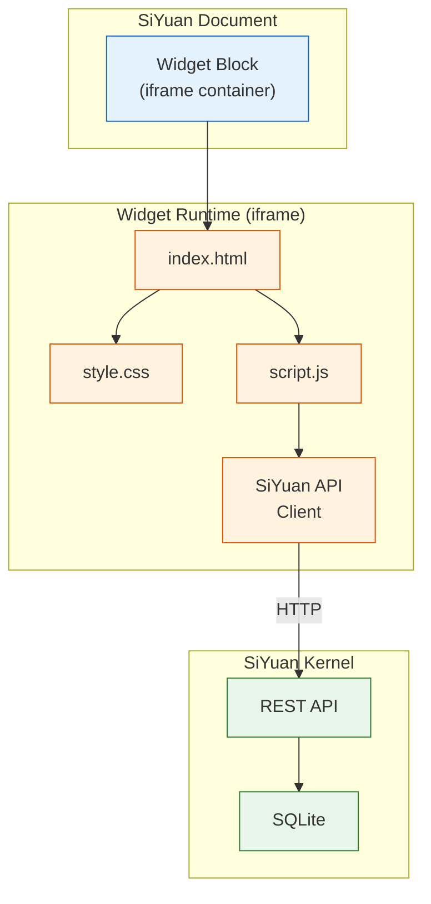
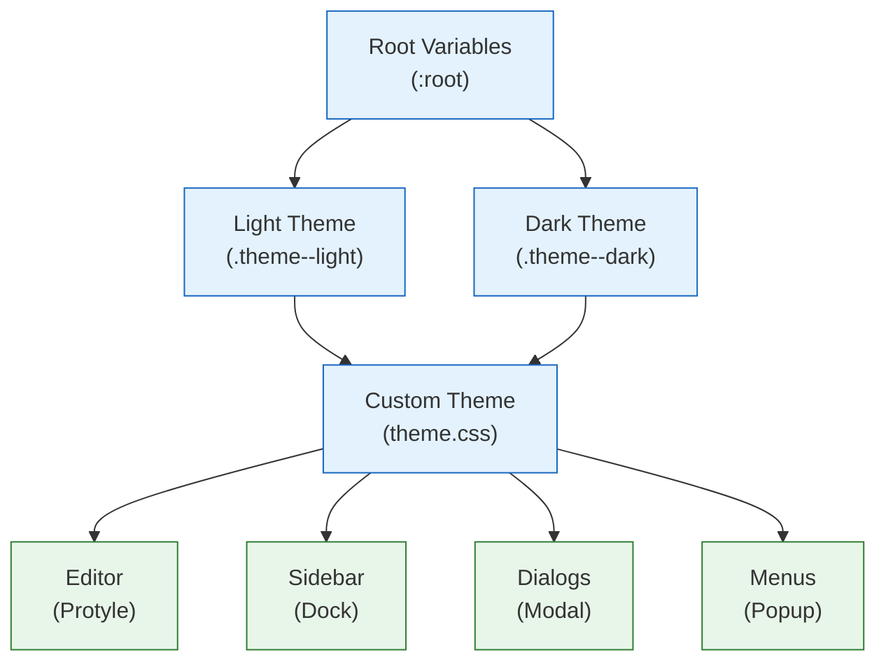

# Chapter 7: Advanced Features

Welcome to **Chapter 7: Advanced Features**. In this part of **SiYuan Tutorial: Privacy-First Knowledge Management**, you will build an intuitive mental model first, then move into concrete implementation details and practical production tradeoffs.


In [Chapter 6](06-synchronization.md), we covered synchronization and backup strategies. Now let's explore SiYuan's advanced features: templates with Sprig functions, custom widgets, theme development, and the customization capabilities that make SiYuan a truly flexible knowledge management platform.

## Templates

SiYuan's template system lets you create reusable document structures with dynamic content. Templates use Go's `text/template` syntax enhanced with the [Sprig](http://masterminds.github.io/sprig/) function library, giving you access to hundreds of utility functions.

### Template Basics

Templates are stored as `.md` files in `data/templates/`:

```markdown
<!-- data/templates/daily-note.md -->
## Daily Note - {{now | date "2006-01-02"}}

### Morning Review
- [ ] Review yesterday's notes
- [ ] Check calendar
- [ ] Set today's priorities

### Tasks
- [ ]

### Notes


### Evening Reflection
- What went well today?
- What could be improved?
- Key learnings:

---
*Created: {{now | date "2006-01-02 15:04"}}*
```

### Sprig Function Reference

SiYuan includes the full Sprig library. Here are the most useful functions for knowledge management:

| Category | Function | Example | Output |
|---|---|---|---|
| **Date** | `now` | `{{now}}` | Current timestamp |
| **Date** | `date` | `{{now \| date "2006-01-02"}}` | `2024-01-15` |
| **Date** | `dateModify` | `{{now \| dateModify "-24h"}}` | Yesterday |
| **String** | `upper` | `{{"hello" \| upper}}` | `HELLO` |
| **String** | `title` | `{{"hello world" \| title}}` | `Hello World` |
| **String** | `replace` | `{{"foo" \| replace "o" "0"}}` | `f00` |
| **String** | `trim` | `{{" hello " \| trim}}` | `hello` |
| **String** | `contains` | `{{"hello" \| contains "ell"}}` | `true` |
| **Math** | `add` | `{{add 1 2}}` | `3` |
| **Math** | `mul` | `{{mul 3 4}}` | `12` |
| **List** | `list` | `{{list "a" "b" "c"}}` | `[a b c]` |
| **List** | `join` | `{{list "a" "b" \| join ", "}}` | `a, b` |
| **Default** | `default` | `{{.missing \| default "N/A"}}` | `N/A` |
| **UUID** | `uuidv4` | `{{uuidv4}}` | Random UUID |

### Advanced Template Examples

```markdown
<!-- data/templates/weekly-review.md -->
# Weekly Review: {{now | date "Jan 2, 2006"}}

## Week {{now | date "W01"}} Summary

### Goals from Last Week
{{/* Reference last week's goals using date math */}}
> Review: Week starting {{now | dateModify "-168h" | date "Jan 2"}}

### This Week's Accomplishments
1.
2.
3.

### Metrics
| Metric | Target | Actual |
|--------|--------|--------|
| Documents created | 5 | |
| Blocks linked | 20 | |
| Reviews completed | 3 | |

### Next Week's Goals
1.
2.
3.

---
*Generated: {{now | date "2006-01-02T15:04:05Z07:00"}}*
*Template ID: {{uuidv4}}*
```

```markdown
<!-- data/templates/meeting-notes.md -->
# Meeting: {{.title | default "Untitled Meeting"}}

**Date:** {{now | date "Monday, January 2, 2006"}}
**Time:** {{now | date "3:04 PM"}}
**Attendees:**

## Agenda
1.

## Discussion Notes


## Action Items
- [ ] **[Owner]** Task description — Due: {{now | dateModify "168h" | date "Jan 2"}}

## Decisions Made


## Follow-up
- Next meeting: {{now | dateModify "168h" | date "Monday, Jan 2"}}

---
*Meeting ID: {{uuidv4 | trunc 8}}*
```

### Template Processing in Go

```go
// kernel/model/template.go
package model

import (
    "bytes"
    "os"
    "path/filepath"
    "text/template"

    "github.com/Masterminds/sprig/v3"
)

// RenderTemplate processes a template file and returns the rendered content
func RenderTemplate(workspacePath, templateName string, data map[string]interface{}) (string, error) {
    templatePath := filepath.Join(workspacePath, "data", "templates", templateName)

    content, err := os.ReadFile(templatePath)
    if err != nil {
        return "", err
    }

    // Create template with Sprig functions
    funcMap := sprig.TxtFuncMap()

    // Add SiYuan-specific template functions
    funcMap["queryBlocks"] = func(sql string) []map[string]interface{} {
        results, _ := SQLQuery(sql)
        return results
    }
    funcMap["getBlockContent"] = func(id string) string {
        block, err := GetBlockByID(id)
        if err != nil {
            return ""
        }
        return block.Content
    }
    funcMap["randomID"] = func() string {
        return NewBlockID()
    }

    tmpl, err := template.New(templateName).Funcs(funcMap).Parse(string(content))
    if err != nil {
        return "", err
    }

    var buf bytes.Buffer
    if err := tmpl.Execute(&buf, data); err != nil {
        return "", err
    }

    return buf.String(), nil
}

// ListTemplates returns all available templates
func ListTemplates(workspacePath string) ([]TemplateInfo, error) {
    templatesDir := filepath.Join(workspacePath, "data", "templates")
    entries, err := os.ReadDir(templatesDir)
    if err != nil {
        if os.IsNotExist(err) {
            return nil, nil
        }
        return nil, err
    }

    var templates []TemplateInfo
    for _, entry := range entries {
        if entry.IsDir() || filepath.Ext(entry.Name()) != ".md" {
            continue
        }
        info, _ := entry.Info()
        templates = append(templates, TemplateInfo{
            Name:     entry.Name(),
            Size:     info.Size(),
            Modified: info.ModTime(),
        })
    }
    return templates, nil
}
```

## Widgets

Widgets are custom HTML/CSS/JavaScript components that run inside SiYuan documents. They are more powerful than templates because they can include interactive logic and real-time data.

### Widget Architecture



### Building a Custom Widget

Widgets live in `data/widgets/<widget-name>/`:

```html
<!-- data/widgets/note-chart/index.html -->
<!DOCTYPE html>
<html>
<head>
    <meta charset="utf-8">
    <style>
        body {
            font-family: var(--b3-font-family, system-ui);
            margin: 0;
            padding: 16px;
            background: transparent;
        }

        .chart-container {
            width: 100%;
            height: 300px;
            position: relative;
        }

        .bar {
            display: inline-block;
            background: var(--b3-theme-primary, #4285f4);
            margin-right: 2px;
            border-radius: 2px 2px 0 0;
            transition: height 0.3s ease;
        }

        .bar:hover {
            opacity: 0.8;
        }

        .bar-label {
            text-align: center;
            font-size: 11px;
            color: var(--b3-theme-on-surface, #333);
            margin-top: 4px;
        }

        .stats {
            display: grid;
            grid-template-columns: repeat(auto-fit, minmax(120px, 1fr));
            gap: 12px;
            margin-bottom: 16px;
        }

        .stat-card {
            background: var(--b3-theme-surface, #f5f5f5);
            padding: 12px;
            border-radius: 8px;
            text-align: center;
        }

        .stat-value {
            font-size: 24px;
            font-weight: bold;
            color: var(--b3-theme-primary, #4285f4);
        }

        .stat-label {
            font-size: 12px;
            color: var(--b3-theme-on-surface-light, #666);
        }

        h3 {
            margin: 0 0 12px 0;
            color: var(--b3-theme-on-background, #333);
        }
    </style>
</head>
<body>
    <h3>Knowledge Base Activity</h3>
    <div class="stats" id="stats">Loading...</div>
    <h3>Blocks Created (Last 30 Days)</h3>
    <div class="chart-container" id="chart">Loading...</div>

    <script>
        // SiYuan Widget API helper
        async function querySQL(sql) {
            const response = await fetch("/api/query/sql", {
                method: "POST",
                headers: { "Content-Type": "application/json" },
                body: JSON.stringify({ stmt: sql }),
            });
            const result = await response.json();
            return result.data || [];
        }

        async function loadStats() {
            const statsEl = document.getElementById("stats");

            const [blocks, docs, refs, todayBlocks] = await Promise.all([
                querySQL("SELECT COUNT(*) AS c FROM blocks"),
                querySQL("SELECT COUNT(*) AS c FROM blocks WHERE type = 'd'"),
                querySQL("SELECT COUNT(*) AS c FROM refs"),
                querySQL(`SELECT COUNT(*) AS c FROM blocks
                          WHERE created > strftime('%Y%m%d', 'now') || '000000'`),
            ]);

            statsEl.innerHTML = `
                <div class="stat-card">
                    <div class="stat-value">${blocks[0]?.c || 0}</div>
                    <div class="stat-label">Total Blocks</div>
                </div>
                <div class="stat-card">
                    <div class="stat-value">${docs[0]?.c || 0}</div>
                    <div class="stat-label">Documents</div>
                </div>
                <div class="stat-card">
                    <div class="stat-value">${refs[0]?.c || 0}</div>
                    <div class="stat-label">References</div>
                </div>
                <div class="stat-card">
                    <div class="stat-value">${todayBlocks[0]?.c || 0}</div>
                    <div class="stat-label">Today's Blocks</div>
                </div>
            `;
        }

        async function loadChart() {
            const chartEl = document.getElementById("chart");

            const data = await querySQL(`
                SELECT
                    SUBSTR(created, 1, 8) AS day,
                    COUNT(*) AS count
                FROM blocks
                WHERE created > strftime('%Y%m%d', 'now', '-30 days') || '000000'
                GROUP BY SUBSTR(created, 1, 8)
                ORDER BY day
            `);

            if (data.length === 0) {
                chartEl.innerHTML = "<p>No data available</p>";
                return;
            }

            const maxCount = Math.max(...data.map(d => d.count));
            const barWidth = Math.floor((chartEl.clientWidth - 20) / data.length) - 3;
            const maxHeight = 260;

            let html = "";
            for (const day of data) {
                const height = Math.max(4, (day.count / maxCount) * maxHeight);
                const label = day.day.substring(4, 6) + "/" + day.day.substring(6, 8);
                html += `
                    <div style="display: inline-block; text-align: center; width: ${barWidth}px;">
                        <div class="bar" style="width: ${barWidth}px; height: ${height}px;"
                             title="${day.count} blocks on ${label}"></div>
                        <div class="bar-label">${data.length <= 15 ? label : ""}</div>
                    </div>
                `;
            }
            chartEl.innerHTML = html;
        }

        // Initialize
        loadStats();
        loadChart();

        // Auto-refresh every 5 minutes
        setInterval(() => {
            loadStats();
            loadChart();
        }, 5 * 60 * 1000);
    </script>
</body>
</html>
```

### Widget Configuration

Widgets can include a `widget.json` manifest:

```json
{
    "name": "note-chart",
    "author": "Your Name",
    "url": "https://github.com/yourname/siyuan-widget-note-chart",
    "version": "1.0.0",
    "displayName": {
        "default": "Knowledge Base Activity Chart"
    },
    "description": {
        "default": "Visualize your knowledge base activity with charts and statistics"
    },
    "minAppVersion": "2.10.0"
}
```

## Theme Development

SiYuan's theming system uses CSS variables, making it straightforward to create custom themes that affect every aspect of the interface.

### CSS Variable Architecture



### Core CSS Variables

```css
/* SiYuan's core CSS variable system */
:root {
    /* ---- Colors ---- */
    --b3-theme-primary: #4285f4;
    --b3-theme-primary-light: #8ab4f8;
    --b3-theme-primary-lighter: #d2e3fc;
    --b3-theme-primary-lightest: #e8f0fe;

    --b3-theme-secondary: #5f6368;

    --b3-theme-background: #ffffff;
    --b3-theme-surface: #f8f9fa;
    --b3-theme-surface-light: #f1f3f4;
    --b3-theme-surface-lighter: #e8eaed;

    --b3-theme-on-background: #202124;
    --b3-theme-on-surface: #3c4043;
    --b3-theme-on-surface-light: #5f6368;
    --b3-theme-on-primary: #ffffff;

    --b3-theme-error: #d93025;
    --b3-theme-success: #188038;
    --b3-theme-warning: #f9ab00;

    /* ---- Typography ---- */
    --b3-font-family: "Helvetica Neue", Helvetica, Arial, sans-serif;
    --b3-font-family-code: "JetBrains Mono", "Fira Code", monospace;
    --b3-font-size: 16px;
    --b3-font-size-small: 14px;

    /* ---- Spacing ---- */
    --b3-border-radius: 4px;
    --b3-border-radius-large: 8px;
    --b3-dialog-padding: 24px;

    /* ---- Editor ---- */
    --b3-protyle-inline-code-background: #f1f3f4;
    --b3-protyle-inline-code-color: #d93025;
    --b3-protyle-heading1-color: #202124;
    --b3-protyle-heading2-color: #3c4043;
    --b3-protyle-link-color: #1a73e8;
    --b3-protyle-blockquote-color: #5f6368;
    --b3-protyle-table-border-color: #dadce0;

    /* ---- Scrollbar ---- */
    --b3-scroll-color: rgba(0, 0, 0, 0.2);
}

/* Dark theme overrides */
.theme--dark {
    --b3-theme-primary: #8ab4f8;
    --b3-theme-primary-light: #aecbfa;
    --b3-theme-primary-lighter: #394457;
    --b3-theme-primary-lightest: #2d333b;

    --b3-theme-background: #1e1e1e;
    --b3-theme-surface: #252526;
    --b3-theme-surface-light: #2d2d2d;
    --b3-theme-surface-lighter: #3c3c3c;

    --b3-theme-on-background: #e8eaed;
    --b3-theme-on-surface: #bdc1c6;
    --b3-theme-on-surface-light: #9aa0a6;
    --b3-theme-on-primary: #202124;

    --b3-protyle-inline-code-background: #3c3c3c;
    --b3-protyle-inline-code-color: #f28b82;
}
```

### Creating a Custom Theme

A SiYuan theme is a directory in `conf/appearance/themes/`:

```
conf/appearance/themes/my-theme/
├── theme.json          # Theme manifest
├── theme.css           # Main stylesheet
├── custom.css          # User customizations (optional)
└── icon.png            # Theme icon
```

```json
// theme.json
{
    "name": "my-theme",
    "author": "Your Name",
    "url": "https://github.com/yourname/siyuan-theme-mytheme",
    "version": "1.0.0",
    "displayName": {
        "default": "My Custom Theme"
    },
    "description": {
        "default": "A clean, focused theme for knowledge work"
    },
    "modes": ["light", "dark"],
    "minAppVersion": "2.10.0"
}
```

```css
/* theme.css - A focused reading theme */

/* Light mode */
.theme--light {
    --b3-theme-primary: #2563eb;
    --b3-theme-primary-light: #60a5fa;
    --b3-theme-primary-lighter: #dbeafe;
    --b3-theme-primary-lightest: #eff6ff;

    --b3-theme-background: #fafafa;
    --b3-theme-surface: #ffffff;
    --b3-theme-surface-light: #f5f5f5;
    --b3-theme-surface-lighter: #e5e5e5;

    --b3-theme-on-background: #171717;
    --b3-theme-on-surface: #262626;
    --b3-theme-on-surface-light: #525252;

    --b3-font-family: "Inter", "SF Pro Display", system-ui, sans-serif;
    --b3-font-family-code: "JetBrains Mono", "SF Mono", monospace;
}

/* Dark mode */
.theme--dark {
    --b3-theme-primary: #60a5fa;
    --b3-theme-primary-light: #93c5fd;
    --b3-theme-primary-lighter: #1e3a5f;
    --b3-theme-primary-lightest: #172554;

    --b3-theme-background: #0a0a0a;
    --b3-theme-surface: #171717;
    --b3-theme-surface-light: #262626;
    --b3-theme-surface-lighter: #404040;

    --b3-theme-on-background: #fafafa;
    --b3-theme-on-surface: #e5e5e5;
    --b3-theme-on-surface-light: #a3a3a3;
}

/* Editor customizations */
.protyle-wysiwyg {
    max-width: 720px;
    margin: 0 auto;
    padding: 40px 20px;
    line-height: 1.75;
}

/* Heading styles */
.protyle-wysiwyg [data-type="NodeHeading"][data-subtype="h1"] {
    font-size: 2em;
    font-weight: 700;
    margin-top: 2em;
    padding-bottom: 0.3em;
    border-bottom: 1px solid var(--b3-theme-surface-lighter);
}

.protyle-wysiwyg [data-type="NodeHeading"][data-subtype="h2"] {
    font-size: 1.5em;
    font-weight: 600;
    margin-top: 1.5em;
}

/* Code block styling */
.protyle-wysiwyg .code-block {
    border-radius: 8px;
    overflow: hidden;
}

.protyle-wysiwyg .code-block .hljs {
    padding: 16px 20px;
    font-size: 14px;
    line-height: 1.6;
}

/* Blockquote styling */
.protyle-wysiwyg [data-type="NodeBlockquote"] {
    border-left: 3px solid var(--b3-theme-primary);
    padding-left: 16px;
    color: var(--b3-theme-on-surface-light);
    font-style: italic;
}

/* Table styling */
.protyle-wysiwyg table {
    border-collapse: collapse;
    width: 100%;
    margin: 16px 0;
}

.protyle-wysiwyg table th {
    background: var(--b3-theme-surface);
    font-weight: 600;
    text-align: left;
    padding: 10px 16px;
}

.protyle-wysiwyg table td {
    padding: 8px 16px;
    border-bottom: 1px solid var(--b3-theme-surface-lighter);
}

/* Focus mode - hide distractions */
.layout__center .protyle:only-child .protyle-breadcrumb {
    opacity: 0;
    transition: opacity 0.3s;
}

.layout__center .protyle:only-child:hover .protyle-breadcrumb {
    opacity: 1;
}
```

### Custom Icons

SiYuan supports custom icon sets through SVG sprites:

```css
/* Override default icons with custom SVG icons */
.b3-menu__icon[data-icon="iconDocument"]::before {
    content: "";
    display: inline-block;
    width: 16px;
    height: 16px;
    background: url('data:image/svg+xml,<svg xmlns="http://www.w3.org/2000/svg" viewBox="0 0 24 24"><path fill="currentColor" d="M14 2H6a2 2 0 0 0-2 2v16a2 2 0 0 0 2 2h12a2 2 0 0 0 2-2V8l-6-6z"/></svg>');
}
```

## Layout Customization

SiYuan's layout system is highly configurable. You can control panel positions, sizes, and visibility:

```typescript
// Programmatic layout management
interface LayoutConfig {
    direction: "lr" | "tb";  // left-right or top-bottom
    children: LayoutChild[];
}

interface LayoutChild {
    type: "wnd" | "layout";
    size: string;            // Percentage or pixel
    children?: LayoutChild[];
    tabs?: TabConfig[];
}

interface TabConfig {
    type: "editor" | "outline" | "graph" | "backlink" | "bookmark" |
          "tag" | "filetree" | "inbox" | "search" | "custom";
    pin?: boolean;
    active?: boolean;
}

// Example: Create a research-focused layout
const researchLayout: LayoutConfig = {
    direction: "lr",
    children: [
        {
            type: "layout",
            size: "20%",
            children: [
                {
                    type: "wnd",
                    size: "60%",
                    tabs: [
                        { type: "filetree", active: true },
                        { type: "bookmark" },
                    ],
                },
                {
                    type: "wnd",
                    size: "40%",
                    tabs: [
                        { type: "outline", active: true },
                        { type: "tag" },
                    ],
                },
            ],
        },
        {
            type: "wnd",
            size: "55%",
            tabs: [
                { type: "editor", active: true },
            ],
        },
        {
            type: "layout",
            size: "25%",
            children: [
                {
                    type: "wnd",
                    size: "50%",
                    tabs: [
                        { type: "backlink", active: true },
                    ],
                },
                {
                    type: "wnd",
                    size: "50%",
                    tabs: [
                        { type: "graph", active: true },
                    ],
                },
            ],
        },
    ],
};
```

## Code Snippets

SiYuan allows injecting custom CSS and JavaScript snippets that run globally:

```typescript
// Manage code snippets via the API
interface CodeSnippet {
    id: string;
    name: string;
    type: "css" | "js";
    content: string;
    enabled: boolean;
}

// CSS snippet: Custom tag colors
const tagColorSnippet: CodeSnippet = {
    id: "tag-colors",
    name: "Custom Tag Colors",
    type: "css",
    enabled: true,
    content: `
        /* Color-coded tags */
        span[data-type="tag"][data-content*="important"] {
            background-color: #fee2e2 !important;
            color: #991b1b !important;
        }
        span[data-type="tag"][data-content*="idea"] {
            background-color: #fef3c7 !important;
            color: #92400e !important;
        }
        span[data-type="tag"][data-content*="done"] {
            background-color: #d1fae5 !important;
            color: #065f46 !important;
        }
        span[data-type="tag"][data-content*="question"] {
            background-color: #dbeafe !important;
            color: #1e40af !important;
        }
    `,
};

// JavaScript snippet: Auto-timestamp on edit
const autoTimestampSnippet: CodeSnippet = {
    id: "auto-timestamp",
    name: "Auto Timestamp",
    type: "js",
    enabled: true,
    content: `
        // Automatically add "last-edited" timestamp to blocks
        const observer = new MutationObserver((mutations) => {
            for (const mutation of mutations) {
                const block = mutation.target.closest("[data-node-id]");
                if (block) {
                    const timestamp = new Date().toISOString();
                    block.setAttribute("data-last-edited", timestamp);
                }
            }
        });

        const editor = document.querySelector(".protyle-wysiwyg");
        if (editor) {
            observer.observe(editor, {
                childList: true,
                subtree: true,
                characterData: true,
            });
        }
    `,
};

// Save snippets via API
async function saveSnippet(snippet: CodeSnippet): Promise<void> {
    await fetch("/api/snippet/setSnippet", {
        method: "POST",
        headers: { "Content-Type": "application/json" },
        body: JSON.stringify({
            snippets: [snippet],
        }),
    });
}
```

## API-Driven Automation

SiYuan's REST API enables powerful automation workflows. Here are practical examples:

### Daily Note Automation

```typescript
// Automatically create and populate daily notes
async function createDailyNote(notebookID: string): Promise<string> {
    const today = new Date();
    const dateStr = today.toISOString().split("T")[0];
    const path = `/Daily Notes/${today.getFullYear()}/${dateStr}`;

    // Check if today's note already exists
    const existing = await fetch("/api/query/sql", {
        method: "POST",
        headers: { "Content-Type": "application/json" },
        body: JSON.stringify({
            stmt: `SELECT id FROM blocks WHERE type = 'd'
                   AND hpath LIKE '%${dateStr}%' AND box = '${notebookID}'`,
        }),
    });
    const existingResult = await existing.json();

    if (existingResult.data && existingResult.data.length > 0) {
        return existingResult.data[0].id;
    }

    // Get yesterday's incomplete tasks
    const yesterday = new Date(today);
    yesterday.setDate(yesterday.getDate() - 1);
    const yesterdayStr = yesterday.toISOString().split("T")[0];

    const tasksResult = await fetch("/api/query/sql", {
        method: "POST",
        headers: { "Content-Type": "application/json" },
        body: JSON.stringify({
            stmt: `SELECT content FROM blocks
                   WHERE markdown LIKE '%- [ ]%'
                   AND root_id IN (
                       SELECT id FROM blocks WHERE type = 'd'
                       AND hpath LIKE '%${yesterdayStr}%'
                   )`,
        }),
    });
    const tasks = await tasksResult.json();

    // Build daily note content
    let content = `# ${dateStr}\n\n## Morning\n\n`;

    if (tasks.data && tasks.data.length > 0) {
        content += "### Carried Over Tasks\n";
        for (const task of tasks.data) {
            content += `${task.content}\n`;
        }
        content += "\n";
    }

    content += "## Today's Tasks\n- [ ] \n\n## Notes\n\n## Evening Review\n";

    // Create the document
    const response = await fetch("/api/filetree/createDocWithMd", {
        method: "POST",
        headers: { "Content-Type": "application/json" },
        body: JSON.stringify({
            notebook: notebookID,
            path: path,
            markdown: content,
        }),
    });
    const result = await response.json();
    return result.data;
}
```

### Batch Tag Processing

```typescript
// Bulk operations on tagged blocks
async function processTaggedBlocks(
    tag: string,
    processor: (block: any) => Promise<void>
): Promise<number> {
    const response = await fetch("/api/query/sql", {
        method: "POST",
        headers: { "Content-Type": "application/json" },
        body: JSON.stringify({
            stmt: `SELECT id, content, type, hpath FROM blocks
                   WHERE tag LIKE '%${tag}%'
                   ORDER BY updated DESC`,
        }),
    });
    const result = await response.json();
    const blocks = result.data || [];

    let processed = 0;
    for (const block of blocks) {
        try {
            await processor(block);
            processed++;
        } catch (err) {
            console.error(`Failed to process block ${block.id}:`, err);
        }
    }

    return processed;
}

// Example: Archive all blocks tagged #done
await processTaggedBlocks("done", async (block) => {
    await fetch("/api/attr/setBlockAttrs", {
        method: "POST",
        headers: { "Content-Type": "application/json" },
        body: JSON.stringify({
            id: block.id,
            attrs: {
                "custom-archived": new Date().toISOString(),
                "custom-status": "archived",
            },
        }),
    });
});
```

## Summary

SiYuan's advanced features transform it from a note-taking app into a fully customizable knowledge management platform.

| Feature | Technology | Capability |
|---|---|---|
| **Templates** | Go `text/template` + Sprig | Dynamic document generation |
| **Widgets** | HTML/CSS/JS in iframes | Interactive embedded components |
| **Themes** | CSS custom properties | Complete visual customization |
| **Code Snippets** | Injected CSS/JS | Global behavior modification |
| **Layout System** | Configurable panel layout | Workflow-specific arrangements |
| **API Automation** | REST API | Programmatic workflows |

## Key Takeaways

1. **Templates are powerful** -- Sprig functions give you date math, string manipulation, and conditional logic inside your note templates.
2. **Widgets are sandboxed apps** -- full HTML/CSS/JS running in iframes with API access to your knowledge base.
3. **Themes use CSS variables** -- override a handful of variables to completely transform the UI.
4. **Code snippets are global** -- inject CSS and JS that runs across all documents.
5. **The API enables automation** -- daily notes, batch operations, and integrations are all possible through REST calls.

## Next Steps

We've covered SiYuan's customization capabilities. In the final chapter, [Chapter 8: Production Deployment](08-production-deployment.md), we'll explore self-hosting with Docker, data migration strategies, security hardening, and enterprise deployment patterns.

---

*Built with insights from the [SiYuan](https://github.com/siyuan-note/siyuan) project.*

## What Problem Does This Solve?

Most teams struggle here because the hard part is not writing more code, but deciding clear boundaries for `theme`, `surface`, `protyle` so behavior stays predictable as complexity grows.

In practical terms, this chapter helps you avoid three common failures:

- coupling core logic too tightly to one implementation path
- missing the handoff boundaries between setup, execution, and validation
- shipping changes without clear rollback or observability strategy

After working through this chapter, you should be able to reason about `Chapter 7: Advanced Features` as an operating subsystem inside **SiYuan Tutorial: Privacy-First Knowledge Management**, with explicit contracts for inputs, state transitions, and outputs.

Use the implementation notes around `content`, `primary`, `color` as your checklist when adapting these patterns to your own repository.

## How it Works Under the Hood

Under the hood, `Chapter 7: Advanced Features` usually follows a repeatable control path:

1. **Context bootstrap**: initialize runtime config and prerequisites for `theme`.
2. **Input normalization**: shape incoming data so `surface` receives stable contracts.
3. **Core execution**: run the main logic branch and propagate intermediate state through `protyle`.
4. **Policy and safety checks**: enforce limits, auth scopes, and failure boundaries.
5. **Output composition**: return canonical result payloads for downstream consumers.
6. **Operational telemetry**: emit logs/metrics needed for debugging and performance tuning.

When debugging, walk this sequence in order and confirm each stage has explicit success/failure conditions.

## Source Walkthrough

Use the following upstream sources to verify implementation details while reading this chapter:

- [View Repo](https://github.com/siyuan-note/siyuan)
  Why it matters: authoritative reference on `View Repo` (github.com).

Suggested trace strategy:
- search upstream code for `theme` and `surface` to map concrete implementation paths
- compare docs claims against actual runtime/config code before reusing patterns in production

## Chapter Connections

- [Tutorial Index](index.md)
- [Previous Chapter: Chapter 6: Synchronization & Backup](06-synchronization.md)
- [Next Chapter: Chapter 8: Production Deployment](08-production-deployment.md)
- [Main Catalog](../../README.md#-tutorial-catalog)
- [A-Z Tutorial Directory](../../discoverability/tutorial-directory.md)
