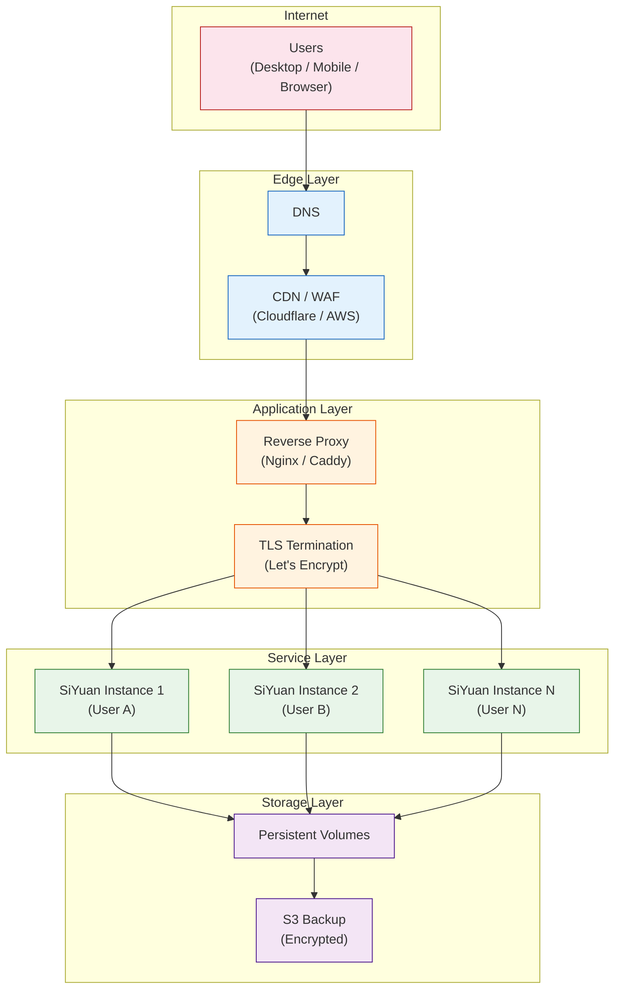
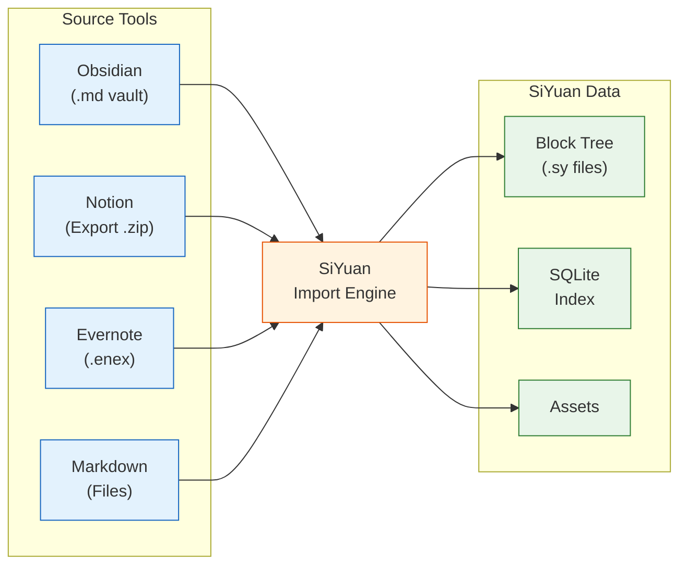
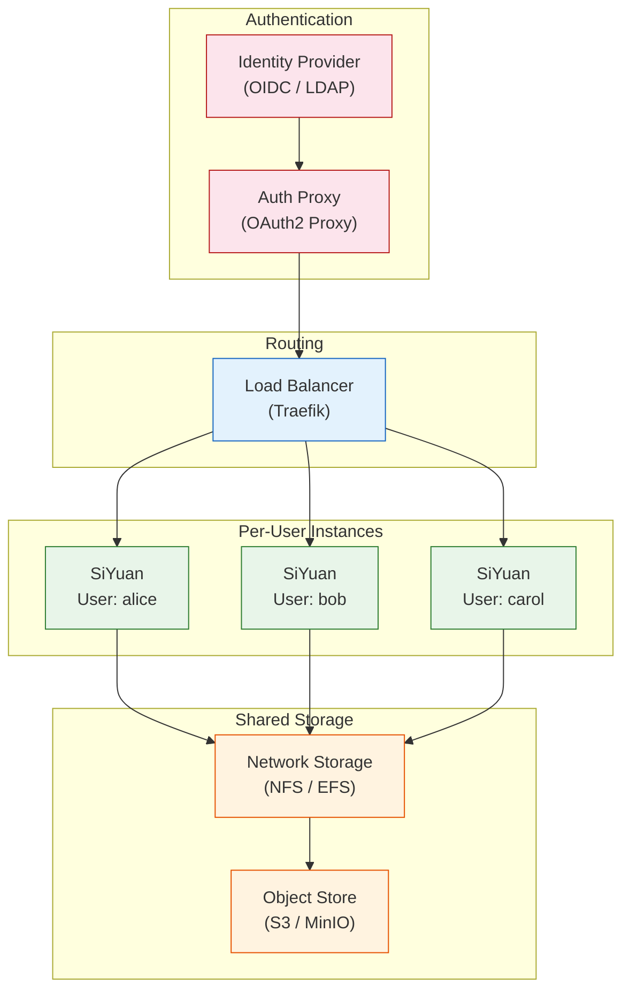

# Chapter 8: Production Deployment

In [Chapter 7](07-advanced-features.md), we explored templates, widgets, themes, and API automation. In this final chapter, we'll cover everything you need to deploy SiYuan in production: Docker self-hosting, reverse proxy configuration, security hardening, data migration, monitoring, and enterprise deployment patterns.

## Deployment Architecture

A production SiYuan deployment typically involves multiple layers for security, performance, and reliability:



## Docker Self-Hosting

Docker is the recommended way to deploy SiYuan in production. It provides isolation, reproducibility, and simple updates.

### Basic Docker Setup

```bash
# Pull the latest SiYuan image
docker pull b3log/siyuan:latest

# Create a data directory
mkdir -p /opt/siyuan/workspace

# Run SiYuan with essential configuration
docker run -d \
    --name siyuan \
    --restart unless-stopped \
    -p 127.0.0.1:6806:6806 \
    -v /opt/siyuan/workspace:/siyuan/workspace \
    -e SIYUAN_ACCESS_AUTH_CODE=your-secure-auth-code \
    -e TZ=America/New_York \
    --memory=512m \
    --cpus=1.0 \
    b3log/siyuan:latest \
    --workspace=/siyuan/workspace
```

### Docker Compose for Production

```yaml
# docker-compose.yml
version: "3.8"

services:
  siyuan:
    image: b3log/siyuan:latest
    container_name: siyuan
    restart: unless-stopped
    ports:
      - "127.0.0.1:6806:6806"
    volumes:
      - siyuan_data:/siyuan/workspace
    environment:
      - SIYUAN_ACCESS_AUTH_CODE=${SIYUAN_AUTH_CODE}
      - TZ=${TIMEZONE:-UTC}
    command: >
      --workspace=/siyuan/workspace
      --accessAuthCode=${SIYUAN_AUTH_CODE}
      --ssl=false
    deploy:
      resources:
        limits:
          memory: 1G
          cpus: "2.0"
        reservations:
          memory: 256M
          cpus: "0.5"
    healthcheck:
      test: ["CMD", "curl", "-f", "http://localhost:6806/api/system/version"]
      interval: 30s
      timeout: 10s
      retries: 3
      start_period: 10s
    logging:
      driver: "json-file"
      options:
        max-size: "10m"
        max-file: "3"

  # Reverse proxy with automatic HTTPS
  caddy:
    image: caddy:2-alpine
    container_name: caddy
    restart: unless-stopped
    ports:
      - "80:80"
      - "443:443"
    volumes:
      - ./Caddyfile:/etc/caddy/Caddyfile:ro
      - caddy_data:/data
      - caddy_config:/config
    depends_on:
      siyuan:
        condition: service_healthy

  # Automated backup service
  backup:
    image: alpine:3
    container_name: siyuan-backup
    restart: unless-stopped
    volumes:
      - siyuan_data:/data/siyuan:ro
      - siyuan_backups:/data/backups
      - ./backup.sh:/backup.sh:ro
    entrypoint: /bin/sh
    command: >
      -c "while true; do
        sh /backup.sh;
        sleep 21600;
      done"

volumes:
  siyuan_data:
    driver: local
  siyuan_backups:
    driver: local
  caddy_data:
    driver: local
  caddy_config:
    driver: local
```

### Environment File

```bash
# .env
SIYUAN_AUTH_CODE=your-very-strong-auth-code-here
TIMEZONE=America/New_York
DOMAIN=notes.yourdomain.com
```

## Reverse Proxy Configuration

### Caddy (Recommended for Simplicity)

Caddy provides automatic HTTPS with Let's Encrypt:

```
# Caddyfile
notes.yourdomain.com {
    reverse_proxy siyuan:6806

    # WebSocket support (required for real-time sync)
    @websocket {
        header Connection *Upgrade*
        header Upgrade websocket
    }
    reverse_proxy @websocket siyuan:6806

    # Security headers
    header {
        X-Content-Type-Options nosniff
        X-Frame-Options DENY
        X-XSS-Protection "1; mode=block"
        Referrer-Policy strict-origin-when-cross-origin
        Strict-Transport-Security "max-age=31536000; includeSubDomains"
        -Server
    }

    # Rate limiting
    rate_limit {
        zone dynamic {
            key {remote_host}
            events 100
            window 1m
        }
    }

    # Logging
    log {
        output file /var/log/caddy/access.log
        format json
    }
}
```

### Nginx Configuration

```nginx
# /etc/nginx/sites-available/siyuan
upstream siyuan_backend {
    server 127.0.0.1:6806;
    keepalive 32;
}

server {
    listen 80;
    server_name notes.yourdomain.com;
    return 301 https://$server_name$request_uri;
}

server {
    listen 443 ssl http2;
    server_name notes.yourdomain.com;

    # TLS configuration
    ssl_certificate     /etc/letsencrypt/live/notes.yourdomain.com/fullchain.pem;
    ssl_certificate_key /etc/letsencrypt/live/notes.yourdomain.com/privkey.pem;
    ssl_protocols       TLSv1.2 TLSv1.3;
    ssl_ciphers         ECDHE-ECDSA-AES128-GCM-SHA256:ECDHE-RSA-AES128-GCM-SHA256;
    ssl_prefer_server_ciphers on;
    ssl_session_cache   shared:SSL:10m;
    ssl_session_timeout 10m;

    # Security headers
    add_header X-Content-Type-Options nosniff;
    add_header X-Frame-Options DENY;
    add_header X-XSS-Protection "1; mode=block";
    add_header Referrer-Policy strict-origin-when-cross-origin;
    add_header Strict-Transport-Security "max-age=31536000; includeSubDomains" always;

    # Request size limit (for large asset uploads)
    client_max_body_size 128M;

    # Proxy settings
    location / {
        proxy_pass http://siyuan_backend;
        proxy_set_header Host $host;
        proxy_set_header X-Real-IP $remote_addr;
        proxy_set_header X-Forwarded-For $proxy_add_x_forwarded_for;
        proxy_set_header X-Forwarded-Proto $scheme;

        # Timeouts
        proxy_connect_timeout 60s;
        proxy_send_timeout 60s;
        proxy_read_timeout 300s;
    }

    # WebSocket support
    location /ws {
        proxy_pass http://siyuan_backend;
        proxy_http_version 1.1;
        proxy_set_header Upgrade $http_upgrade;
        proxy_set_header Connection "upgrade";
        proxy_set_header Host $host;
        proxy_set_header X-Real-IP $remote_addr;
        proxy_read_timeout 86400s;
        proxy_send_timeout 86400s;
    }

    # Cache static assets
    location ~* \.(js|css|png|jpg|jpeg|gif|ico|svg|woff|woff2)$ {
        proxy_pass http://siyuan_backend;
        expires 7d;
        add_header Cache-Control "public, immutable";
    }

    # Block access to sensitive paths
    location ~ /\. {
        deny all;
    }

    # Access log
    access_log /var/log/nginx/siyuan-access.log;
    error_log  /var/log/nginx/siyuan-error.log;
}
```

## Security Hardening

### Authentication and Access Control

```go
// kernel/model/auth.go
package model

import (
    "crypto/rand"
    "crypto/subtle"
    "encoding/hex"
    "net/http"
    "strings"
    "sync"
    "time"
)

// AuthConfig holds authentication settings
type AuthConfig struct {
    AccessAuthCode    string        `json:"accessAuthCode"`
    MaxFailedAttempts int           `json:"maxFailedAttempts"`
    LockoutDuration   time.Duration `json:"lockoutDuration"`
}

// RateLimiter tracks authentication attempts
type RateLimiter struct {
    attempts map[string][]time.Time
    mu       sync.RWMutex
}

func NewRateLimiter() *RateLimiter {
    return &RateLimiter{
        attempts: make(map[string][]time.Time),
    }
}

// CheckRate returns true if the request is allowed
func (rl *RateLimiter) CheckRate(ip string, maxAttempts int, window time.Duration) bool {
    rl.mu.Lock()
    defer rl.mu.Unlock()

    now := time.Now()
    cutoff := now.Add(-window)

    // Clean old entries
    var recent []time.Time
    for _, t := range rl.attempts[ip] {
        if t.After(cutoff) {
            recent = append(recent, t)
        }
    }
    rl.attempts[ip] = recent

    if len(recent) >= maxAttempts {
        return false // Rate limited
    }

    rl.attempts[ip] = append(rl.attempts[ip], now)
    return true
}

// AuthMiddleware validates the access auth code
func AuthMiddleware(config *AuthConfig, limiter *RateLimiter) func(http.Handler) http.Handler {
    return func(next http.Handler) http.Handler {
        return http.HandlerFunc(func(w http.ResponseWriter, r *http.Request) {
            // Skip auth for version check (health check)
            if r.URL.Path == "/api/system/version" {
                next.ServeHTTP(w, r)
                return
            }

            // Extract client IP
            ip := getClientIP(r)

            // Rate limiting
            if !limiter.CheckRate(ip, config.MaxFailedAttempts, config.LockoutDuration) {
                http.Error(w, "Too many failed attempts", http.StatusTooManyRequests)
                return
            }

            // Check auth token
            token := r.Header.Get("Authorization")
            if token == "" {
                // Check cookie
                cookie, err := r.Cookie("siyuan")
                if err == nil {
                    token = cookie.Value
                }
            }

            token = strings.TrimPrefix(token, "Token ")

            if config.AccessAuthCode != "" {
                if subtle.ConstantTimeCompare([]byte(token), []byte(config.AccessAuthCode)) != 1 {
                    http.Error(w, "Unauthorized", http.StatusUnauthorized)
                    return
                }
            }

            next.ServeHTTP(w, r)
        })
    }
}

func getClientIP(r *http.Request) string {
    // Check X-Forwarded-For header (behind reverse proxy)
    forwarded := r.Header.Get("X-Forwarded-For")
    if forwarded != "" {
        parts := strings.Split(forwarded, ",")
        return strings.TrimSpace(parts[0])
    }
    // Check X-Real-IP header
    realIP := r.Header.Get("X-Real-IP")
    if realIP != "" {
        return realIP
    }
    // Fall back to remote address
    return strings.Split(r.RemoteAddr, ":")[0]
}

// GenerateSecureToken creates a cryptographically secure auth token
func GenerateSecureToken(length int) string {
    bytes := make([]byte, length)
    rand.Read(bytes)
    return hex.EncodeToString(bytes)
}
```

### Security Checklist

| Category | Check | Priority |
|---|---|---|
| **Authentication** | Set a strong `accessAuthCode` | Critical |
| **Authentication** | Use HTTPS exclusively | Critical |
| **Network** | Bind to 127.0.0.1, not 0.0.0.0 | High |
| **Network** | Use a reverse proxy (Caddy/Nginx) | High |
| **Network** | Enable rate limiting | High |
| **Network** | Block access to `/.` paths | Medium |
| **Encryption** | Set a strong sync passphrase | Critical |
| **Encryption** | Use TLS 1.2+ only | High |
| **Container** | Run as non-root user | High |
| **Container** | Set memory and CPU limits | Medium |
| **Container** | Use read-only root filesystem | Medium |
| **Backup** | Automated backup schedule | High |
| **Backup** | Off-site backup copies | High |
| **Backup** | Regular restore testing | Medium |
| **Monitoring** | Health check endpoint | Medium |
| **Monitoring** | Log aggregation | Medium |
| **Updates** | Regular image updates | High |

### Hardened Docker Configuration

```yaml
# docker-compose.hardened.yml
version: "3.8"

services:
  siyuan:
    image: b3log/siyuan:latest
    container_name: siyuan
    restart: unless-stopped
    user: "1000:1000"
    read_only: true
    tmpfs:
      - /tmp:size=100M
    ports:
      - "127.0.0.1:6806:6806"
    volumes:
      - siyuan_data:/siyuan/workspace
    environment:
      - SIYUAN_ACCESS_AUTH_CODE=${SIYUAN_AUTH_CODE}
    security_opt:
      - no-new-privileges:true
    cap_drop:
      - ALL
    networks:
      - siyuan_net
    deploy:
      resources:
        limits:
          memory: 1G
          cpus: "2.0"
        reservations:
          memory: 256M

networks:
  siyuan_net:
    driver: bridge
    internal: false

volumes:
  siyuan_data:
    driver: local
```

## Data Migration

### Migrating from Other Tools

SiYuan supports importing from several popular knowledge management tools:



### Migration Script: Obsidian to SiYuan

```typescript
// migrate-obsidian.ts
import * as fs from "fs";
import * as path from "path";

interface MigrationConfig {
    obsidianVault: string;  // Path to Obsidian vault
    siyuanAPI: string;      // SiYuan API URL
    siyuanToken: string;    // API auth token
    notebookID: string;     // Target SiYuan notebook
}

class ObsidianMigrator {
    private config: MigrationConfig;
    private linkMap: Map<string, string> = new Map();
    private stats = { files: 0, blocks: 0, links: 0, assets: 0, errors: 0 };

    constructor(config: MigrationConfig) {
        this.config = config;
    }

    async migrate(): Promise<typeof this.stats> {
        console.log("Starting Obsidian to SiYuan migration...");

        // Phase 1: Scan vault structure
        const files = this.scanVault(this.config.obsidianVault);
        console.log(`Found ${files.length} markdown files`);

        // Phase 2: Create documents (without resolving links)
        for (const file of files) {
            try {
                await this.createDocument(file);
                this.stats.files++;
            } catch (err) {
                console.error(`Error migrating ${file}:`, err);
                this.stats.errors++;
            }
        }

        // Phase 3: Resolve internal links
        await this.resolveLinks();

        // Phase 4: Migrate assets
        await this.migrateAssets();

        console.log("Migration complete:", this.stats);
        return this.stats;
    }

    private scanVault(dir: string): string[] {
        const files: string[] = [];
        const entries = fs.readdirSync(dir, { withFileTypes: true });

        for (const entry of entries) {
            const fullPath = path.join(dir, entry.name);
            if (entry.isDirectory() && !entry.name.startsWith(".")) {
                files.push(...this.scanVault(fullPath));
            } else if (entry.name.endsWith(".md")) {
                files.push(fullPath);
            }
        }

        return files;
    }

    private async createDocument(filePath: string): Promise<void> {
        const relativePath = path.relative(this.config.obsidianVault, filePath);
        const siyuanPath = "/" + relativePath
            .replace(/\.md$/, "")
            .replace(/\\/g, "/");

        let content = fs.readFileSync(filePath, "utf-8");

        // Convert Obsidian wiki-links to placeholder tokens
        content = content.replace(
            /\[\[([^\]|]+)(?:\|([^\]]+))?\]\]/g,
            (match, target, display) => {
                return `__LINK__${target}__DISPLAY__${display || target}__END__`;
            }
        );

        // Create document via API
        const response = await fetch(
            `${this.config.siyuanAPI}/api/filetree/createDocWithMd`,
            {
                method: "POST",
                headers: {
                    "Content-Type": "application/json",
                    "Authorization": `Token ${this.config.siyuanToken}`,
                },
                body: JSON.stringify({
                    notebook: this.config.notebookID,
                    path: siyuanPath,
                    markdown: content,
                }),
            }
        );

        const result = await response.json();
        if (result.code === 0) {
            this.linkMap.set(
                path.basename(filePath, ".md"),
                result.data // Document block ID
            );
        }
    }

    private async resolveLinks(): Promise<void> {
        // Query all blocks with placeholder link tokens
        const blocksWithLinks = await this.querySQL(
            `SELECT id, markdown FROM blocks
             WHERE markdown LIKE '%__LINK__%'`
        );

        for (const block of blocksWithLinks) {
            let markdown = block.markdown as string;

            markdown = markdown.replace(
                /__LINK__(.+?)__DISPLAY__(.+?)__END__/g,
                (match, target, display) => {
                    const targetID = this.linkMap.get(target);
                    if (targetID) {
                        this.stats.links++;
                        return `((${targetID} "${display}"))`;
                    }
                    return display; // Unresolved link becomes plain text
                }
            );

            await fetch(`${this.config.siyuanAPI}/api/block/updateBlock`, {
                method: "POST",
                headers: {
                    "Content-Type": "application/json",
                    "Authorization": `Token ${this.config.siyuanToken}`,
                },
                body: JSON.stringify({
                    id: block.id,
                    dataType: "markdown",
                    data: markdown,
                }),
            });
        }
    }

    private async migrateAssets(): Promise<void> {
        const assetsDir = path.join(this.config.obsidianVault, "attachments");
        if (!fs.existsSync(assetsDir)) return;

        const assets = fs.readdirSync(assetsDir);
        for (const asset of assets) {
            const assetPath = path.join(assetsDir, asset);
            const formData = new FormData();
            const fileBuffer = fs.readFileSync(assetPath);
            const blob = new Blob([fileBuffer]);
            formData.append("file[]", blob, asset);
            formData.append("assetsDirPath", "/assets/");

            await fetch(`${this.config.siyuanAPI}/api/asset/upload`, {
                method: "POST",
                headers: {
                    "Authorization": `Token ${this.config.siyuanToken}`,
                },
                body: formData,
            });

            this.stats.assets++;
        }
    }

    private async querySQL(sql: string): Promise<any[]> {
        const response = await fetch(
            `${this.config.siyuanAPI}/api/query/sql`,
            {
                method: "POST",
                headers: {
                    "Content-Type": "application/json",
                    "Authorization": `Token ${this.config.siyuanToken}`,
                },
                body: JSON.stringify({ stmt: sql }),
            }
        );
        const result = await response.json();
        return result.data || [];
    }
}

// Run migration
const migrator = new ObsidianMigrator({
    obsidianVault: "/path/to/obsidian/vault",
    siyuanAPI: "http://localhost:6806",
    siyuanToken: "your-api-token",
    notebookID: "target-notebook-id",
});

migrator.migrate().then(stats => {
    console.log("Migration results:", stats);
});
```

## Backup Strategies for Production

### Automated Backup Script

```bash
#!/bin/bash
# backup.sh - Production backup for Docker-deployed SiYuan

set -euo pipefail

# Configuration
BACKUP_DIR="/data/backups"
WORKSPACE_DIR="/data/siyuan/workspace"
S3_BUCKET="${S3_BACKUP_BUCKET:-}"
RETENTION_DAYS=30
DATE=$(date +%Y%m%d-%H%M%S)
BACKUP_FILE="${BACKUP_DIR}/siyuan-${DATE}.tar.gz"

# Create backup directory
mkdir -p "${BACKUP_DIR}"

echo "[$(date)] Starting SiYuan backup..."

# Create compressed backup
tar -czf "${BACKUP_FILE}" \
    --exclude='*/temp/*' \
    --exclude='*/log/*' \
    --exclude='*.log' \
    --exclude='*.db-wal' \
    --exclude='*.db-shm' \
    -C "$(dirname "${WORKSPACE_DIR}")" \
    "$(basename "${WORKSPACE_DIR}")"

# Compute checksum
sha256sum "${BACKUP_FILE}" > "${BACKUP_FILE}.sha256"

BACKUP_SIZE=$(du -h "${BACKUP_FILE}" | cut -f1)
echo "[$(date)] Local backup created: ${BACKUP_FILE} (${BACKUP_SIZE})"

# Upload to S3 if configured
if [ -n "${S3_BUCKET}" ]; then
    echo "[$(date)] Uploading to S3..."
    aws s3 cp "${BACKUP_FILE}" "s3://${S3_BUCKET}/backups/" --storage-class STANDARD_IA
    aws s3 cp "${BACKUP_FILE}.sha256" "s3://${S3_BUCKET}/backups/"
    echo "[$(date)] S3 upload complete"
fi

# Cleanup old local backups
find "${BACKUP_DIR}" -name "siyuan-*.tar.gz" -mtime +${RETENTION_DAYS} -delete
find "${BACKUP_DIR}" -name "siyuan-*.sha256" -mtime +${RETENTION_DAYS} -delete

echo "[$(date)] Backup complete"
```

### Restore Procedure

```bash
#!/bin/bash
# restore.sh - Restore SiYuan from backup

set -euo pipefail

BACKUP_FILE="${1:?Usage: restore.sh <backup-file>}"
WORKSPACE_DIR="/opt/siyuan/workspace"

echo "WARNING: This will replace all data in ${WORKSPACE_DIR}"
echo "Backup file: ${BACKUP_FILE}"
read -p "Continue? (yes/no) " CONFIRM
if [ "${CONFIRM}" != "yes" ]; then
    echo "Aborted."
    exit 1
fi

# Verify backup integrity
echo "Verifying backup checksum..."
if [ -f "${BACKUP_FILE}.sha256" ]; then
    sha256sum -c "${BACKUP_FILE}.sha256"
else
    echo "WARNING: No checksum file found, skipping verification"
fi

# Stop SiYuan
echo "Stopping SiYuan..."
docker stop siyuan || true

# Create safety backup of current data
SAFETY_BACKUP="/tmp/siyuan-safety-$(date +%Y%m%d%H%M%S).tar.gz"
tar -czf "${SAFETY_BACKUP}" -C "$(dirname "${WORKSPACE_DIR}")" "$(basename "${WORKSPACE_DIR}")"
echo "Safety backup created: ${SAFETY_BACKUP}"

# Restore from backup
echo "Restoring from backup..."
rm -rf "${WORKSPACE_DIR:?}"/*
tar -xzf "${BACKUP_FILE}" -C "$(dirname "${WORKSPACE_DIR}")"

# Fix permissions
chown -R 1000:1000 "${WORKSPACE_DIR}"

# Start SiYuan
echo "Starting SiYuan..."
docker start siyuan

echo "Restore complete. Please verify your data."
```

## Monitoring and Health Checks

### Health Check Endpoint

```go
// kernel/api/system.go
package api

import (
    "encoding/json"
    "net/http"
    "runtime"
    "time"
)

// HealthStatus represents the system health
type HealthStatus struct {
    Status     string            `json:"status"`      // "healthy" or "degraded"
    Version    string            `json:"version"`
    Uptime     string            `json:"uptime"`
    Memory     MemoryStats       `json:"memory"`
    Database   DatabaseStats     `json:"database"`
    Sync       SyncHealthStats   `json:"sync"`
    Checks     map[string]string `json:"checks"`
}

type MemoryStats struct {
    Alloc      uint64 `json:"allocMB"`
    Sys        uint64 `json:"sysMB"`
    NumGC      uint32 `json:"numGC"`
    Goroutines int    `json:"goroutines"`
}

type DatabaseStats struct {
    BlockCount int   `json:"blockCount"`
    DBSizeMB   int64 `json:"dbSizeMB"`
    WALSizeMB  int64 `json:"walSizeMB"`
}

type SyncHealthStats struct {
    Enabled     bool      `json:"enabled"`
    LastSync    time.Time `json:"lastSync"`
    LastError   string    `json:"lastError"`
    Provider    string    `json:"provider"`
}

func HealthHandler(startTime time.Time) http.HandlerFunc {
    return func(w http.ResponseWriter, r *http.Request) {
        var memStats runtime.MemStats
        runtime.ReadMemStats(&memStats)

        status := HealthStatus{
            Status:  "healthy",
            Version: Version,
            Uptime:  time.Since(startTime).String(),
            Memory: MemoryStats{
                Alloc:      memStats.Alloc / 1024 / 1024,
                Sys:        memStats.Sys / 1024 / 1024,
                NumGC:      memStats.NumGC,
                Goroutines: runtime.NumGoroutine(),
            },
            Checks: make(map[string]string),
        }

        // Check database
        if err := checkDatabase(); err != nil {
            status.Status = "degraded"
            status.Checks["database"] = err.Error()
        } else {
            status.Checks["database"] = "ok"
        }

        // Check disk space
        if err := checkDiskSpace(); err != nil {
            status.Status = "degraded"
            status.Checks["disk"] = err.Error()
        } else {
            status.Checks["disk"] = "ok"
        }

        // Check file system
        if err := checkFileSystem(); err != nil {
            status.Status = "degraded"
            status.Checks["filesystem"] = err.Error()
        } else {
            status.Checks["filesystem"] = "ok"
        }

        w.Header().Set("Content-Type", "application/json")
        if status.Status == "degraded" {
            w.WriteHeader(http.StatusServiceUnavailable)
        }
        json.NewEncoder(w).Encode(status)
    }
}
```

### Monitoring with Prometheus

```yaml
# prometheus.yml (snippet)
scrape_configs:
  - job_name: 'siyuan'
    metrics_path: '/api/system/metrics'
    static_configs:
      - targets: ['siyuan:6806']
    scrape_interval: 30s
    bearer_token: 'your-api-token'
```

```typescript
// Custom monitoring dashboard
async function collectMetrics(baseURL: string, token: string) {
    const headers = {
        "Content-Type": "application/json",
        "Authorization": `Token ${token}`,
    };

    // Workspace metrics
    const blockCount = await fetch(`${baseURL}/api/query/sql`, {
        method: "POST",
        headers,
        body: JSON.stringify({ stmt: "SELECT COUNT(*) AS c FROM blocks" }),
    }).then(r => r.json());

    const docCount = await fetch(`${baseURL}/api/query/sql`, {
        method: "POST",
        headers,
        body: JSON.stringify({
            stmt: "SELECT COUNT(*) AS c FROM blocks WHERE type = 'd'",
        }),
    }).then(r => r.json());

    const refCount = await fetch(`${baseURL}/api/query/sql`, {
        method: "POST",
        headers,
        body: JSON.stringify({ stmt: "SELECT COUNT(*) AS c FROM refs" }),
    }).then(r => r.json());

    // Growth metrics (blocks created in last 24h)
    const recentBlocks = await fetch(`${baseURL}/api/query/sql`, {
        method: "POST",
        headers,
        body: JSON.stringify({
            stmt: `SELECT COUNT(*) AS c FROM blocks
                   WHERE created > strftime('%Y%m%d', 'now', '-1 day') || '000000'`,
        }),
    }).then(r => r.json());

    return {
        timestamp: new Date().toISOString(),
        blocks: blockCount.data[0].c,
        documents: docCount.data[0].c,
        references: refCount.data[0].c,
        blocksLast24h: recentBlocks.data[0].c,
    };
}
```

## Multi-User Enterprise Deployment

For organizations, SiYuan instances can be deployed per-user with shared infrastructure:



### Kubernetes Deployment

```yaml
# siyuan-deployment.yaml
apiVersion: apps/v1
kind: StatefulSet
metadata:
  name: siyuan
  labels:
    app: siyuan
spec:
  replicas: 1
  selector:
    matchLabels:
      app: siyuan
  serviceName: siyuan
  template:
    metadata:
      labels:
        app: siyuan
    spec:
      securityContext:
        runAsUser: 1000
        runAsGroup: 1000
        fsGroup: 1000
      containers:
        - name: siyuan
          image: b3log/siyuan:latest
          args:
            - "--workspace=/siyuan/workspace"
            - "--accessAuthCode=$(SIYUAN_AUTH_CODE)"
          env:
            - name: SIYUAN_AUTH_CODE
              valueFrom:
                secretKeyRef:
                  name: siyuan-secrets
                  key: auth-code
            - name: TZ
              value: "UTC"
          ports:
            - containerPort: 6806
              name: http
          volumeMounts:
            - name: workspace
              mountPath: /siyuan/workspace
          resources:
            requests:
              cpu: 500m
              memory: 256Mi
            limits:
              cpu: 2000m
              memory: 1Gi
          livenessProbe:
            httpGet:
              path: /api/system/version
              port: 6806
            initialDelaySeconds: 10
            periodSeconds: 30
          readinessProbe:
            httpGet:
              path: /api/system/version
              port: 6806
            initialDelaySeconds: 5
            periodSeconds: 10
  volumeClaimTemplates:
    - metadata:
        name: workspace
      spec:
        accessModes: ["ReadWriteOnce"]
        storageClassName: standard
        resources:
          requests:
            storage: 10Gi
---
apiVersion: v1
kind: Service
metadata:
  name: siyuan
spec:
  selector:
    app: siyuan
  ports:
    - port: 6806
      targetPort: 6806
      name: http
  type: ClusterIP
---
apiVersion: networking.k8s.io/v1
kind: Ingress
metadata:
  name: siyuan
  annotations:
    cert-manager.io/cluster-issuer: letsencrypt-prod
    nginx.ingress.kubernetes.io/proxy-read-timeout: "300"
    nginx.ingress.kubernetes.io/proxy-send-timeout: "300"
    nginx.ingress.kubernetes.io/proxy-body-size: 128m
spec:
  tls:
    - hosts:
        - notes.yourdomain.com
      secretName: siyuan-tls
  rules:
    - host: notes.yourdomain.com
      http:
        paths:
          - path: /
            pathType: Prefix
            backend:
              service:
                name: siyuan
                port:
                  number: 6806
```

## Summary

Deploying SiYuan in production requires attention to security, reliability, and maintainability.

| Component | Recommended Approach | Alternative |
|---|---|---|
| **Container Runtime** | Docker Compose | Kubernetes |
| **Reverse Proxy** | Caddy (auto-HTTPS) | Nginx + certbot |
| **TLS** | Let's Encrypt | Custom CA |
| **Authentication** | Built-in auth code | OAuth2 Proxy + OIDC |
| **Backup** | Automated script + S3 | Git-based backup |
| **Monitoring** | Health check endpoint | Prometheus + Grafana |
| **Storage** | Docker volumes | NFS / EFS |
| **Updates** | Watchtower / manual | CI/CD pipeline |

## Key Takeaways

1. **Docker Compose is the sweet spot** -- it provides isolation and reproducibility without Kubernetes complexity for most deployments.
2. **Always use a reverse proxy** -- never expose SiYuan directly to the internet. Caddy makes HTTPS automatic.
3. **Security is layered** -- strong auth codes, TLS, rate limiting, and container hardening all work together.
4. **Backups must be automated** -- manual backups are forgotten backups. Script them and verify restores regularly.
5. **Migration is achievable** -- tools exist to move from Obsidian, Notion, and Evernote while preserving links.
6. **Monitor proactively** -- health checks and metrics catch issues before they become outages.
7. **Start simple, scale as needed** -- a single Docker Compose deployment handles most use cases. Kubernetes is for multi-user organizations.

## Congratulations

You have completed the SiYuan tutorial series. Over eight chapters, you have explored:

1. **Getting Started** -- Installation, workspace setup, and core concepts
2. **Block Architecture** -- Block types, trees, references, and the Lute engine
3. **Data Storage** -- SQLite schema, file system layout, and the indexing pipeline
4. **Query System** -- Full-text search, SQL queries, embedded queries, and attribute views
5. **Plugin Architecture** -- Plugin lifecycle, events, API access, and the marketplace
6. **Synchronization** -- Snapshots, encryption, S3 sync, and backup strategies
7. **Advanced Features** -- Templates, widgets, themes, and API automation
8. **Production Deployment** -- Docker, security, migration, and monitoring

You now have a comprehensive understanding of how SiYuan works from the ground up and how to deploy it for real-world use. Whether you are building your own knowledge management system, extending SiYuan with plugins, or deploying it for an organization, you have the knowledge to do so confidently.

---

*Built with insights from the [SiYuan](https://github.com/siyuan-note/siyuan) project.*
