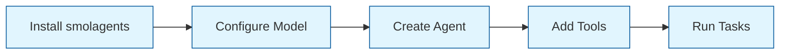
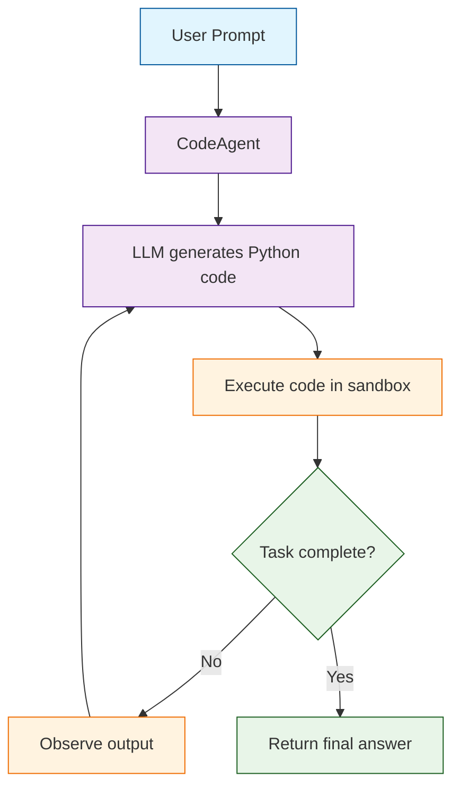

# Chapter 1: Getting Started with Smolagents

Welcome to **Chapter 1: Getting Started with Smolagents**. In this part of **Smolagents Tutorial: Hugging Face's Lightweight Agent Framework**, you will build an intuitive mental model first, then move into concrete implementation details and practical production tradeoffs.


> Install smolagents, configure your model backend, and run your first lightweight AI agent in minutes.

## What is Smolagents?

Smolagents is Hugging Face's lightweight Python library for building AI agents. Unlike heavier frameworks, smolagents keeps things minimal: a small API surface, transparent reasoning, and first-class support for code-writing agents. Whether you want an agent that writes Python to solve problems or one that makes structured tool calls, smolagents provides a clean foundation.



## Installation

### Core Installation

The core package includes the agent runtime, model connectors, and basic utilities:

```bash
pip install smolagents
```

### Full Installation

Install with all extras for web tools, code execution helpers, and additional integrations:

```bash
pip install smolagents[all]
```

### Development Installation

For contributors or those who want the latest features:

```bash
git clone https://github.com/huggingface/smolagents.git
cd smolagents
pip install -e ".[dev]"
```

### Verifying Your Installation

```python
import smolagents
print(f"smolagents version: {smolagents.__version__}")

# Check available components
from smolagents import CodeAgent, ToolCallingAgent, HfApiModel
print("All core components imported successfully.")
```

## Environment Setup

Smolagents is model-agnostic. You configure which LLM backend to use through environment variables and model classes.

### Environment Variables

Set the credentials for the model providers you plan to use:

```bash
# Hugging Face Inference API (default backend)
export HF_API_TOKEN=your-hf-token

# OpenAI (if using GPT models)
export OPENAI_API_KEY=sk-your-key

# Anthropic (if using Claude models)
export ANTHROPIC_API_KEY=your-anthropic-key

# For local models via Ollama (no key needed, just run the server)
# ollama serve
```

### Model Provider Comparison

| Provider | Model Class | Example Model ID | Best For |
|:---------|:------------|:-----------------|:---------|
| **Hugging Face** | `HfApiModel` | `meta-llama/Llama-3.1-70B-Instruct` | Open-source models, free tier available |
| **OpenAI** | `OpenAIServerModel` | `gpt-4o` | Strong general-purpose reasoning |
| **Anthropic** | `AnthropicModel` | `claude-3-5-sonnet-20241022` | Careful instruction following |
| **LiteLLM** | `LiteLLMModel` | `groq/llama-3.1-70b` | Unified gateway to 100+ providers |
| **Local (Ollama)** | `LiteLLMModel` | `ollama/llama3.1` | Privacy, no API costs |

### Configuring Each Provider

```python
from smolagents import (
    HfApiModel,
    OpenAIServerModel,
    AnthropicModel,
    LiteLLMModel,
)

# --- Hugging Face Inference API ---
hf_model = HfApiModel(model_id="meta-llama/Llama-3.1-70B-Instruct")

# --- OpenAI ---
openai_model = OpenAIServerModel(model_id="gpt-4o")

# --- Anthropic ---
anthropic_model = AnthropicModel(model_id="claude-3-5-sonnet-20241022")

# --- LiteLLM (any provider) ---
litellm_model = LiteLLMModel(model_id="groq/llama-3.1-70b")

# --- Local model via Ollama ---
local_model = LiteLLMModel(model_id="ollama/llama3.1")
```

## Your First Agent: CodeAgent

The `CodeAgent` is the flagship agent type. It generates Python code, executes it, observes the results, and iterates until the task is complete.



### Basic CodeAgent Example

```python
from smolagents import CodeAgent, HfApiModel

# Create the model backend
model = HfApiModel(model_id="meta-llama/Llama-3.1-8B-Instruct")

# Create a CodeAgent with no tools (pure code execution)
agent = CodeAgent(
    tools=[],          # no external tools yet
    model=model,
    max_steps=6,       # cap reasoning iterations
    verbose=True,      # show reasoning during execution
)

# Run a simple task
result = agent.run("Calculate 37 * 42, then divide by 7.")
print(f"Result: {result}")
# The agent writes Python: print(37 * 42 / 7) => 222.0
```

### What Happens Under the Hood

When you call `agent.run(...)`, the following loop executes:

1. The prompt is sent to the LLM with system instructions explaining the agent's capabilities.
2. The LLM generates a Python code block to address the task.
3. The code is executed in a sandboxed environment.
4. The output is captured and fed back to the LLM as an observation.
5. The LLM decides whether to write more code or return a final answer.
6. Steps 2-5 repeat until `max_steps` is reached or the agent produces a final answer.

### A More Interesting Example

```python
from smolagents import CodeAgent, HfApiModel

agent = CodeAgent(
    tools=[],
    model=HfApiModel(model_id="meta-llama/Llama-3.1-70B-Instruct"),
    max_steps=8,
    verbose=True,
)

result = agent.run("""
Create a list of the first 15 Fibonacci numbers.
Then calculate:
1. Their sum
2. Their average
3. The ratio between consecutive numbers (to show convergence to the golden ratio)
""")
print(result)
```

The agent will write Python code that computes Fibonacci numbers, iterates through them, calculates statistics, and returns a formatted answer -- all without any external tools.

## Your First ToolCallingAgent

The `ToolCallingAgent` uses the LLM's function-calling interface to make structured tool calls instead of writing arbitrary code.

```python
from smolagents import ToolCallingAgent, OpenAIServerModel, tool


@tool
def get_greeting(name: str) -> str:
    """Return a friendly greeting for the given person.

    Args:
        name: The name of the person to greet.

    Returns:
        A personalized greeting string.
    """
    return f"Hello, {name}! Welcome to smolagents."


agent = ToolCallingAgent(
    tools=[get_greeting],
    model=OpenAIServerModel(model_id="gpt-4o"),
    max_steps=4,
)

result = agent.run("Greet Alex warmly.")
print(result)
# "Hello, Alex! Welcome to smolagents."
```

### CodeAgent vs. ToolCallingAgent

| Feature | CodeAgent | ToolCallingAgent |
|:--------|:----------|:-----------------|
| **Execution** | Writes and runs Python code | Makes structured tool calls |
| **Flexibility** | High -- can compute, transform, loop | Constrained to registered tools |
| **Auditability** | Moderate -- code logs required | High -- tool calls are structured |
| **Best for** | Data analysis, complex reasoning | API integrations, strict workflows |
| **Risk level** | Higher -- arbitrary code execution | Lower -- only pre-approved tools |
| **Model requirement** | Any instruction-following LLM | LLM with function-calling support |

## Configuration Deep Dive

### Key Parameters

```python
from smolagents import CodeAgent, HfApiModel

agent = CodeAgent(
    # Required
    tools=[],                    # list of tool functions
    model=HfApiModel(),          # LLM backend

    # Execution control
    max_steps=6,                 # max reasoning iterations (default: 6)

    # Debugging
    verbose=True,                # print reasoning to stdout

    # Safety
    additional_authorized_imports=["numpy", "pandas"],  # allowed Python imports
)
```

### Configuration Recommendations by Use Case

| Use Case | `max_steps` | `verbose` | Notes |
|:---------|:------------|:----------|:------|
| Quick calculation | 3-4 | False | Simple tasks need few steps |
| Web research | 8-12 | True | Multiple search-and-read cycles |
| Data analysis | 6-10 | True | Code iteration with data |
| Production API | 6-8 | False | Balance cost and capability |
| Debugging / development | 10-15 | True | Allow deeper exploration |

## Troubleshooting Common Issues

### Import Errors

```python
# Problem: ModuleNotFoundError for numpy/pandas
# Solution: Add to authorized imports
agent = CodeAgent(
    tools=[],
    model=HfApiModel(),
    additional_authorized_imports=["numpy", "pandas", "json", "math"],
)
```

### Model Authentication

```python
# Problem: 401 Unauthorized from Hugging Face
# Solution: Ensure HF_API_TOKEN is set
import os
assert os.getenv("HF_API_TOKEN"), "Set HF_API_TOKEN environment variable"

# Or pass the token explicitly
model = HfApiModel(
    model_id="meta-llama/Llama-3.1-70B-Instruct",
    token="hf_your_token_here",
)
```

### Agent Loops or Exceeds Steps

```python
# Problem: Agent hits max_steps without finishing
# Solution 1: Increase max_steps
agent = CodeAgent(tools=[], model=model, max_steps=15)

# Solution 2: Simplify the prompt
# Instead of: "Research everything about X and write a comprehensive report"
# Try: "List the top 3 features of X in bullet points"
```

## Complete Getting Started Script

Here is a self-contained script that validates your setup end to end:

```python
"""smolagents_quickstart.py -- Validate your smolagents installation."""
import os
from smolagents import CodeAgent, HfApiModel, tool


# Step 1: Verify environment
print("Step 1: Checking environment...")
assert os.getenv("HF_API_TOKEN"), "Set HF_API_TOKEN first"
print("  HF_API_TOKEN is set.")

# Step 2: Create model
print("Step 2: Creating model backend...")
model = HfApiModel(model_id="meta-llama/Llama-3.1-8B-Instruct")
print(f"  Model: {model.model_id}")

# Step 3: Define a simple tool
@tool
def add_numbers(a: float, b: float) -> float:
    """Add two numbers together.

    Args:
        a: First number.
        b: Second number.

    Returns:
        The sum of a and b.
    """
    return a + b

# Step 4: Create and run agent
print("Step 3: Running CodeAgent...")
agent = CodeAgent(
    tools=[add_numbers],
    model=model,
    max_steps=4,
    verbose=True,
)

result = agent.run("What is 123.45 + 678.90?")
print(f"\nResult: {result}")
print("Setup complete!")
```

---

## Summary

Smolagents provides a minimal, powerful abstraction for building AI agents. In this chapter you installed the library, configured model backends across multiple providers, and ran your first `CodeAgent` and `ToolCallingAgent`. The key insight is that smolagents is deliberately lightweight -- you get agents that write code or call tools, with straightforward configuration knobs to control cost, safety, and verbosity.

## Key Takeaways

- **Two installation modes**: `pip install smolagents` for core, `smolagents[all]` for extras.
- **Model-agnostic**: Works with Hugging Face, OpenAI, Anthropic, Groq, local models, and more via a unified interface.
- **CodeAgent** writes and executes Python -- maximum flexibility for computation and reasoning.
- **ToolCallingAgent** uses structured function calls -- better auditability and safety.
- **`max_steps`** and **`verbose`** are your primary control knobs during development.
- Always set `additional_authorized_imports` to control what the agent can import.

## Next Steps

In **[Chapter 2: Understanding Agents](02-understanding-agents.md)**, you will explore the agent architecture in depth, compare execution modes, learn about the agent loop internals, and understand when to choose each agent type for your use case.

---

*Built with insights from the [Smolagents](https://github.com/huggingface/smolagents) project.*

## What Problem Does This Solve?

Most teams struggle here because the hard part is not writing more code, but deciding clear boundaries for `smolagents`, `model`, `agent` so behavior stays predictable as complexity grows.

In practical terms, this chapter helps you avoid three common failures:

- coupling core logic too tightly to one implementation path
- missing the handoff boundaries between setup, execution, and validation
- shipping changes without clear rollback or observability strategy

After working through this chapter, you should be able to reason about `Chapter 1: Getting Started with Smolagents` as an operating subsystem inside **Smolagents Tutorial: Hugging Face's Lightweight Agent Framework**, with explicit contracts for inputs, state transitions, and outputs.

Use the implementation notes around `print`, `CodeAgent`, `HfApiModel` as your checklist when adapting these patterns to your own repository.

## How it Works Under the Hood

Under the hood, `Chapter 1: Getting Started with Smolagents` usually follows a repeatable control path:

1. **Context bootstrap**: initialize runtime config and prerequisites for `smolagents`.
2. **Input normalization**: shape incoming data so `model` receives stable contracts.
3. **Core execution**: run the main logic branch and propagate intermediate state through `agent`.
4. **Policy and safety checks**: enforce limits, auth scopes, and failure boundaries.
5. **Output composition**: return canonical result payloads for downstream consumers.
6. **Operational telemetry**: emit logs/metrics needed for debugging and performance tuning.

When debugging, walk this sequence in order and confirm each stage has explicit success/failure conditions.

## Source Walkthrough

Use the following upstream sources to verify implementation details while reading this chapter:

- [View Repo](https://github.com/huggingface/smolagents)
  Why it matters: authoritative reference on `View Repo` (github.com).
- [Awesome Code Docs](https://github.com/johnxie/awesome-code-docs)
  Why it matters: authoritative reference on `Awesome Code Docs` (github.com).

Suggested trace strategy:
- search upstream code for `smolagents` and `model` to map concrete implementation paths
- compare docs claims against actual runtime/config code before reusing patterns in production

## Chapter Connections

- [Tutorial Index](index.md)
- [Next Chapter: Chapter 2: Understanding Smolagents](02-understanding-agents.md)
- [Main Catalog](../../README.md#-tutorial-catalog)
- [A-Z Tutorial Directory](../../discoverability/tutorial-directory.md)
