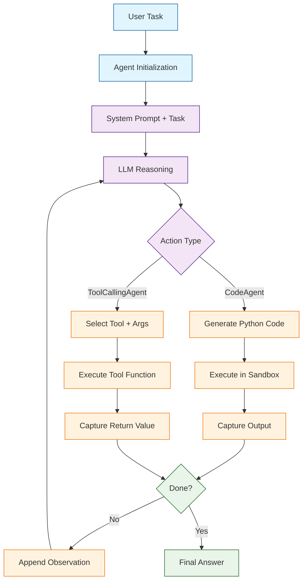
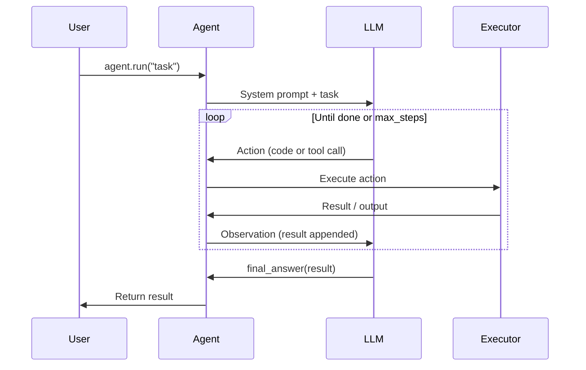
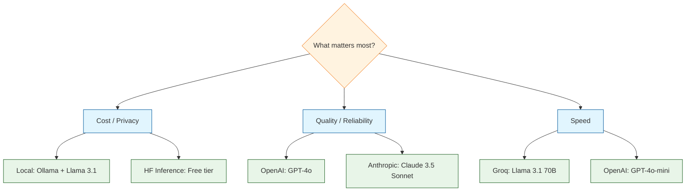
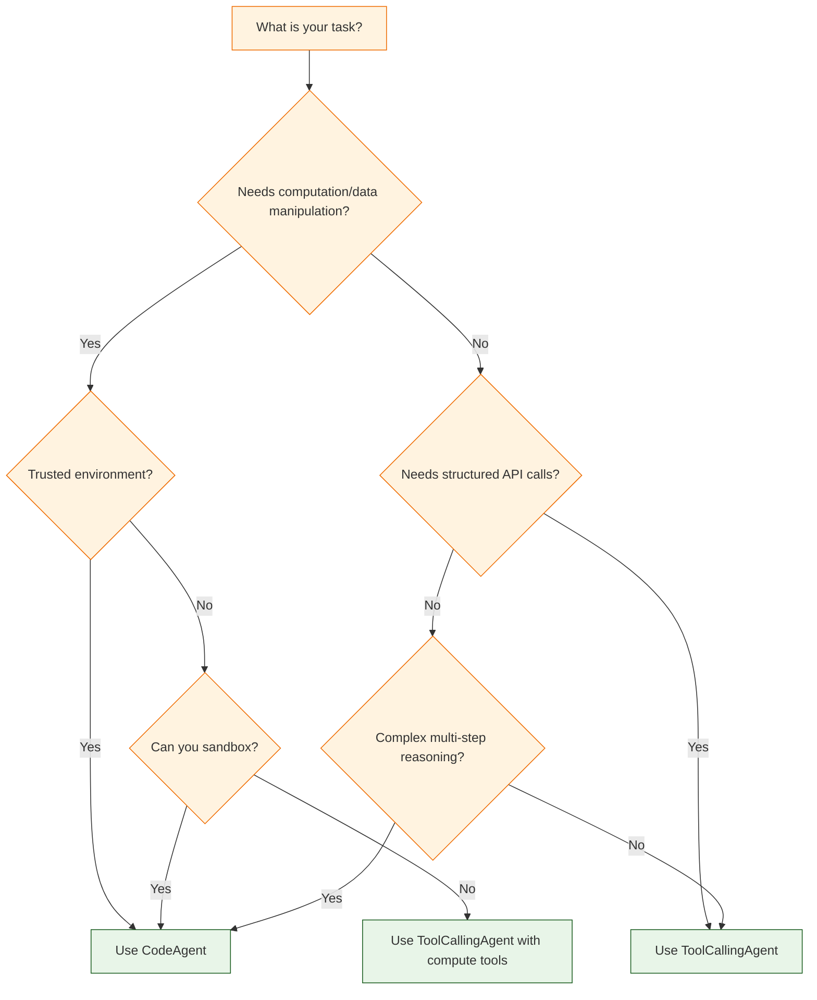

# Chapter 2: Understanding Smolagents

> Compare agent types, understand the execution loop, explore configuration options, and choose the right agent architecture for your task.

## The Smolagents Architecture

At its core, smolagents follows a simple loop: the agent receives a task, the LLM decides what to do, the action is executed, the result is observed, and the cycle repeats until the task is complete. This minimal design is what makes smolagents powerful -- there is no hidden complexity.



## Agent Types In Depth

### CodeAgent

The `CodeAgent` is smolagents' flagship. When given a task, the underlying LLM writes Python code that is executed in a sandboxed environment. The output of that code is fed back as an observation, and the LLM can iterate -- writing more code, correcting errors, or producing a final answer.

**Why code?** Research from Hugging Face shows that code-based agents outperform tool-calling agents on many benchmarks. Writing code gives the LLM access to the full expressiveness of Python: loops, conditionals, string manipulation, math, data structures, and composition of multiple tool calls in a single step.

```python
from smolagents import CodeAgent, HfApiModel
from smolagents.tools import DuckDuckGoSearchTool

agent = CodeAgent(
    tools=[DuckDuckGoSearchTool()],
    model=HfApiModel(model_id="meta-llama/Llama-3.1-70B-Instruct"),
    max_steps=10,
    verbose=True,
)

# The agent writes Python to search, parse results, and format output
result = agent.run(
    "Find the top 3 vector databases by GitHub stars and compare their features in a table."
)
print(result)
```

**What the agent generates internally** (example):

```python
# Step 1: Search for vector databases
results = duckduckgo_search("top vector databases GitHub stars 2024")
print(results)

# Step 2: (after observing search results) Format comparison
comparison = """
| Database | Stars | Key Features |
|----------|-------|-------------|
| Milvus   | 25k+  | GPU-accelerated, distributed |
| Qdrant   | 15k+  | Rust-based, filtering |
| Weaviate | 9k+   | GraphQL API, modules |
"""
final_answer(comparison)
```

### ToolCallingAgent

The `ToolCallingAgent` uses the LLM's native function-calling interface (also called tool use). Instead of writing arbitrary Python, the model selects from registered tools and provides structured arguments. The framework handles execution and returns results.

```python
from smolagents import ToolCallingAgent, OpenAIServerModel, tool


@tool
def fetch_repo_stars(repo: str) -> int:
    """Return the number of GitHub stars for a repository.

    Args:
        repo: Repository in 'owner/name' format (e.g., 'huggingface/smolagents').

    Returns:
        Number of stars as an integer.
    """
    # In production, call the GitHub API
    mock_data = {
        "huggingface/smolagents": 6000,
        "microsoft/semantic-kernel": 25000,
        "langchain-ai/langchain": 95000,
    }
    return mock_data.get(repo, 0)


@tool
def compare_numbers(a: int, b: int) -> str:
    """Compare two numbers and return which is larger.

    Args:
        a: First number.
        b: Second number.

    Returns:
        A string describing the comparison result.
    """
    if a > b:
        return f"{a} is greater than {b} by {a - b}"
    elif b > a:
        return f"{b} is greater than {a} by {b - a}"
    return f"{a} and {b} are equal"


agent = ToolCallingAgent(
    tools=[fetch_repo_stars, compare_numbers],
    model=OpenAIServerModel(model_id="gpt-4o-mini"),
    max_steps=5,
)

result = agent.run(
    "Compare the GitHub stars of huggingface/smolagents and langchain-ai/langchain."
)
print(result)
```

### Side-by-Side Comparison

| Dimension | CodeAgent | ToolCallingAgent |
|:----------|:----------|:-----------------|
| **How it works** | LLM writes Python, framework executes it | LLM selects tool + args via function-calling API |
| **Expressiveness** | Full Python: loops, math, string ops | Limited to tool signatures |
| **Multi-tool in one step** | Yes -- one code block can call many tools | One tool call per step (typically) |
| **Error recovery** | LLM sees traceback, rewrites code | Framework returns error, LLM retries |
| **Auditability** | Must log generated code | Tool calls are structured and loggable |
| **Security surface** | Larger -- arbitrary code | Smaller -- only registered tools |
| **Model requirements** | Any instruct-tuned LLM | LLM with function-calling support |
| **Performance** | Often fewer steps (batches calls) | More steps for complex tasks |
| **Best for** | Data analysis, research, computation | API integrations, strict workflows |

## The Agent Execution Loop

Both agent types follow the same high-level loop. Understanding this loop is critical for debugging and prompt engineering.



### Step-by-Step Breakdown

1. **Initialization**: The agent constructs a system prompt describing its role, available tools, and expected output format.
2. **Task injection**: The user's task is appended to the conversation.
3. **LLM reasoning**: The model reasons about what to do and produces an action.
4. **Action execution**: For `CodeAgent`, the Python code is executed. For `ToolCallingAgent`, the selected tool function is called.
5. **Observation**: The output is captured and appended to the conversation as an observation message.
6. **Loop or terminate**: If the agent calls `final_answer(...)`, the loop ends. Otherwise, the LLM sees the observation and decides what to do next. If `max_steps` is reached, the agent stops with whatever output is available.

### Verbose Output Example

When `verbose=True`, you see each step in real time:

```
=== Step 1 ===
Thought: I need to calculate 37 * 42, then divide by 7. Let me write Python code.
Code:
```python
result = 37 * 42
print(f"37 * 42 = {result}")
divided = result / 7
print(f"{result} / 7 = {divided}")
final_answer(divided)
```
Output: 37 * 42 = 1554
        1554 / 7 = 222.0
=== Final Answer ===
222.0
```

## Configuration Reference

### Common Parameters (Both Agent Types)

```python
from smolagents import CodeAgent, HfApiModel

agent = CodeAgent(
    # --- Required ---
    tools=[],                          # list of @tool-decorated functions
    model=HfApiModel(),                # LLM backend instance

    # --- Execution Control ---
    max_steps=6,                       # max reasoning iterations

    # --- Debugging ---
    verbose=True,                      # print step-by-step output
)
```

### CodeAgent-Specific Parameters

```python
agent = CodeAgent(
    tools=[],
    model=HfApiModel(),
    max_steps=8,

    # --- Code Execution Safety ---
    additional_authorized_imports=[     # Python modules the agent may import
        "numpy", "pandas", "json",
        "math", "collections", "re",
    ],
)
```

### ToolCallingAgent-Specific Parameters

```python
from smolagents import ToolCallingAgent, OpenAIServerModel

agent = ToolCallingAgent(
    tools=[my_tool],
    model=OpenAIServerModel(model_id="gpt-4o"),
    max_steps=5,
)
```

### Parameter Reference Table

| Parameter | Type | Default | Description |
|:----------|:-----|:--------|:------------|
| `tools` | `list` | `[]` | Tool functions available to the agent |
| `model` | `Model` | Required | LLM backend instance |
| `max_steps` | `int` | `6` | Maximum reasoning loop iterations |
| `verbose` | `bool` | `False` | Print step-by-step reasoning |
| `additional_authorized_imports` | `list[str]` | `[]` | Allowed Python imports (CodeAgent) |
| `system_prompt` | `str` | Built-in | Override the default system prompt |
| `planning_interval` | `int` | `None` | Re-plan every N steps |

## Model Selection Guide

Choosing the right model backend affects cost, speed, and quality. Here is a practical guide:



| Priority | Recommended Model | Provider | Notes |
|:---------|:------------------|:---------|:------|
| **Best quality** | GPT-4o or Claude 3.5 Sonnet | OpenAI / Anthropic | Best reasoning, highest cost |
| **Best value** | Llama 3.1 70B | HF Inference or Groq | Open-source, strong performance |
| **Fastest** | GPT-4o-mini or Groq Llama | OpenAI / Groq | Low latency, good for interactive use |
| **Privacy-first** | Llama 3.1 via Ollama | Local | No data leaves your machine |
| **Free** | Llama 3.1 8B | HF Inference free tier | Rate-limited but no cost |

### Switching Models at Runtime

```python
from smolagents import CodeAgent, HfApiModel, OpenAIServerModel

# Start with a cheap model for development
dev_model = HfApiModel(model_id="meta-llama/Llama-3.1-8B-Instruct")
agent = CodeAgent(tools=[], model=dev_model, max_steps=6)

# Switch to a stronger model for production
prod_model = OpenAIServerModel(model_id="gpt-4o")
agent = CodeAgent(tools=[], model=prod_model, max_steps=8)
```

## Choosing the Right Agent Type

### Decision Framework



### Use Case Recommendations

| Scenario | Recommended Agent | Rationale |
|:---------|:------------------|:----------|
| Data analysis / statistics | CodeAgent | Needs Python computation |
| Web research + summarize | CodeAgent | Chains search, parse, format in code |
| Customer support bot | ToolCallingAgent | Structured lookups, predictable flow |
| Database queries | ToolCallingAgent | Safety: only pre-approved queries |
| File processing pipeline | CodeAgent | Needs loops, conditionals, I/O |
| API integration gateway | ToolCallingAgent | Each API is a clean tool |
| Math / science problems | CodeAgent | Direct computation in Python |
| Form-filling assistant | ToolCallingAgent | Structured inputs and outputs |

## Advanced: Custom System Prompts

You can override the default system prompt to change agent behavior:

```python
from smolagents import CodeAgent, HfApiModel

custom_prompt = """You are a data analysis agent. You write Python code to analyze data.
Always follow these rules:
1. Start by understanding the data structure.
2. Use pandas for tabular data.
3. Include error handling in your code.
4. Format numerical results to 2 decimal places.
5. End with a clear summary of findings.

You have access to these tools: {tool_descriptions}
"""

agent = CodeAgent(
    tools=[],
    model=HfApiModel(),
    max_steps=10,
    system_prompt=custom_prompt,
    additional_authorized_imports=["pandas", "numpy"],
)
```

## Advanced: Planning Intervals

For complex tasks, you can enable periodic re-planning. The agent pauses every N steps to reflect on progress and adjust its plan:

```python
from smolagents import CodeAgent, HfApiModel

agent = CodeAgent(
    tools=[],
    model=HfApiModel(model_id="meta-llama/Llama-3.1-70B-Instruct"),
    max_steps=15,
    planning_interval=3,  # Re-plan every 3 steps
    verbose=True,
)

result = agent.run("""
Analyze the performance characteristics of bubble sort, merge sort, and quicksort.
For each algorithm:
1. Describe the time complexity (best, average, worst)
2. Describe the space complexity
3. Identify when each is most appropriate
Then provide a recommendation for general-purpose sorting.
""")
```

With `planning_interval=3`, the agent will pause after steps 3, 6, 9, and 12 to assess progress and decide what to tackle next.

## Practical Example: Research Agent

Here is a complete example combining multiple concepts from this chapter:

```python
from smolagents import CodeAgent, HfApiModel
from smolagents.tools import DuckDuckGoSearchTool, VisitWebpageTool

# Create a research-oriented CodeAgent
research_agent = CodeAgent(
    tools=[DuckDuckGoSearchTool(), VisitWebpageTool()],
    model=HfApiModel(model_id="meta-llama/Llama-3.1-70B-Instruct"),
    max_steps=12,
    planning_interval=4,       # re-plan every 4 steps
    verbose=True,
    additional_authorized_imports=["json", "re"],
)

# Run a multi-step research task
report = research_agent.run("""
Research smolagents by Hugging Face:
1. Find its GitHub repository and note the star count
2. Identify the main agent types it supports
3. Compare it briefly with LangChain's agent approach
4. Provide a 3-sentence summary of when to use smolagents
""")

print(report)
```

---

## Summary

Smolagents offers two agent types that share the same execution loop but differ in how they take actions. `CodeAgent` writes Python code for maximum flexibility and expressiveness, while `ToolCallingAgent` makes structured tool calls for better auditability and safety. The agent loop is a simple observe-think-act cycle controlled by `max_steps`, with optional planning intervals for complex tasks. Choosing the right agent type and model backend depends on your task requirements, trust boundaries, and cost constraints.

## Key Takeaways

- **CodeAgent** writes Python and is the recommended default -- it is more expressive and often completes tasks in fewer steps.
- **ToolCallingAgent** uses structured function calling and is better for strict, auditable workflows.
- The **agent loop** is observe-think-act, repeating until `max_steps` or `final_answer()`.
- **`verbose=True`** is essential during development for understanding agent reasoning.
- **`planning_interval`** enables periodic re-planning for complex multi-step tasks.
- **Model selection** should balance quality, cost, speed, and privacy requirements.
- Always start with a simpler configuration and increase complexity as needed.

## Next Steps

In **[Chapter 3: Tools & Functions](03-tools.md)**, you will learn how to build custom tools with the `@tool` decorator, use built-in tools from the smolagents ecosystem, and design tool APIs that LLMs can use effectively.

---

*Built with insights from the [Smolagents](https://github.com/huggingface/smolagents) project.*
