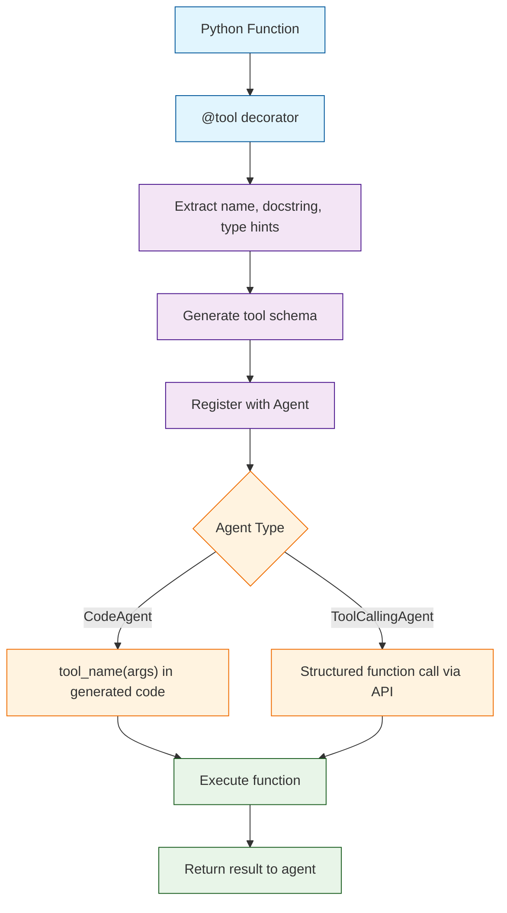
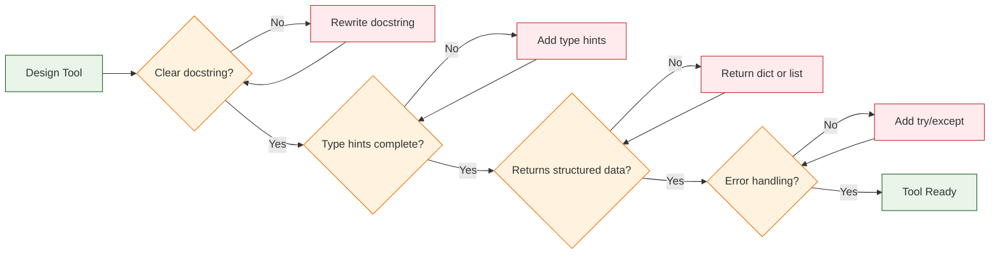

# Chapter 3: Tools & Functions

Welcome to **Chapter 3: Tools & Functions**. In this part of **Smolagents Tutorial: Hugging Face's Lightweight Agent Framework**, you will build an intuitive mental model first, then move into concrete implementation details and practical production tradeoffs.


> Build custom tools with the `@tool` decorator, use built-in tools, design effective tool APIs, and compose tools for complex workflows.

## How Tools Work in Smolagents

Tools are the bridge between your agent and the outside world. A tool is a Python function decorated with `@tool` that the agent can call during its reasoning loop. The decorator extracts the function's name, docstring, type hints, and default values to generate a schema that the LLM uses to understand what the tool does and how to call it.



## Built-in Tools

Smolagents ships with several ready-to-use tools for common tasks. These cover web search, webpage visiting, and more.

### Available Built-in Tools

| Tool | Class Name | Description | Use Case |
|:-----|:-----------|:------------|:---------|
| **Web Search** | `DuckDuckGoSearchTool` | Search the web via DuckDuckGo | Research, fact-checking |
| **Visit Webpage** | `VisitWebpageTool` | Fetch and parse webpage content | Reading articles, documentation |
| **Python REPL** | `PythonInterpreterTool` | Execute Python code | Computation, data processing |
| **Text-to-Speech** | `SpeechToTextTool` | Convert speech to text | Audio processing |
| **Image Generation** | `TextToImageTool` | Generate images from text | Creative tasks |

### Using Built-in Tools

```python
from smolagents import CodeAgent, HfApiModel
from smolagents.tools import DuckDuckGoSearchTool, VisitWebpageTool

# Create an agent with web research capabilities
agent = CodeAgent(
    tools=[
        DuckDuckGoSearchTool(),
        VisitWebpageTool(),
    ],
    model=HfApiModel(model_id="meta-llama/Llama-3.1-70B-Instruct"),
    max_steps=10,
    verbose=True,
)

# The agent can search the web and read pages
result = agent.run(
    "Find the latest release of smolagents on GitHub and summarize the key changes."
)
print(result)
```

### Combining Multiple Built-in Tools

```python
from smolagents import CodeAgent, HfApiModel
from smolagents.tools import DuckDuckGoSearchTool, VisitWebpageTool

agent = CodeAgent(
    tools=[
        DuckDuckGoSearchTool(),
        VisitWebpageTool(),
    ],
    model=HfApiModel(),
    max_steps=12,
    verbose=True,
    additional_authorized_imports=["json", "re"],
)

result = agent.run("""
Research the top 3 Python web frameworks (Django, Flask, FastAPI).
For each one:
1. Search for the official website
2. Visit the homepage to confirm the latest version
3. Note the key features
Then compare them in a table.
""")
print(result)
```

## Creating Custom Tools with @tool

The `@tool` decorator transforms any Python function into a tool the agent can use. The key requirements are: type hints for all parameters and the return type, and a clear docstring with argument descriptions.

### Anatomy of a Tool

```python
from smolagents import tool
from typing import List


@tool
def search_database(query: str, limit: int = 5) -> List[dict]:
    """Search the internal database for matching records.

    Args:
        query: The search query string to look for in the database.
        limit: Maximum number of results to return (default: 5).

    Returns:
        A list of dictionaries, each containing 'id', 'title', and 'score'.
    """
    # Your implementation here
    mock_results = [
        {"id": i, "title": f"Result {i} for '{query}'", "score": 0.95 - i * 0.1}
        for i in range(limit)
    ]
    return mock_results
```

### What the Decorator Extracts

The `@tool` decorator reads the following from your function:

| Element | Source | Used For |
|:--------|:-------|:---------|
| **Tool name** | Function name | Identifies the tool in the agent's prompt |
| **Description** | First line of docstring | Tells the LLM what the tool does |
| **Parameters** | Type hints + `Args:` in docstring | Generates parameter schema |
| **Return type** | Return type hint | Tells the LLM what to expect back |
| **Defaults** | Default parameter values | Makes parameters optional |

### Best Practices for Docstrings

The docstring is the most important part of a tool. The LLM reads it to decide when and how to use the tool. Write it for an audience that cannot see your code.

```python
from smolagents import tool


# GOOD: Clear, descriptive docstring
@tool
def convert_currency(amount: float, from_currency: str, to_currency: str) -> str:
    """Convert an amount from one currency to another using current exchange rates.

    Args:
        amount: The monetary amount to convert (e.g., 100.0).
        from_currency: The source currency code (e.g., 'USD', 'EUR', 'GBP').
        to_currency: The target currency code (e.g., 'JPY', 'CHF', 'CAD').

    Returns:
        A string with the converted amount and currency, e.g., '12,345.67 JPY'.
    """
    rates = {"USD_EUR": 0.92, "USD_JPY": 149.50, "EUR_USD": 1.09}
    key = f"{from_currency}_{to_currency}"
    rate = rates.get(key, 1.0)
    converted = amount * rate
    return f"{converted:,.2f} {to_currency}"


# BAD: Vague docstring -- LLM won't know when to use this
@tool
def do_conversion(a: float, b: str, c: str) -> str:
    """Do a conversion."""  # Too vague!
    pass
```

## Tool Patterns and Recipes

### Pattern 1: Data Retrieval Tool

```python
from smolagents import tool
from typing import Optional


@tool
def get_user_profile(user_id: str, include_history: bool = False) -> dict:
    """Retrieve a user's profile information from the system.

    Args:
        user_id: The unique identifier for the user (e.g., 'usr_12345').
        include_history: Whether to include the user's recent activity history.

    Returns:
        A dictionary with keys 'name', 'email', 'plan', and optionally 'history'.
    """
    # In production, query your database
    profile = {
        "name": "Alice Chen",
        "email": "alice@example.com",
        "plan": "pro",
    }
    if include_history:
        profile["history"] = [
            {"action": "login", "timestamp": "2024-01-15T10:30:00Z"},
            {"action": "upload", "timestamp": "2024-01-15T11:00:00Z"},
        ]
    return profile
```

### Pattern 2: Action/Mutation Tool

```python
from smolagents import tool


@tool
def create_ticket(title: str, description: str, priority: str = "medium") -> dict:
    """Create a new support ticket in the ticketing system.

    Args:
        title: Brief title for the ticket (max 100 characters).
        description: Detailed description of the issue or request.
        priority: Ticket priority level, one of 'low', 'medium', 'high', 'critical'.

    Returns:
        A dictionary with the created ticket's 'id', 'status', and 'url'.
    """
    # In production, call your ticketing API
    import hashlib
    ticket_id = hashlib.md5(title.encode()).hexdigest()[:8]
    return {
        "id": f"TKT-{ticket_id}",
        "status": "open",
        "url": f"https://tickets.example.com/TKT-{ticket_id}",
    }
```

### Pattern 3: Transformation Tool

```python
from smolagents import tool
from typing import List


@tool
def summarize_list(items: List[str], max_items: int = 5) -> str:
    """Summarize a list of items into a numbered markdown list.

    Args:
        items: The list of text items to summarize.
        max_items: Maximum number of items to include (default: 5).

    Returns:
        A formatted markdown numbered list string.
    """
    selected = items[:max_items]
    lines = [f"{i+1}. {item}" for i, item in enumerate(selected)]
    if len(items) > max_items:
        lines.append(f"... and {len(items) - max_items} more items")
    return "\n".join(lines)
```

### Pattern 4: Validation Tool

```python
from smolagents import tool


@tool
def validate_email(email: str) -> dict:
    """Validate an email address format and domain.

    Args:
        email: The email address to validate (e.g., 'user@example.com').

    Returns:
        A dictionary with 'valid' (bool), 'reason' (str), and 'domain' (str).
    """
    import re
    pattern = r'^[a-zA-Z0-9._%+-]+@[a-zA-Z0-9.-]+\.[a-zA-Z]{2,}$'
    if not re.match(pattern, email):
        return {"valid": False, "reason": "Invalid format", "domain": None}
    domain = email.split("@")[1]
    return {"valid": True, "reason": "Format OK", "domain": domain}
```

### Pattern 5: Aggregation Tool

```python
from smolagents import tool
from typing import List


@tool
def calculate_statistics(numbers: List[float]) -> dict:
    """Calculate descriptive statistics for a list of numbers.

    Args:
        numbers: A list of numerical values to analyze.

    Returns:
        A dictionary with 'count', 'mean', 'min', 'max', 'sum', and 'std_dev'.
    """
    n = len(numbers)
    if n == 0:
        return {"count": 0, "mean": 0, "min": 0, "max": 0, "sum": 0, "std_dev": 0}
    total = sum(numbers)
    mean = total / n
    variance = sum((x - mean) ** 2 for x in numbers) / n
    return {
        "count": n,
        "mean": round(mean, 4),
        "min": min(numbers),
        "max": max(numbers),
        "sum": round(total, 4),
        "std_dev": round(variance ** 0.5, 4),
    }
```

## Registering Tools with Agents

### At Initialization

```python
from smolagents import CodeAgent, HfApiModel

agent = CodeAgent(
    tools=[
        search_database,
        create_ticket,
        validate_email,
        calculate_statistics,
    ],
    model=HfApiModel(),
    max_steps=8,
)
```

### Tool Naming in the Agent Context

When you register a tool, the agent's system prompt includes the tool's name, description, and parameter schema. The CodeAgent can then write code like:

```python
# Inside the agent's generated code:
results = search_database(query="billing issue", limit=3)
for r in results:
    print(r["title"])
```

The ToolCallingAgent makes structured calls like:

```json
{
  "name": "search_database",
  "arguments": {
    "query": "billing issue",
    "limit": 3
  }
}
```

## Composing Tools in CodeAgent

One of the major advantages of CodeAgent is that it can compose multiple tools in a single code block:

```python
from smolagents import CodeAgent, HfApiModel, tool
from typing import List


@tool
def search_products(query: str) -> List[dict]:
    """Search the product catalog.

    Args:
        query: Search query for products.

    Returns:
        List of matching products with 'name', 'price', and 'rating'.
    """
    return [
        {"name": "Widget A", "price": 29.99, "rating": 4.5},
        {"name": "Widget B", "price": 19.99, "rating": 4.8},
        {"name": "Widget C", "price": 49.99, "rating": 4.2},
    ]


@tool
def format_as_table(headers: List[str], rows: List[List[str]]) -> str:
    """Format data as a markdown table.

    Args:
        headers: Column header names.
        rows: List of rows, each row is a list of cell values.

    Returns:
        A formatted markdown table string.
    """
    header_row = "| " + " | ".join(headers) + " |"
    separator = "| " + " | ".join(["---"] * len(headers)) + " |"
    data_rows = [("| " + " | ".join(row) + " |") for row in rows]
    return "\n".join([header_row, separator] + data_rows)


agent = CodeAgent(
    tools=[search_products, format_as_table],
    model=HfApiModel(),
    max_steps=6,
)

# The agent can chain: search -> process -> format in one code block
result = agent.run(
    "Find products matching 'widget', sort by rating, and display as a table."
)
print(result)
```

The agent might generate code like:

```python
# Search for products
products = search_products(query="widget")

# Sort by rating descending
products.sort(key=lambda p: p["rating"], reverse=True)

# Format as table
headers = ["Name", "Price", "Rating"]
rows = [[p["name"], f"${p['price']}", str(p["rating"])] for p in products]
table = format_as_table(headers=headers, rows=rows)
final_answer(table)
```

## Loading Tools from Hugging Face Hub

Smolagents supports loading tools shared on the Hugging Face Hub:

```python
from smolagents import CodeAgent, HfApiModel, load_tool

# Load a tool from the Hub
image_gen_tool = load_tool("m-ric/text-to-image")

agent = CodeAgent(
    tools=[image_gen_tool],
    model=HfApiModel(),
    max_steps=6,
)

result = agent.run("Generate an image of a sunset over mountains.")
```

## Testing Your Tools

Always test tools independently before registering them with an agent. This ensures the tool works correctly and returns the expected types.

### Unit Testing

```python
def test_search_database():
    """Test search_database returns correct structure."""
    results = search_database(query="test", limit=3)
    assert isinstance(results, list)
    assert len(results) == 3
    assert all("id" in r and "title" in r and "score" in r for r in results)


def test_validate_email_valid():
    """Test valid email passes validation."""
    result = validate_email(email="user@example.com")
    assert result["valid"] is True
    assert result["domain"] == "example.com"


def test_validate_email_invalid():
    """Test invalid email fails validation."""
    result = validate_email(email="not-an-email")
    assert result["valid"] is False


def test_calculate_statistics():
    """Test statistics calculation."""
    result = calculate_statistics(numbers=[1.0, 2.0, 3.0, 4.0, 5.0])
    assert result["count"] == 5
    assert result["mean"] == 3.0
    assert result["min"] == 1.0
    assert result["max"] == 5.0


def test_calculate_statistics_empty():
    """Test statistics with empty input."""
    result = calculate_statistics(numbers=[])
    assert result["count"] == 0
```

### Integration Testing with an Agent

```python
from smolagents import CodeAgent, HfApiModel

def test_agent_uses_tool():
    """Verify the agent can discover and use a custom tool."""
    agent = CodeAgent(
        tools=[calculate_statistics],
        model=HfApiModel(),
        max_steps=4,
        verbose=True,
    )
    result = agent.run("Calculate the mean of [10, 20, 30, 40, 50].")
    # The agent should use calculate_statistics and return 30.0
    assert "30" in str(result)
```

## Tool Design Guidelines



### Do's and Don'ts

| Do | Don't |
|:---|:------|
| Write descriptive docstrings with Args/Returns | Use vague or missing docstrings |
| Use specific type hints (`List[str]`, `dict`) | Use `Any` or omit types |
| Return structured data (dicts, lists) | Return unstructured strings for complex data |
| Handle errors gracefully with informative messages | Let exceptions propagate silently |
| Keep tools focused on one responsibility | Build mega-tools that do everything |
| Include default values for optional parameters | Require every parameter |
| Test tools independently before agent integration | Only test through the agent |

### Error Handling in Tools

```python
from smolagents import tool


@tool
def divide_numbers(a: float, b: float) -> dict:
    """Divide two numbers safely.

    Args:
        a: The dividend (number to be divided).
        b: The divisor (number to divide by).

    Returns:
        A dictionary with 'result' (float) and 'success' (bool).
    """
    if b == 0:
        return {"result": None, "success": False, "error": "Division by zero"}
    return {"result": round(a / b, 6), "success": True, "error": None}
```

---

## Summary

Tools are the mechanism by which smolagents agents interact with external systems, data sources, and services. The `@tool` decorator transforms any Python function into an agent-callable tool by extracting its name, docstring, and type hints into a schema. Built-in tools cover web search and page visiting, while custom tools can implement any logic you need. The quality of your tool's docstring directly impacts how well the LLM uses it -- write docstrings for an audience that cannot see your code.

## Key Takeaways

- **`@tool` decorator** extracts name, docstring, and type hints to create tool schemas automatically.
- **Docstrings are critical** -- the LLM reads them to decide when and how to call your tool.
- **Built-in tools** cover web search (`DuckDuckGoSearchTool`) and webpage reading (`VisitWebpageTool`).
- **CodeAgent** can compose multiple tools in a single code block, which is more efficient than one-tool-per-step.
- **Return structured data** (dicts, lists) rather than raw strings for complex outputs.
- **Test tools independently** with unit tests before integrating with an agent.
- **Error handling** should return informative results rather than raising exceptions.
- Tools from Hugging Face Hub can be loaded with `load_tool()` for community-shared capabilities.

## Next Steps

In **[Chapter 4: Code Execution](04-code-execution.md)**, you will learn how smolagents safely executes agent-generated Python code, how to control the sandbox, manage imports, and build observable execution pipelines.

---

*Built with insights from the [Smolagents](https://github.com/huggingface/smolagents) project.*

## What Problem Does This Solve?

Most teams struggle here because the hard part is not writing more code, but deciding clear boundaries for `result`, `tool`, `agent` so behavior stays predictable as complexity grows.

In practical terms, this chapter helps you avoid three common failures:

- coupling core logic too tightly to one implementation path
- missing the handoff boundaries between setup, execution, and validation
- shipping changes without clear rollback or observability strategy

After working through this chapter, you should be able to reason about `Chapter 3: Tools & Functions` as an operating subsystem inside **Smolagents Tutorial: Hugging Face's Lightweight Agent Framework**, with explicit contracts for inputs, state transitions, and outputs.

Use the implementation notes around `smolagents`, `CodeAgent`, `List` as your checklist when adapting these patterns to your own repository.

## How it Works Under the Hood

Under the hood, `Chapter 3: Tools & Functions` usually follows a repeatable control path:

1. **Context bootstrap**: initialize runtime config and prerequisites for `result`.
2. **Input normalization**: shape incoming data so `tool` receives stable contracts.
3. **Core execution**: run the main logic branch and propagate intermediate state through `agent`.
4. **Policy and safety checks**: enforce limits, auth scopes, and failure boundaries.
5. **Output composition**: return canonical result payloads for downstream consumers.
6. **Operational telemetry**: emit logs/metrics needed for debugging and performance tuning.

When debugging, walk this sequence in order and confirm each stage has explicit success/failure conditions.

## Source Walkthrough

Use the following upstream sources to verify implementation details while reading this chapter:

- [View Repo](https://github.com/huggingface/smolagents)
  Why it matters: authoritative reference on `View Repo` (github.com).
- [Awesome Code Docs](https://github.com/johnxie/awesome-code-docs)
  Why it matters: authoritative reference on `Awesome Code Docs` (github.com).

Suggested trace strategy:
- search upstream code for `result` and `tool` to map concrete implementation paths
- compare docs claims against actual runtime/config code before reusing patterns in production

## Chapter Connections

- [Tutorial Index](index.md)
- [Previous Chapter: Chapter 2: Understanding Smolagents](02-understanding-agents.md)
- [Next Chapter: Chapter 4: Safe Code Execution](04-code-execution.md)
- [Main Catalog](../../README.md#-tutorial-catalog)
- [A-Z Tutorial Directory](../../discoverability/tutorial-directory.md)
