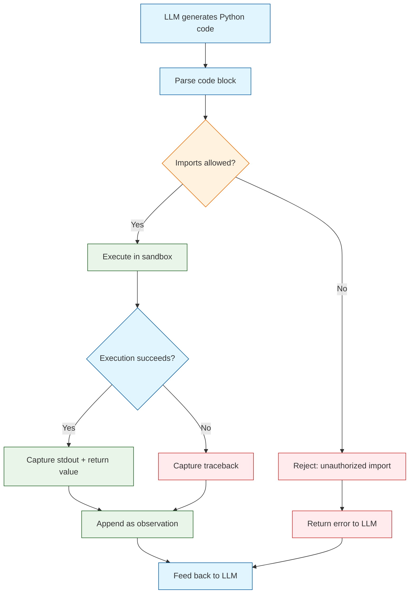
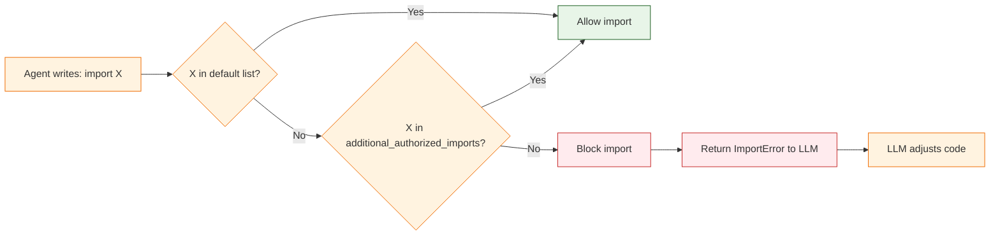
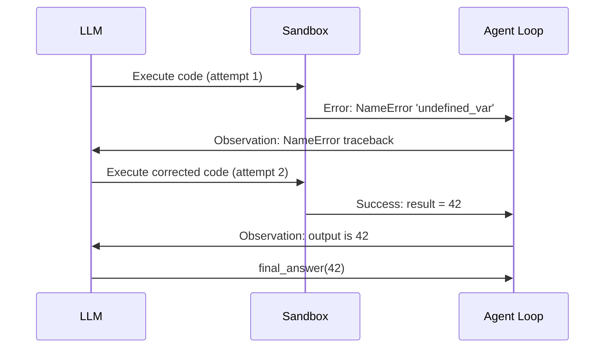
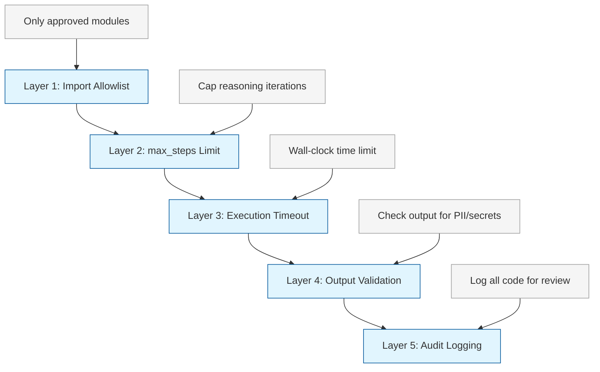

# Chapter 4: Safe Code Execution

> Understand how smolagents executes agent-generated Python code, configure the sandbox, manage import restrictions, handle errors, and build observable execution pipelines.

## How Code Execution Works

The `CodeAgent` is unique among agent types: the LLM generates Python code, and smolagents executes it in a controlled environment. This gives agents the full power of Python -- loops, conditionals, math, data structures, string manipulation -- while the framework provides safety boundaries.



## The Execution Sandbox

Smolagents executes agent-generated code in a sandboxed Python interpreter. This sandbox restricts what the code can do:

- **Import control**: Only modules in the authorized list can be imported.
- **No file system access**: By default, the code cannot read or write files.
- **No network access**: Direct network calls are blocked; use tools for external access.
- **Output capture**: All `print()` output and return values are captured.

### Default Authorized Imports

The sandbox allows a small set of safe built-in modules by default:

| Category | Modules |
|:---------|:--------|
| **Math** | `math`, `statistics` |
| **Data structures** | `collections`, `itertools`, `functools` |
| **Text** | `re`, `string`, `textwrap` |
| **Time** | `time`, `datetime` |
| **Serialization** | `json` |
| **Utilities** | `random`, `copy`, `enum`, `typing` |

### Adding Authorized Imports

To let the agent use additional libraries, specify them in `additional_authorized_imports`:

```python
from smolagents import CodeAgent, HfApiModel

agent = CodeAgent(
    tools=[],
    model=HfApiModel(),
    max_steps=8,
    additional_authorized_imports=[
        "numpy",
        "pandas",
        "matplotlib",
        "scipy",
    ],
)

result = agent.run("""
Using numpy, create an array of 100 random numbers from a normal distribution.
Calculate the mean, standard deviation, and the 95th percentile.
""")
print(result)
```

### Import Security Model



## Controlling Execution Limits

### max_steps: Preventing Infinite Loops

The `max_steps` parameter caps how many reasoning iterations the agent can perform. Each iteration consists of the LLM producing code and the sandbox executing it.

```python
from smolagents import CodeAgent, HfApiModel

# Tight limit for simple tasks
simple_agent = CodeAgent(
    tools=[],
    model=HfApiModel(),
    max_steps=3,  # 3 iterations max
)

# Generous limit for complex analysis
analysis_agent = CodeAgent(
    tools=[],
    model=HfApiModel(),
    max_steps=15,  # up to 15 iterations
    additional_authorized_imports=["pandas", "numpy"],
)
```

### Recommended max_steps by Task Type

| Task Type | Recommended `max_steps` | Rationale |
|:----------|:------------------------|:----------|
| Simple calculation | 2-3 | One code block usually suffices |
| Data transformation | 4-6 | May need iteration for formatting |
| Web research | 8-12 | Multiple search-read-process cycles |
| Data analysis | 6-10 | Exploration, computation, formatting |
| Complex multi-part task | 10-15 | Multiple sub-tasks, error recovery |

### Execution Timeouts

For production use, combine `max_steps` with external timeouts to prevent runaway execution:

```python
import signal
from smolagents import CodeAgent, HfApiModel


def timeout_handler(signum, frame):
    raise TimeoutError("Agent execution timed out")


agent = CodeAgent(
    tools=[],
    model=HfApiModel(),
    max_steps=10,
)

# Set a 60-second timeout
signal.signal(signal.SIGALRM, timeout_handler)
signal.alarm(60)

try:
    result = agent.run("Analyze the time complexity of merge sort.")
    print(result)
except TimeoutError:
    print("Agent took too long -- aborting.")
finally:
    signal.alarm(0)  # Cancel the alarm
```

## Error Handling Strategies

When agent-generated code fails, smolagents captures the traceback and feeds it back to the LLM as an observation. The LLM can then adjust its code and try again. This self-correction is one of the key advantages of code-based agents.

### How Error Recovery Works



### Configuring Error Behavior

```python
from smolagents import CodeAgent, HfApiModel

# Default: agent retries on error (up to max_steps)
resilient_agent = CodeAgent(
    tools=[],
    model=HfApiModel(),
    max_steps=6,
    verbose=True,  # See error recovery in action
)

# The agent will see the error and rewrite the code
result = resilient_agent.run(
    "Calculate the factorial of 20 using a recursive function."
)
```

### Wrapping Agent Execution

For production, wrap the agent call in a try/except to handle cases where the agent exhausts all steps:

```python
from smolagents import CodeAgent, HfApiModel


def safe_run(agent, prompt, fallback="Unable to complete the task."):
    """Run an agent with graceful error handling."""
    try:
        result = agent.run(prompt)
        if result is None:
            return fallback
        return result
    except Exception as e:
        return f"{fallback} Error: {type(e).__name__}: {e}"


agent = CodeAgent(
    tools=[],
    model=HfApiModel(),
    max_steps=6,
)

answer = safe_run(agent, "What is the square root of 144?")
print(answer)
```

## Observability and Logging

Understanding what the agent does is critical for debugging and auditing. Smolagents provides built-in verbose output, and you can build additional logging on top.

### Built-in Verbose Mode

```python
from smolagents import CodeAgent, HfApiModel

agent = CodeAgent(
    tools=[],
    model=HfApiModel(),
    max_steps=6,
    verbose=True,  # Prints each step's thought, code, and output
)

result = agent.run("Generate the first 10 prime numbers.")
```

With `verbose=True`, each step shows:
- **Thought**: The LLM's reasoning about what to do
- **Code**: The Python code the LLM wrote
- **Output**: The result of executing that code

### Custom Logging Wrapper

Build a wrapper to capture detailed execution logs for auditing:

```python
import time
import json
from smolagents import CodeAgent, HfApiModel


class LoggedAgent:
    """Wrapper that logs agent execution details."""

    def __init__(self, agent):
        self.agent = agent
        self.logs = []

    def run(self, prompt):
        start_time = time.time()
        log_entry = {
            "prompt": prompt,
            "start_time": start_time,
            "steps": [],
        }

        try:
            result = self.agent.run(prompt)
            log_entry["result"] = str(result)
            log_entry["status"] = "success"
        except Exception as e:
            log_entry["result"] = None
            log_entry["status"] = "error"
            log_entry["error"] = str(e)
            result = None

        log_entry["duration_seconds"] = round(time.time() - start_time, 2)
        self.logs.append(log_entry)
        return result

    def export_logs(self, filepath="agent_logs.json"):
        with open(filepath, "w") as f:
            json.dump(self.logs, f, indent=2, default=str)


# Usage
agent = CodeAgent(
    tools=[],
    model=HfApiModel(),
    max_steps=6,
    verbose=False,
)

logged = LoggedAgent(agent)
result = logged.run("What is 2 to the power of 32?")
logged.export_logs("execution_log.json")
```

### Metrics to Track

| Metric | Description | Why It Matters |
|:-------|:------------|:---------------|
| **Steps used** | Number of iterations before completion | Cost and efficiency indicator |
| **Total tokens** | Input + output tokens across all steps | Direct cost metric |
| **Execution time** | Wall-clock time for the full run | Latency for users |
| **Error count** | Number of failed code executions | Reliability indicator |
| **Imports used** | Which modules the agent imported | Security audit trail |
| **Code cells** | All generated code blocks | Full audit log |

## Practical Examples

### Example 1: Data Analysis Agent

```python
from smolagents import CodeAgent, HfApiModel

agent = CodeAgent(
    tools=[],
    model=HfApiModel(model_id="meta-llama/Llama-3.1-70B-Instruct"),
    max_steps=8,
    additional_authorized_imports=["numpy", "statistics"],
    verbose=True,
)

result = agent.run("""
Create a dataset of monthly sales figures for a fictional company:
- January: 45000, February: 52000, March: 48000
- April: 61000, May: 55000, June: 72000
- July: 68000, August: 71000, September: 64000
- October: 78000, November: 82000, December: 95000

Calculate:
1. Total annual sales
2. Average monthly sales
3. Best and worst months
4. Quarter-over-quarter growth rates
5. Month with the highest growth from the previous month
""")
print(result)
```

### Example 2: Text Processing Agent

```python
from smolagents import CodeAgent, HfApiModel

agent = CodeAgent(
    tools=[],
    model=HfApiModel(),
    max_steps=6,
    additional_authorized_imports=["re", "collections"],
    verbose=True,
)

result = agent.run("""
Given this text:
'The quick brown fox jumps over the lazy dog. The fox is quick and brown.'

1. Count the frequency of each word (case-insensitive)
2. Find the top 3 most common words
3. Count the number of sentences
4. Calculate the average words per sentence
""")
print(result)
```

### Example 3: Algorithm Implementation

```python
from smolagents import CodeAgent, HfApiModel

agent = CodeAgent(
    tools=[],
    model=HfApiModel(model_id="meta-llama/Llama-3.1-70B-Instruct"),
    max_steps=6,
    verbose=True,
)

result = agent.run("""
Implement binary search on the sorted list [2, 5, 8, 12, 16, 23, 38, 56, 72, 91].
Search for the values: 23 (should be found) and 25 (should not be found).
Show the step-by-step process for each search.
""")
print(result)
```

## Security Best Practices

### The Layered Defense Model



### Security Configuration Checklist

| Control | Setting | Purpose |
|:--------|:--------|:--------|
| Import allowlist | `additional_authorized_imports=["numpy"]` | Prevent access to `os`, `subprocess`, `socket` |
| Step limit | `max_steps=8` | Prevent infinite reasoning loops |
| Timeout | External `signal.alarm(60)` | Hard wall-clock limit |
| No file I/O | Default sandbox behavior | Prevent reading/writing files |
| No network | Default sandbox behavior | Prevent direct HTTP calls |
| Logging | `verbose=True` or custom logger | Audit trail for all executed code |

### What NOT to Allow

Never add these to `additional_authorized_imports` in untrusted environments:

```python
# DANGEROUS -- do not authorize these in untrusted setups
dangerous_imports = [
    "os",           # File system access, process control
    "subprocess",   # Execute arbitrary shell commands
    "socket",       # Direct network access
    "shutil",       # File operations
    "sys",          # System-level access
    "importlib",    # Dynamic imports bypass allowlist
    "ctypes",       # C-level operations
    "pickle",       # Deserialization attacks
]
```

### Safe Import Lists by Use Case

```python
# Data analysis
data_imports = ["numpy", "pandas", "statistics", "math", "collections"]

# Text processing
text_imports = ["re", "string", "textwrap", "collections"]

# Scientific computing
science_imports = ["numpy", "scipy", "statistics", "math"]

# General utilities
utility_imports = ["json", "datetime", "collections", "itertools", "functools"]
```

## Advanced: Custom Execution Environments

For advanced use cases, you can customize the execution environment:

### Pre-loading Variables

```python
from smolagents import CodeAgent, HfApiModel

# Provide data the agent can reference
agent = CodeAgent(
    tools=[],
    model=HfApiModel(),
    max_steps=6,
    additional_authorized_imports=["json"],
)

# Pass data via the prompt
data_json = '{"users": [{"name": "Alice", "age": 30}, {"name": "Bob", "age": 25}]}'

result = agent.run(f"""
Given this JSON data:
{data_json}

Parse it and calculate the average age of all users.
""")
print(result)
```

### Restricting Output Size

```python
from smolagents import CodeAgent, HfApiModel


def run_with_output_limit(agent, prompt, max_output_chars=5000):
    """Run agent and truncate oversized outputs."""
    result = agent.run(prompt)
    result_str = str(result)
    if len(result_str) > max_output_chars:
        return result_str[:max_output_chars] + "\n... [output truncated]"
    return result


agent = CodeAgent(
    tools=[],
    model=HfApiModel(),
    max_steps=6,
)

output = run_with_output_limit(agent, "List the first 100 Fibonacci numbers.")
print(output)
```

---

## Summary

Code execution is the foundation of the `CodeAgent` architecture. The sandbox provides safety boundaries through import allowlists, step limits, and isolated execution. When code fails, the traceback is fed back to the LLM, enabling self-correction. Observability through verbose mode and custom logging ensures you can audit and debug agent behavior. A layered security approach -- combining import restrictions, step limits, timeouts, and logging -- provides defense in depth for production deployments.

## Key Takeaways

- **Sandboxed execution**: Agent-generated code runs in a restricted environment with controlled imports and no direct file/network access.
- **Import allowlist**: Use `additional_authorized_imports` to grant access only to modules the agent needs.
- **`max_steps`** prevents infinite loops; tune it based on task complexity (2-3 for simple, 10-15 for complex).
- **Error recovery**: The LLM sees tracebacks and can self-correct, making code agents resilient.
- **Verbose mode** (`verbose=True`) is essential for development and debugging.
- **Layered security**: Combine import restrictions, step limits, timeouts, output validation, and audit logging.
- **Never authorize** `os`, `subprocess`, `socket`, or other system-level modules in untrusted environments.
- Build **custom logging wrappers** to capture execution metrics for production monitoring.

## Next Steps

In **[Chapter 5: Multi-Step Reasoning](05-multi-step.md)**, you will learn how to structure complex tasks, guide the agent's plan with prompt engineering, audit reasoning traces, and prevent drift in long-running agent sessions.

---

*Built with insights from the [Smolagents](https://github.com/huggingface/smolagents) project.*
