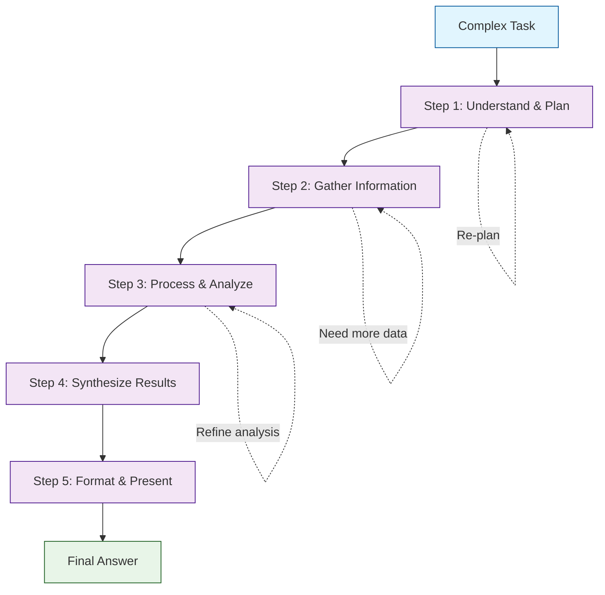
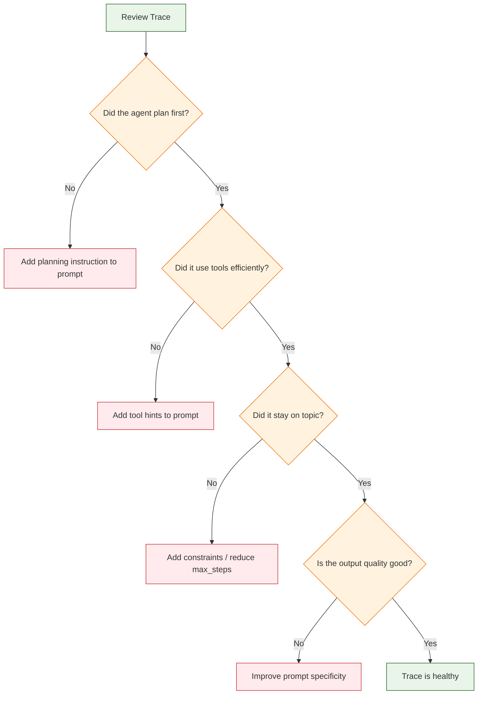
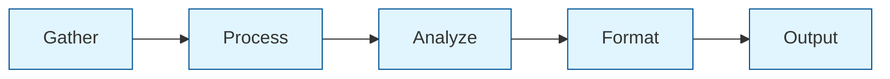
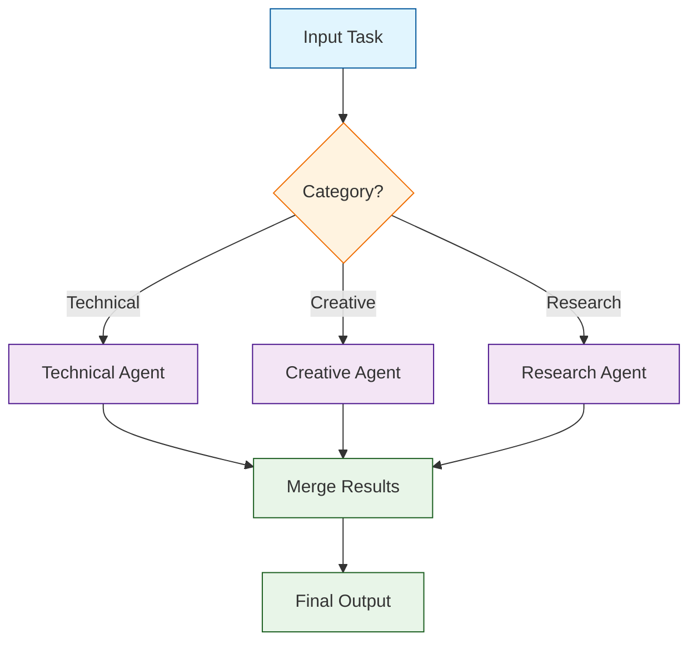

# Chapter 5: Multi-Step Reasoning

> Structure complex tasks into manageable steps, guide the agent's planning, audit reasoning traces, prevent drift, and build reliable multi-step pipelines.

## Why Multi-Step Reasoning Matters

Real-world tasks rarely fit into a single action. When you ask an agent to "research the top 3 RAG frameworks and compare them," the agent must search, read, extract, compare, and format -- a sequence of steps that build on each other. Smolagents handles this through its iterative execution loop, but getting good results requires thoughtful prompt design, step budgeting, and drift prevention.



## Configuring for Multi-Step Tasks

### Setting max_steps

The `max_steps` parameter determines how many reasoning iterations the agent can perform. For multi-step tasks, you need enough steps to allow exploration, error recovery, and synthesis.

```python
from smolagents import CodeAgent, HfApiModel
from smolagents.tools import DuckDuckGoSearchTool

# Research task: needs many steps for search-read-process cycles
research_agent = CodeAgent(
    tools=[DuckDuckGoSearchTool()],
    model=HfApiModel(model_id="meta-llama/Llama-3.1-70B-Instruct"),
    max_steps=12,
    verbose=True,
)

result = research_agent.run("""
Research 3 open-source RAG frameworks (LlamaIndex, LangChain, Haystack).
For each framework:
1. Find the GitHub repository
2. Note the star count and latest release
3. Identify key features and supported vector stores
Then compare them in a table and recommend one for an enterprise pilot.
""")
print(result)
```

### Step Budget Planning

| Task Phase | Typical Steps | Description |
|:-----------|:-------------|:------------|
| **Planning** | 1 | Agent reads the task and formulates a plan |
| **Data gathering** | 2-4 per source | Search, visit page, extract data |
| **Processing** | 1-2 | Transform, filter, or compute |
| **Synthesis** | 1-2 | Combine findings, draw conclusions |
| **Formatting** | 1 | Produce final output |
| **Error recovery** | 1-2 buffer | Handle failed searches or code errors |

**Rule of thumb**: For a task involving N sources, budget `3*N + 4` steps.

### Using planning_interval

The `planning_interval` parameter makes the agent pause every N steps to reflect on progress and adjust its approach. This is especially useful for complex tasks where the agent might lose track of the overall goal.

```python
from smolagents import CodeAgent, HfApiModel
from smolagents.tools import DuckDuckGoSearchTool, VisitWebpageTool

agent = CodeAgent(
    tools=[DuckDuckGoSearchTool(), VisitWebpageTool()],
    model=HfApiModel(model_id="meta-llama/Llama-3.1-70B-Instruct"),
    max_steps=15,
    planning_interval=3,  # Reflect every 3 steps
    verbose=True,
)

result = agent.run("""
Create a comprehensive comparison of Python async frameworks:
1. Research asyncio, trio, and curio
2. Compare their API design, performance, and ecosystem
3. Identify which is best for web servers, CLI tools, and data pipelines
4. Provide a final recommendation with reasoning
""")
print(result)
```

When `planning_interval=3`, the agent's internal conversation looks like:

```
Step 1: [Search for asyncio features]
Step 2: [Search for trio features]
Step 3: [Search for curio features]
--- Planning pause ---
"I've gathered basic info on all three frameworks. Next, I should
compare their performance characteristics and ecosystem support."
Step 4: [Deep dive into performance]
Step 5: [Compare ecosystems]
Step 6: [Draft comparison table]
--- Planning pause ---
"I have a comparison table. Now I need to write the recommendation."
Step 7: [Write recommendation and final answer]
```

## Prompt Engineering for Multi-Step Tasks

The prompt is the most important lever for controlling multi-step behavior. A well-structured prompt guides the agent through the task without wasting steps.

### Strategy 1: Numbered Steps

Explicitly list the steps you want the agent to follow:

```python
from smolagents import CodeAgent, HfApiModel

agent = CodeAgent(
    tools=[],
    model=HfApiModel(),
    max_steps=8,
    additional_authorized_imports=["json", "collections"],
)

result = agent.run("""
Follow these steps exactly:
1. Create a list of 20 random integers between 1 and 100
2. Sort the list in ascending order
3. Find the median value
4. Calculate the mean and standard deviation
5. Identify any outliers (values more than 2 standard deviations from the mean)
6. Present results in a structured format
""")
print(result)
```

### Strategy 2: Constraints and Format

Add constraints to prevent the agent from going off track:

```python
result = agent.run("""
Analyze the time complexity of these sorting algorithms:
- Bubble Sort, Merge Sort, Quick Sort, Heap Sort

CONSTRAINTS:
- Cover best, average, and worst case for each
- Include space complexity
- Use Big-O notation
- Present results in a markdown table
- Keep the analysis under 500 words
- Do NOT discuss implementation details
""")
```

### Strategy 3: Tool Hints

When the agent has access to tools, mention them in the prompt to steer tool usage:

```python
from smolagents import CodeAgent, HfApiModel
from smolagents.tools import DuckDuckGoSearchTool

agent = CodeAgent(
    tools=[DuckDuckGoSearchTool()],
    model=HfApiModel(),
    max_steps=10,
    verbose=True,
)

result = agent.run("""
Use the web search tool to find the current GitHub star counts
for these Python agent frameworks:
- smolagents
- langchain
- autogen

Then calculate which framework has grown the most relative to its size.
Present the data in a table.
""")
```

### Strategy 4: Few-Shot Examples

Provide an example of the desired output format:

```python
result = agent.run("""
Analyze the list of numbers: [15, 22, 8, 45, 31, 12, 67, 3, 55, 28]

Format your answer exactly like this example:

**Dataset Analysis**
- Count: 5
- Range: 10 - 50
- Mean: 30.0
- Median: 30
- Std Dev: 15.81

**Distribution:**
- Below mean: 2 values
- Above mean: 3 values

Now do this for the actual dataset provided.
""")
```

## Reasoning Trace Analysis

Understanding how the agent reasons through a task is critical for debugging and improvement. Smolagents provides verbose output, and you can build structured analysis tools on top.

### Capturing Reasoning Traces

```python
import time
from smolagents import CodeAgent, HfApiModel


class TracedAgent:
    """Wrapper that captures detailed reasoning traces."""

    def __init__(self, agent):
        self.agent = agent
        self.traces = []

    def run(self, prompt):
        trace = {
            "prompt": prompt,
            "start_time": time.time(),
            "result": None,
        }

        result = self.agent.run(prompt)

        trace["result"] = str(result)
        trace["end_time"] = time.time()
        trace["duration"] = round(trace["end_time"] - trace["start_time"], 2)
        self.traces.append(trace)
        return result

    def print_summary(self):
        for i, trace in enumerate(self.traces):
            print(f"\n--- Run {i + 1} ---")
            print(f"  Prompt: {trace['prompt'][:80]}...")
            print(f"  Duration: {trace['duration']}s")
            print(f"  Result: {str(trace['result'])[:100]}...")


agent = CodeAgent(
    tools=[],
    model=HfApiModel(),
    max_steps=8,
    verbose=True,
)

traced = TracedAgent(agent)
traced.run("Calculate the compound interest on $10,000 at 5% for 10 years.")
traced.print_summary()
```

### What to Look for in Traces



| Symptom | Likely Cause | Fix |
|:--------|:-------------|:----|
| Agent repeats the same action | Stuck in a loop | Reduce `max_steps`, simplify prompt |
| Agent ignores available tools | Prompt does not mention tools | Add tool hints to the prompt |
| Agent produces partial results | `max_steps` too low | Increase `max_steps` |
| Agent goes off topic | Prompt too broad | Add constraints and specific format |
| Agent makes errors then fixes them | Normal self-correction | No fix needed; budget extra steps |
| Agent uses too many steps | Task too complex for one agent | Split into sub-tasks or use multi-agent |

## Preventing Drift

Drift occurs when the agent gradually moves away from the original task, pursuing tangents or repeating work. Here are strategies to prevent it.

### Strategy 1: Tight max_steps

```python
# For a focused 3-part task, 6 steps is usually enough
agent = CodeAgent(
    tools=[],
    model=HfApiModel(),
    max_steps=6,  # Tight limit forces focus
)
```

### Strategy 2: Planning Intervals

```python
agent = CodeAgent(
    tools=[],
    model=HfApiModel(),
    max_steps=12,
    planning_interval=3,  # Re-evaluate every 3 steps
)
```

### Strategy 3: Decomposition with Multiple Runs

Instead of one large prompt, break the task into sequential runs:

```python
from smolagents import CodeAgent, HfApiModel

agent = CodeAgent(
    tools=[],
    model=HfApiModel(),
    max_steps=5,
)

# Step 1: Gather data
data = agent.run("""
Create a dictionary of 5 programming languages and their key attributes:
- Python, JavaScript, Rust, Go, TypeScript
For each: year created, typing (static/dynamic), primary use case
Return as a Python dictionary.
""")

# Step 2: Analyze (separate run, no drift from step 1)
analysis = agent.run(f"""
Given this data about programming languages:
{data}

Rank them by:
1. Popularity (estimate)
2. Performance (estimate)
3. Learning curve (easiest to hardest)
Present as a formatted comparison.
""")

print(analysis)
```

### Strategy 4: Validation Checks

Add a post-processing step to verify the agent's output:

```python
from smolagents import CodeAgent, HfApiModel


def run_with_validation(agent, prompt, required_keywords=None):
    """Run the agent and validate the output contains expected content."""
    result = agent.run(prompt)
    result_str = str(result).lower()

    if required_keywords:
        missing = [kw for kw in required_keywords if kw.lower() not in result_str]
        if missing:
            # Re-run with more specific instructions
            retry_prompt = (
                f"{prompt}\n\nIMPORTANT: Your response must include "
                f"discussion of: {', '.join(missing)}"
            )
            result = agent.run(retry_prompt)

    return result


agent = CodeAgent(tools=[], model=HfApiModel(), max_steps=6)

result = run_with_validation(
    agent,
    "Compare Python and Rust for systems programming.",
    required_keywords=["memory safety", "performance", "ecosystem"],
)
print(result)
```

## Multi-Step Pipeline Patterns

### Pattern 1: Sequential Pipeline



```python
from smolagents import CodeAgent, HfApiModel

agent = CodeAgent(
    tools=[],
    model=HfApiModel(),
    max_steps=5,
    additional_authorized_imports=["statistics"],
)


def sequential_pipeline(data_description):
    """Run a sequential multi-step analysis pipeline."""
    # Phase 1: Generate data
    raw_data = agent.run(f"Generate sample data: {data_description}. Return as a Python list.")

    # Phase 2: Process
    processed = agent.run(f"Clean and normalize this data: {raw_data}")

    # Phase 3: Analyze
    analysis = agent.run(f"Calculate statistics for: {processed}")

    # Phase 4: Format
    report = agent.run(f"Format this analysis as a markdown report: {analysis}")

    return report


result = sequential_pipeline("Monthly sales figures for a year (12 numbers)")
print(result)
```

### Pattern 2: Branching Pipeline



```python
from smolagents import CodeAgent, HfApiModel

model = HfApiModel()


def classify_task(task):
    """Simple classifier for routing tasks."""
    task_lower = task.lower()
    if any(w in task_lower for w in ["code", "algorithm", "debug", "implement"]):
        return "technical"
    elif any(w in task_lower for w in ["write", "story", "creative", "poem"]):
        return "creative"
    else:
        return "research"


def branching_pipeline(task):
    category = classify_task(task)

    if category == "technical":
        agent = CodeAgent(
            tools=[], model=model, max_steps=8,
            additional_authorized_imports=["math", "collections"],
        )
    elif category == "creative":
        agent = CodeAgent(tools=[], model=model, max_steps=5)
    else:
        agent = CodeAgent(tools=[], model=model, max_steps=10)

    return agent.run(task)


result = branching_pipeline("Implement a function to check if a number is prime.")
print(result)
```

### Pattern 3: Iterative Refinement

```python
from smolagents import CodeAgent, HfApiModel

agent = CodeAgent(
    tools=[],
    model=HfApiModel(),
    max_steps=5,
)


def iterative_refinement(task, max_iterations=3):
    """Iteratively improve the agent's output."""
    result = agent.run(task)

    for i in range(max_iterations - 1):
        critique = agent.run(
            f"Review this output and identify 2 specific improvements:\n{result}"
        )
        result = agent.run(
            f"Original task: {task}\n\n"
            f"Previous output: {result}\n\n"
            f"Improvements needed: {critique}\n\n"
            f"Write an improved version addressing the feedback."
        )

    return result


final = iterative_refinement(
    "Write a Python function that validates a credit card number using the Luhn algorithm."
)
print(final)
```

## Complete Example: Research and Report Agent

```python
from smolagents import CodeAgent, HfApiModel
from smolagents.tools import DuckDuckGoSearchTool, VisitWebpageTool

# Build a research agent with planning
research_agent = CodeAgent(
    tools=[DuckDuckGoSearchTool(), VisitWebpageTool()],
    model=HfApiModel(model_id="meta-llama/Llama-3.1-70B-Instruct"),
    max_steps=15,
    planning_interval=4,
    verbose=True,
    additional_authorized_imports=["json", "re", "collections"],
)

report = research_agent.run("""
Write a brief research report on "AI Agent Frameworks in 2024."

Follow this structure:
1. SEARCH for the top 5 AI agent frameworks by popularity
2. For each framework, NOTE:
   - GitHub stars
   - Primary language
   - Key differentiator
3. COMPARE them in a markdown table
4. RECOMMEND the best choice for:
   - A startup building a chatbot
   - An enterprise needing auditability
   - A researcher prototyping ideas

CONSTRAINTS:
- Use web search for up-to-date information
- Keep the report under 600 words
- Include specific numbers where possible
- End with a 2-sentence conclusion
""")

print(report)
```

---

## Summary

Multi-step reasoning is where smolagents truly shines. By configuring `max_steps` and `planning_interval`, you control how deep the agent can explore. Prompt engineering techniques -- numbered steps, constraints, tool hints, and format examples -- guide the agent through complex tasks without drift. Breaking large tasks into sequential pipeline stages prevents the agent from losing focus, while iterative refinement produces higher-quality outputs. Always budget extra steps for error recovery and validate outputs against expected criteria.

## Key Takeaways

- **Budget steps carefully**: Use `3*N + 4` as a starting formula, where N is the number of data sources or sub-tasks.
- **`planning_interval`** makes the agent pause and reflect, reducing drift in long tasks.
- **Structured prompts** with numbered steps, constraints, and format examples produce better results than open-ended requests.
- **Tool hints** in the prompt help the agent discover and use tools efficiently.
- **Decomposition** -- splitting a large task into multiple `agent.run()` calls -- prevents drift and makes each step auditable.
- **Iterative refinement** can improve output quality through critique-and-improve cycles.
- **Validation checks** catch missing content and trigger retries with more specific instructions.
- Always review reasoning traces during development with `verbose=True`.

## Next Steps

In **[Chapter 6: Memory & Context](06-memory.md)**, you will learn how to manage conversation history, implement RAG-based knowledge retrieval, use tools as memory interfaces, and keep agent context clean and token-efficient.

---

*Built with insights from the [Smolagents](https://github.com/huggingface/smolagents) project.*
