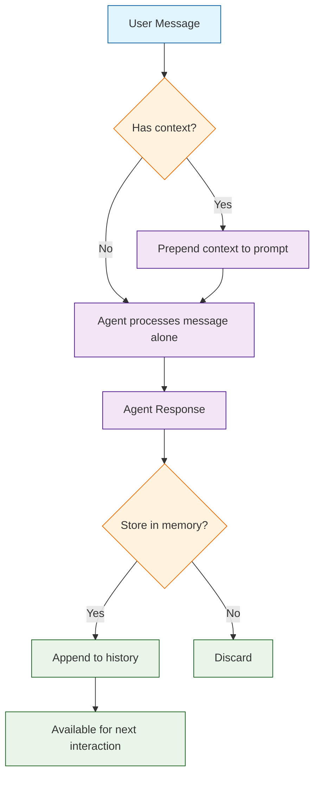
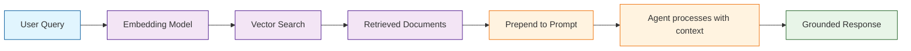
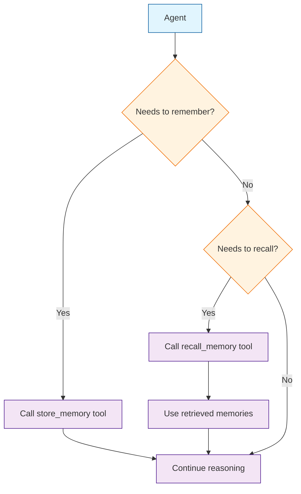
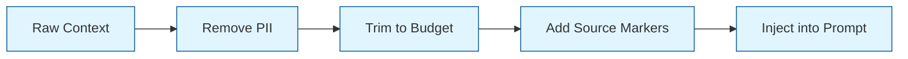

# Chapter 6: Memory & Context

Welcome to **Chapter 6: Memory & Context**. In this part of **Smolagents Tutorial: Hugging Face's Lightweight Agent Framework**, you will build an intuitive mental model first, then move into concrete implementation details and practical production tradeoffs.


> Manage conversation history, implement RAG-based knowledge retrieval, use tools as memory interfaces, and keep agent context clean and token-efficient.

## Memory in Smolagents

Smolagents takes a deliberately minimal approach to memory: it does not impose a built-in memory store. Each call to `agent.run()` is stateless by default -- the agent starts fresh with no recollection of previous interactions. This design gives you full control over what context the agent receives and how conversation history is managed.



## Building Conversation Memory

Since smolagents is stateless, you build conversation memory by maintaining a history list and injecting it into each prompt. This approach gives you complete control over what the agent "remembers."

### Basic Conversation History

```python
from smolagents import CodeAgent, HfApiModel

agent = CodeAgent(
    model=HfApiModel(),
    tools=[],
    max_steps=6,
    verbose=False,
)

# Conversation history store
history: list[dict] = []


def chat(message: str) -> str:
    """Send a message with conversation context."""
    # Add user message to history
    history.append({"role": "user", "content": message})

    # Build context from recent history
    context_lines = []
    for turn in history[-10:]:  # Keep last 10 turns
        role = turn["role"].capitalize()
        context_lines.append(f"{role}: {turn['content']}")
    context = "\n".join(context_lines)

    # Run agent with context
    prompt = (
        f"Conversation history:\n{context}\n\n"
        f"Respond to the latest user message. "
        f"Use the conversation history for context."
    )
    response = agent.run(prompt)
    response_str = str(response)

    # Add response to history
    history.append({"role": "assistant", "content": response_str})
    return response_str


# Multi-turn conversation
print(chat("My name is Riley, and I'm building an AI agent."))
print(chat("What's my name?"))  # Agent should recall "Riley"
print(chat("What am I building?"))  # Agent should recall "AI agent"
```

### Sliding Window Memory

For long conversations, use a sliding window to keep only the most recent turns, preventing token bloat:

```python
class SlidingWindowMemory:
    """Fixed-size sliding window conversation memory."""

    def __init__(self, max_turns: int = 10):
        self.max_turns = max_turns
        self.turns: list[dict] = []

    def add(self, role: str, content: str):
        self.turns.append({"role": role, "content": content})
        # Trim to window size
        if len(self.turns) > self.max_turns:
            self.turns = self.turns[-self.max_turns:]

    def get_context(self) -> str:
        lines = [f"{t['role'].capitalize()}: {t['content']}" for t in self.turns]
        return "\n".join(lines)

    def clear(self):
        self.turns = []

    @property
    def turn_count(self) -> int:
        return len(self.turns)
```

### Token-Aware Memory

For production systems, track token usage and trim context when it gets too large:

```python
class TokenAwareMemory:
    """Memory that respects a token budget."""

    def __init__(self, max_tokens: int = 2000):
        self.max_tokens = max_tokens
        self.turns: list[dict] = []

    @staticmethod
    def estimate_tokens(text: str) -> int:
        """Rough token estimate (4 chars per token)."""
        return len(text) // 4

    def add(self, role: str, content: str):
        self.turns.append({"role": role, "content": content})
        self._trim()

    def _trim(self):
        """Remove oldest turns until within token budget."""
        while self._total_tokens() > self.max_tokens and len(self.turns) > 1:
            self.turns.pop(0)

    def _total_tokens(self) -> int:
        return sum(self.estimate_tokens(t["content"]) for t in self.turns)

    def get_context(self) -> str:
        lines = [f"{t['role'].capitalize()}: {t['content']}" for t in self.turns]
        return "\n".join(lines)

    def stats(self) -> dict:
        return {
            "turns": len(self.turns),
            "estimated_tokens": self._total_tokens(),
            "budget": self.max_tokens,
            "utilization": round(self._total_tokens() / self.max_tokens, 2),
        }
```

### Memory Type Comparison

| Memory Type | Pros | Cons | Best For |
|:------------|:-----|:-----|:---------|
| **No memory** (default) | Simple, predictable | No continuity | One-shot tasks |
| **Full history** | Complete context | Token bloat, high cost | Short conversations |
| **Sliding window** | Bounded cost, simple | Forgets old context | Interactive chat |
| **Token-aware** | Respects budget | Complex implementation | Production systems |
| **Summary-based** | Compact long history | Lossy compression | Long-running sessions |
| **RAG-augmented** | Relevant retrieval | Infrastructure needed | Knowledge-heavy tasks |

## Summary-Based Memory

For long conversations, compress older turns into a summary while keeping recent turns intact:

```python
from smolagents import CodeAgent, HfApiModel


class SummaryMemory:
    """Memory that summarizes old turns to save tokens."""

    def __init__(self, agent, recent_turns: int = 6):
        self.agent = agent
        self.recent_turns = recent_turns
        self.summary: str = ""
        self.turns: list[dict] = []

    def add(self, role: str, content: str):
        self.turns.append({"role": role, "content": content})
        if len(self.turns) > self.recent_turns * 2:
            self._compress()

    def _compress(self):
        """Summarize older turns and keep only recent ones."""
        old_turns = self.turns[:-self.recent_turns]
        old_context = "\n".join(
            f"{t['role'].capitalize()}: {t['content']}" for t in old_turns
        )

        # Use the agent to summarize
        new_summary = self.agent.run(
            f"Summarize this conversation concisely, preserving key facts "
            f"and decisions:\n\n{self.summary}\n{old_context}"
        )
        self.summary = str(new_summary)
        self.turns = self.turns[-self.recent_turns:]

    def get_context(self) -> str:
        parts = []
        if self.summary:
            parts.append(f"Previous conversation summary:\n{self.summary}")
        recent = "\n".join(
            f"{t['role'].capitalize()}: {t['content']}" for t in self.turns
        )
        if recent:
            parts.append(f"Recent conversation:\n{recent}")
        return "\n\n".join(parts)


# Usage
agent = CodeAgent(model=HfApiModel(), tools=[], max_steps=4)
memory = SummaryMemory(agent, recent_turns=4)

memory.add("user", "My name is Riley.")
memory.add("assistant", "Hello Riley!")
memory.add("user", "I'm working on a chatbot project.")
memory.add("assistant", "That sounds interesting!")
# ... after many more turns, old ones get summarized
```

## Integrating External Knowledge (RAG)

Retrieval-Augmented Generation (RAG) connects your agent to external knowledge bases. Instead of relying only on the LLM's training data, the agent can retrieve relevant documents and use them as context.



### RAG with Manual Context Injection

The simplest RAG approach: retrieve context and prepend it to the agent's prompt.

```python
from smolagents import CodeAgent, HfApiModel


def retrieve_chunks(query: str, top_k: int = 3) -> list[str]:
    """Mock retrieval function -- replace with your vector store.

    In production, this would:
    1. Embed the query using an embedding model
    2. Search a vector database (Chroma, Qdrant, Pinecone, etc.)
    3. Return the top-k most relevant document chunks
    """
    # Mock knowledge base
    knowledge_base = [
        "Smolagents is a lightweight agent framework by Hugging Face. "
        "It supports CodeAgent and ToolCallingAgent.",
        "CodeAgent writes Python code to solve tasks. "
        "It executes code in a sandboxed environment.",
        "Tools are created with the @tool decorator. "
        "Each tool needs type hints and a clear docstring.",
        "The max_steps parameter controls how many reasoning "
        "iterations the agent can perform.",
        "Smolagents supports multiple LLM backends: "
        "HfApiModel, OpenAIServerModel, AnthropicModel, LiteLLMModel.",
    ]
    # Simple keyword matching (use vector similarity in production)
    scored = []
    for chunk in knowledge_base:
        score = sum(1 for word in query.lower().split() if word in chunk.lower())
        scored.append((score, chunk))
    scored.sort(reverse=True)
    return [chunk for _, chunk in scored[:top_k]]


def answer_with_context(question: str) -> str:
    """Answer a question using RAG-style context injection."""
    agent = CodeAgent(model=HfApiModel(), tools=[], max_steps=4)

    # Retrieve relevant context
    chunks = retrieve_chunks(question)
    context = "\n\n".join(f"[Document {i+1}]: {c}" for i, c in enumerate(chunks))

    # Build grounded prompt
    prompt = (
        f"Use ONLY the following context to answer the question. "
        f"If the context doesn't contain the answer, say so.\n\n"
        f"Context:\n{context}\n\n"
        f"Question: {question}\n"
        f"Answer:"
    )
    return str(agent.run(prompt))


# Usage
answer = answer_with_context("What agent types does smolagents support?")
print(answer)
```

### RAG Architecture Components

| Component | Purpose | Example Technologies |
|:----------|:--------|:--------------------|
| **Embedding model** | Convert text to vectors | sentence-transformers, OpenAI embeddings |
| **Vector store** | Store and search embeddings | Chroma, Qdrant, Pinecone, Weaviate |
| **Chunking** | Split documents into searchable pieces | Fixed-size, sentence-based, semantic |
| **Retrieval** | Find relevant chunks for a query | Cosine similarity, MMR |
| **Reranking** | Improve retrieval quality | Cross-encoders, Cohere rerank |

### Production RAG Pattern

```python
from smolagents import CodeAgent, HfApiModel, tool


# Expose retrieval as a tool so the agent decides when to search
@tool
def search_knowledge_base(query: str) -> str:
    """Search the internal knowledge base for information relevant to the query.

    Args:
        query: The search query describing what information you need.

    Returns:
        The most relevant document excerpts as a formatted string.
    """
    chunks = retrieve_chunks(query, top_k=3)
    if not chunks:
        return "No relevant documents found."
    return "\n\n".join(f"- {chunk}" for chunk in chunks)


# Agent can decide when to search vs. when to use its own knowledge
agent = CodeAgent(
    tools=[search_knowledge_base],
    model=HfApiModel(),
    max_steps=8,
    verbose=True,
)

result = agent.run(
    "What is the difference between CodeAgent and ToolCallingAgent in smolagents?"
)
print(result)
```

## Tool-Based Memory

Instead of injecting context via prompts, you can expose memory as tools that the agent can call when it needs to store or retrieve information.



### Memory Store Tool

```python
from smolagents import CodeAgent, HfApiModel, tool
from typing import List

# In-memory store (use a database in production)
memory_store: dict[str, str] = {}


@tool
def store_memory(key: str, value: str) -> str:
    """Store a piece of information in memory for later retrieval.

    Args:
        key: A descriptive key for the memory (e.g., 'user_name', 'project_goal').
        value: The information to store.

    Returns:
        Confirmation that the memory was stored.
    """
    memory_store[key] = value
    return f"Stored: '{key}' = '{value}'"


@tool
def recall_memory(key: str) -> str:
    """Retrieve a previously stored piece of information.

    Args:
        key: The key to look up in memory.

    Returns:
        The stored value, or a message if the key is not found.
    """
    if key in memory_store:
        return f"{key}: {memory_store[key]}"
    return f"No memory found for key '{key}'. Available keys: {list(memory_store.keys())}"


@tool
def list_memories() -> str:
    """List all stored memory keys and their values.

    Returns:
        A formatted list of all stored memories.
    """
    if not memory_store:
        return "No memories stored yet."
    lines = [f"- {k}: {v}" for k, v in memory_store.items()]
    return "\n".join(lines)


agent = CodeAgent(
    tools=[store_memory, recall_memory, list_memories],
    model=HfApiModel(),
    max_steps=6,
)

# The agent can store and retrieve information across tasks
agent.run("Remember that my name is Riley and I'm building a chatbot.")
agent.run("What's my name and what am I working on?")
```

## Context Hygiene

Managing context effectively is crucial for agent performance, cost, and safety.

### Principles of Context Hygiene



| Principle | Description | Implementation |
|:----------|:------------|:---------------|
| **Token budgeting** | Keep context within model limits | Sliding window, summarization |
| **Relevance filtering** | Only include relevant context | RAG retrieval, keyword filtering |
| **PII removal** | Strip sensitive data before passing to LLM | Regex patterns, NER-based redaction |
| **Source markers** | Label where context came from | `[Doc 1]:`, `[Memory]:`, `[User]:` |
| **Freshness** | Prioritize recent context over old | Timestamp-based ordering |
| **Deduplication** | Avoid repeating the same context | Hash-based deduplication |

### PII Redaction Before Context Injection

```python
import re


def redact_pii(text: str) -> str:
    """Remove common PII patterns from text before passing to agent."""
    # Email addresses
    text = re.sub(r'[\w.+-]+@[\w-]+\.[\w.-]+', '[EMAIL_REDACTED]', text)
    # Phone numbers (US format)
    text = re.sub(r'\b\d{3}[-.]?\d{3}[-.]?\d{4}\b', '[PHONE_REDACTED]', text)
    # SSN-like patterns
    text = re.sub(r'\b\d{3}-\d{2}-\d{4}\b', '[SSN_REDACTED]', text)
    # Credit card-like patterns
    text = re.sub(r'\b\d{4}[\s-]?\d{4}[\s-]?\d{4}[\s-]?\d{4}\b', '[CC_REDACTED]', text)
    return text


# Usage: always redact before building context
raw_context = "Contact john@example.com or call 555-123-4567 for details."
safe_context = redact_pii(raw_context)
# safe_context = "Contact [EMAIL_REDACTED] or call [PHONE_REDACTED] for details."
```

### Context Budget Calculator

```python
def build_context_within_budget(
    system_prompt: str,
    conversation_history: list[dict],
    retrieved_docs: list[str],
    max_context_tokens: int = 3000,
) -> str:
    """Build a context string that fits within the token budget.

    Args:
        system_prompt: The base system prompt.
        conversation_history: List of conversation turns.
        retrieved_docs: RAG-retrieved document chunks.
        max_context_tokens: Maximum tokens for context.

    Returns:
        A context string within budget.
    """
    def estimate_tokens(text):
        return len(text) // 4

    parts = []
    remaining = max_context_tokens - estimate_tokens(system_prompt)

    # Priority 1: Recent conversation (most important)
    for turn in reversed(conversation_history):
        turn_text = f"{turn['role'].capitalize()}: {turn['content']}"
        tokens = estimate_tokens(turn_text)
        if tokens <= remaining:
            parts.insert(0, turn_text)
            remaining -= tokens
        else:
            break

    # Priority 2: Retrieved documents (if budget allows)
    doc_section = []
    for i, doc in enumerate(retrieved_docs):
        doc_text = f"[Document {i+1}]: {doc}"
        tokens = estimate_tokens(doc_text)
        if tokens <= remaining:
            doc_section.append(doc_text)
            remaining -= tokens
        else:
            break

    context = ""
    if doc_section:
        context += "Relevant documents:\n" + "\n".join(doc_section) + "\n\n"
    if parts:
        context += "Conversation:\n" + "\n".join(parts)

    return context
```

## Complete Example: Conversational Agent with RAG

```python
from smolagents import CodeAgent, HfApiModel, tool


# --- Knowledge Base (mock) ---
documents = {
    "pricing": "Our Pro plan costs $29/month. Enterprise is $99/month. Free tier available.",
    "features": "Features include: agent builder, tool marketplace, custom models, API access.",
    "support": "Support hours: Mon-Fri 9am-5pm EST. Email: support@example.com",
    "refunds": "Refunds available within 30 days of purchase. Contact billing@example.com",
}


@tool
def search_docs(query: str) -> str:
    """Search company documentation for relevant information.

    Args:
        query: What you want to find in the documentation.

    Returns:
        Relevant documentation excerpts.
    """
    results = []
    for topic, content in documents.items():
        if any(word in content.lower() for word in query.lower().split()):
            results.append(f"[{topic}]: {content}")
    return "\n".join(results) if results else "No relevant documentation found."


# --- Conversation Agent ---
agent = CodeAgent(
    tools=[search_docs],
    model=HfApiModel(),
    max_steps=6,
    verbose=True,
)

memory = SlidingWindowMemory(max_turns=8)


def customer_chat(message: str) -> str:
    """Handle a customer support conversation."""
    memory.add("user", message)
    context = memory.get_context()

    prompt = (
        f"You are a helpful customer support agent.\n\n"
        f"Conversation so far:\n{context}\n\n"
        f"Use the search_docs tool to find relevant information when needed.\n"
        f"Respond helpfully to the customer's latest message."
    )

    response = str(agent.run(prompt))
    memory.add("assistant", response)
    return response


# Simulated conversation
print(customer_chat("Hi, what plans do you offer?"))
print(customer_chat("What features are included in the Pro plan?"))
print(customer_chat("Can I get a refund if I'm not satisfied?"))
```

---

## Summary

Memory in smolagents is intentionally minimal -- the framework provides stateless agent calls, and you build the memory layer that suits your needs. From simple sliding-window history to token-aware memory management and RAG-based knowledge retrieval, the patterns in this chapter give you full control over what context your agent receives. Tool-based memory lets the agent decide when to store and recall information, while context hygiene practices ensure you stay within token budgets and protect sensitive data.

## Key Takeaways

- **Smolagents is stateless by default** -- each `agent.run()` call starts fresh unless you inject context.
- **Conversation memory** is built by maintaining a history list and prepending it to each prompt.
- **Sliding window** memory bounds token usage by keeping only the N most recent turns.
- **Token-aware memory** tracks estimated token counts and trims when exceeding budget.
- **Summary-based memory** compresses old conversation turns into concise summaries.
- **RAG integration** retrieves relevant documents and injects them as context, grounding responses in external knowledge.
- **Tool-based memory** exposes `store_memory` and `recall_memory` as tools the agent can call autonomously.
- **Context hygiene** includes PII redaction, source markers, deduplication, and token budgeting.
- Always prioritize recent conversation over older context when budget is limited.

## Next Steps

In **[Chapter 7: Advanced Patterns](07-advanced.md)**, you will explore multi-agent systems, router patterns, managed agents, safety layers, and evaluation frameworks for building sophisticated agent architectures.

---

*Built with insights from the [Smolagents](https://github.com/huggingface/smolagents) project.*

## What Problem Does This Solve?

Most teams struggle here because the hard part is not writing more code, but deciding clear boundaries for `self`, `agent`, `turns` so behavior stays predictable as complexity grows.

In practical terms, this chapter helps you avoid three common failures:

- coupling core logic too tightly to one implementation path
- missing the handoff boundaries between setup, execution, and validation
- shipping changes without clear rollback or observability strategy

After working through this chapter, you should be able to reason about `Chapter 6: Memory & Context` as an operating subsystem inside **Smolagents Tutorial: Hugging Face's Lightweight Agent Framework**, with explicit contracts for inputs, state transitions, and outputs.

Use the implementation notes around `context`, `content`, `role` as your checklist when adapting these patterns to your own repository.

## How it Works Under the Hood

Under the hood, `Chapter 6: Memory & Context` usually follows a repeatable control path:

1. **Context bootstrap**: initialize runtime config and prerequisites for `self`.
2. **Input normalization**: shape incoming data so `agent` receives stable contracts.
3. **Core execution**: run the main logic branch and propagate intermediate state through `turns`.
4. **Policy and safety checks**: enforce limits, auth scopes, and failure boundaries.
5. **Output composition**: return canonical result payloads for downstream consumers.
6. **Operational telemetry**: emit logs/metrics needed for debugging and performance tuning.

When debugging, walk this sequence in order and confirm each stage has explicit success/failure conditions.

## Source Walkthrough

Use the following upstream sources to verify implementation details while reading this chapter:

- [View Repo](https://github.com/huggingface/smolagents)
  Why it matters: authoritative reference on `View Repo` (github.com).
- [Awesome Code Docs](https://github.com/johnxie/awesome-code-docs)
  Why it matters: authoritative reference on `Awesome Code Docs` (github.com).

Suggested trace strategy:
- search upstream code for `self` and `agent` to map concrete implementation paths
- compare docs claims against actual runtime/config code before reusing patterns in production

## Chapter Connections

- [Tutorial Index](index.md)
- [Previous Chapter: Chapter 5: Multi-Step Reasoning](05-multi-step.md)
- [Next Chapter: Chapter 7: Advanced Patterns](07-advanced.md)
- [Main Catalog](../../README.md#-tutorial-catalog)
- [A-Z Tutorial Directory](../../discoverability/tutorial-directory.md)
