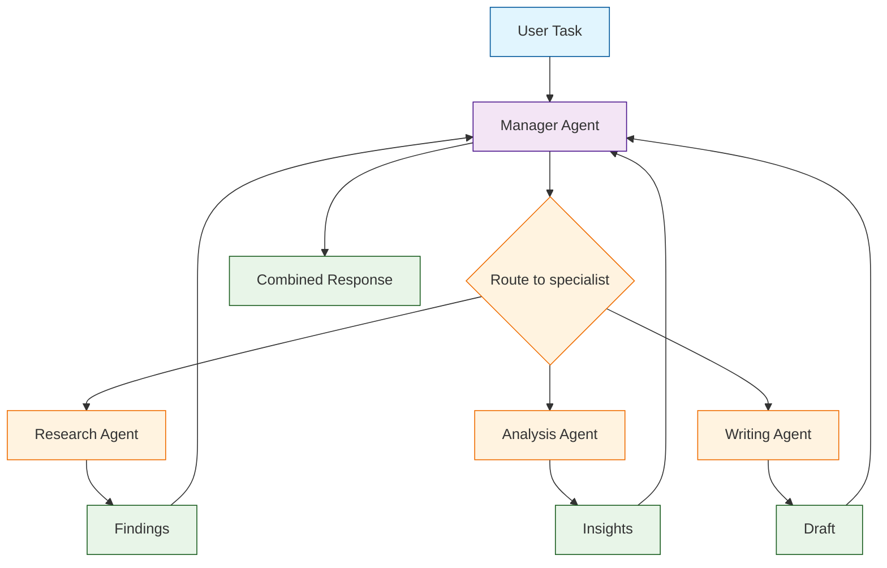
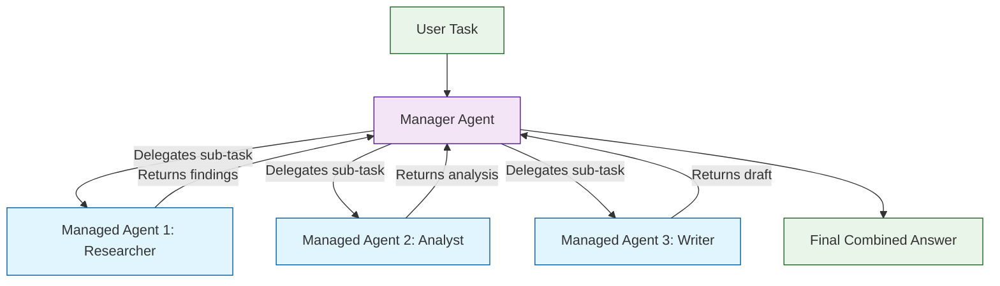
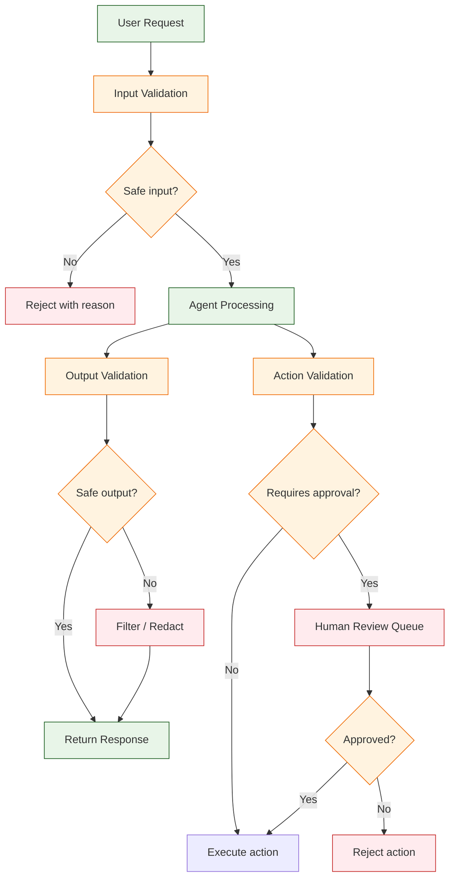

# Chapter 7: Advanced Patterns

> Build multi-agent systems, implement router and managed agent patterns, add safety layers, create evaluation frameworks, and orchestrate complex agent workflows.

## Multi-Agent Architecture Overview

Single agents are powerful, but complex workflows often benefit from specialized agents working together. Smolagents supports multi-agent patterns through its managed agent system, where a manager agent can delegate tasks to specialist agents.



## Router Pattern

The router pattern directs tasks to different agents based on the task's characteristics. This is useful when different tasks require different capabilities, tools, or safety levels.

### Simple Keyword Router

```python
from smolagents import CodeAgent, ToolCallingAgent, HfApiModel, OpenAIServerModel, tool


# --- Specialist agents ---

# Research agent: flexible, can write code and use search
@tool
def web_search(query: str) -> str:
    """Search the web for information.

    Args:
        query: The search query.

    Returns:
        Search results as text.
    """
    return f"Search results for: {query} [mock results]"


research_agent = CodeAgent(
    model=HfApiModel(model_id="meta-llama/Llama-3.1-70B-Instruct"),
    tools=[web_search],
    max_steps=10,
    verbose=True,
)

# Database agent: strict, only uses pre-approved tools
@tool
def query_database(sql: str) -> str:
    """Execute a read-only SQL query against the database.

    Args:
        sql: A SELECT statement to execute (no writes allowed).

    Returns:
        Query results as a formatted string.
    """
    if not sql.strip().upper().startswith("SELECT"):
        return "Error: Only SELECT queries are allowed."
    return f"Results for: {sql} [mock data]"


db_agent = ToolCallingAgent(
    model=OpenAIServerModel(model_id="gpt-4o-mini"),
    tools=[query_database],
    max_steps=4,
)

# Computation agent: pure code, no external tools
compute_agent = CodeAgent(
    model=HfApiModel(),
    tools=[],
    max_steps=6,
    additional_authorized_imports=["numpy", "statistics", "math"],
)


# --- Router ---
def route_task(task: str):
    """Route a task to the appropriate specialist agent."""
    task_lower = task.lower()

    if any(w in task_lower for w in ["database", "sql", "query", "table"]):
        print("[Router] -> Database Agent (strict mode)")
        return db_agent.run(task)
    elif any(w in task_lower for w in ["search", "find", "research", "latest"]):
        print("[Router] -> Research Agent")
        return research_agent.run(task)
    elif any(w in task_lower for w in ["calculate", "compute", "analyze", "math"]):
        print("[Router] -> Computation Agent")
        return compute_agent.run(task)
    else:
        print("[Router] -> Research Agent (default)")
        return research_agent.run(task)


# Usage
print(route_task("Search for the latest smolagents release notes."))
print(route_task("Calculate the standard deviation of [10, 20, 30, 40, 50]."))
print(route_task("Query the database for all users who signed up this month."))
```

### LLM-Based Router

For more nuanced routing, use an LLM to classify the task:

```python
from smolagents import CodeAgent, HfApiModel


def llm_router(task: str, agents: dict) -> str:
    """Use an LLM to route tasks to the right specialist."""
    classifier = CodeAgent(
        model=HfApiModel(),
        tools=[],
        max_steps=2,
    )

    categories = ", ".join(agents.keys())
    classification = classifier.run(
        f"Classify this task into one of these categories: {categories}.\n"
        f"Task: {task}\n"
        f"Respond with ONLY the category name, nothing else."
    )

    category = str(classification).strip().lower()
    if category in agents:
        return agents[category].run(task)
    else:
        # Fallback to first agent
        first_agent = list(agents.values())[0]
        return first_agent.run(task)


# Usage
agents = {
    "research": research_agent,
    "database": db_agent,
    "computation": compute_agent,
}

result = llm_router("What is the compound annual growth rate for our revenue?", agents)
print(result)
```

### Router Pattern Comparison

| Router Type | Pros | Cons | Best For |
|:------------|:-----|:-----|:---------|
| **Keyword** | Fast, deterministic, no LLM cost | Brittle, misses nuance | Known task categories |
| **LLM-based** | Handles ambiguity, flexible | Extra LLM call, latency | Complex routing |
| **Rule engine** | Configurable, auditable | Maintenance overhead | Enterprise workflows |
| **Classifier model** | Trained on your data, fast | Requires training data | High-volume routing |

## Managed Agents

Smolagents provides a built-in managed agent system where a manager agent can delegate sub-tasks to specialist agents. The manager treats each sub-agent as a tool it can call.



### Creating Managed Agents

```python
from smolagents import CodeAgent, HfApiModel, ManagedAgent
from smolagents.tools import DuckDuckGoSearchTool

model = HfApiModel(model_id="meta-llama/Llama-3.1-70B-Instruct")

# Create specialist agents
research_agent = CodeAgent(
    model=model,
    tools=[DuckDuckGoSearchTool()],
    max_steps=8,
)

analysis_agent = CodeAgent(
    model=model,
    tools=[],
    max_steps=6,
    additional_authorized_imports=["statistics", "math"],
)

# Wrap them as managed agents
managed_researcher = ManagedAgent(
    agent=research_agent,
    name="researcher",
    description=(
        "A research agent that can search the web. "
        "Give it a research question and it will find relevant information."
    ),
)

managed_analyst = ManagedAgent(
    agent=analysis_agent,
    name="analyst",
    description=(
        "A data analysis agent that can perform calculations and statistical analysis. "
        "Give it data and an analysis task."
    ),
)

# Create manager agent that orchestrates the specialists
manager = CodeAgent(
    model=model,
    tools=[],
    managed_agents=[managed_researcher, managed_analyst],
    max_steps=10,
    verbose=True,
)

# The manager delegates sub-tasks to specialists
result = manager.run("""
Research the top 3 Python web frameworks by GitHub stars.
Then analyze the star counts to determine:
1. Which framework has the most stars
2. The average star count
3. The ratio of the top framework to the average
""")
print(result)
```

### Managed Agent Design Principles

| Principle | Description |
|:----------|:------------|
| **Clear descriptions** | The manager uses the description to decide which agent to call |
| **Focused specialists** | Each agent should excel at one type of task |
| **Appropriate tools** | Give each agent only the tools it needs |
| **Step budgets** | Set reasonable `max_steps` per specialist |
| **Error isolation** | A specialist failure should not crash the manager |

## Multi-Agent Hand-off Pattern

For sequential workflows where one agent's output feeds another's input:

```python
from smolagents import CodeAgent, HfApiModel
from smolagents.tools import DuckDuckGoSearchTool

model = HfApiModel(model_id="meta-llama/Llama-3.1-70B-Instruct")

# Agent 1: Researcher -- gathers raw information
researcher = CodeAgent(
    model=model,
    tools=[DuckDuckGoSearchTool()],
    max_steps=8,
    verbose=True,
)

# Agent 2: Analyst -- processes and structures data
analyst = CodeAgent(
    model=model,
    tools=[],
    max_steps=6,
    additional_authorized_imports=["json", "collections"],
)

# Agent 3: Writer -- produces the final output
writer = CodeAgent(
    model=model,
    tools=[],
    max_steps=5,
)


def research_pipeline(topic: str) -> str:
    """Three-agent pipeline: research -> analyze -> write."""
    # Phase 1: Research
    print("=== Phase 1: Research ===")
    raw_findings = researcher.run(
        f"Research '{topic}'. Find 5 key facts with sources. "
        f"Return as a numbered list."
    )

    # Phase 2: Analysis
    print("\n=== Phase 2: Analysis ===")
    analysis = analyst.run(
        f"Analyze these research findings and identify patterns, "
        f"contradictions, and key themes:\n\n{raw_findings}"
    )

    # Phase 3: Writing
    print("\n=== Phase 3: Writing ===")
    article = writer.run(
        f"Write a concise blog post (300-400 words) about '{topic}' "
        f"using these findings and analysis:\n\n"
        f"Findings:\n{raw_findings}\n\n"
        f"Analysis:\n{analysis}"
    )

    return str(article)


result = research_pipeline("The rise of lightweight AI agent frameworks")
print(result)
```

## Safety and Governance Layers

Production agent systems need safety controls to prevent harmful outputs, unauthorized actions, and policy violations.

### Safety Architecture



### Input Validation

```python
import re


def validate_input(prompt: str) -> tuple[bool, str]:
    """Validate user input before passing to the agent."""
    # Check for prompt injection attempts
    injection_patterns = [
        r"ignore previous instructions",
        r"forget your rules",
        r"you are now",
        r"system prompt:",
        r"override",
    ]
    for pattern in injection_patterns:
        if re.search(pattern, prompt, re.IGNORECASE):
            return False, f"Input rejected: potential prompt injection detected."

    # Check for dangerous requests
    dangerous_patterns = [
        r"delete.*database",
        r"drop.*table",
        r"rm\s+-rf",
        r"format.*disk",
    ]
    for pattern in dangerous_patterns:
        if re.search(pattern, prompt, re.IGNORECASE):
            return False, f"Input rejected: potentially dangerous request detected."

    # Length check
    if len(prompt) > 10000:
        return False, "Input rejected: prompt too long (max 10,000 characters)."

    return True, "Input accepted."
```

### Output Filtering

```python
def filter_output(response: str) -> str:
    """Filter agent output for safety and compliance."""
    # Redact any PII that leaked through
    response = re.sub(r'[\w.+-]+@[\w-]+\.[\w.-]+', '[EMAIL_REDACTED]', response)
    response = re.sub(r'\b\d{3}[-.]?\d{3}[-.]?\d{4}\b', '[PHONE_REDACTED]', response)

    # Check for harmful content patterns
    harmful_patterns = [
        r"sudo\s+",
        r"password\s*[:=]",
        r"api[_-]?key\s*[:=]",
        r"secret\s*[:=]",
    ]
    for pattern in harmful_patterns:
        response = re.sub(pattern, "[REDACTED]", response, flags=re.IGNORECASE)

    return response
```

### Human-in-the-Loop Approval

```python
from smolagents import CodeAgent, HfApiModel, tool


# Track actions that need approval
approval_queue: list[dict] = []


@tool
def update_database(table: str, changes: str) -> str:
    """Queue a database update for human approval.

    Args:
        table: The database table to update.
        changes: Description of the changes to make.

    Returns:
        Confirmation that the change has been queued for approval.
    """
    change_request = {
        "table": table,
        "changes": changes,
        "status": "pending_approval",
    }
    approval_queue.append(change_request)
    return (
        f"Database change queued for human approval: "
        f"Table '{table}', Changes: '{changes}'. "
        f"A human reviewer will approve or reject this change."
    )


def review_pending_changes():
    """Human reviews pending changes (in production, this would be a UI)."""
    for i, change in enumerate(approval_queue):
        if change["status"] == "pending_approval":
            print(f"\nPending change #{i}:")
            print(f"  Table: {change['table']}")
            print(f"  Changes: {change['changes']}")
            # In production: present to human reviewer via UI
            change["status"] = "approved"  # or "rejected"


agent = CodeAgent(
    tools=[update_database],
    model=HfApiModel(),
    max_steps=6,
)

# Agent proposes changes, but they go through approval
result = agent.run("Update the users table to add an 'is_verified' column.")
print(result)

# Human reviews
review_pending_changes()
```

### Safety Controls Summary

| Control | Purpose | Implementation |
|:--------|:--------|:---------------|
| **Input validation** | Block prompt injection, dangerous requests | Regex patterns, length limits |
| **Tool allowlist** | Restrict available actions | Only register safe tools |
| **Import restrictions** | Prevent code from accessing system | `additional_authorized_imports` |
| **Output filtering** | Remove PII, secrets, harmful content | Regex-based redaction |
| **Rate limiting** | Prevent abuse and cost overruns | Per-user/session limits |
| **Human approval** | Gate destructive actions | Approval queue for mutations |
| **Audit logging** | Full traceability | Log all prompts, actions, outputs |

## Evaluation Framework

Testing agent behavior systematically ensures quality and catches regressions.

### Regression Test Suite

```python
from smolagents import CodeAgent, HfApiModel


def evaluate_agent(agent, test_cases: list[dict]) -> dict:
    """Run a suite of test cases against an agent.

    Args:
        agent: The agent to evaluate.
        test_cases: List of dicts with 'prompt', 'expected_contains', and 'description'.

    Returns:
        Evaluation results with pass/fail for each test case.
    """
    results = {"passed": 0, "failed": 0, "errors": 0, "details": []}

    for i, test in enumerate(test_cases):
        try:
            response = str(agent.run(test["prompt"]))
            passed = all(
                keyword.lower() in response.lower()
                for keyword in test.get("expected_contains", [])
            )
            results["details"].append({
                "test": test["description"],
                "passed": passed,
                "response_preview": response[:200],
            })
            if passed:
                results["passed"] += 1
            else:
                results["failed"] += 1
        except Exception as e:
            results["errors"] += 1
            results["details"].append({
                "test": test["description"],
                "passed": False,
                "error": str(e),
            })

    results["total"] = len(test_cases)
    results["pass_rate"] = (
        round(results["passed"] / results["total"], 2) if results["total"] else 0
    )
    return results


# Define test cases
test_cases = [
    {
        "description": "Simple math",
        "prompt": "What is 15 * 23?",
        "expected_contains": ["345"],
    },
    {
        "description": "List generation",
        "prompt": "List the first 5 prime numbers.",
        "expected_contains": ["2", "3", "5", "7", "11"],
    },
    {
        "description": "String processing",
        "prompt": "Reverse the string 'hello world'.",
        "expected_contains": ["dlrow olleh"],
    },
]

agent = CodeAgent(
    model=HfApiModel(),
    tools=[],
    max_steps=4,
)

results = evaluate_agent(agent, test_cases)
print(f"Pass rate: {results['pass_rate']}")
for detail in results["details"]:
    status = "PASS" if detail["passed"] else "FAIL"
    print(f"  [{status}] {detail['test']}")
```

### Quality Scoring

```python
def score_response(response: str, criteria: dict) -> dict:
    """Score a response against quality criteria.

    Args:
        response: The agent's response text.
        criteria: Dict with scoring criteria.

    Returns:
        Scores for each criterion and an overall score.
    """
    scores = {}

    # Length check
    if "min_length" in criteria:
        scores["length"] = 1.0 if len(response) >= criteria["min_length"] else 0.5
    if "max_length" in criteria:
        if len(response) <= criteria["max_length"]:
            scores["length"] = scores.get("length", 1.0)
        else:
            scores["length"] = 0.5

    # Required keywords
    if "required_keywords" in criteria:
        found = sum(
            1 for kw in criteria["required_keywords"]
            if kw.lower() in response.lower()
        )
        scores["completeness"] = round(found / len(criteria["required_keywords"]), 2)

    # Banned content
    if "banned_patterns" in criteria:
        has_banned = any(
            pattern.lower() in response.lower()
            for pattern in criteria["banned_patterns"]
        )
        scores["safety"] = 0.0 if has_banned else 1.0

    # Overall score
    if scores:
        scores["overall"] = round(sum(scores.values()) / len(scores), 2)

    return scores
```

## Advanced: Agent Composition Patterns

### Fan-Out / Fan-In

Run multiple agents in parallel and combine results:

```python
from concurrent.futures import ThreadPoolExecutor
from smolagents import CodeAgent, HfApiModel

model = HfApiModel()


def fan_out_fan_in(task: str, subtasks: list[str]) -> str:
    """Run subtasks in parallel, then combine results."""
    agents = [
        CodeAgent(model=model, tools=[], max_steps=5)
        for _ in subtasks
    ]

    # Fan out: run subtasks in parallel
    with ThreadPoolExecutor(max_workers=3) as executor:
        futures = [
            executor.submit(agent.run, subtask)
            for agent, subtask in zip(agents, subtasks)
        ]
        results = [str(f.result()) for f in futures]

    # Fan in: combine results
    combiner = CodeAgent(model=model, tools=[], max_steps=4)
    combined = combiner.run(
        f"Combine these results into a coherent summary:\n\n"
        + "\n\n".join(f"--- Result {i+1} ---\n{r}" for i, r in enumerate(results))
    )

    return str(combined)


result = fan_out_fan_in(
    "Compare Python web frameworks",
    [
        "List the top 3 features of Django.",
        "List the top 3 features of Flask.",
        "List the top 3 features of FastAPI.",
    ],
)
print(result)
```

### Chain of Responsibility

Each agent tries to handle the task; if it cannot, it passes to the next:

```python
from smolagents import CodeAgent, HfApiModel


def chain_of_responsibility(task: str, agents: list[dict]) -> str:
    """Try each agent in order until one succeeds."""
    for agent_config in agents:
        agent = agent_config["agent"]
        can_handle = agent_config.get("filter", lambda t: True)

        if can_handle(task):
            try:
                result = str(agent.run(task))
                if result and len(result) > 10:
                    return result
            except Exception:
                continue

    return "No agent could handle this task."


model = HfApiModel()
agents = [
    {
        "agent": CodeAgent(model=model, tools=[], max_steps=3),
        "filter": lambda t: "calculate" in t.lower() or "compute" in t.lower(),
    },
    {
        "agent": CodeAgent(model=model, tools=[], max_steps=6),
        "filter": lambda t: True,  # fallback: handles anything
    },
]

result = chain_of_responsibility("Calculate the area of a circle with radius 5.", agents)
print(result)
```

---

## Summary

Advanced smolagents patterns unlock sophisticated workflows for real-world applications. The router pattern directs tasks to specialized agents based on task characteristics. Managed agents let a manager delegate sub-tasks to specialists, creating hierarchical workflows. Multi-agent hand-offs create sequential pipelines where each agent focuses on one phase. Safety layers -- input validation, output filtering, human approval, and audit logging -- protect production systems. Evaluation frameworks with regression test suites and quality scoring ensure agent behavior remains reliable as you iterate.

## Key Takeaways

- **Router pattern** directs tasks to the right specialist -- use keyword matching for simplicity or LLM classification for nuance.
- **Managed agents** (`ManagedAgent`) let a manager agent orchestrate specialists, treating each sub-agent as a callable tool.
- **Multi-agent hand-off** creates sequential pipelines: research -> analyze -> write.
- **Safety layers** should include input validation, output filtering, tool allowlists, and human approval for destructive actions.
- **Evaluation frameworks** with regression test suites catch quality regressions before they reach users.
- **Fan-out/fan-in** runs subtasks in parallel for speed; chain of responsibility provides graceful fallbacks.
- Always give managed agents clear, descriptive names and descriptions -- the manager uses these to decide which agent to call.
- Keep specialist agents focused on one domain with appropriate tools and step budgets.

## Next Steps

In **[Chapter 8: Production Deployment](08-production.md)**, you will learn how to deploy smolagents behind an API, implement monitoring and observability, handle scaling, manage costs, and build production-ready agent services.

---

*Built with insights from the [Smolagents](https://github.com/huggingface/smolagents) project.*
