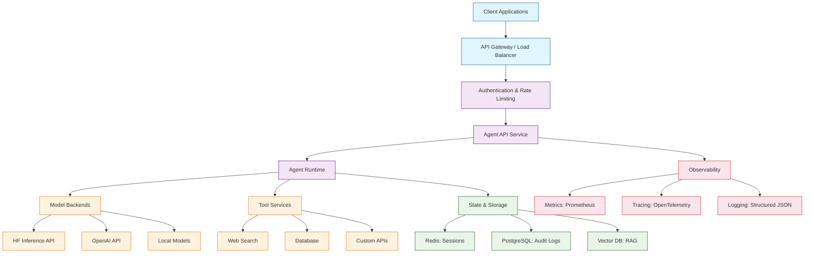
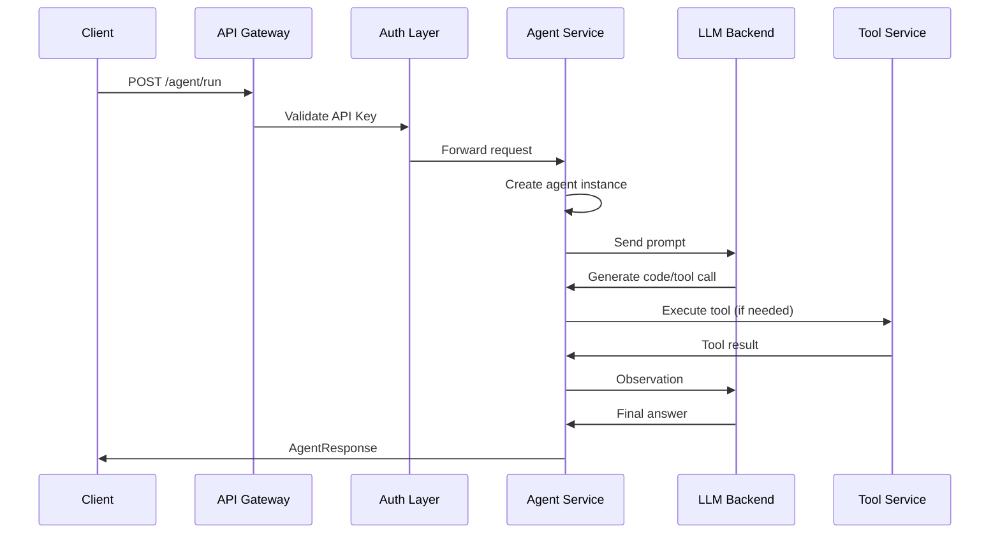
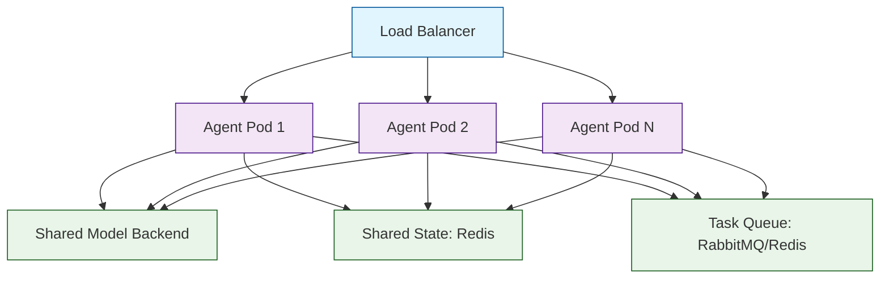

# Chapter 8: Production Deployment & Operations

> Deploy smolagents-powered services with robust APIs, monitoring, scaling strategies, cost management, and operational best practices.

## Production Architecture

A production smolagents deployment involves multiple layers: an API gateway, the agent runtime, model backends, tool services, and observability infrastructure. The architecture below shows how these components fit together.



## Building the API Layer

### FastAPI Agent Service

```python
import time
import uuid
import logging
from fastapi import FastAPI, HTTPException, Depends, Header
from pydantic import BaseModel
from smolagents import CodeAgent, HfApiModel, tool

# --- Configuration ---
logging.basicConfig(level=logging.INFO, format="%(asctime)s %(levelname)s %(message)s")
logger = logging.getLogger("smolagents-api")

# --- Models ---
class AgentRequest(BaseModel):
    prompt: str
    max_steps: int = 8
    session_id: str | None = None

class AgentResponse(BaseModel):
    request_id: str
    result: str
    steps_used: int
    duration_seconds: float
    session_id: str | None

# --- Tools ---
@tool
def search_docs(query: str) -> str:
    """Search internal documentation for relevant information.

    Args:
        query: The search query.

    Returns:
        Relevant documentation excerpts.
    """
    return f"Documentation results for: {query}"

# --- Agent Factory ---
def create_agent(max_steps: int = 8) -> CodeAgent:
    """Create a configured agent instance."""
    return CodeAgent(
        tools=[search_docs],
        model=HfApiModel(model_id="meta-llama/Llama-3.1-70B-Instruct"),
        max_steps=max_steps,
        verbose=False,
        additional_authorized_imports=["json", "math", "collections"],
    )

# --- Authentication ---
API_KEYS = {"sk-prod-key-1", "sk-prod-key-2"}

async def verify_api_key(authorization: str = Header(...)):
    """Validate the API key from the Authorization header."""
    if not authorization.startswith("Bearer "):
        raise HTTPException(status_code=401, detail="Invalid authorization format")
    token = authorization.replace("Bearer ", "")
    if token not in API_KEYS:
        raise HTTPException(status_code=403, detail="Invalid API key")
    return token

# --- Application ---
app = FastAPI(title="Smolagents API", version="1.0.0")


@app.post("/agent/run", response_model=AgentResponse)
async def run_agent(
    body: AgentRequest,
    api_key: str = Depends(verify_api_key),
):
    """Execute an agent task."""
    request_id = str(uuid.uuid4())
    start_time = time.time()

    logger.info(f"[{request_id}] Starting agent run: {body.prompt[:80]}...")

    try:
        agent = create_agent(max_steps=body.max_steps)
        result = agent.run(body.prompt)

        duration = round(time.time() - start_time, 2)
        logger.info(f"[{request_id}] Completed in {duration}s")

        return AgentResponse(
            request_id=request_id,
            result=str(result),
            steps_used=body.max_steps,  # agent tracks internally
            duration_seconds=duration,
            session_id=body.session_id,
        )
    except Exception as e:
        logger.error(f"[{request_id}] Error: {e}")
        raise HTTPException(status_code=500, detail=f"Agent error: {str(e)}")


@app.get("/health")
async def health_check():
    """Health check endpoint."""
    return {"status": "healthy", "service": "smolagents-api"}
```

### Request Flow



## Monitoring and Observability

### Metrics to Track

| Metric | Type | Description | Alert Threshold |
|:-------|:-----|:------------|:----------------|
| `agent_requests_total` | Counter | Total requests | -- |
| `agent_request_duration_seconds` | Histogram | End-to-end latency | p99 > 30s |
| `agent_steps_used` | Histogram | Steps per request | avg > 80% of max |
| `agent_errors_total` | Counter | Failed requests | > 5% error rate |
| `agent_tokens_total` | Counter | Total tokens consumed | Budget threshold |
| `agent_tool_calls_total` | Counter | Tool invocations by name | Anomaly detection |
| `agent_active_requests` | Gauge | Currently running agents | > capacity * 0.8 |

### Prometheus Metrics Integration

```python
import time
from prometheus_client import Counter, Histogram, Gauge, generate_latest
from fastapi import FastAPI, Response

# Define metrics
REQUEST_COUNT = Counter(
    "agent_requests_total",
    "Total agent requests",
    ["method", "status"],
)
REQUEST_DURATION = Histogram(
    "agent_request_duration_seconds",
    "Agent request duration in seconds",
    buckets=[0.5, 1, 2, 5, 10, 20, 30, 60],
)
STEPS_USED = Histogram(
    "agent_steps_used",
    "Number of steps used per request",
    buckets=[1, 2, 3, 5, 8, 10, 15],
)
ACTIVE_REQUESTS = Gauge(
    "agent_active_requests",
    "Currently active agent requests",
)
ERROR_COUNT = Counter(
    "agent_errors_total",
    "Total agent errors",
    ["error_type"],
)

app = FastAPI()


@app.post("/agent/run")
async def run_agent_with_metrics(body: dict):
    """Agent endpoint with Prometheus metrics."""
    ACTIVE_REQUESTS.inc()
    start_time = time.time()

    try:
        agent = create_agent(max_steps=body.get("max_steps", 8))
        result = agent.run(body["prompt"])

        duration = time.time() - start_time
        REQUEST_DURATION.observe(duration)
        REQUEST_COUNT.labels(method="POST", status="success").inc()

        return {"result": str(result), "duration": round(duration, 2)}
    except Exception as e:
        REQUEST_COUNT.labels(method="POST", status="error").inc()
        ERROR_COUNT.labels(error_type=type(e).__name__).inc()
        raise
    finally:
        ACTIVE_REQUESTS.dec()


@app.get("/metrics")
async def metrics():
    """Expose Prometheus metrics."""
    return Response(content=generate_latest(), media_type="text/plain")
```

### Structured Logging

```python
import json
import time
import logging


class StructuredFormatter(logging.Formatter):
    """JSON-formatted log output for production."""

    def format(self, record):
        log_data = {
            "timestamp": self.formatTime(record),
            "level": record.levelname,
            "message": record.getMessage(),
            "logger": record.name,
        }
        if hasattr(record, "request_id"):
            log_data["request_id"] = record.request_id
        if hasattr(record, "agent_step"):
            log_data["agent_step"] = record.agent_step
        if record.exc_info:
            log_data["exception"] = self.formatException(record.exc_info)
        return json.dumps(log_data)


def setup_production_logging():
    """Configure structured JSON logging."""
    handler = logging.StreamHandler()
    handler.setFormatter(StructuredFormatter())
    logger = logging.getLogger("smolagents")
    logger.addHandler(handler)
    logger.setLevel(logging.INFO)
    return logger


logger = setup_production_logging()
logger.info("Agent service started", extra={"request_id": "startup"})
```

### Audit Logging

```python
import json
import datetime


class AuditLogger:
    """Log all agent interactions for compliance and debugging."""

    def __init__(self, log_file: str = "audit.jsonl"):
        self.log_file = log_file

    def log(self, event: dict):
        """Append an audit event."""
        event["timestamp"] = datetime.datetime.utcnow().isoformat()
        with open(self.log_file, "a") as f:
            f.write(json.dumps(event, default=str) + "\n")

    def log_request(self, request_id: str, prompt: str, user_id: str):
        self.log({
            "event": "agent_request",
            "request_id": request_id,
            "user_id": user_id,
            "prompt_preview": prompt[:200],
            "prompt_length": len(prompt),
        })

    def log_response(self, request_id: str, result: str, duration: float, steps: int):
        self.log({
            "event": "agent_response",
            "request_id": request_id,
            "result_preview": result[:200],
            "result_length": len(result),
            "duration_seconds": duration,
            "steps_used": steps,
        })

    def log_tool_call(self, request_id: str, tool_name: str, args: dict):
        self.log({
            "event": "tool_call",
            "request_id": request_id,
            "tool_name": tool_name,
            "args": args,
        })

    def log_error(self, request_id: str, error: str, error_type: str):
        self.log({
            "event": "agent_error",
            "request_id": request_id,
            "error": error,
            "error_type": error_type,
        })


audit = AuditLogger("agent_audit.jsonl")
```

## Scaling Strategies

### Horizontal Scaling Architecture



### Stateless Agent Design

Make agents stateless so any pod can handle any request:

```python
from smolagents import CodeAgent, HfApiModel
import redis


# Redis for session state
redis_client = redis.Redis(host="redis", port=6379, db=0)


def get_session_context(session_id: str) -> str:
    """Retrieve session context from Redis."""
    data = redis_client.get(f"session:{session_id}")
    return data.decode("utf-8") if data else ""


def save_session_context(session_id: str, context: str, ttl: int = 3600):
    """Save session context to Redis with TTL."""
    redis_client.setex(f"session:{session_id}", ttl, context)


def run_stateless_agent(prompt: str, session_id: str | None = None) -> str:
    """Run an agent with externalized state."""
    agent = CodeAgent(
        tools=[],
        model=HfApiModel(),
        max_steps=8,
        verbose=False,
    )

    # Load context from Redis if session exists
    context = ""
    if session_id:
        context = get_session_context(session_id)

    full_prompt = f"{context}\n\nUser: {prompt}" if context else prompt
    result = str(agent.run(full_prompt))

    # Save updated context
    if session_id:
        updated_context = f"{context}\nUser: {prompt}\nAssistant: {result}"
        save_session_context(session_id, updated_context)

    return result
```

### Async Task Queue

For long-running agent tasks, use a queue:

```python
import uuid
import json
import redis
from smolagents import CodeAgent, HfApiModel

redis_client = redis.Redis(host="redis", port=6379, db=0)
TASK_QUEUE = "agent:tasks"
RESULTS_PREFIX = "agent:result:"


def submit_task(prompt: str, max_steps: int = 8) -> str:
    """Submit a task to the queue and return a task ID."""
    task_id = str(uuid.uuid4())
    task = {
        "task_id": task_id,
        "prompt": prompt,
        "max_steps": max_steps,
    }
    redis_client.rpush(TASK_QUEUE, json.dumps(task))
    return task_id


def get_result(task_id: str) -> dict | None:
    """Check if a task result is ready."""
    data = redis_client.get(f"{RESULTS_PREFIX}{task_id}")
    return json.loads(data) if data else None


def worker_loop():
    """Worker process that consumes tasks from the queue."""
    while True:
        _, task_json = redis_client.blpop(TASK_QUEUE)
        task = json.loads(task_json)

        agent = CodeAgent(
            tools=[],
            model=HfApiModel(),
            max_steps=task["max_steps"],
        )

        try:
            result = str(agent.run(task["prompt"]))
            status = "completed"
        except Exception as e:
            result = str(e)
            status = "failed"

        redis_client.setex(
            f"{RESULTS_PREFIX}{task['task_id']}",
            3600,  # 1 hour TTL
            json.dumps({"status": status, "result": result}),
        )
```

### Scaling Recommendations

| Dimension | Strategy | When to Use |
|:----------|:---------|:------------|
| **Concurrent requests** | Horizontal pod scaling | > 10 concurrent requests |
| **Long-running tasks** | Task queue (Redis/RabbitMQ) | Agent runs > 30 seconds |
| **Session state** | Redis with TTL | Multi-turn conversations |
| **Model latency** | LLM proxy/cache (LiteLLM) | Reduce p99 latency |
| **Tool results** | Cache frequent tool results | Expensive or slow tools |
| **Cost per request** | Model tier routing | Budget constraints |

## Cost Management

### Cost Estimation

```python
# Rough token costs (varies by provider and model)
COST_PER_1K_TOKENS = {
    "gpt-4o": {"input": 0.0025, "output": 0.01},
    "gpt-4o-mini": {"input": 0.00015, "output": 0.0006},
    "claude-3-5-sonnet": {"input": 0.003, "output": 0.015},
    "llama-3.1-70b-hf": {"input": 0.0, "output": 0.0},  # Free tier
    "llama-3.1-70b-groq": {"input": 0.00059, "output": 0.00079},
}


def estimate_cost(
    prompt_tokens: int,
    completion_tokens: int,
    model: str,
    steps: int = 1,
) -> float:
    """Estimate the cost of an agent run."""
    rates = COST_PER_1K_TOKENS.get(model, {"input": 0.001, "output": 0.002})
    input_cost = (prompt_tokens / 1000) * rates["input"] * steps
    output_cost = (completion_tokens / 1000) * rates["output"] * steps
    return round(input_cost + output_cost, 4)


# Example: A 6-step agent run with GPT-4o
estimated = estimate_cost(
    prompt_tokens=2000,
    completion_tokens=500,
    model="gpt-4o",
    steps=6,
)
print(f"Estimated cost: ${estimated}")  # ~$0.06
```

### Cost Control Strategies

| Strategy | Implementation | Savings |
|:---------|:---------------|:--------|
| **Model tiering** | Use cheap model for routing, expensive for execution | 40-60% |
| **max_steps limits** | Cap iterations per request | Prevents runaway costs |
| **Caching** | Cache identical prompts and tool results | 20-50% for repeat queries |
| **Prompt optimization** | Shorter, more focused prompts | 10-30% |
| **Budget caps** | Per-user/session spending limits | Hard cost ceiling |
| **Off-peak scheduling** | Queue non-urgent tasks for cheaper times | 10-20% (provider-dependent) |

### Budget Guard Middleware

```python
from fastapi import FastAPI, HTTPException
import redis

redis_client = redis.Redis(host="redis", port=6379, db=0)

DAILY_BUDGET_CENTS = 1000  # $10/day
PER_REQUEST_MAX_CENTS = 50  # $0.50/request


def check_budget(user_id: str, estimated_cost_cents: float) -> bool:
    """Check if a request is within budget."""
    # Check per-request limit
    if estimated_cost_cents > PER_REQUEST_MAX_CENTS:
        return False

    # Check daily budget
    daily_key = f"budget:daily:{user_id}"
    spent = float(redis_client.get(daily_key) or 0)
    if spent + estimated_cost_cents > DAILY_BUDGET_CENTS:
        return False

    return True


def record_cost(user_id: str, cost_cents: float):
    """Record cost against the user's budget."""
    daily_key = f"budget:daily:{user_id}"
    redis_client.incrbyfloat(daily_key, cost_cents)
    redis_client.expire(daily_key, 86400)  # Reset daily
```

## Security Hardening

### Security Checklist

```mermaid
flowchart TD
    A[Security Checklist] --> B[Authentication]
    A --> C[Input Validation]
    A --> D[Agent Sandboxing]
    A --> E[Output Filtering]
    A --> F[Audit Logging]
    A --> G[Network Security]

    B --> B1[API keys or JWT]
    B --> B2[Rate limiting per key]

    C --> C1[Prompt injection detection]
    C --> C2[Input length limits]

    D --> D1[Import allowlist]
    D --> D2[max_steps cap]
    D --> D3[No file/network access]

    E --> E1[PII redaction]
    E --> E2[Secret scanning]

    F --> F1[All prompts logged]
    F --> F2[All tool calls logged]
    F --> F3[All code blocks logged]

    G --> G1[HTTPS only]
    G --> G2[VPC/private networking]

    classDef root fill:#f3e5f5,stroke:#4a148c
    classDef category fill:#e1f5fe,stroke:#01579b
    classDef item fill:#e8f5e8,stroke:#1b5e20

    class A root
    class B,C,D,E,F,G category
    class B1,B2,C1,C2,D1,D2,D3,E1,E2,F1,F2,F3,G1,G2 item
```



### Production Security Configuration

```python
from smolagents import CodeAgent, HfApiModel

# Production agent with security hardening
def create_production_agent():
    """Create a security-hardened agent for production."""
    return CodeAgent(
        tools=[],  # Only add vetted, approved tools
        model=HfApiModel(model_id="meta-llama/Llama-3.1-70B-Instruct"),
        max_steps=8,           # Hard cap on iterations
        verbose=False,         # No verbose output in production
        additional_authorized_imports=[
            # ONLY safe, computation-focused modules
            "json",
            "math",
            "statistics",
            "collections",
            "itertools",
            "re",
            "datetime",
            # NEVER: os, subprocess, socket, shutil, sys, importlib
        ],
    )
```

## Deployment Configurations

### Docker

```dockerfile
FROM python:3.11-slim

WORKDIR /app
COPY requirements.txt .
RUN pip install --no-cache-dir -r requirements.txt

COPY . .

# Non-root user for security
RUN useradd -m appuser
USER appuser

EXPOSE 8000
CMD ["uvicorn", "main:app", "--host", "0.0.0.0", "--port", "8000", "--workers", "4"]
```

### Docker Compose

```yaml
version: "3.8"
services:
  smolagents-api:
    build: .
    ports:
      - "8000:8000"
    environment:
      - HF_API_TOKEN=${HF_API_TOKEN}
      - OPENAI_API_KEY=${OPENAI_API_KEY}
      - REDIS_URL=redis://redis:6379/0
    depends_on:
      - redis
    restart: unless-stopped
    deploy:
      resources:
        limits:
          cpus: "2.0"
          memory: "4G"

  redis:
    image: redis:7-alpine
    ports:
      - "6379:6379"
    volumes:
      - redis-data:/data
    restart: unless-stopped

  prometheus:
    image: prom/prometheus
    ports:
      - "9090:9090"
    volumes:
      - ./prometheus.yml:/etc/prometheus/prometheus.yml
    restart: unless-stopped

  grafana:
    image: grafana/grafana
    ports:
      - "3000:3000"
    depends_on:
      - prometheus
    restart: unless-stopped

volumes:
  redis-data:
```

### Kubernetes Deployment

```yaml
apiVersion: apps/v1
kind: Deployment
metadata:
  name: smolagents-api
spec:
  replicas: 3
  selector:
    matchLabels:
      app: smolagents-api
  template:
    metadata:
      labels:
        app: smolagents-api
    spec:
      containers:
        - name: smolagents-api
          image: your-registry/smolagents-api:latest
          ports:
            - containerPort: 8000
          env:
            - name: HF_API_TOKEN
              valueFrom:
                secretKeyRef:
                  name: smolagents-secrets
                  key: hf-api-token
          resources:
            requests:
              cpu: "500m"
              memory: "1Gi"
            limits:
              cpu: "2000m"
              memory: "4Gi"
          readinessProbe:
            httpGet:
              path: /health
              port: 8000
            initialDelaySeconds: 5
            periodSeconds: 10
          livenessProbe:
            httpGet:
              path: /health
              port: 8000
            initialDelaySeconds: 15
            periodSeconds: 30
---
apiVersion: v1
kind: Service
metadata:
  name: smolagents-api
spec:
  selector:
    app: smolagents-api
  ports:
    - port: 80
      targetPort: 8000
  type: ClusterIP
```

## Production Readiness Checklist

| Category | Item | Status |
|:---------|:-----|:-------|
| **Authentication** | API keys or JWT on all endpoints | Required |
| **Rate Limiting** | Per-user request limits | Required |
| **Input Validation** | Prompt injection detection, length limits | Required |
| **Agent Safety** | Import allowlist, max_steps cap | Required |
| **Output Filtering** | PII redaction, secret scanning | Required |
| **Monitoring** | Request latency, error rate, token usage | Required |
| **Logging** | Structured JSON logs with request IDs | Required |
| **Audit Trail** | All prompts, tool calls, and code logged | Required |
| **Cost Controls** | Per-user budgets, model tiering | Recommended |
| **Health Checks** | /health endpoint with dependency checks | Required |
| **Graceful Shutdown** | Complete in-flight requests before stopping | Recommended |
| **Horizontal Scaling** | Stateless agents behind load balancer | Recommended |
| **Task Queue** | Async processing for long-running tasks | Recommended |
| **Alerting** | Alerts on error rate, latency, budget | Required |
| **Disaster Recovery** | Backup model backends, failover | Recommended |

## Operational Runbook

### Common Issues and Resolution

| Issue | Symptoms | Resolution |
|:------|:---------|:-----------|
| **Agent timeout** | Requests exceed 30s | Reduce `max_steps`, simplify prompts |
| **High error rate** | > 5% of requests fail | Check model backend health, review logs |
| **Cost spike** | Budget alerts triggered | Review recent requests, check for loops |
| **Memory leak** | Pod memory grows over time | Restart pods, check agent cleanup |
| **Model rate limit** | 429 errors from provider | Implement backoff, use multiple keys |
| **Stale sessions** | Users report lost context | Check Redis TTL, increase if needed |

### Graceful Degradation

```python
from smolagents import CodeAgent, HfApiModel, LiteLLMModel


def create_agent_with_fallback():
    """Create an agent with model fallback chain."""
    # Try primary model
    try:
        model = HfApiModel(model_id="meta-llama/Llama-3.1-70B-Instruct")
        return CodeAgent(tools=[], model=model, max_steps=8)
    except Exception:
        pass

    # Fallback to secondary model
    try:
        model = LiteLLMModel(model_id="groq/llama-3.1-70b")
        return CodeAgent(tools=[], model=model, max_steps=6)
    except Exception:
        pass

    # Last resort: smaller model
    model = HfApiModel(model_id="meta-llama/Llama-3.1-8B-Instruct")
    return CodeAgent(tools=[], model=model, max_steps=4)
```

---

## Summary

Deploying smolagents in production requires attention to API design, authentication, monitoring, scaling, cost management, and security. A well-architected production system uses stateless agents behind a load balancer, externalized state in Redis, structured logging with request tracing, Prometheus metrics with Grafana dashboards, and layered security from input validation to output filtering. Cost management through model tiering, budget caps, and caching keeps expenses predictable. The production readiness checklist ensures nothing is missed before going live.

## Key Takeaways

- **FastAPI** provides a clean API layer for serving agent endpoints with authentication and request validation.
- **Stateless agents** behind a load balancer enable horizontal scaling -- externalize session state to Redis.
- **Prometheus metrics** should track request latency, error rate, token usage, and active requests.
- **Structured JSON logging** with request IDs enables effective debugging and correlation.
- **Audit logging** captures all prompts, tool calls, and agent-generated code for compliance.
- **Cost management** requires model tiering, per-user budgets, `max_steps` caps, and caching.
- **Security hardening** includes import allowlists, input validation, PII redaction, and human approval for destructive actions.
- **Task queues** handle long-running agent tasks without blocking API responses.
- **Graceful degradation** with model fallback chains ensures availability when primary models are down.
- Always run the production readiness checklist before deploying to production.

---

*Built with insights from the [Smolagents](https://github.com/huggingface/smolagents) project.*
