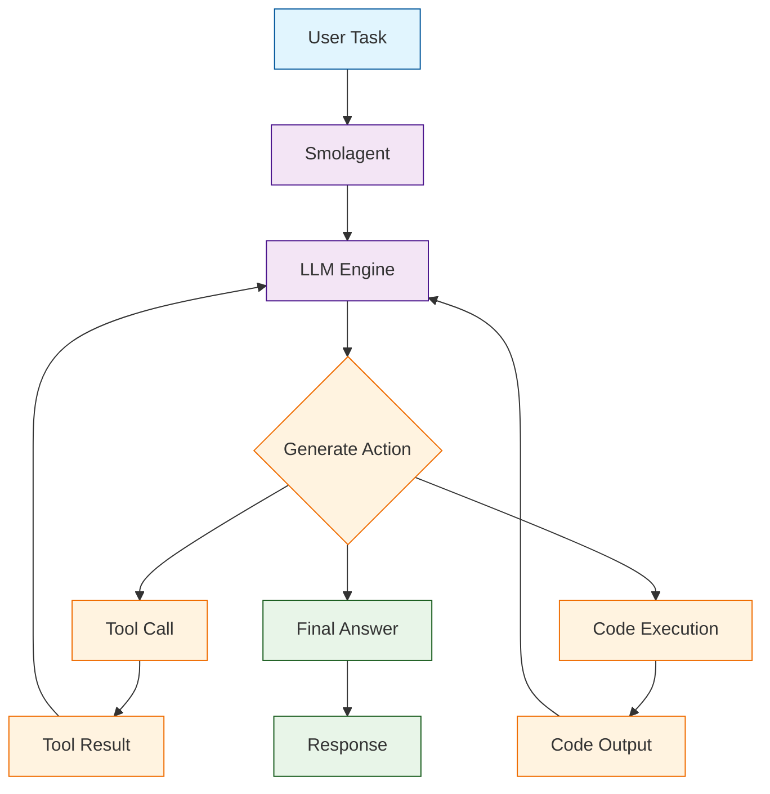

# Smolagents Tutorial: Hugging Face's Lightweight Agent Framework

> Build efficient AI agents with minimal code using Hugging Face's smolagents library.

<div align="center">

**🤗 Simple, Powerful AI Agents from Hugging Face**

[](https://github.com/huggingface/smolagents)

</div>

---

## 🎯 What is Smolagents?

**Smolagents**<sup>[View Repo](https://github.com/huggingface/smolagents)</sup> is Hugging Face's lightweight library for building AI agents. It provides a minimal yet powerful abstraction for creating agents that can use tools, execute code, and solve complex tasks.

### Design Philosophy

| Principle | Description |
|:----------|:------------|
| **Minimal Abstraction** | Simple API that's easy to understand and extend |
| **Code-First** | Agents write and execute Python code for maximum flexibility |
| **Tool Ecosystem** | Easy integration with Hugging Face tools and custom functions |
| **Model Agnostic** | Works with any LLM through a unified interface |
| **Transparency** | Clear visibility into agent reasoning and actions |



## Tutorial Chapters

1. **[Chapter 1: Getting Started](01-getting-started.md)** - Installation, setup, and your first smolagent
2. **[Chapter 2: Understanding Agents](02-understanding-agents.md)** - Agent types and execution modes
3. **[Chapter 3: Tools & Functions](03-tools.md)** - Built-in tools and creating custom tools
4. **[Chapter 4: Code Execution](04-code-execution.md)** - Safe Python code execution by agents
5. **[Chapter 5: Multi-Step Reasoning](05-multi-step.md)** - Complex task decomposition
6. **[Chapter 6: Memory & Context](06-memory.md)** - Managing agent memory and conversation history
7. **[Chapter 7: Advanced Patterns](07-advanced.md)** - Multi-agent systems and orchestration
8. **[Chapter 8: Production Deployment](08-production.md)** - Scaling, safety, and best practices

## What You'll Learn

- **Create Minimal Agents** that accomplish complex tasks
- **Use Built-in Tools** for web search, image generation, and more
- **Build Custom Tools** tailored to your domain
- **Execute Code Safely** with sandboxed Python execution
- **Design Multi-Step Workflows** with proper reasoning
- **Integrate with Hugging Face** models and spaces
- **Deploy Agents** in production environments

## Prerequisites

- Python 3.9+
- Basic understanding of LLMs
- Hugging Face account (for Hub access)
- API key for your LLM provider

## Quick Start

```bash
# Install smolagents
pip install smolagents

# For additional tools
pip install smolagents[all]
```

## Your First Agent

```python
from smolagents import CodeAgent, HfApiModel

# Use a Hugging Face model
model = HfApiModel()

# Create a code agent
agent = CodeAgent(tools=[], model=model)

# Run a simple task
result = agent.run("What is 25 * 48?")
print(result)
# 1200
```

## Agent with Tools

```python
from smolagents import CodeAgent, HfApiModel, tool

# Define a custom tool
@tool
def get_weather(city: str) -> str:
    """
    Get the current weather for a city.
    
    Args:
        city: The name of the city
        
    Returns:
        Current weather description
    """
    # Mock implementation
    weather_data = {
        "Paris": "22°C, Sunny",
        "London": "15°C, Cloudy",
        "Tokyo": "28°C, Humid"
    }
    return weather_data.get(city, f"Weather not available for {city}")

# Create agent with tools
agent = CodeAgent(
    tools=[get_weather],
    model=HfApiModel()
)

result = agent.run("What's the weather in Paris and Tokyo?")
print(result)
```

## Using Built-in Tools

```python
from smolagents import CodeAgent, HfApiModel
from smolagents.tools import DuckDuckGoSearchTool, VisitWebpageTool

# Web search agent
agent = CodeAgent(
    tools=[DuckDuckGoSearchTool(), VisitWebpageTool()],
    model=HfApiModel()
)

result = agent.run("Find the latest news about AI agents and summarize the top 3 stories")
print(result)
```

## Code Agent vs Tool Agent

Smolagents offers two agent types:

### CodeAgent (Recommended)
Writes and executes Python code - more flexible and powerful:

```python
from smolagents import CodeAgent, HfApiModel

agent = CodeAgent(
    tools=[],
    model=HfApiModel()
)

# Agent writes Python code to solve the task
result = agent.run("""
Create a list of the first 10 fibonacci numbers,
then calculate their sum and average.
""")
```

### ToolCallingAgent
Uses structured tool calls - more constrained:

```python
from smolagents import ToolCallingAgent, HfApiModel

agent = ToolCallingAgent(
    tools=[get_weather],
    model=HfApiModel()
)

result = agent.run("What's the weather in London?")
```

## Working with Different Models

```python
from smolagents import CodeAgent
from smolagents import (
    HfApiModel,
    OpenAIServerModel,
    AnthropicModel,
    LiteLLMModel
)

# Hugging Face Inference API
hf_model = HfApiModel(model_id="meta-llama/Llama-3.1-70B-Instruct")

# OpenAI
openai_model = OpenAIServerModel(model_id="gpt-4o")

# Anthropic
anthropic_model = AnthropicModel(model_id="claude-3-5-sonnet-20241022")

# Any model via LiteLLM
litellm_model = LiteLLMModel(model_id="groq/llama-3.1-70b")

# Create agent with any model
agent = CodeAgent(tools=[], model=openai_model)
```

## Safe Code Execution

```python
from smolagents import CodeAgent, HfApiModel

# Agent with sandboxed execution
agent = CodeAgent(
    tools=[],
    model=HfApiModel(),
    additional_authorized_imports=["numpy", "pandas"],  # Allowed imports
    max_steps=10,  # Limit iterations
)

result = agent.run("""
Using pandas, create a simple dataframe with 
names and ages, then calculate the average age.
""")
```

## Multi-Step Tasks

```python
from smolagents import CodeAgent, HfApiModel
from smolagents.tools import DuckDuckGoSearchTool

agent = CodeAgent(
    tools=[DuckDuckGoSearchTool()],
    model=HfApiModel(),
    max_steps=15,
    verbose=True  # See step-by-step reasoning
)

result = agent.run("""
Research the top 3 Python web frameworks,
compare their GitHub stars and latest release dates,
then recommend one for a new project and explain why.
""")
```

## Supported Models

| Provider | Model Examples |
|:---------|:---------------|
| **Hugging Face** | Llama 3.1, Mistral, Qwen |
| **OpenAI** | GPT-4o, GPT-4-turbo |
| **Anthropic** | Claude 3.5 Sonnet, Claude 3 Opus |
| **Groq** | Llama 3.1 (fast inference) |
| **Local** | Any Ollama or vLLM model |

## Learning Path

### 🟢 Beginner Track
1. Chapters 1-3: Setup, agent basics, and tools
2. Build simple task-solving agents

### 🟡 Intermediate Track
1. Chapters 4-6: Code execution, multi-step, and memory
2. Create sophisticated reasoning agents

### 🔴 Advanced Track
1. Chapters 7-8: Advanced patterns and production
2. Deploy enterprise-grade agent systems

---

**Ready to build lightweight AI agents? Let's begin with [Chapter 1: Getting Started](01-getting-started.md)!**

*Generated for [Awesome Code Docs](https://github.com/johnxie/awesome-code-docs)*
