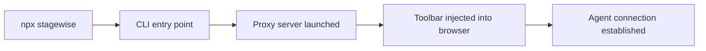

# Chapter 1: Getting Started and CLI Bootstrap

Welcome to **Chapter 1: Getting Started and CLI Bootstrap**. In this part of **Stagewise Tutorial: Frontend Coding Agent Workflows in Real Browser Context**, you will build an intuitive mental model first, then move into concrete implementation details and practical production tradeoffs.


This chapter gets Stagewise running with the correct workspace assumptions so the agent can safely edit your frontend codebase.

## Learning Goals

- run Stagewise from the correct project root
- start a first toolbar-enabled session
- verify prompt flow from browser to agent

## Quick Bootstrap

```bash
# from your frontend app root (where package.json exists)
npx stagewise@latest
```

Or with pnpm:

```bash
pnpm dlx stagewise@latest
```

## First-Run Checklist

1. dev app is running on its own app port
2. Stagewise CLI starts from app root directory
3. toolbar appears in browser on Stagewise proxy port
4. prompt submission reaches selected agent

## Source References

- [Root README](https://github.com/stagewise-io/stagewise/blob/main/README.md)
- [Docs: Getting Started](https://github.com/stagewise-io/stagewise/blob/main/apps/website/content/docs/index.mdx)

## Summary

You now have a working Stagewise baseline and understand the root-directory requirement.

Next: [Chapter 2: Proxy and Toolbar Architecture](02-proxy-and-toolbar-architecture.md)

## Source Code Walkthrough

Use the following upstream sources to verify CLI bootstrap and getting-started implementation details while reading this chapter:

- [`apps/stagewise/src/index.ts`](https://github.com/stagewise-io/stagewise/blob/HEAD/apps/stagewise/src/index.ts) — the main CLI entry point that bootstraps the Stagewise proxy server, injects the toolbar into the running frontend dev server, and launches the agent connection.
- [`apps/stagewise/package.json`](https://github.com/stagewise-io/stagewise/blob/HEAD/apps/stagewise/package.json) — defines the `stagewise` CLI bin entry, dependencies, and the script commands used during `npx stagewise` execution.

Suggested trace strategy:
- trace the bootstrap sequence in the CLI entry point to see how the proxy port, target URL, and workspace root are resolved
- check `package.json` bin fields to understand how `npx stagewise` resolves to the CLI executable
- look at monorepo `pnpm-workspace.yaml` to understand which packages are composed during a full install

## How These Components Connect


