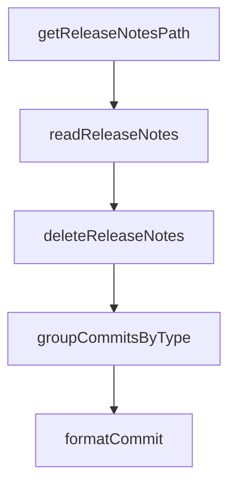

# Chapter 1: Getting Started and CLI Bootstrap

Welcome to **Chapter 1: Getting Started and CLI Bootstrap**. In this part of **Stagewise Tutorial: Frontend Coding Agent Workflows in Real Browser Context**, you will build an intuitive mental model first, then move into concrete implementation details and practical production tradeoffs.


This chapter gets Stagewise running with the correct workspace assumptions so the agent can safely edit your frontend codebase.

## Learning Goals

- run Stagewise from the correct project root
- start a first toolbar-enabled session
- verify prompt flow from browser to agent

## Quick Bootstrap

```bash
# from your frontend app root (where package.json exists)
npx stagewise@latest
```

Or with pnpm:

```bash
pnpm dlx stagewise@latest
```

## First-Run Checklist

1. dev app is running on its own app port
2. Stagewise CLI starts from app root directory
3. toolbar appears in browser on Stagewise proxy port
4. prompt submission reaches selected agent

## Source References

- [Root README](https://github.com/stagewise-io/stagewise/blob/main/README.md)
- [Docs: Getting Started](https://github.com/stagewise-io/stagewise/blob/main/apps/website/content/docs/index.mdx)

## Summary

You now have a working Stagewise baseline and understand the root-directory requirement.

Next: [Chapter 2: Proxy and Toolbar Architecture](02-proxy-and-toolbar-architecture.md)

## Depth Expansion Playbook

## Source Code Walkthrough

### `scripts/release/generate-changelog.ts`

The `getReleaseNotesPath` function in [`scripts/release/generate-changelog.ts`](https://github.com/stagewise-io/stagewise/blob/HEAD/scripts/release/generate-changelog.ts) handles a key part of this chapter's functionality:

```ts
 * Get the path to release notes file for a package
 */
export async function getReleaseNotesPath(
  packageName: string,
): Promise<string> {
  const repoRoot = await getRepoRoot();
  return path.join(repoRoot, '.release-notes', `${packageName}.md`);
}

/**
 * Read custom release notes for a package
 * Returns null if no release notes file exists
 */
export async function readReleaseNotes(
  packageName: string,
): Promise<string | null> {
  const notesPath = await getReleaseNotesPath(packageName);

  if (!existsSync(notesPath)) {
    return null;
  }

  const content = await readFile(notesPath, 'utf-8');
  return content.trim() || null;
}

/**
 * Delete the release notes file after it's been used
 */
export async function deleteReleaseNotes(packageName: string): Promise<void> {
  const notesPath = await getReleaseNotesPath(packageName);

```

This function is important because it defines how Stagewise Tutorial: Frontend Coding Agent Workflows in Real Browser Context implements the patterns covered in this chapter.

### `scripts/release/generate-changelog.ts`

The `readReleaseNotes` function in [`scripts/release/generate-changelog.ts`](https://github.com/stagewise-io/stagewise/blob/HEAD/scripts/release/generate-changelog.ts) handles a key part of this chapter's functionality:

```ts
 * Returns null if no release notes file exists
 */
export async function readReleaseNotes(
  packageName: string,
): Promise<string | null> {
  const notesPath = await getReleaseNotesPath(packageName);

  if (!existsSync(notesPath)) {
    return null;
  }

  const content = await readFile(notesPath, 'utf-8');
  return content.trim() || null;
}

/**
 * Delete the release notes file after it's been used
 */
export async function deleteReleaseNotes(packageName: string): Promise<void> {
  const notesPath = await getReleaseNotesPath(packageName);

  if (existsSync(notesPath)) {
    await unlink(notesPath);
  }
}

/**
 * Group commits by type for changelog sections
 */
interface GroupedCommits {
  features: ConventionalCommit[];
  fixes: ConventionalCommit[];
```

This function is important because it defines how Stagewise Tutorial: Frontend Coding Agent Workflows in Real Browser Context implements the patterns covered in this chapter.

### `scripts/release/generate-changelog.ts`

The `deleteReleaseNotes` function in [`scripts/release/generate-changelog.ts`](https://github.com/stagewise-io/stagewise/blob/HEAD/scripts/release/generate-changelog.ts) handles a key part of this chapter's functionality:

```ts
 * Delete the release notes file after it's been used
 */
export async function deleteReleaseNotes(packageName: string): Promise<void> {
  const notesPath = await getReleaseNotesPath(packageName);

  if (existsSync(notesPath)) {
    await unlink(notesPath);
  }
}

/**
 * Group commits by type for changelog sections
 */
interface GroupedCommits {
  features: ConventionalCommit[];
  fixes: ConventionalCommit[];
  breaking: ConventionalCommit[];
  other: ConventionalCommit[];
}

function groupCommitsByType(commits: ConventionalCommit[]): GroupedCommits {
  return {
    features: commits.filter((c) => c.type === 'feat'),
    fixes: commits.filter((c) => c.type === 'fix'),
    breaking: commits.filter((c) => c.breaking),
    other: commits.filter(
      (c) => !['feat', 'fix'].includes(c.type) && !c.breaking,
    ),
  };
}

/**
```

This function is important because it defines how Stagewise Tutorial: Frontend Coding Agent Workflows in Real Browser Context implements the patterns covered in this chapter.

### `scripts/release/generate-changelog.ts`

The `groupCommitsByType` function in [`scripts/release/generate-changelog.ts`](https://github.com/stagewise-io/stagewise/blob/HEAD/scripts/release/generate-changelog.ts) handles a key part of this chapter's functionality:

```ts
}

function groupCommitsByType(commits: ConventionalCommit[]): GroupedCommits {
  return {
    features: commits.filter((c) => c.type === 'feat'),
    fixes: commits.filter((c) => c.type === 'fix'),
    breaking: commits.filter((c) => c.breaking),
    other: commits.filter(
      (c) => !['feat', 'fix'].includes(c.type) && !c.breaking,
    ),
  };
}

/**
 * Generate markdown for a single commit
 */
function formatCommit(commit: ConventionalCommit): string {
  const breaking = commit.breaking ? '**BREAKING** ' : '';
  return `* ${breaking}${commit.subject} (${commit.shortHash})`;
}

/**
 * Detect if version is a channel promotion (e.g., alpha→beta or prerelease→release)
 */
function detectPromotion(version: string): {
  isPromotion: boolean;
  fromChannel: string | null;
  toChannel: string;
} {
  const parsed = parseVersion(version);

  // Determine the target channel from the version
```

This function is important because it defines how Stagewise Tutorial: Frontend Coding Agent Workflows in Real Browser Context implements the patterns covered in this chapter.


## How These Components Connect


