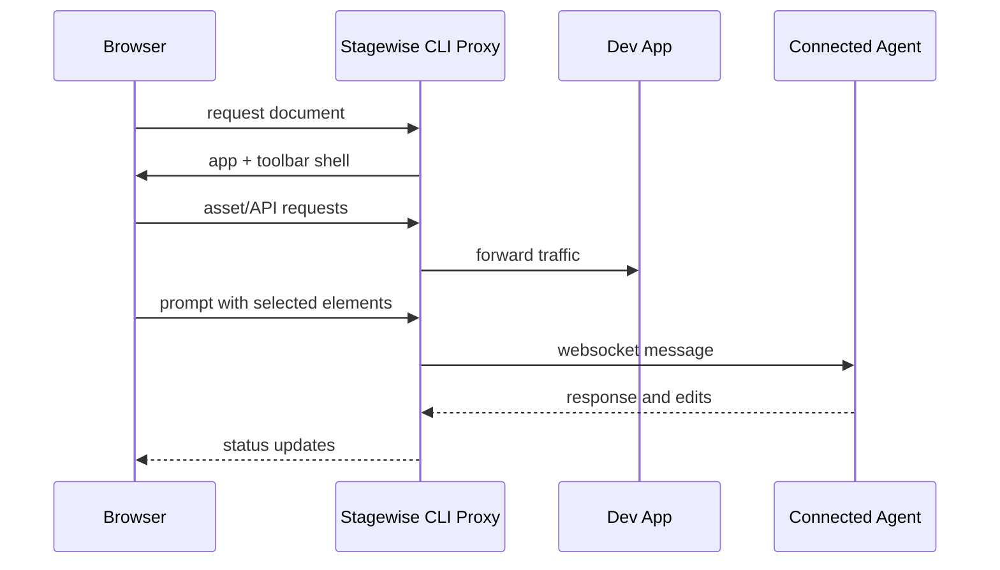

# Chapter 2: Proxy and Toolbar Architecture

Stagewise works by proxying your app and injecting a toolbar layer that captures UI context for coding-agent prompts.

## Learning Goals

- understand how the CLI proxy routes requests
- map toolbar injection and plugin loading behavior
- reason about websocket paths and agent communication

## Core Runtime Flow

## Architecture Notes

- document requests receive toolbar augmentation
- non-document traffic is proxied to your app as-is
- bridge or built-in agent mode changes who receives prompt traffic

## Source References

- [CLI Deep Dive](https://github.com/stagewise-io/stagewise/blob/main/apps/website/content/docs/advanced-usage/cli-deep-dive.mdx)
- [Apps CLI README](https://github.com/stagewise-io/stagewise/blob/main/apps/cli/README.md)

## Summary

You now understand how Stagewise integrates without replacing your existing dev server workflow.

Next: [Chapter 3: Bridge Mode and Multi-Agent Integrations](03-bridge-mode-and-multi-agent-integrations.md)
