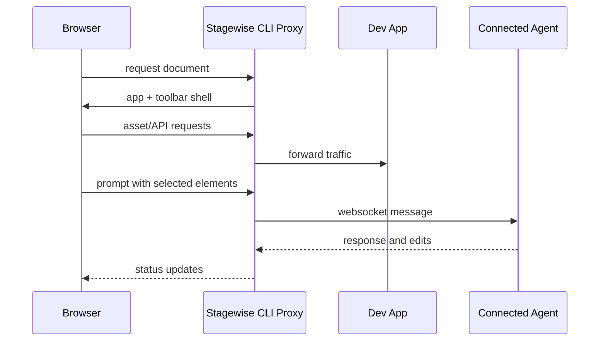
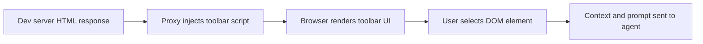

# Chapter 2: Proxy and Toolbar Architecture

Welcome to **Chapter 2: Proxy and Toolbar Architecture**. In this part of **Stagewise Tutorial: Frontend Coding Agent Workflows in Real Browser Context**, you will build an intuitive mental model first, then move into concrete implementation details and practical production tradeoffs.

Stagewise works by proxying your app and injecting a toolbar layer that captures UI context for coding-agent prompts.

## Learning Goals

- understand how the CLI proxy routes requests
- map toolbar injection and plugin loading behavior
- reason about websocket paths and agent communication

## Core Runtime Flow

```mermaid
sequenceDiagram
    participant Browser
    participant Proxy as Stagewise CLI Proxy
    participant App as Dev App
    participant Agent as Connected Agent

    Browser->>Proxy: request document
    Proxy->>Browser: app + toolbar shell
    Browser->>Proxy: asset/API requests
    Proxy->>App: forward traffic
    Browser->>Proxy: prompt with selected elements
    Proxy->>Agent: websocket message
    Agent-->>Proxy: response and edits
    Proxy-->>Browser: status updates
```

## Architecture Notes

- document requests receive toolbar augmentation
- non-document traffic is proxied to your app as-is
- bridge or built-in agent mode changes who receives prompt traffic

## Source References

- [CLI Deep Dive](https://github.com/stagewise-io/stagewise/blob/main/apps/website/content/docs/advanced-usage/cli-deep-dive.mdx)
- [Apps CLI README](https://github.com/stagewise-io/stagewise/blob/main/apps/cli/README.md)

## Summary

You now understand how Stagewise integrates without replacing your existing dev server workflow.

Next: [Chapter 3: Bridge Mode and Multi-Agent Integrations](03-bridge-mode-and-multi-agent-integrations.md)

## Source Code Walkthrough

Use the following upstream sources to verify proxy and toolbar architecture details while reading this chapter:

- [`toolbars/stagewise-toolbar/src/`](https://github.com/stagewise-io/stagewise/blob/HEAD/toolbars/stagewise-toolbar/src/) — the main toolbar package that gets injected into the running frontend browser session, providing the UI for element selection and prompt submission.
- [`apps/stagewise/src/proxy/`](https://github.com/stagewise-io/stagewise/blob/HEAD/apps/stagewise/src/) — the proxy server that intercepts dev server requests, injects the toolbar script into HTML responses, and routes messages between the browser toolbar and the agent.

Suggested trace strategy:
- browse the toolbar `src/` directory to find the component that handles DOM element selection and context capture
- trace the proxy server entry to see how HTML injection and WebSocket message routing are implemented
- review `apps/stagewise/src/ipc/` for the inter-process channel that connects the proxy to the Cursor/Copilot agent bridge

## How These Components Connect

```mermaid
flowchart LR
    A[Dev server HTML response] --> B[Proxy injects toolbar script]
    B --> C[Browser renders toolbar UI]
    C --> D[User selects DOM element]
    D --> E[Context and prompt sent to agent]
```