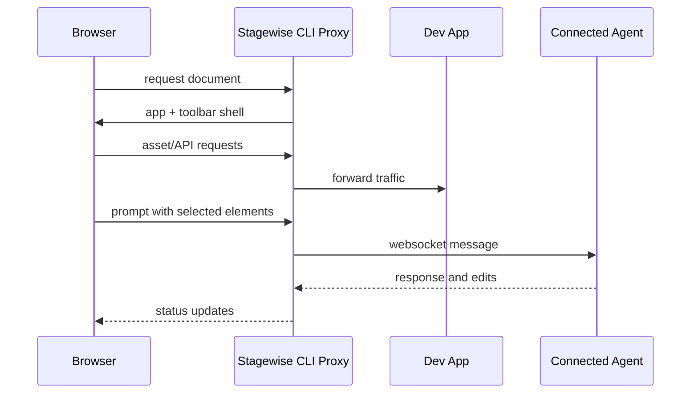
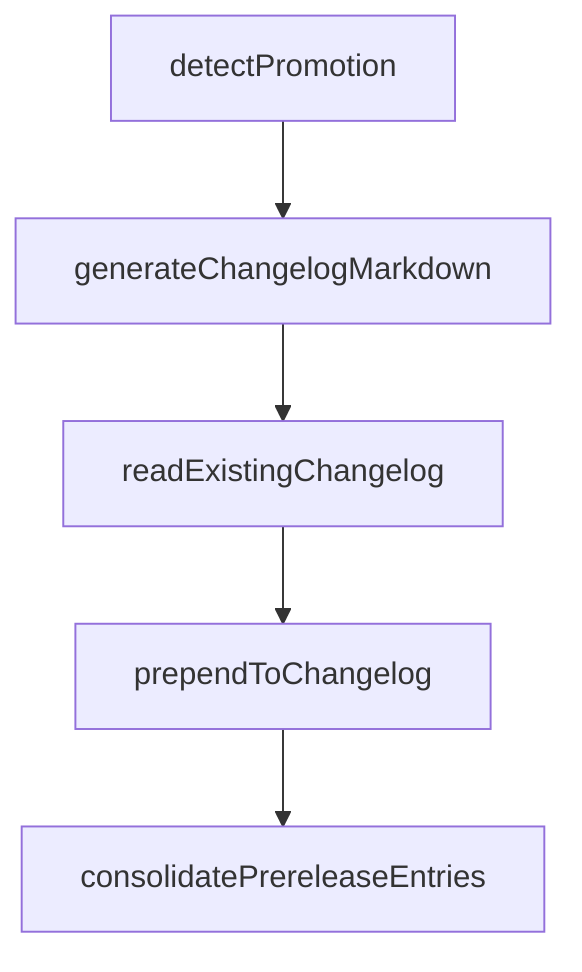

# Chapter 2: Proxy and Toolbar Architecture

Welcome to **Chapter 2: Proxy and Toolbar Architecture**. In this part of **Stagewise Tutorial: Frontend Coding Agent Workflows in Real Browser Context**, you will build an intuitive mental model first, then move into concrete implementation details and practical production tradeoffs.


Stagewise works by proxying your app and injecting a toolbar layer that captures UI context for coding-agent prompts.

## Learning Goals

- understand how the CLI proxy routes requests
- map toolbar injection and plugin loading behavior
- reason about websocket paths and agent communication

## Core Runtime Flow


```mermaid
sequenceDiagram
    participant Browser
    participant Proxy as Stagewise CLI Proxy
    participant App as Dev App
    participant Agent as Connected Agent

    Browser->>Proxy: request document
    Proxy->>Browser: app + toolbar shell
    Browser->>Proxy: asset/API requests
    Proxy->>App: forward traffic
    Browser->>Proxy: prompt with selected elements
    Proxy->>Agent: websocket message
    Agent-->>Proxy: response and edits
    Proxy-->>Browser: status updates
```

## Architecture Notes

- document requests receive toolbar augmentation
- non-document traffic is proxied to your app as-is
- bridge or built-in agent mode changes who receives prompt traffic

## Source References

- [CLI Deep Dive](https://github.com/stagewise-io/stagewise/blob/main/apps/website/content/docs/advanced-usage/cli-deep-dive.mdx)
- [Apps CLI README](https://github.com/stagewise-io/stagewise/blob/main/apps/cli/README.md)

## Summary

You now understand how Stagewise integrates without replacing your existing dev server workflow.

Next: [Chapter 3: Bridge Mode and Multi-Agent Integrations](03-bridge-mode-and-multi-agent-integrations.md)

## Depth Expansion Playbook

## Source Code Walkthrough

### `scripts/release/generate-changelog.ts`

The `detectPromotion` function in [`scripts/release/generate-changelog.ts`](https://github.com/stagewise-io/stagewise/blob/HEAD/scripts/release/generate-changelog.ts) handles a key part of this chapter's functionality:

```ts
 * Detect if version is a channel promotion (e.g., alpha→beta or prerelease→release)
 */
function detectPromotion(version: string): {
  isPromotion: boolean;
  fromChannel: string | null;
  toChannel: string;
} {
  const parsed = parseVersion(version);

  // Determine the target channel from the version
  let toChannel: string;
  if (parsed.prerelease === 'alpha') {
    toChannel = 'alpha';
  } else if (parsed.prerelease === 'beta') {
    toChannel = 'beta';
  } else {
    toChannel = 'release';
  }

  // For promotions, the previous channel is indicated by the prereleaseNum being 1
  // (first of a new channel series)
  const isFirstOfChannel = parsed.prereleaseNum === 1;

  return {
    isPromotion: isFirstOfChannel && toChannel !== 'alpha',
    fromChannel:
      isFirstOfChannel && toChannel === 'beta'
        ? 'alpha'
        : isFirstOfChannel && toChannel === 'release'
          ? 'prerelease'
          : null,
    toChannel,
```

This function is important because it defines how Stagewise Tutorial: Frontend Coding Agent Workflows in Real Browser Context implements the patterns covered in this chapter.

### `scripts/release/generate-changelog.ts`

The `generateChangelogMarkdown` function in [`scripts/release/generate-changelog.ts`](https://github.com/stagewise-io/stagewise/blob/HEAD/scripts/release/generate-changelog.ts) handles a key part of this chapter's functionality:

```ts
 * Generate the changelog markdown for a new version
 */
export function generateChangelogMarkdown(
  version: string,
  commits: ConventionalCommit[],
  date: Date = new Date(),
  customNotes: string | null = null,
): string {
  const dateStr = date.toISOString().split('T')[0];
  const { features, fixes, breaking, other } = groupCommitsByType(commits);

  let markdown = `## ${version} (${dateStr})\n\n`;

  // Add custom release notes at the top if provided
  if (customNotes) {
    markdown += `${customNotes}\n\n`;
  }

  // Handle case when there are no commits (channel promotion)
  if (commits.length === 0) {
    const promotion = detectPromotion(version);
    if (promotion.isPromotion && promotion.fromChannel) {
      markdown += `Promoted from ${promotion.fromChannel} to ${promotion.toChannel}.\n\n`;
    } else {
      markdown += `No changes in this release.\n\n`;
    }
    return markdown;
  }

  // Breaking changes section
  if (breaking.length > 0) {
    markdown += `### Breaking Changes\n\n`;
```

This function is important because it defines how Stagewise Tutorial: Frontend Coding Agent Workflows in Real Browser Context implements the patterns covered in this chapter.

### `scripts/release/generate-changelog.ts`

The `readExistingChangelog` function in [`scripts/release/generate-changelog.ts`](https://github.com/stagewise-io/stagewise/blob/HEAD/scripts/release/generate-changelog.ts) handles a key part of this chapter's functionality:

```ts
 * Read existing changelog or return header
 */
async function readExistingChangelog(changelogPath: string): Promise<string> {
  if (existsSync(changelogPath)) {
    return await readFile(changelogPath, 'utf-8');
  }
  return '';
}

/**
 * Prepend new changelog entry to existing changelog
 */
export async function prependToChangelog(
  packageConfig: PackageConfig,
  newEntry: string,
): Promise<void> {
  const repoRoot = await getRepoRoot();
  const packageDir = path.dirname(path.join(repoRoot, packageConfig.path));
  const changelogPath = path.join(packageDir, 'CHANGELOG.md');

  const existing = await readExistingChangelog(changelogPath);

  // Check if changelog has a header
  const hasHeader = existing.startsWith('# Changelog');

  let newContent: string;
  if (hasHeader) {
    // Insert after the header line
    const headerEnd = existing.indexOf('\n\n');
    if (headerEnd !== -1) {
      newContent =
        existing.slice(0, headerEnd + 2) +
```

This function is important because it defines how Stagewise Tutorial: Frontend Coding Agent Workflows in Real Browser Context implements the patterns covered in this chapter.

### `scripts/release/generate-changelog.ts`

The `prependToChangelog` function in [`scripts/release/generate-changelog.ts`](https://github.com/stagewise-io/stagewise/blob/HEAD/scripts/release/generate-changelog.ts) handles a key part of this chapter's functionality:

```ts
 * Prepend new changelog entry to existing changelog
 */
export async function prependToChangelog(
  packageConfig: PackageConfig,
  newEntry: string,
): Promise<void> {
  const repoRoot = await getRepoRoot();
  const packageDir = path.dirname(path.join(repoRoot, packageConfig.path));
  const changelogPath = path.join(packageDir, 'CHANGELOG.md');

  const existing = await readExistingChangelog(changelogPath);

  // Check if changelog has a header
  const hasHeader = existing.startsWith('# Changelog');

  let newContent: string;
  if (hasHeader) {
    // Insert after the header line
    const headerEnd = existing.indexOf('\n\n');
    if (headerEnd !== -1) {
      newContent =
        existing.slice(0, headerEnd + 2) +
        newEntry +
        existing.slice(headerEnd + 2);
    } else {
      newContent = `${existing}\n\n${newEntry}`;
    }
  } else if (existing) {
    // No header, just prepend
    newContent = newEntry + existing;
  } else {
    // Empty file, create with header
```

This function is important because it defines how Stagewise Tutorial: Frontend Coding Agent Workflows in Real Browser Context implements the patterns covered in this chapter.


## How These Components Connect


```mermaid
flowchart TD
    A[detectPromotion]
    B[generateChangelogMarkdown]
    C[readExistingChangelog]
    D[prependToChangelog]
    E[consolidatePrereleaseEntries]
    A --> B
    B --> C
    C --> D
    D --> E
```
