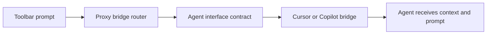

# Chapter 3: Bridge Mode and Multi-Agent Integrations

Welcome to **Chapter 3: Bridge Mode and Multi-Agent Integrations**. In this part of **Stagewise Tutorial: Frontend Coding Agent Workflows in Real Browser Context**, you will build an intuitive mental model first, then move into concrete implementation details and practical production tradeoffs.


Bridge mode allows Stagewise to route prompts to external IDE agents instead of the built-in Stagewise agent runtime.

## Learning Goals

- decide when to run Stagewise in bridge mode
- map supported external agent integrations
- avoid common bridge-mode misconfiguration

## Bridge Mode Command

```bash
stagewise -b
```

With explicit workspace:

```bash
stagewise -b -w ~/repos/my-dev-app
```

## Supported Agent Examples

| Agent Surface | Status |
|:--------------|:-------|
| Cursor | supported |
| GitHub Copilot | supported |
| Windsurf | supported |
| Cline / Roo Code / Kilo Code / Trae | supported |

## Source References

- [Use Different Agents](https://github.com/stagewise-io/stagewise/blob/main/apps/website/content/docs/advanced-usage/use-different-agents.mdx)
- [VS Code Extension README](https://github.com/stagewise-io/stagewise/blob/main/apps/vscode-extension/README.md)

## Summary

You now know how to route Stagewise browser context into external coding-agent ecosystems.

Next: [Chapter 4: Configuration and Plugin Loading](04-configuration-and-plugin-loading.md)

## Source Code Walkthrough

Use the following upstream sources to verify bridge mode and multi-agent integration details while reading this chapter:

- [`packages/agent-interface/src/`](https://github.com/stagewise-io/stagewise/blob/HEAD/packages/agent-interface/src/) — defines the agent interface contract used by all bridge integrations, specifying the message format and handshake protocol for connecting external coding agents.
- [`apps/stagewise/src/agents/`](https://github.com/stagewise-io/stagewise/blob/HEAD/apps/stagewise/src/) — contains the bridge implementations for Cursor, Copilot, and other supported agents, each wrapping the agent interface contract to route toolbar prompts into the agent's input.

Suggested trace strategy:
- review the agent interface package to understand the `AgentMessage` type and the connection lifecycle
- compare bridge implementations across different agents to see how Cursor vs. VS Code Copilot bridge differs
- trace how the proxy routes a user prompt from the toolbar through the correct bridge to the target agent

## How These Components Connect

