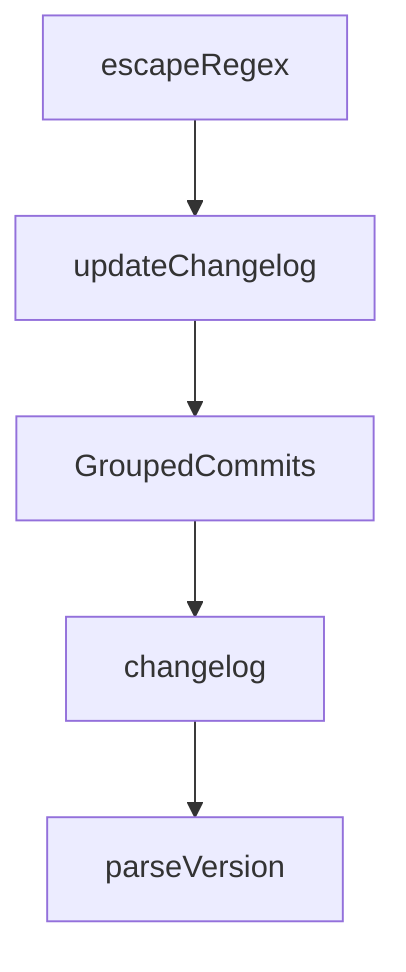

# Chapter 3: Bridge Mode and Multi-Agent Integrations

Welcome to **Chapter 3: Bridge Mode and Multi-Agent Integrations**. In this part of **Stagewise Tutorial: Frontend Coding Agent Workflows in Real Browser Context**, you will build an intuitive mental model first, then move into concrete implementation details and practical production tradeoffs.


Bridge mode allows Stagewise to route prompts to external IDE agents instead of the built-in Stagewise agent runtime.

## Learning Goals

- decide when to run Stagewise in bridge mode
- map supported external agent integrations
- avoid common bridge-mode misconfiguration

## Bridge Mode Command

```bash
stagewise -b
```

With explicit workspace:

```bash
stagewise -b -w ~/repos/my-dev-app
```

## Supported Agent Examples

| Agent Surface | Status |
|:--------------|:-------|
| Cursor | supported |
| GitHub Copilot | supported |
| Windsurf | supported |
| Cline / Roo Code / Kilo Code / Trae | supported |

## Source References

- [Use Different Agents](https://github.com/stagewise-io/stagewise/blob/main/apps/website/content/docs/advanced-usage/use-different-agents.mdx)
- [VS Code Extension README](https://github.com/stagewise-io/stagewise/blob/main/apps/vscode-extension/README.md)

## Summary

You now know how to route Stagewise browser context into external coding-agent ecosystems.

Next: [Chapter 4: Configuration and Plugin Loading](04-configuration-and-plugin-loading.md)

## Depth Expansion Playbook

## Source Code Walkthrough

### `scripts/release/generate-changelog.ts`

The `escapeRegex` function in [`scripts/release/generate-changelog.ts`](https://github.com/stagewise-io/stagewise/blob/HEAD/scripts/release/generate-changelog.ts) handles a key part of this chapter's functionality:

```ts
  // Regex to match prerelease versions of the same base
  const prereleasePattern = new RegExp(
    `## ${escapeRegex(baseVersion)}-(alpha|beta)\\.\\d+[^#]*`,
    'g',
  );

  // Remove prerelease entries from existing changelog
  const cleanedChangelog = existing.replace(prereleasePattern, '');

  // Generate consolidated release entry
  const releaseEntry = generateChangelogMarkdown(
    releaseVersion,
    commits,
    new Date(),
    customNotes,
  );

  // Reconstruct changelog
  const hasHeader = cleanedChangelog.startsWith('# Changelog');
  let newContent: string;

  if (hasHeader) {
    const headerEnd = cleanedChangelog.indexOf('\n\n');
    if (headerEnd !== -1) {
      newContent =
        cleanedChangelog.slice(0, headerEnd + 2) +
        releaseEntry +
        cleanedChangelog.slice(headerEnd + 2);
    } else {
      newContent = `${cleanedChangelog}\n\n${releaseEntry}`;
    }
  } else {
```

This function is important because it defines how Stagewise Tutorial: Frontend Coding Agent Workflows in Real Browser Context implements the patterns covered in this chapter.

### `scripts/release/generate-changelog.ts`

The `updateChangelog` function in [`scripts/release/generate-changelog.ts`](https://github.com/stagewise-io/stagewise/blob/HEAD/scripts/release/generate-changelog.ts) handles a key part of this chapter's functionality:

```ts
 * Update changelog for a new release
 */
export async function updateChangelog(
  packageConfig: PackageConfig,
  newVersion: string,
  targetChannel: ReleaseChannel,
  commits: ConventionalCommit[],
  customNotes: string | null = null,
): Promise<string> {
  // For stable releases, consolidate any prerelease entries
  if (targetChannel === 'release') {
    return await consolidatePrereleaseEntries(
      packageConfig,
      newVersion,
      commits,
      customNotes,
    );
  }

  // For prerelease, just prepend the new entry
  const entry = generateChangelogMarkdown(
    newVersion,
    commits,
    new Date(),
    customNotes,
  );
  await prependToChangelog(packageConfig, entry);
  return entry;
}

```

This function is important because it defines how Stagewise Tutorial: Frontend Coding Agent Workflows in Real Browser Context implements the patterns covered in this chapter.

### `scripts/release/generate-changelog.ts`

The `GroupedCommits` interface in [`scripts/release/generate-changelog.ts`](https://github.com/stagewise-io/stagewise/blob/HEAD/scripts/release/generate-changelog.ts) handles a key part of this chapter's functionality:

```ts
 * Group commits by type for changelog sections
 */
interface GroupedCommits {
  features: ConventionalCommit[];
  fixes: ConventionalCommit[];
  breaking: ConventionalCommit[];
  other: ConventionalCommit[];
}

function groupCommitsByType(commits: ConventionalCommit[]): GroupedCommits {
  return {
    features: commits.filter((c) => c.type === 'feat'),
    fixes: commits.filter((c) => c.type === 'fix'),
    breaking: commits.filter((c) => c.breaking),
    other: commits.filter(
      (c) => !['feat', 'fix'].includes(c.type) && !c.breaking,
    ),
  };
}

/**
 * Generate markdown for a single commit
 */
function formatCommit(commit: ConventionalCommit): string {
  const breaking = commit.breaking ? '**BREAKING** ' : '';
  return `* ${breaking}${commit.subject} (${commit.shortHash})`;
}

/**
 * Detect if version is a channel promotion (e.g., alpha→beta or prerelease→release)
 */
function detectPromotion(version: string): {
```

This interface is important because it defines how Stagewise Tutorial: Frontend Coding Agent Workflows in Real Browser Context implements the patterns covered in this chapter.

### `scripts/release/generate-changelog.ts`

The `changelog` interface in [`scripts/release/generate-changelog.ts`](https://github.com/stagewise-io/stagewise/blob/HEAD/scripts/release/generate-changelog.ts) handles a key part of this chapter's functionality:

```ts

/**
 * Group commits by type for changelog sections
 */
interface GroupedCommits {
  features: ConventionalCommit[];
  fixes: ConventionalCommit[];
  breaking: ConventionalCommit[];
  other: ConventionalCommit[];
}

function groupCommitsByType(commits: ConventionalCommit[]): GroupedCommits {
  return {
    features: commits.filter((c) => c.type === 'feat'),
    fixes: commits.filter((c) => c.type === 'fix'),
    breaking: commits.filter((c) => c.breaking),
    other: commits.filter(
      (c) => !['feat', 'fix'].includes(c.type) && !c.breaking,
    ),
  };
}

/**
 * Generate markdown for a single commit
 */
function formatCommit(commit: ConventionalCommit): string {
  const breaking = commit.breaking ? '**BREAKING** ' : '';
  return `* ${breaking}${commit.subject} (${commit.shortHash})`;
}

/**
 * Detect if version is a channel promotion (e.g., alpha→beta or prerelease→release)
```

This interface is important because it defines how Stagewise Tutorial: Frontend Coding Agent Workflows in Real Browser Context implements the patterns covered in this chapter.


## How These Components Connect


