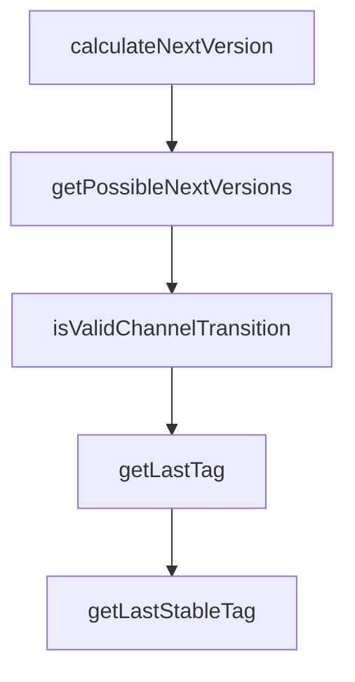

# Chapter 4: Configuration and Plugin Loading

Welcome to **Chapter 4: Configuration and Plugin Loading**. In this part of **Stagewise Tutorial: Frontend Coding Agent Workflows in Real Browser Context**, you will build an intuitive mental model first, then move into concrete implementation details and practical production tradeoffs.


`stagewise.json` governs ports, workspace behavior, and plugin loading strategy.

## Learning Goals

- configure Stagewise with stable project defaults
- control automatic and explicit plugin loading
- understand config precedence and overrides

## Example `stagewise.json`

```json
{
  "port": 3100,
  "appPort": 3000,
  "autoPlugins": true,
  "plugins": [
    "@stagewise/react-plugin",
    {
      "name": "custom-plugin",
      "path": "./plugins/custom-plugin/dist"
    }
  ]
}
```

## Precedence Order

1. command-line flags
2. `stagewise.json`
3. default values

## Source References

- [CLI Deep Dive](https://github.com/stagewise-io/stagewise/blob/main/apps/website/content/docs/advanced-usage/cli-deep-dive.mdx)
- [Install Plugins](https://github.com/stagewise-io/stagewise/blob/main/apps/website/content/docs/advanced-usage/install-plugins.mdx)

## Summary

You now have a configuration model for predictable per-project Stagewise behavior.

Next: [Chapter 5: Building Plugins with Plugin SDK](05-building-plugins-with-plugin-sdk.md)

## Depth Expansion Playbook

## Source Code Walkthrough

### `scripts/release/bump-version.ts`

The `calculateNextVersion` function in [`scripts/release/bump-version.ts`](https://github.com/stagewise-io/stagewise/blob/HEAD/scripts/release/bump-version.ts) handles a key part of this chapter's functionality:

```ts
 * - From release to prerelease: apply bump, add prerelease (1.0.0 -> 1.0.1-alpha.1)
 */
export function calculateNextVersion(
  currentVersion: string,
  bumpType: VersionBump,
  targetChannel: ReleaseChannel,
): string {
  const current = parseVersion(currentVersion);

  // Case 1: Target is a stable release
  if (targetChannel === 'release') {
    // If already a release version, apply the bump
    if (!current.prerelease) {
      return semver.inc(currentVersion, bumpType) || currentVersion;
    }

    // If coming from prerelease, just drop the prerelease tag
    // The base version already represents the "next" version
    return current.base;
  }

  // Case 2: Target is a prerelease (alpha or beta)

  // If current is a stable release, apply bump and start at prerelease.1
  if (!current.prerelease) {
    const bumpedBase = semver.inc(currentVersion, bumpType);
    if (!bumpedBase) {
      throw new Error(
        `Failed to bump version ${currentVersion} with ${bumpType}`,
      );
    }
    return `${bumpedBase}-${targetChannel}.1`;
```

This function is important because it defines how Stagewise Tutorial: Frontend Coding Agent Workflows in Real Browser Context implements the patterns covered in this chapter.

### `scripts/release/bump-version.ts`

The `getPossibleNextVersions` function in [`scripts/release/bump-version.ts`](https://github.com/stagewise-io/stagewise/blob/HEAD/scripts/release/bump-version.ts) handles a key part of this chapter's functionality:

```ts
 * Get a list of possible next versions for display
 */
export function getPossibleNextVersions(
  currentVersion: string,
  bumpType: VersionBump,
): Record<ReleaseChannel, string> {
  return {
    alpha: calculateNextVersion(currentVersion, bumpType, 'alpha'),
    beta: calculateNextVersion(currentVersion, bumpType, 'beta'),
    release: calculateNextVersion(currentVersion, bumpType, 'release'),
  };
}

/**
 * Validate that a channel transition is allowed
 */
export function isValidChannelTransition(
  currentChannel: ReleaseChannel | null,
  targetChannel: ReleaseChannel,
): boolean {
  // From release to any prerelease is allowed
  if (currentChannel === null) {
    return true;
  }

  // To release is always allowed
  if (targetChannel === 'release') {
    return true;
  }

  // Same channel is allowed
  if (currentChannel === targetChannel) {
```

This function is important because it defines how Stagewise Tutorial: Frontend Coding Agent Workflows in Real Browser Context implements the patterns covered in this chapter.

### `scripts/release/bump-version.ts`

The `isValidChannelTransition` function in [`scripts/release/bump-version.ts`](https://github.com/stagewise-io/stagewise/blob/HEAD/scripts/release/bump-version.ts) handles a key part of this chapter's functionality:

```ts
 * Validate that a channel transition is allowed
 */
export function isValidChannelTransition(
  currentChannel: ReleaseChannel | null,
  targetChannel: ReleaseChannel,
): boolean {
  // From release to any prerelease is allowed
  if (currentChannel === null) {
    return true;
  }

  // To release is always allowed
  if (targetChannel === 'release') {
    return true;
  }

  // Same channel is allowed
  if (currentChannel === targetChannel) {
    return true;
  }

  // alpha -> beta is allowed
  if (currentChannel === 'alpha' && targetChannel === 'beta') {
    return true;
  }

  // beta -> alpha is NOT allowed
  return false;
}

```

This function is important because it defines how Stagewise Tutorial: Frontend Coding Agent Workflows in Real Browser Context implements the patterns covered in this chapter.

### `scripts/release/git-utils.ts`

The `getLastTag` function in [`scripts/release/git-utils.ts`](https://github.com/stagewise-io/stagewise/blob/HEAD/scripts/release/git-utils.ts) handles a key part of this chapter's functionality:

```ts
 * Get the most recent tag matching a prefix
 */
export async function getLastTag(prefix: string): Promise<string | null> {
  try {
    const { stdout } = await exec(
      `git tag --list "${prefix}*" --sort=-version:refname | head -n 1`,
    );
    const tag = stdout.trim();
    return tag || null;
  } catch {
    return null;
  }
}

/**
 * Get the most recent stable (non-prerelease) tag matching a prefix
 */
export async function getLastStableTag(prefix: string): Promise<string | null> {
  try {
    const { stdout } = await exec(
      `git tag --list "${prefix}*" --sort=-version:refname`,
    );
    const tags = stdout.trim().split('\n').filter(Boolean);

    // Find the first tag that doesn't contain alpha or beta
    for (const tag of tags) {
      const version = tag.replace(prefix, '');
      if (!version.includes('-alpha') && !version.includes('-beta')) {
        return tag;
      }
    }
    return null;
```

This function is important because it defines how Stagewise Tutorial: Frontend Coding Agent Workflows in Real Browser Context implements the patterns covered in this chapter.


## How These Components Connect


