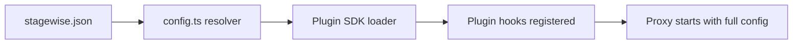

# Chapter 4: Configuration and Plugin Loading

Welcome to **Chapter 4: Configuration and Plugin Loading**. In this part of **Stagewise Tutorial: Frontend Coding Agent Workflows in Real Browser Context**, you will build an intuitive mental model first, then move into concrete implementation details and practical production tradeoffs.


`stagewise.json` governs ports, workspace behavior, and plugin loading strategy.

## Learning Goals

- configure Stagewise with stable project defaults
- control automatic and explicit plugin loading
- understand config precedence and overrides

## Example `stagewise.json`

```json
{
  "port": 3100,
  "appPort": 3000,
  "autoPlugins": true,
  "plugins": [
    "@stagewise/react-plugin",
    {
      "name": "custom-plugin",
      "path": "./plugins/custom-plugin/dist"
    }
  ]
}
```

## Precedence Order

1. command-line flags
2. `stagewise.json`
3. default values

## Source References

- [CLI Deep Dive](https://github.com/stagewise-io/stagewise/blob/main/apps/website/content/docs/advanced-usage/cli-deep-dive.mdx)
- [Install Plugins](https://github.com/stagewise-io/stagewise/blob/main/apps/website/content/docs/advanced-usage/install-plugins.mdx)

## Summary

You now have a configuration model for predictable per-project Stagewise behavior.

Next: [Chapter 5: Building Plugins with Plugin SDK](05-building-plugins-with-plugin-sdk.md)

## Source Code Walkthrough

Use the following upstream sources to verify configuration and plugin loading details while reading this chapter:

- [`apps/stagewise/src/config.ts`](https://github.com/stagewise-io/stagewise/blob/HEAD/apps/stagewise/src/) — resolves and validates the `stagewise.json` workspace config file, loading proxy settings, plugin declarations, and agent connection parameters.
- [`packages/stagewise-plugin-sdk/src/`](https://github.com/stagewise-io/stagewise/blob/HEAD/packages/stagewise-plugin-sdk/src/) — exports the plugin contract types and loader utilities used to discover and register plugins at startup.

Suggested trace strategy:
- trace config resolution to understand how `stagewise.json` fields map to runtime behavior (port, target URL, plugins array)
- review the plugin SDK loader to see how plugin module paths are resolved and their hooks registered
- check the startup sequence for the order in which config is read, plugins are loaded, and the proxy starts

## How These Components Connect

