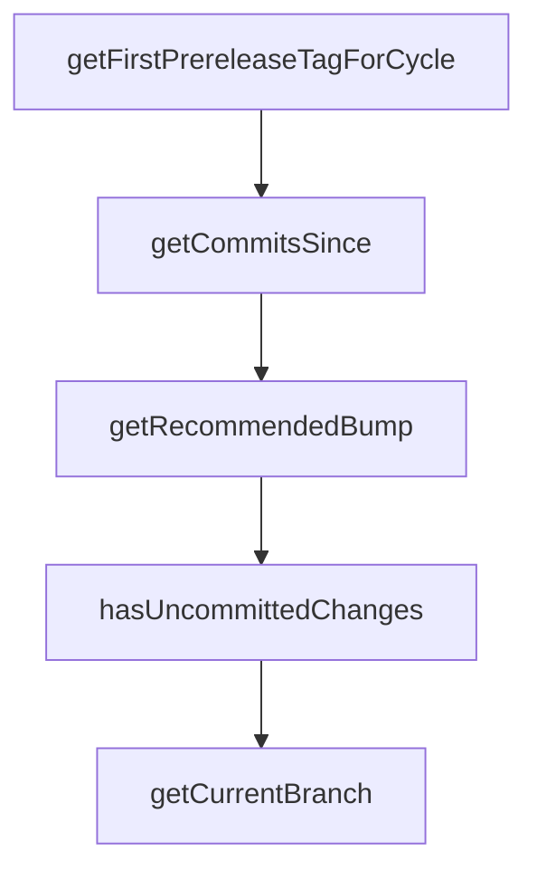

# Chapter 5: Building Plugins with Plugin SDK

Welcome to **Chapter 5: Building Plugins with Plugin SDK**. In this part of **Stagewise Tutorial: Frontend Coding Agent Workflows in Real Browser Context**, you will build an intuitive mental model first, then move into concrete implementation details and practical production tradeoffs.


Plugins let teams add custom toolbar UX and prompt behavior without forking the core project.

## Learning Goals

- scaffold plugin projects quickly
- implement the `ToolbarPlugin` contract
- test and load local plugins in Stagewise

## Fast Scaffold

```bash
npx create-stagewise-plugin
```

## Minimal Plugin Shape

```tsx
import type { ToolbarPlugin } from '@stagewise/toolbar';

const MyPlugin: ToolbarPlugin = {
  pluginName: 'my-plugin',
  displayName: 'My Plugin',
  description: 'Custom toolbar integration'
};

export default MyPlugin;
```

## Development Notes

- use local path loading for rapid iteration
- validate plugin behavior in a real app workspace
- keep plugin responsibilities narrow and composable

## Source References

- [Build Plugins Guide](https://github.com/stagewise-io/stagewise/blob/main/apps/website/content/docs/developer-guides/build-plugins.mdx)
- [Plugin SDK README](https://github.com/stagewise-io/stagewise/blob/main/toolbar/plugin-sdk/README.md)
- [Create Stagewise Plugin README](https://github.com/stagewise-io/stagewise/blob/main/packages/create-stagewise-plugin/README.md)

## Summary

You now know how to create and iterate on custom Stagewise plugins.

Next: [Chapter 6: Custom Agent Integrations with Agent Interface](06-custom-agent-integrations-with-agent-interface.md)

## Depth Expansion Playbook

## Source Code Walkthrough

### `scripts/release/git-utils.ts`

The `getFirstPrereleaseTagForCycle` function in [`scripts/release/git-utils.ts`](https://github.com/stagewise-io/stagewise/blob/HEAD/scripts/release/git-utils.ts) handles a key part of this chapter's functionality:

```ts
 * (i.e., the first alpha/beta tag with the same base version)
 */
export async function getFirstPrereleaseTagForCycle(
  prefix: string,
  baseVersion: string,
): Promise<string | null> {
  try {
    const { stdout } = await exec(
      `git tag --list "${prefix}${baseVersion}-*" --sort=version:refname | head -n 1`,
    );
    const tag = stdout.trim();
    return tag || null;
  } catch {
    return null;
  }
}

/**
 * Get all commits since a given tag (or all commits if no tag)
 */
export async function getCommitsSince(
  sinceTag: string | null,
  scope: string,
): Promise<ConventionalCommit[]> {
  const range = sinceTag ? `${sinceTag}..HEAD` : '';

  try {
    // Get commits with full details
    // Format: hash|subject|body using null byte as commit separator
    // (null bytes can't appear in commit messages)
    const { stdout } = await exec(
      `git log ${range} --format="%H|%s|%b%x00" --no-merges`,
```

This function is important because it defines how Stagewise Tutorial: Frontend Coding Agent Workflows in Real Browser Context implements the patterns covered in this chapter.

### `scripts/release/git-utils.ts`

The `getCommitsSince` function in [`scripts/release/git-utils.ts`](https://github.com/stagewise-io/stagewise/blob/HEAD/scripts/release/git-utils.ts) handles a key part of this chapter's functionality:

```ts
 * Get all commits since a given tag (or all commits if no tag)
 */
export async function getCommitsSince(
  sinceTag: string | null,
  scope: string,
): Promise<ConventionalCommit[]> {
  const range = sinceTag ? `${sinceTag}..HEAD` : '';

  try {
    // Get commits with full details
    // Format: hash|subject|body using null byte as commit separator
    // (null bytes can't appear in commit messages)
    const { stdout } = await exec(
      `git log ${range} --format="%H|%s|%b%x00" --no-merges`,
    );

    if (!stdout.trim()) {
      return [];
    }

    const commits: ConventionalCommit[] = [];

    // Split by null byte delimiter (end of each commit)
    const rawCommits = stdout.split('\0').filter((c) => c.trim());

    for (const rawCommit of rawCommits) {
      const parts = rawCommit.trim().split('|');
      if (parts.length < 2) continue;

      const hash = parts[0];
      const subject = parts[1];
      const body = parts.slice(2).join('|').trim() || null;
```

This function is important because it defines how Stagewise Tutorial: Frontend Coding Agent Workflows in Real Browser Context implements the patterns covered in this chapter.

### `scripts/release/git-utils.ts`

The `getRecommendedBump` function in [`scripts/release/git-utils.ts`](https://github.com/stagewise-io/stagewise/blob/HEAD/scripts/release/git-utils.ts) handles a key part of this chapter's functionality:

```ts
 * Get the recommended version bump based on commits
 */
export function getRecommendedBump(
  commits: ConventionalCommit[],
): 'major' | 'minor' | 'patch' | null {
  if (commits.length === 0) {
    return null;
  }

  // Check for breaking changes first
  if (commits.some((c) => c.breaking)) {
    return 'major';
  }

  // Check for features
  if (commits.some((c) => c.type === 'feat')) {
    return 'minor';
  }

  // Check for fixes or other changes
  if (commits.some((c) => ['fix', 'perf', 'refactor'].includes(c.type))) {
    return 'patch';
  }

  // For other types (docs, style, test, chore), return patch as fallback
  return 'patch';
}

/**
 * Check if there are any uncommitted changes
 */
export async function hasUncommittedChanges(): Promise<boolean> {
```

This function is important because it defines how Stagewise Tutorial: Frontend Coding Agent Workflows in Real Browser Context implements the patterns covered in this chapter.

### `scripts/release/git-utils.ts`

The `hasUncommittedChanges` function in [`scripts/release/git-utils.ts`](https://github.com/stagewise-io/stagewise/blob/HEAD/scripts/release/git-utils.ts) handles a key part of this chapter's functionality:

```ts
 * Check if there are any uncommitted changes
 */
export async function hasUncommittedChanges(): Promise<boolean> {
  try {
    const { stdout } = await exec('git status --porcelain');
    return stdout.trim().length > 0;
  } catch {
    return true;
  }
}

/**
 * Get the current branch name
 */
export async function getCurrentBranch(): Promise<string> {
  const { stdout } = await exec('git rev-parse --abbrev-ref HEAD');
  return stdout.trim();
}

/**
 * Create a git tag
 */
export async function createTag(
  tagName: string,
  message: string,
): Promise<void> {
  await exec(`git tag -a "${tagName}" -m "${message}"`);
}

/**
 * Push a tag to remote
 */
```

This function is important because it defines how Stagewise Tutorial: Frontend Coding Agent Workflows in Real Browser Context implements the patterns covered in this chapter.


## How These Components Connect


