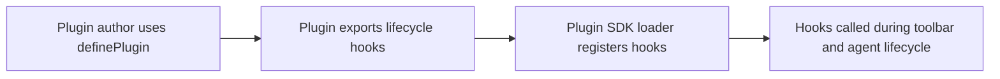

# Chapter 5: Building Plugins with Plugin SDK

Welcome to **Chapter 5: Building Plugins with Plugin SDK**. In this part of **Stagewise Tutorial: Frontend Coding Agent Workflows in Real Browser Context**, you will build an intuitive mental model first, then move into concrete implementation details and practical production tradeoffs.


Plugins let teams add custom toolbar UX and prompt behavior without forking the core project.

## Learning Goals

- scaffold plugin projects quickly
- implement the `ToolbarPlugin` contract
- test and load local plugins in Stagewise

## Fast Scaffold

```bash
npx create-stagewise-plugin
```

## Minimal Plugin Shape

```tsx
import type { ToolbarPlugin } from '@stagewise/toolbar';

const MyPlugin: ToolbarPlugin = {
  pluginName: 'my-plugin',
  displayName: 'My Plugin',
  description: 'Custom toolbar integration'
};

export default MyPlugin;
```

## Development Notes

- use local path loading for rapid iteration
- validate plugin behavior in a real app workspace
- keep plugin responsibilities narrow and composable

## Source References

- [Build Plugins Guide](https://github.com/stagewise-io/stagewise/blob/main/apps/website/content/docs/developer-guides/build-plugins.mdx)
- [Plugin SDK README](https://github.com/stagewise-io/stagewise/blob/main/toolbar/plugin-sdk/README.md)
- [Create Stagewise Plugin README](https://github.com/stagewise-io/stagewise/blob/main/packages/create-stagewise-plugin/README.md)

## Summary

You now know how to create and iterate on custom Stagewise plugins.

Next: [Chapter 6: Custom Agent Integrations with Agent Interface](06-custom-agent-integrations-with-agent-interface.md)

## Source Code Walkthrough

Use the following upstream sources to verify plugin SDK implementation details while reading this chapter:

- [`packages/stagewise-plugin-sdk/src/index.ts`](https://github.com/stagewise-io/stagewise/blob/HEAD/packages/stagewise-plugin-sdk/src/) — the main export of the plugin SDK, exposing the `definePlugin` factory, hook types, and context utilities that plugin authors use to extend toolbar behavior.
- [`packages/stagewise-plugin-sdk/src/types.ts`](https://github.com/stagewise-io/stagewise/blob/HEAD/packages/stagewise-plugin-sdk/src/) — defines the `PluginDefinition` interface and the full lifecycle hook contract including `onContextCapture`, `onPromptSend`, and `onAgentResponse`.

Suggested trace strategy:
- read `definePlugin` to understand the required and optional fields a plugin must export
- review the hook type definitions to understand what context data is available at each lifecycle stage
- look at example plugins in `examples/` if present to see how common patterns are implemented

## How These Components Connect

