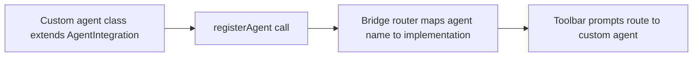

# Chapter 6: Custom Agent Integrations with Agent Interface

Welcome to **Chapter 6: Custom Agent Integrations with Agent Interface**. In this part of **Stagewise Tutorial: Frontend Coding Agent Workflows in Real Browser Context**, you will build an intuitive mental model first, then move into concrete implementation details and practical production tradeoffs.


Stagewise provides a dedicated interface for wiring custom agents while keeping toolbar protocol behavior stable.

## Learning Goals

- bootstrap a basic custom agent server
- manage availability and state transitions
- handle user messages and streamed responses

## Basic Server Bootstrap

```typescript
import { createAgentServer } from '@stagewise/agent-interface/agent';

const server = await createAgentServer();
server.interface.availability.set(true);
```

## Integration Responsibilities

| Responsibility | Description |
|:---------------|:------------|
| availability | report when agent can accept requests |
| state | communicate working/thinking/completed lifecycle |
| messaging | consume user context and send responses |
| cleanup | remove listeners and free resources |

## Source References

- [Build Custom Agent Integrations](https://github.com/stagewise-io/stagewise/blob/main/apps/website/content/docs/developer-guides/build-custom-agent-integrations.mdx)
- [Use Different Agents](https://github.com/stagewise-io/stagewise/blob/main/apps/website/content/docs/advanced-usage/use-different-agents.mdx)

## Summary

You now have an implementation map for connecting custom agents into Stagewise workflows.

Next: [Chapter 7: Troubleshooting, Security, and Operations](07-troubleshooting-security-and-operations.md)

## Source Code Walkthrough

Use the following upstream sources to verify custom agent integration details while reading this chapter:

- [`packages/agent-interface/src/index.ts`](https://github.com/stagewise-io/stagewise/blob/HEAD/packages/agent-interface/src/) — the root export of the agent interface package, defining the `AgentIntegration` abstract class and the `registerAgent` function used to wire a custom agent implementation into Stagewise.
- [`packages/agent-interface/src/types.ts`](https://github.com/stagewise-io/stagewise/blob/HEAD/packages/agent-interface/src/) — contains the full type surface for agent integrations including `AgentContext`, `AgentPrompt`, and the response streaming interface.

Suggested trace strategy:
- read `AgentIntegration` to understand the methods a custom agent must implement (`connect`, `sendPrompt`, `disconnect`)
- trace how `registerAgent` wires a custom implementation into the proxy bridge router
- compare against an existing bridge (e.g., Cursor bridge) to see a reference implementation pattern

## How These Components Connect

