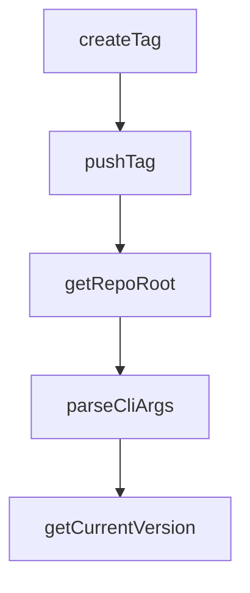

# Chapter 6: Custom Agent Integrations with Agent Interface

Welcome to **Chapter 6: Custom Agent Integrations with Agent Interface**. In this part of **Stagewise Tutorial: Frontend Coding Agent Workflows in Real Browser Context**, you will build an intuitive mental model first, then move into concrete implementation details and practical production tradeoffs.


Stagewise provides a dedicated interface for wiring custom agents while keeping toolbar protocol behavior stable.

## Learning Goals

- bootstrap a basic custom agent server
- manage availability and state transitions
- handle user messages and streamed responses

## Basic Server Bootstrap

```typescript
import { createAgentServer } from '@stagewise/agent-interface/agent';

const server = await createAgentServer();
server.interface.availability.set(true);
```

## Integration Responsibilities

| Responsibility | Description |
|:---------------|:------------|
| availability | report when agent can accept requests |
| state | communicate working/thinking/completed lifecycle |
| messaging | consume user context and send responses |
| cleanup | remove listeners and free resources |

## Source References

- [Build Custom Agent Integrations](https://github.com/stagewise-io/stagewise/blob/main/apps/website/content/docs/developer-guides/build-custom-agent-integrations.mdx)
- [Use Different Agents](https://github.com/stagewise-io/stagewise/blob/main/apps/website/content/docs/advanced-usage/use-different-agents.mdx)

## Summary

You now have an implementation map for connecting custom agents into Stagewise workflows.

Next: [Chapter 7: Troubleshooting, Security, and Operations](07-troubleshooting-security-and-operations.md)

## Depth Expansion Playbook

## Source Code Walkthrough

### `scripts/release/git-utils.ts`

The `createTag` function in [`scripts/release/git-utils.ts`](https://github.com/stagewise-io/stagewise/blob/HEAD/scripts/release/git-utils.ts) handles a key part of this chapter's functionality:

```ts
 * Create a git tag
 */
export async function createTag(
  tagName: string,
  message: string,
): Promise<void> {
  await exec(`git tag -a "${tagName}" -m "${message}"`);
}

/**
 * Push a tag to remote
 */
export async function pushTag(tagName: string): Promise<void> {
  await exec(`git push origin "${tagName}"`);
}

/**
 * Get the repo root directory
 */
export async function getRepoRoot(): Promise<string> {
  const { stdout } = await exec('git rev-parse --show-toplevel');
  return stdout.trim();
}

```

This function is important because it defines how Stagewise Tutorial: Frontend Coding Agent Workflows in Real Browser Context implements the patterns covered in this chapter.

### `scripts/release/git-utils.ts`

The `pushTag` function in [`scripts/release/git-utils.ts`](https://github.com/stagewise-io/stagewise/blob/HEAD/scripts/release/git-utils.ts) handles a key part of this chapter's functionality:

```ts
 * Push a tag to remote
 */
export async function pushTag(tagName: string): Promise<void> {
  await exec(`git push origin "${tagName}"`);
}

/**
 * Get the repo root directory
 */
export async function getRepoRoot(): Promise<string> {
  const { stdout } = await exec('git rev-parse --show-toplevel');
  return stdout.trim();
}

```

This function is important because it defines how Stagewise Tutorial: Frontend Coding Agent Workflows in Real Browser Context implements the patterns covered in this chapter.

### `scripts/release/git-utils.ts`

The `getRepoRoot` function in [`scripts/release/git-utils.ts`](https://github.com/stagewise-io/stagewise/blob/HEAD/scripts/release/git-utils.ts) handles a key part of this chapter's functionality:

```ts
 * Get the repo root directory
 */
export async function getRepoRoot(): Promise<string> {
  const { stdout } = await exec('git rev-parse --show-toplevel');
  return stdout.trim();
}

```

This function is important because it defines how Stagewise Tutorial: Frontend Coding Agent Workflows in Real Browser Context implements the patterns covered in this chapter.

### `scripts/release/index.ts`

The `parseCliArgs` function in [`scripts/release/index.ts`](https://github.com/stagewise-io/stagewise/blob/HEAD/scripts/release/index.ts) handles a key part of this chapter's functionality:

```ts
 * Parse command line arguments
 */
function parseCliArgs(): CLIOptions {
  const { values } = parseArgs({
    options: {
      package: { type: 'string', short: 'p' },
      channel: { type: 'string', short: 'c' },
      'dry-run': { type: 'boolean', default: false },
      'new-cycle': { type: 'boolean', default: false },
      since: { type: 'string', short: 's' },
      help: { type: 'boolean', short: 'h' },
    },
  });

  if (values.help) {
    console.log(`
Release CLI - Version bumping and changelog generation

Usage:
  pnpm tsx scripts/release/index.ts --package <name> [--channel <channel>] [--dry-run]

Options:
  -p, --package <name>     Package to release (${getAvailablePackageNames().join(', ')})
  -c, --channel <channel>  Release channel (alpha, beta, release)
  -s, --since <ref>        Git ref to start from (commit, tag, branch) for first releases
  --new-cycle              Abandon current prerelease and start fresh version cycle
  --dry-run                Preview changes without applying them
  -h, --help               Show this help message

Examples:
  pnpm tsx scripts/release/index.ts --package stagewise --channel beta
  pnpm tsx scripts/release/index.ts --package karton --channel release
```

This function is important because it defines how Stagewise Tutorial: Frontend Coding Agent Workflows in Real Browser Context implements the patterns covered in this chapter.


## How These Components Connect


