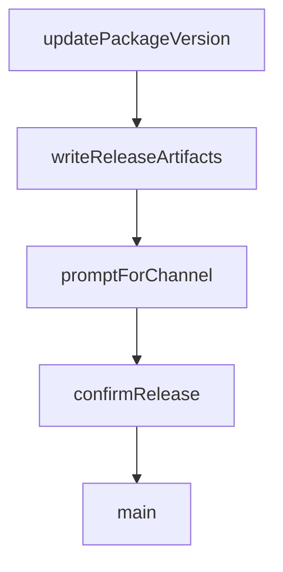

# Chapter 7: Troubleshooting, Security, and Operations

Welcome to **Chapter 7: Troubleshooting, Security, and Operations**. In this part of **Stagewise Tutorial: Frontend Coding Agent Workflows in Real Browser Context**, you will build an intuitive mental model first, then move into concrete implementation details and practical production tradeoffs.


This chapter covers practical operational concerns: common runtime failures, security boundaries, and production-minded usage.

## Learning Goals

- diagnose common integration and prompt-delivery failures
- apply safe operating boundaries for workspace edits
- define team-level operational controls

## Common Failure Modes

| Symptom | Likely Cause | First Fix |
|:--------|:-------------|:----------|
| prompt not received in IDE | wrong or duplicate IDE target | close extra sessions and retry |
| toolbar fails in SSH WSL remote flow | unsupported remote access pattern | run on local host workflow |
| edits target wrong repo | Stagewise not started in app root | relaunch from correct workspace |

## Security and Safety Controls

- run Stagewise only in trusted local workspaces
- keep source control and CI checks mandatory before merge
- use bridge mode intentionally when delegating to external agents

## Source References

- [Common Issues](https://github.com/stagewise-io/stagewise/blob/main/apps/website/content/docs/troubleshooting/common-issues.mdx)
- [CLI Deep Dive](https://github.com/stagewise-io/stagewise/blob/main/apps/website/content/docs/advanced-usage/cli-deep-dive.mdx)

## Summary

You now have a troubleshooting and operations baseline for reliable Stagewise sessions.

Next: [Chapter 8: Contribution Workflow and Ecosystem Evolution](08-contribution-workflow-and-ecosystem-evolution.md)

## Depth Expansion Playbook

## Source Code Walkthrough

### `scripts/release/index.ts`

The `updatePackageVersion` function in [`scripts/release/index.ts`](https://github.com/stagewise-io/stagewise/blob/HEAD/scripts/release/index.ts) handles a key part of this chapter's functionality:

```ts
 * Update package.json version
 */
async function updatePackageVersion(
  packageConfig: PackageConfig,
  newVersion: string,
): Promise<void> {
  const repoRoot = await getRepoRoot();
  const packageJsonPath = path.join(repoRoot, packageConfig.path);
  const content = await readFile(packageJsonPath, 'utf-8');
  const pkg = JSON.parse(content);
  pkg.version = newVersion;
  await writeFile(
    packageJsonPath,
    `${JSON.stringify(pkg, null, 2)}\n`,
    'utf-8',
  );
}

/**
 * Write release artifacts for CI
 */
async function writeReleaseArtifacts(
  version: string,
  tag: string,
  releaseNotes: string,
): Promise<void> {
  const repoRoot = await getRepoRoot();
  await writeFile(path.join(repoRoot, '.release-version'), version, 'utf-8');
  await writeFile(path.join(repoRoot, '.release-tag'), tag, 'utf-8');
  await writeFile(
    path.join(repoRoot, '.release-notes.md'),
    releaseNotes,
```

This function is important because it defines how Stagewise Tutorial: Frontend Coding Agent Workflows in Real Browser Context implements the patterns covered in this chapter.

### `scripts/release/index.ts`

The `writeReleaseArtifacts` function in [`scripts/release/index.ts`](https://github.com/stagewise-io/stagewise/blob/HEAD/scripts/release/index.ts) handles a key part of this chapter's functionality:

```ts
 * Write release artifacts for CI
 */
async function writeReleaseArtifacts(
  version: string,
  tag: string,
  releaseNotes: string,
): Promise<void> {
  const repoRoot = await getRepoRoot();
  await writeFile(path.join(repoRoot, '.release-version'), version, 'utf-8');
  await writeFile(path.join(repoRoot, '.release-tag'), tag, 'utf-8');
  await writeFile(
    path.join(repoRoot, '.release-notes.md'),
    releaseNotes,
    'utf-8',
  );
}

/**
 * Prompt user to select a channel interactively
 */
async function promptForChannel(
  currentVersion: string,
  bumpType: 'patch' | 'minor' | 'major',
): Promise<ReleaseChannel> {
  const possibleVersions = getPossibleNextVersions(currentVersion, bumpType);
  const parsed = parseVersion(currentVersion);

  console.log('\nSelect release channel:');

  // Filter available channels based on current version
  const availableChannels = VALID_CHANNELS.filter((channel) =>
    isValidChannelTransition(parsed.prerelease, channel),
```

This function is important because it defines how Stagewise Tutorial: Frontend Coding Agent Workflows in Real Browser Context implements the patterns covered in this chapter.

### `scripts/release/index.ts`

The `promptForChannel` function in [`scripts/release/index.ts`](https://github.com/stagewise-io/stagewise/blob/HEAD/scripts/release/index.ts) handles a key part of this chapter's functionality:

```ts
 * Prompt user to select a channel interactively
 */
async function promptForChannel(
  currentVersion: string,
  bumpType: 'patch' | 'minor' | 'major',
): Promise<ReleaseChannel> {
  const possibleVersions = getPossibleNextVersions(currentVersion, bumpType);
  const parsed = parseVersion(currentVersion);

  console.log('\nSelect release channel:');

  // Filter available channels based on current version
  const availableChannels = VALID_CHANNELS.filter((channel) =>
    isValidChannelTransition(parsed.prerelease, channel),
  );

  for (const [i, channel] of availableChannels.entries()) {
    const version = possibleVersions[channel];
    console.log(`  ${i + 1}. ${channel} -> ${version}`);
  }

  const rl = readline.createInterface({
    input: process.stdin,
    output: process.stdout,
  });

  return new Promise((resolve) => {
    rl.question(
      `\nEnter choice (1-${availableChannels.length}): `,
      (answer) => {
        rl.close();
        const choice = Number.parseInt(answer, 10) - 1;
```

This function is important because it defines how Stagewise Tutorial: Frontend Coding Agent Workflows in Real Browser Context implements the patterns covered in this chapter.

### `scripts/release/index.ts`

The `confirmRelease` function in [`scripts/release/index.ts`](https://github.com/stagewise-io/stagewise/blob/HEAD/scripts/release/index.ts) handles a key part of this chapter's functionality:

```ts
 * Confirm release with user
 */
async function confirmRelease(): Promise<boolean> {
  const rl = readline.createInterface({
    input: process.stdin,
    output: process.stdout,
  });

  return new Promise((resolve) => {
    rl.question('\nProceed with release? (y/N): ', (answer) => {
      rl.close();
      resolve(answer.toLowerCase() === 'y');
    });
  });
}

/**
 * Main release flow
 */
async function main(): Promise<void> {
  const options = parseCliArgs();

  // Get package config
  const packageConfig = getPackageConfig(options.package);
  if (!packageConfig) {
    console.error(`Error: Unknown package "${options.package}"`);
    console.error(
      `Available packages: ${getAvailablePackageNames().join(', ')}`,
    );
    process.exit(1);
  }

```

This function is important because it defines how Stagewise Tutorial: Frontend Coding Agent Workflows in Real Browser Context implements the patterns covered in this chapter.


## How These Components Connect


