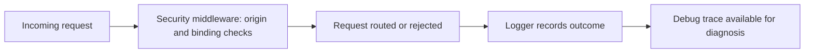

# Chapter 7: Troubleshooting, Security, and Operations

Welcome to **Chapter 7: Troubleshooting, Security, and Operations**. In this part of **Stagewise Tutorial: Frontend Coding Agent Workflows in Real Browser Context**, you will build an intuitive mental model first, then move into concrete implementation details and practical production tradeoffs.

This chapter covers practical operational concerns: common runtime failures, security boundaries, and production-minded usage.

## Learning Goals

- diagnose common integration and prompt-delivery failures
- apply safe operating boundaries for workspace edits
- define team-level operational controls

## Common Failure Modes

| Symptom | Likely Cause | First Fix |
|:--------|:-------------|:----------|
| prompt not received in IDE | wrong or duplicate IDE target | close extra sessions and retry |
| toolbar fails in SSH WSL remote flow | unsupported remote access pattern | run on local host workflow |
| edits target wrong repo | Stagewise not started in app root | relaunch from correct workspace |

## Security and Safety Controls

- run Stagewise only in trusted local workspaces
- keep source control and CI checks mandatory before merge
- use bridge mode intentionally when delegating to external agents

## Source References

- [Common Issues](https://github.com/stagewise-io/stagewise/blob/main/apps/website/content/docs/troubleshooting/common-issues.mdx)
- [CLI Deep Dive](https://github.com/stagewise-io/stagewise/blob/main/apps/website/content/docs/advanced-usage/cli-deep-dive.mdx)

## Summary

You now have a troubleshooting and operations baseline for reliable Stagewise sessions.

Next: [Chapter 8: Contribution Workflow and Ecosystem Evolution](08-contribution-workflow-and-ecosystem-evolution.md)

## Source Code Walkthrough

Use the following upstream sources to verify troubleshooting, security, and operations details while reading this chapter:

- [`apps/stagewise/src/proxy/middleware/`](https://github.com/stagewise-io/stagewise/blob/HEAD/apps/stagewise/src/) — proxy middleware layer where security controls such as localhost-only binding, header validation, and request origin checks are implemented.
- [`apps/stagewise/src/logger.ts`](https://github.com/stagewise-io/stagewise/blob/HEAD/apps/stagewise/src/) — the structured logger used across the proxy and agent bridge, outputting debug traces that are essential for diagnosing connection failures and plugin errors.

Suggested trace strategy:
- review the middleware stack to identify which security boundaries are enforced at the proxy layer vs. the agent layer
- trace the logger output levels to understand how to increase verbosity (`--debug` flag) for incident diagnosis
- check the error handling paths in the proxy entry point to see how startup failures are surfaced to the operator

## How These Components Connect

