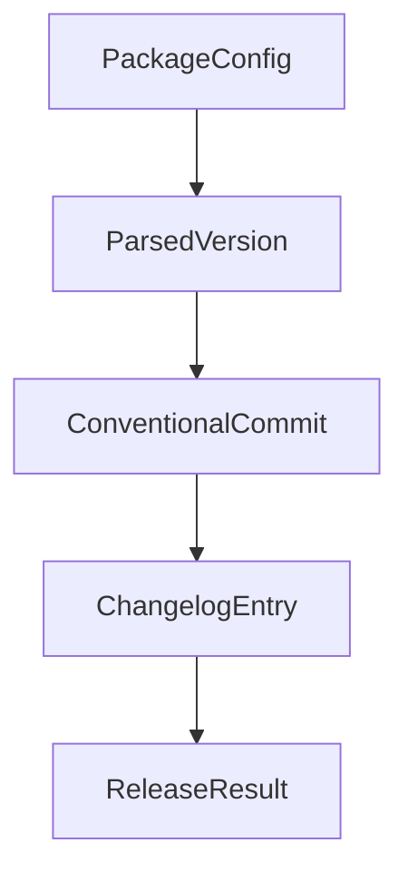

# Chapter 8: Contribution Workflow and Ecosystem Evolution

Welcome to **Chapter 8: Contribution Workflow and Ecosystem Evolution**. In this part of **Stagewise Tutorial: Frontend Coding Agent Workflows in Real Browser Context**, you will build an intuitive mental model first, then move into concrete implementation details and practical production tradeoffs.


Stagewise is an active monorepo with clear contribution mechanics and a growing frontend-agent ecosystem.

## Learning Goals

- understand contribution flow and monorepo structure
- run development commands for local contribution
- align roadmap decisions with plugin and agent ecosystem growth

## Contribution Baseline

```bash
pnpm install
pnpm dev
pnpm build
pnpm lint
pnpm test
```

## Monorepo Contribution Areas

| Area | Focus |
|:-----|:------|
| `apps/` | website, CLI, and VS Code extension surfaces |
| `plugins/` and `toolbar/` | framework adapters and UI runtime |
| `agent/` | integration interfaces and runtime components |
| `examples/` | reference implementations across frameworks |

## Source References

- [Contributing Guide](https://github.com/stagewise-io/stagewise/blob/main/CONTRIBUTING.md)
- [Developer Contribution Guidelines](https://github.com/stagewise-io/stagewise/blob/main/apps/website/content/docs/developer-guides/contribution-guidelines.mdx)
- [Repository](https://github.com/stagewise-io/stagewise)

## Summary

You now have an end-to-end model for adopting, extending, and contributing to Stagewise in production frontend environments.

Next: connect this flow with [VibeSDK](../vibesdk-tutorial/) and [OpenCode](../opencode-tutorial/).

## Depth Expansion Playbook

## Source Code Walkthrough

### `scripts/release/types.ts`

The `PackageConfig` interface in [`scripts/release/types.ts`](https://github.com/stagewise-io/stagewise/blob/HEAD/scripts/release/types.ts) handles a key part of this chapter's functionality:

```ts
export type VersionBump = 'patch' | 'minor' | 'major';

export interface PackageConfig {
  /** Short name for the package (used in CLI) */
  name: string;
  /** Path to package.json relative to repo root */
  path: string;
  /** Commit scope(s) that map to this package */
  scope: string;
  /** Whether to publish to npm registry */
  publishToNpm: boolean;
  /** Whether to create GitHub release */
  createGithubRelease: boolean;
  /** Git tag prefix (e.g., "stagewise@", "@stagewise/karton@") */
  tagPrefix: string;
  /** Whether prerelease channels (alpha/beta) are enabled. Default: true */
  prereleaseEnabled?: boolean;
}

export interface ParsedVersion {
  /** Full version string (e.g., "1.0.0-alpha.1") */
  full: string;
  /** Major version number */
  major: number;
  /** Minor version number */
  minor: number;
  /** Patch version number */
  patch: number;
  /** Prerelease channel (alpha, beta) or null for release */
  prerelease: ReleaseChannel | null;
  /** Prerelease number (e.g., 1 in "alpha.1") or null */
  prereleaseNum: number | null;
```

This interface is important because it defines how Stagewise Tutorial: Frontend Coding Agent Workflows in Real Browser Context implements the patterns covered in this chapter.

### `scripts/release/types.ts`

The `ParsedVersion` interface in [`scripts/release/types.ts`](https://github.com/stagewise-io/stagewise/blob/HEAD/scripts/release/types.ts) handles a key part of this chapter's functionality:

```ts
}

export interface ParsedVersion {
  /** Full version string (e.g., "1.0.0-alpha.1") */
  full: string;
  /** Major version number */
  major: number;
  /** Minor version number */
  minor: number;
  /** Patch version number */
  patch: number;
  /** Prerelease channel (alpha, beta) or null for release */
  prerelease: ReleaseChannel | null;
  /** Prerelease number (e.g., 1 in "alpha.1") or null */
  prereleaseNum: number | null;
  /** Base version without prerelease (e.g., "1.0.0") */
  base: string;
}

export interface ConventionalCommit {
  /** Full commit hash */
  hash: string;
  /** Short commit hash (7 chars) */
  shortHash: string;
  /** Commit type (feat, fix, etc.) */
  type: string;
  /** Commit scope */
  scope: string | null;
  /** Commit subject/description */
  subject: string;
  /** Commit body */
  body: string | null;
```

This interface is important because it defines how Stagewise Tutorial: Frontend Coding Agent Workflows in Real Browser Context implements the patterns covered in this chapter.

### `scripts/release/types.ts`

The `ConventionalCommit` interface in [`scripts/release/types.ts`](https://github.com/stagewise-io/stagewise/blob/HEAD/scripts/release/types.ts) handles a key part of this chapter's functionality:

```ts
}

export interface ConventionalCommit {
  /** Full commit hash */
  hash: string;
  /** Short commit hash (7 chars) */
  shortHash: string;
  /** Commit type (feat, fix, etc.) */
  type: string;
  /** Commit scope */
  scope: string | null;
  /** Commit subject/description */
  subject: string;
  /** Commit body */
  body: string | null;
  /** Whether this is a breaking change */
  breaking: boolean;
  /** Breaking change description if present */
  breakingDescription: string | null;
}

export interface ChangelogEntry {
  /** Version string */
  version: string;
  /** Release date (YYYY-MM-DD) */
  date: string;
  /** Features added */
  features: ConventionalCommit[];
  /** Bug fixes */
  fixes: ConventionalCommit[];
  /** Breaking changes */
  breaking: ConventionalCommit[];
```

This interface is important because it defines how Stagewise Tutorial: Frontend Coding Agent Workflows in Real Browser Context implements the patterns covered in this chapter.

### `scripts/release/types.ts`

The `ChangelogEntry` interface in [`scripts/release/types.ts`](https://github.com/stagewise-io/stagewise/blob/HEAD/scripts/release/types.ts) handles a key part of this chapter's functionality:

```ts
}

export interface ChangelogEntry {
  /** Version string */
  version: string;
  /** Release date (YYYY-MM-DD) */
  date: string;
  /** Features added */
  features: ConventionalCommit[];
  /** Bug fixes */
  fixes: ConventionalCommit[];
  /** Breaking changes */
  breaking: ConventionalCommit[];
  /** Other changes (refactor, perf, etc.) */
  other: ConventionalCommit[];
}

export interface ReleaseResult {
  /** The new version string */
  version: string;
  /** Git tag name */
  tag: string;
  /** Generated changelog markdown */
  changelog: string;
  /** Whether this was a dry run */
  dryRun: boolean;
}

export interface CLIOptions {
  /** Package name to release */
  package: string;
  /** Target release channel */
```

This interface is important because it defines how Stagewise Tutorial: Frontend Coding Agent Workflows in Real Browser Context implements the patterns covered in this chapter.


## How These Components Connect


