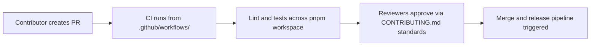

# Chapter 8: Contribution Workflow and Ecosystem Evolution

Welcome to **Chapter 8: Contribution Workflow and Ecosystem Evolution**. In this part of **Stagewise Tutorial: Frontend Coding Agent Workflows in Real Browser Context**, you will build an intuitive mental model first, then move into concrete implementation details and practical production tradeoffs.


Stagewise is an active monorepo with clear contribution mechanics and a growing frontend-agent ecosystem.

## Learning Goals

- understand contribution flow and monorepo structure
- run development commands for local contribution
- align roadmap decisions with plugin and agent ecosystem growth

## Contribution Baseline

```bash
pnpm install
pnpm dev
pnpm build
pnpm lint
pnpm test
```

## Monorepo Contribution Areas

| Area | Focus |
|:-----|:------|
| `apps/` | website, CLI, and VS Code extension surfaces |
| `plugins/` and `toolbar/` | framework adapters and UI runtime |
| `agent/` | integration interfaces and runtime components |
| `examples/` | reference implementations across frameworks |

## Source References

- [Contributing Guide](https://github.com/stagewise-io/stagewise/blob/main/CONTRIBUTING.md)
- [Developer Contribution Guidelines](https://github.com/stagewise-io/stagewise/blob/main/apps/website/content/docs/developer-guides/contribution-guidelines.mdx)
- [Repository](https://github.com/stagewise-io/stagewise)

## Summary

You now have an end-to-end model for adopting, extending, and contributing to Stagewise in production frontend environments.

Next: connect this flow with [VibeSDK](../vibesdk-tutorial/) and [OpenCode](../opencode-tutorial/).

## Source Code Walkthrough

Use the following upstream sources to verify contribution workflow and ecosystem evolution details while reading this chapter:

- [`CONTRIBUTING.md`](https://github.com/stagewise-io/stagewise/blob/HEAD/CONTRIBUTING.md) — the official contributor guide covering branch strategy, PR requirements, commit conventions, and the review process for the Stagewise monorepo.
- [`pnpm-workspace.yaml`](https://github.com/stagewise-io/stagewise/blob/HEAD/pnpm-workspace.yaml) — defines the monorepo workspace structure, which packages are published, and the dependency graph that contributors must keep in sync when adding new packages.

Suggested trace strategy:
- read the contribution guide for the commit message format and the CI checks that run on every PR
- review `pnpm-workspace.yaml` to understand the relationship between `apps/`, `packages/`, and `toolbars/`
- check `.github/workflows/` for the CI pipeline steps to know what tests and lint checks must pass before merge

## How These Components Connect

