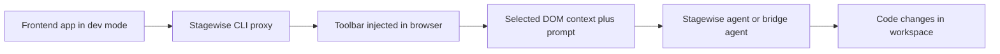

# Stagewise Tutorial: Frontend Coding Agent Workflows in Real Browser Context

> Learn how to use `stagewise-io/stagewise` to connect browser-selected UI context with coding agents, plugin extensions, and multi-agent bridge workflows.

## Why This Track Matters

Stagewise addresses a common pain in frontend AI coding: translating visual UI context into precise prompts and edits. Its browser toolbar, CLI proxy, bridge mode, and plugin system provide a strong architecture for production frontend workflows.

This track focuses on:

- running Stagewise quickly in active frontend projects
- understanding proxy + toolbar + agent bridge architecture
- extending behavior with plugins and custom agent integrations
- operating troubleshooting and contribution workflows in a monorepo environment

## Current Snapshot (Verified February 12, 2026)

- repository: [`stagewise-io/stagewise`](https://github.com/stagewise-io/stagewise)
- stars: about **6.5k**
- latest release: [`stagewise-vscode-extension@0.11.4`](https://github.com/stagewise-io/stagewise/releases/tag/stagewise-vscode-extension%400.11.4) (**November 28, 2025**)
- recent activity: updated on **February 12, 2026**
- positioning: frontend coding agent platform with browser context selection, CLI proxy, and open agent/plugin interfaces

## Mental Model

## Chapter Guide

| Chapter | Key Question | Outcome |
|:--------|:-------------|:--------|
| [01 - Getting Started and CLI Bootstrap](01-getting-started-and-cli-bootstrap.md) | How do I run Stagewise correctly in a real project? | Working baseline |
| [02 - Proxy and Toolbar Architecture](02-proxy-and-toolbar-architecture.md) | How does Stagewise wrap and augment a running frontend app? | Strong runtime model |
| [03 - Bridge Mode and Multi-Agent Integrations](03-bridge-mode-and-multi-agent-integrations.md) | How does Stagewise connect to Cursor, Copilot, and other agents? | Flexible agent strategy |
| [04 - Configuration and Plugin Loading](04-configuration-and-plugin-loading.md) | How does `stagewise.json` and plugin loading affect behavior? | Reliable workspace config |
| [05 - Building Plugins with Plugin SDK](05-building-plugins-with-plugin-sdk.md) | How do teams extend toolbar capabilities? | Extensibility baseline |
| [06 - Custom Agent Integrations with Agent Interface](06-custom-agent-integrations-with-agent-interface.md) | How do we wire custom agents into Stagewise? | Integration capability |
| [07 - Troubleshooting, Security, and Operations](07-troubleshooting-security-and-operations.md) | What are common failure modes and ops controls? | Better runbook readiness |
| [08 - Contribution Workflow and Ecosystem Evolution](08-contribution-workflow-and-ecosystem-evolution.md) | How do teams contribute and scale Stagewise adoption? | Long-term ownership model |

## What You Will Learn

- how to run Stagewise in root-correct workspace and proxy mode
- how to combine browser context selection with coding-agent workflows
- how to extend Stagewise via plugin and agent integration APIs
- how to operate and troubleshoot Stagewise in production-like frontend environments

## Source References

- [Stagewise Repository](https://github.com/stagewise-io/stagewise)
- [Root README](https://github.com/stagewise-io/stagewise/blob/main/README.md)
- [Docs Home](https://stagewise.io/docs)
- [CLI Deep Dive](https://github.com/stagewise-io/stagewise/blob/main/apps/website/content/docs/advanced-usage/cli-deep-dive.mdx)
- [Use Different Agents](https://github.com/stagewise-io/stagewise/blob/main/apps/website/content/docs/advanced-usage/use-different-agents.mdx)
- [Install Plugins](https://github.com/stagewise-io/stagewise/blob/main/apps/website/content/docs/advanced-usage/install-plugins.mdx)
- [Build Plugins](https://github.com/stagewise-io/stagewise/blob/main/apps/website/content/docs/developer-guides/build-plugins.mdx)
- [Build Custom Agent Integrations](https://github.com/stagewise-io/stagewise/blob/main/apps/website/content/docs/developer-guides/build-custom-agent-integrations.mdx)
- [Troubleshooting](https://github.com/stagewise-io/stagewise/blob/main/apps/website/content/docs/troubleshooting/common-issues.mdx)

## Related Tutorials

- [OpenCode Tutorial](../opencode-tutorial/)
- [Tabby Tutorial](../tabby-tutorial/)
- [Sweep Tutorial](../sweep-tutorial/)
- [VibeSDK Tutorial](../vibesdk-tutorial/)

---

Start with [Chapter 1: Getting Started and CLI Bootstrap](01-getting-started-and-cli-bootstrap.md).
