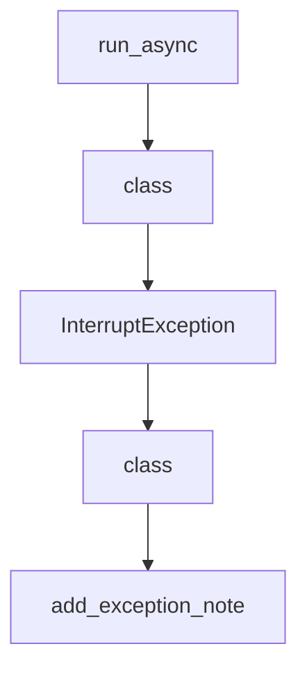

# Chapter 1: Getting Started

Welcome to **Chapter 1: Getting Started**. In this part of **Strands Agents Tutorial: Model-Driven Agent Systems with Native MCP Support**, you will build an intuitive mental model first, then move into concrete implementation details and practical production tradeoffs.


This chapter gets a first Strands agent running with minimal setup.

## Learning Goals

- install Strands SDK and companion tools package
- run a first tool-enabled agent call
- establish a clean local development loop
- avoid common setup mistakes

## Quick Setup Pattern

```bash
python -m venv .venv
source .venv/bin/activate
pip install strands-agents strands-agents-tools
```

Minimal usage:

```python
from strands import Agent
from strands_tools import calculator

agent = Agent(tools=[calculator])
agent("What is the square root of 1764?")
```

## Source References

- [Strands README: Quick Start](https://github.com/strands-agents/sdk-python#quick-start)
- [Strands Python Quickstart Docs](https://strandsagents.com/latest/documentation/docs/user-guide/quickstart/python/)

## Summary

You now have Strands installed with a working first invocation.

Next: [Chapter 2: Agent Loop and Model-Driven Architecture](02-agent-loop-and-model-driven-architecture.md)

## Depth Expansion Playbook

## Source Code Walkthrough

### `src/strands/_async.py`

The `run_async` function in [`src/strands/_async.py`](https://github.com/strands-agents/sdk-python/blob/HEAD/src/strands/_async.py) handles a key part of this chapter's functionality:

```py


def run_async(async_func: Callable[[], Awaitable[T]]) -> T:
    """Run an async function in a separate thread to avoid event loop conflicts.

    This utility handles the common pattern of running async code from sync contexts
    by using ThreadPoolExecutor to isolate the async execution.

    Args:
        async_func: A callable that returns an awaitable

    Returns:
        The result of the async function
    """

    async def execute_async() -> T:
        return await async_func()

    def execute() -> T:
        return asyncio.run(execute_async())

    with ThreadPoolExecutor() as executor:
        context = contextvars.copy_context()
        future = executor.submit(context.run, execute)
        return future.result()

```

This function is important because it defines how Strands Agents Tutorial: Model-Driven Agent Systems with Native MCP Support implements the patterns covered in this chapter.

### `src/strands/interrupt.py`

The `class` class in [`src/strands/interrupt.py`](https://github.com/strands-agents/sdk-python/blob/HEAD/src/strands/interrupt.py) handles a key part of this chapter's functionality:

```py
"""Human-in-the-loop interrupt system for agent workflows."""

from dataclasses import asdict, dataclass, field
from typing import TYPE_CHECKING, Any, cast

if TYPE_CHECKING:
    from .types.agent import AgentInput
    from .types.interrupt import InterruptResponseContent


@dataclass
class Interrupt:
    """Represents an interrupt that can pause agent execution for human-in-the-loop workflows.

    Attributes:
        id: Unique identifier.
        name: User defined name.
        reason: User provided reason for raising the interrupt.
        response: Human response provided when resuming the agent after an interrupt.
    """

    id: str
    name: str
    reason: Any = None
    response: Any = None

    def to_dict(self) -> dict[str, Any]:
        """Serialize to dict for session management."""
        return asdict(self)


class InterruptException(Exception):
```

This class is important because it defines how Strands Agents Tutorial: Model-Driven Agent Systems with Native MCP Support implements the patterns covered in this chapter.

### `src/strands/interrupt.py`

The `InterruptException` class in [`src/strands/interrupt.py`](https://github.com/strands-agents/sdk-python/blob/HEAD/src/strands/interrupt.py) handles a key part of this chapter's functionality:

```py


class InterruptException(Exception):
    """Exception raised when human input is required."""

    def __init__(self, interrupt: Interrupt) -> None:
        """Set the interrupt."""
        self.interrupt = interrupt


@dataclass
class _InterruptState:
    """Track the state of interrupt events raised by the user.

    Note, interrupt state is cleared after resuming.

    Attributes:
        interrupts: Interrupts raised by the user.
        context: Additional context associated with an interrupt event.
        activated: True if agent is in an interrupt state, False otherwise.
    """

    interrupts: dict[str, Interrupt] = field(default_factory=dict)
    context: dict[str, Any] = field(default_factory=dict)
    activated: bool = False
    _version: int = field(default=0, compare=False, repr=False)

    def activate(self) -> None:
        """Activate the interrupt state."""
        self.activated = True
        self._version += 1

```

This class is important because it defines how Strands Agents Tutorial: Model-Driven Agent Systems with Native MCP Support implements the patterns covered in this chapter.

### `src/strands/interrupt.py`

The `class` class in [`src/strands/interrupt.py`](https://github.com/strands-agents/sdk-python/blob/HEAD/src/strands/interrupt.py) handles a key part of this chapter's functionality:

```py
"""Human-in-the-loop interrupt system for agent workflows."""

from dataclasses import asdict, dataclass, field
from typing import TYPE_CHECKING, Any, cast

if TYPE_CHECKING:
    from .types.agent import AgentInput
    from .types.interrupt import InterruptResponseContent


@dataclass
class Interrupt:
    """Represents an interrupt that can pause agent execution for human-in-the-loop workflows.

    Attributes:
        id: Unique identifier.
        name: User defined name.
        reason: User provided reason for raising the interrupt.
        response: Human response provided when resuming the agent after an interrupt.
    """

    id: str
    name: str
    reason: Any = None
    response: Any = None

    def to_dict(self) -> dict[str, Any]:
        """Serialize to dict for session management."""
        return asdict(self)


class InterruptException(Exception):
```

This class is important because it defines how Strands Agents Tutorial: Model-Driven Agent Systems with Native MCP Support implements the patterns covered in this chapter.


## How These Components Connect


