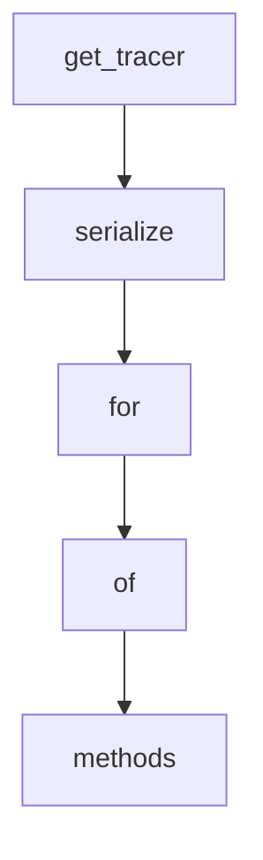

# Chapter 2: Agent Loop and Model-Driven Architecture

Welcome to **Chapter 2: Agent Loop and Model-Driven Architecture**. In this part of **Strands Agents Tutorial: Model-Driven Agent Systems with Native MCP Support**, you will build an intuitive mental model first, then move into concrete implementation details and practical production tradeoffs.


This chapter explains why Strands is described as model-driven and how that affects design choices.

## Learning Goals

- understand the core agent loop model
- map model reasoning to tool invocation behavior
- identify extension points for custom logic
- preserve simplicity while adding capability

## Architecture Notes

- the agent loop is intentionally lightweight
- models drive decision-making while tools execute capabilities
- APIs emphasize composable primitives instead of heavy framework layers

## Source References

- [Strands README](https://github.com/strands-agents/sdk-python)
- [Strands Agent Loop Docs](https://strandsagents.com/latest/documentation/docs/user-guide/concepts/agents/agent-loop/)
- [Strands Agent API Reference](https://strandsagents.com/latest/documentation/docs/api-reference/python/agent/agent/)

## Summary

You now have the foundation to design Strands agents with clearer tradeoff awareness.

Next: [Chapter 3: Tools and MCP Integration](03-tools-and-mcp-integration.md)

## Depth Expansion Playbook

## Source Code Walkthrough

### `src/strands/telemetry/tracer.py`

The `get_tracer` function in [`src/strands/telemetry/tracer.py`](https://github.com/strands-agents/sdk-python/blob/HEAD/src/strands/telemetry/tracer.py) handles a key part of this chapter's functionality:

```py
        self.service_name = __name__
        self.tracer_provider: trace_api.TracerProvider | None = None
        self.tracer_provider = trace_api.get_tracer_provider()
        self.tracer = self.tracer_provider.get_tracer(self.service_name)
        ThreadingInstrumentor().instrument()

        # Read OTEL_SEMCONV_STABILITY_OPT_IN environment variable
        opt_in_values = self._parse_semconv_opt_in()
        ## To-do: should not set below attributes directly, use env var instead
        self.use_latest_genai_conventions = "gen_ai_latest_experimental" in opt_in_values
        self._include_tool_definitions = "gen_ai_tool_definitions" in opt_in_values

    def _parse_semconv_opt_in(self) -> set[str]:
        """Parse the OTEL_SEMCONV_STABILITY_OPT_IN environment variable.

        Returns:
            A set of opt-in values from the environment variable.
        """
        opt_in_env = os.getenv("OTEL_SEMCONV_STABILITY_OPT_IN", "")
        return {value.strip() for value in opt_in_env.split(",")}

    @property
    def is_langfuse(self) -> bool:
        """Check if Langfuse is configured as the OTLP endpoint.

        Returns:
            True if Langfuse is the OTLP endpoint, False otherwise.
        """
        return any(
            "langfuse" in os.getenv(var, "")
            for var in ("OTEL_EXPORTER_OTLP_ENDPOINT", "OTEL_EXPORTER_OTLP_TRACES_ENDPOINT", "LANGFUSE_BASE_URL")
        )
```

This function is important because it defines how Strands Agents Tutorial: Model-Driven Agent Systems with Native MCP Support implements the patterns covered in this chapter.

### `src/strands/telemetry/tracer.py`

The `serialize` function in [`src/strands/telemetry/tracer.py`](https://github.com/strands-agents/sdk-python/blob/HEAD/src/strands/telemetry/tracer.py) handles a key part of this chapter's functionality:

```py
                "gen_ai.client.inference.operation.details",
                {
                    "gen_ai.output.messages": serialize(
                        [
                            {
                                "role": message["role"],
                                "parts": self._map_content_blocks_to_otel_parts(message["content"]),
                                "finish_reason": str(stop_reason),
                            }
                        ]
                    ),
                },
                to_span_attributes=self.is_langfuse,
            )
        else:
            self._add_event(
                span,
                "gen_ai.choice",
                event_attributes={"finish_reason": str(stop_reason), "message": serialize(message["content"])},
            )

        span.set_attributes(attributes)

    def start_tool_call_span(
        self,
        tool: ToolUse,
        parent_span: Span | None = None,
        custom_trace_attributes: Mapping[str, AttributeValue] | None = None,
        **kwargs: Any,
    ) -> Span:
        """Start a new span for a tool call.

```

This function is important because it defines how Strands Agents Tutorial: Model-Driven Agent Systems with Native MCP Support implements the patterns covered in this chapter.

### `src/strands/telemetry/tracer.py`

The `for` interface in [`src/strands/telemetry/tracer.py`](https://github.com/strands-agents/sdk-python/blob/HEAD/src/strands/telemetry/tracer.py) handles a key part of this chapter's functionality:

```py
        # Handle datetime objects directly
        if isinstance(value, (datetime, date)):
            return value.isoformat()

        # Handle dictionaries
        elif isinstance(value, dict):
            return {k: self._process_value(v) for k, v in value.items()}

        # Handle lists
        elif isinstance(value, list):
            return [self._process_value(item) for item in value]

        # Handle all other values
        else:
            try:
                # Test if the value is JSON serializable
                json.dumps(value)
                return value
            except (TypeError, OverflowError, ValueError):
                return "<replaced>"


class Tracer:
    """Handles OpenTelemetry tracing.

    This class provides a simple interface for creating and managing traces,
    with support for sending to OTLP endpoints.

    When the OTEL_EXPORTER_OTLP_ENDPOINT environment variable is set, traces
    are sent to the OTLP endpoint.

    Both attributes are controlled by including "gen_ai_latest_experimental" or "gen_ai_tool_definitions",
```

This interface is important because it defines how Strands Agents Tutorial: Model-Driven Agent Systems with Native MCP Support implements the patterns covered in this chapter.

### `src/strands/telemetry/tracer.py`

The `of` interface in [`src/strands/telemetry/tracer.py`](https://github.com/strands-agents/sdk-python/blob/HEAD/src/strands/telemetry/tracer.py) handles a key part of this chapter's functionality:

```py

        Returns:
            JSON string representation of the object
        """
        # Process the object to handle non-serializable values
        processed_obj = self._process_value(obj)
        # Use the parent class to encode the processed object
        return super().encode(processed_obj)

    def _process_value(self, value: Any) -> Any:
        """Process any value, handling containers recursively.

        Args:
            value: The value to process

        Returns:
            Processed value with unserializable parts replaced
        """
        # Handle datetime objects directly
        if isinstance(value, (datetime, date)):
            return value.isoformat()

        # Handle dictionaries
        elif isinstance(value, dict):
            return {k: self._process_value(v) for k, v in value.items()}

        # Handle lists
        elif isinstance(value, list):
            return [self._process_value(item) for item in value]

        # Handle all other values
        else:
```

This interface is important because it defines how Strands Agents Tutorial: Model-Driven Agent Systems with Native MCP Support implements the patterns covered in this chapter.


## How These Components Connect


