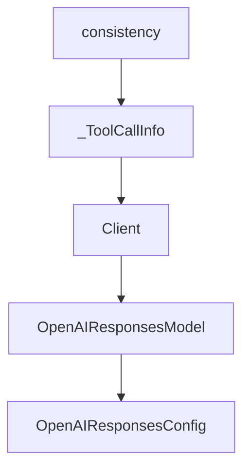

# Chapter 2: Agent Loop and Model-Driven Architecture

Welcome to **Chapter 2: Agent Loop and Model-Driven Architecture**. In this part of **Strands Agents Tutorial: Model-Driven Agent Systems with Native MCP Support**, you will build an intuitive mental model first, then move into concrete implementation details and practical production tradeoffs.


This chapter explains why Strands is described as model-driven and how that affects design choices.

## Learning Goals

- understand the core agent loop model
- map model reasoning to tool invocation behavior
- identify extension points for custom logic
- preserve simplicity while adding capability

## Architecture Notes

- the agent loop is intentionally lightweight
- models drive decision-making while tools execute capabilities
- APIs emphasize composable primitives instead of heavy framework layers

## Source References

- [Strands README](https://github.com/strands-agents/sdk-python)
- [Strands Agent Loop Docs](https://strandsagents.com/latest/documentation/docs/user-guide/concepts/agents/agent-loop/)
- [Strands Agent API Reference](https://strandsagents.com/latest/documentation/docs/api-reference/python/agent/agent/)

## Summary

You now have the foundation to design Strands agents with clearer tradeoff awareness.

Next: [Chapter 3: Tools and MCP Integration](03-tools-and-mcp-integration.md)

## Source Code Walkthrough

### `src/strands/models/llamacpp.py`

The `consistency` interface in [`src/strands/models/llamacpp.py`](https://github.com/strands-agents/sdk-python/blob/HEAD/src/strands/models/llamacpp.py) handles a key part of this chapter's functionality:

```py
            system_prompt: System prompt to provide context to the model.
            tool_choice: Selection strategy for tool invocation. **Note: This parameter is accepted for
                interface consistency but is currently ignored for this model provider.**
            **kwargs: Additional keyword arguments for future extensibility.

        Yields:
            Formatted message chunks from the model.

        Raises:
            ContextWindowOverflowException: When the context window is exceeded.
            ModelThrottledException: When the llama.cpp server is overloaded.
        """
        warn_on_tool_choice_not_supported(tool_choice)

        # Track request start time for latency calculation
        start_time = time.perf_counter()

        try:
            logger.debug("formatting request")
            request = self._format_request(messages, tool_specs, system_prompt)
            logger.debug("request=<%s>", request)

            logger.debug("invoking model")
            response = await self.client.post("/v1/chat/completions", json=request)
            response.raise_for_status()

            logger.debug("got response from model")
            yield self._format_chunk({"chunk_type": "message_start"})
            yield self._format_chunk({"chunk_type": "content_start", "data_type": "text"})

            tool_calls: dict[int, list] = {}
            usage_data = None
```

This interface is important because it defines how Strands Agents Tutorial: Model-Driven Agent Systems with Native MCP Support implements the patterns covered in this chapter.

### `src/strands/models/openai_responses.py`

The `_ToolCallInfo` class in [`src/strands/models/openai_responses.py`](https://github.com/strands-agents/sdk-python/blob/HEAD/src/strands/models/openai_responses.py) handles a key part of this chapter's functionality:

```py


class _ToolCallInfo(TypedDict):
    """Internal type for tracking tool call information during streaming."""

    name: str
    arguments: str
    call_id: str
    item_id: str


class Client(Protocol):
    """Protocol defining the OpenAI Responses API interface for the underlying provider client."""

    @property
    # pragma: no cover
    def responses(self) -> Any:
        """Responses interface."""
        ...


class OpenAIResponsesModel(Model):
    """OpenAI Responses API model provider implementation."""

    client: Client
    client_args: dict[str, Any]

    class OpenAIResponsesConfig(TypedDict, total=False):
        """Configuration options for OpenAI Responses API models.

        Attributes:
            model_id: Model ID (e.g., "gpt-4o").
```

This class is important because it defines how Strands Agents Tutorial: Model-Driven Agent Systems with Native MCP Support implements the patterns covered in this chapter.

### `src/strands/models/openai_responses.py`

The `Client` class in [`src/strands/models/openai_responses.py`](https://github.com/strands-agents/sdk-python/blob/HEAD/src/strands/models/openai_responses.py) handles a key part of this chapter's functionality:

```py


class Client(Protocol):
    """Protocol defining the OpenAI Responses API interface for the underlying provider client."""

    @property
    # pragma: no cover
    def responses(self) -> Any:
        """Responses interface."""
        ...


class OpenAIResponsesModel(Model):
    """OpenAI Responses API model provider implementation."""

    client: Client
    client_args: dict[str, Any]

    class OpenAIResponsesConfig(TypedDict, total=False):
        """Configuration options for OpenAI Responses API models.

        Attributes:
            model_id: Model ID (e.g., "gpt-4o").
                For a complete list of supported models, see https://platform.openai.com/docs/models.
            params: Model parameters (e.g., max_output_tokens, temperature, etc.).
                For a complete list of supported parameters, see
                https://platform.openai.com/docs/api-reference/responses/create.
            stateful: Whether to enable server-side conversation state management.
                When True, the server stores conversation history and the client does not need to
                send the full message history with each request. Defaults to False.
        """

```

This class is important because it defines how Strands Agents Tutorial: Model-Driven Agent Systems with Native MCP Support implements the patterns covered in this chapter.

### `src/strands/models/openai_responses.py`

The `OpenAIResponsesModel` class in [`src/strands/models/openai_responses.py`](https://github.com/strands-agents/sdk-python/blob/HEAD/src/strands/models/openai_responses.py) handles a key part of this chapter's functionality:

```py
    if _openai_version < _MIN_OPENAI_VERSION:
        raise ImportError(
            f"OpenAIResponsesModel requires openai>={_MIN_OPENAI_VERSION} (found {_openai_version}). "
            "Install/upgrade with: pip install -U openai. "
            "For older SDKs, use OpenAIModel (Chat Completions)."
        )
except ImportError:
    # Re-raise ImportError as-is (covers both our explicit raise above and missing openai package)
    raise
except Exception as e:
    raise ImportError(
        f"OpenAIResponsesModel requires openai>={_MIN_OPENAI_VERSION}. Install with: pip install -U openai"
    ) from e

import openai  # noqa: E402 - must import after version check

from ..types.citations import WebLocationDict  # noqa: E402
from ..types.content import ContentBlock, Messages, Role  # noqa: E402
from ..types.exceptions import ContextWindowOverflowException, ModelThrottledException  # noqa: E402
from ..types.streaming import StreamEvent  # noqa: E402
from ..types.tools import ToolChoice, ToolResult, ToolSpec, ToolUse  # noqa: E402
from ._validation import validate_config_keys  # noqa: E402
from .model import Model  # noqa: E402

logger = logging.getLogger(__name__)

T = TypeVar("T", bound=BaseModel)

# Maximum file size for media content in tool results (20MB)
_MAX_MEDIA_SIZE_BYTES = 20 * 1024 * 1024
_MAX_MEDIA_SIZE_LABEL = "20MB"
_DEFAULT_MIME_TYPE = "application/octet-stream"
```

This class is important because it defines how Strands Agents Tutorial: Model-Driven Agent Systems with Native MCP Support implements the patterns covered in this chapter.


## How These Components Connect


