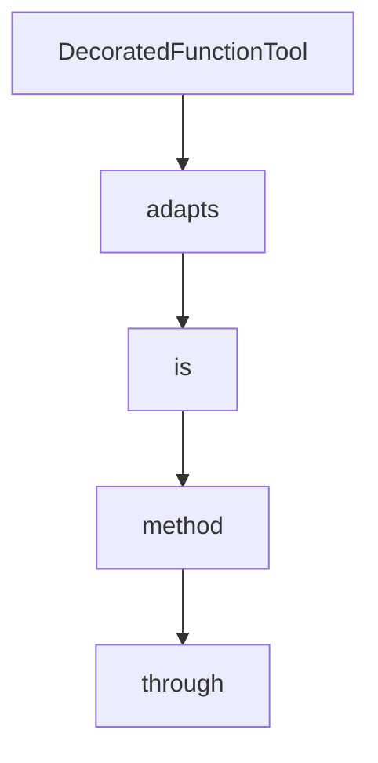

# Chapter 3: Tools and MCP Integration

Welcome to **Chapter 3: Tools and MCP Integration**. In this part of **Strands Agents Tutorial: Model-Driven Agent Systems with Native MCP Support**, you will build an intuitive mental model first, then move into concrete implementation details and practical production tradeoffs.


This chapter covers tool composition and MCP usage patterns for real capability expansion.

## Learning Goals

- build custom Python tools with decorators
- attach MCP servers through `MCPClient`
- manage tool discovery and lifecycle
- avoid hanging and stability pitfalls

## Integration Patterns

- static tool lists for predictable behavior
- directory-based tool loading for rapid iteration
- MCP-backed tool surfaces for external capabilities

## Reliability Considerations

Strands runs MCP communication through a background-thread architecture to hide async complexity. Treat MCP connection lifecycle and error handling as first-class operational concerns.

## Source References

- [Strands Tools Concepts](https://strandsagents.com/latest/documentation/docs/user-guide/concepts/tools/)
- [Strands MCP Tools Concepts](https://strandsagents.com/latest/documentation/docs/user-guide/concepts/tools/mcp-tools/)
- [Strands MCP Client Architecture](https://github.com/strands-agents/sdk-python/blob/main/docs/MCP_CLIENT_ARCHITECTURE.md)

## Summary

You now have practical patterns for integrating tools and MCP safely in Strands.

Next: [Chapter 4: Model Providers and Runtime Strategy](04-model-providers-and-runtime-strategy.md)

## Source Code Walkthrough

### `src/strands/tools/decorator.py`

The `DecoratedFunctionTool` class in [`src/strands/tools/decorator.py`](https://github.com/strands-agents/sdk-python/blob/HEAD/src/strands/tools/decorator.py) handles a key part of this chapter's functionality:

```py


class DecoratedFunctionTool(AgentTool, Generic[P, R]):
    """An AgentTool that wraps a function that was decorated with @tool.

    This class adapts Python functions decorated with @tool to the AgentTool interface. It handles both direct
    function calls and tool use invocations, maintaining the function's
    original behavior while adding tool capabilities.

    The class is generic over the function's parameter types (P) and return type (R) to maintain type safety.
    """

    _tool_name: str
    _tool_spec: ToolSpec
    _tool_func: Callable[P, R]
    _metadata: FunctionToolMetadata

    def __init__(
        self,
        tool_name: str,
        tool_spec: ToolSpec,
        tool_func: Callable[P, R],
        metadata: FunctionToolMetadata,
    ):
        """Initialize the decorated function tool.

        Args:
            tool_name: The name to use for the tool (usually the function name).
            tool_spec: The tool specification containing metadata for Agent integration.
            tool_func: The original function being decorated.
            metadata: The FunctionToolMetadata object with extracted function information.
        """
```

This class is important because it defines how Strands Agents Tutorial: Model-Driven Agent Systems with Native MCP Support implements the patterns covered in this chapter.

### `src/strands/tools/decorator.py`

The `adapts` class in [`src/strands/tools/decorator.py`](https://github.com/strands-agents/sdk-python/blob/HEAD/src/strands/tools/decorator.py) handles a key part of this chapter's functionality:

```py
    """An AgentTool that wraps a function that was decorated with @tool.

    This class adapts Python functions decorated with @tool to the AgentTool interface. It handles both direct
    function calls and tool use invocations, maintaining the function's
    original behavior while adding tool capabilities.

    The class is generic over the function's parameter types (P) and return type (R) to maintain type safety.
    """

    _tool_name: str
    _tool_spec: ToolSpec
    _tool_func: Callable[P, R]
    _metadata: FunctionToolMetadata

    def __init__(
        self,
        tool_name: str,
        tool_spec: ToolSpec,
        tool_func: Callable[P, R],
        metadata: FunctionToolMetadata,
    ):
        """Initialize the decorated function tool.

        Args:
            tool_name: The name to use for the tool (usually the function name).
            tool_spec: The tool specification containing metadata for Agent integration.
            tool_func: The original function being decorated.
            metadata: The FunctionToolMetadata object with extracted function information.
        """
        super().__init__()

        self._tool_name = tool_name
```

This class is important because it defines how Strands Agents Tutorial: Model-Driven Agent Systems with Native MCP Support implements the patterns covered in this chapter.

### `src/strands/tools/decorator.py`

The `is` class in [`src/strands/tools/decorator.py`](https://github.com/strands-agents/sdk-python/blob/HEAD/src/strands/tools/decorator.py) handles a key part of this chapter's functionality:

```py
"""Tool decorator for SDK.

This module provides the @tool decorator that transforms Python functions into SDK Agent tools with automatic metadata
extraction and validation.

The @tool decorator performs several functions:

1. Extracts function metadata (name, description, parameters) from docstrings and type hints
2. Generates a JSON schema for input validation
3. Handles two different calling patterns:
   - Standard function calls (func(arg1, arg2))
   - Tool use calls (agent.my_tool(param1="hello", param2=123))
4. Provides error handling and result formatting
5. Works with both standalone functions and class methods

Example:
    ```python
    from strands import Agent, tool

    @tool
    def my_tool(param1: str, param2: int = 42) -> dict:
        '''
        Tool description - explain what it does.

        #Args:
            param1: Description of first parameter.
            param2: Description of second parameter (default: 42).

        #Returns:
            A dictionary with the results.
        '''
        result = do_something(param1, param2)
```

This class is important because it defines how Strands Agents Tutorial: Model-Driven Agent Systems with Native MCP Support implements the patterns covered in this chapter.

### `src/strands/tools/decorator.py`

The `method` class in [`src/strands/tools/decorator.py`](https://github.com/strands-agents/sdk-python/blob/HEAD/src/strands/tools/decorator.py) handles a key part of this chapter's functionality:

```py
   - Tool use calls (agent.my_tool(param1="hello", param2=123))
4. Provides error handling and result formatting
5. Works with both standalone functions and class methods

Example:
    ```python
    from strands import Agent, tool

    @tool
    def my_tool(param1: str, param2: int = 42) -> dict:
        '''
        Tool description - explain what it does.

        #Args:
            param1: Description of first parameter.
            param2: Description of second parameter (default: 42).

        #Returns:
            A dictionary with the results.
        '''
        result = do_something(param1, param2)
        return {
            "status": "success",
            "content": [{"text": f"Result: {result}"}]
        }

    agent = Agent(tools=[my_tool])
    agent.tool.my_tool(param1="hello", param2=123)
    ```
"""

import asyncio
```

This class is important because it defines how Strands Agents Tutorial: Model-Driven Agent Systems with Native MCP Support implements the patterns covered in this chapter.


## How These Components Connect


