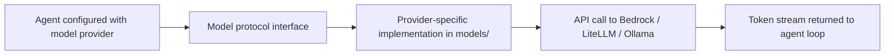

# Chapter 4: Model Providers and Runtime Strategy

Welcome to **Chapter 4: Model Providers and Runtime Strategy**. In this part of **Strands Agents Tutorial: Model-Driven Agent Systems with Native MCP Support**, you will build an intuitive mental model first, then move into concrete implementation details and practical production tradeoffs.

This chapter explains provider selection and runtime tuning decisions.

## Learning Goals

- choose model providers based on constraints
- configure parameters for quality/cost/latency tradeoffs
- use provider abstractions cleanly
- avoid lock-in through adapter-friendly architecture

## Provider Strategy

- start with one provider for baseline reliability
- use explicit model IDs and params in code
- benchmark task classes before multi-provider expansion

## Source References

- [Strands Model Provider Concepts](https://strandsagents.com/latest/documentation/docs/user-guide/concepts/model-providers/)
- [Strands README: Multiple Model Providers](https://github.com/strands-agents/sdk-python#multiple-model-providers)
- [Strands Custom Provider Docs](https://strandsagents.com/latest/documentation/docs/user-guide/concepts/model-providers/custom_model_provider/)

## Summary

You can now make provider decisions that align with product and operations goals.

Next: [Chapter 5: Hooks, State, and Reliability Controls](05-hooks-state-and-reliability-controls.md)

## Source Code Walkthrough

Use the following upstream sources to verify model provider and runtime strategy details while reading this chapter:

- [`src/strands/models/`](https://github.com/strands-agents/sdk-python/blob/HEAD/src/strands/models/) — the model provider implementations directory; each file implements the `Model` protocol for a specific provider (Bedrock, LiteLLM, Ollama, OpenAI-compatible).
- [`src/strands/models/bedrock.py`](https://github.com/strands-agents/sdk-python/blob/HEAD/src/strands/models/bedrock.py) — the Amazon Bedrock model provider, which is the default and most feature-complete provider implementation in the Strands SDK.

Suggested trace strategy:
- compare the `__init__` signatures across model providers in `src/strands/models/` to understand which parameters are provider-specific vs. universal
- trace how a model provider handles the `stream` method to understand the interface contract all providers must satisfy
- review `src/strands/models/litellm.py` to see how LiteLLM is used as a multi-provider gateway for non-Bedrock deployments

## How These Components Connect

