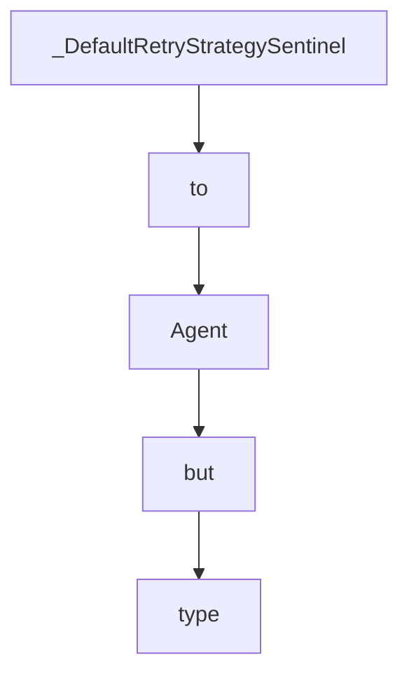

# Chapter 4: Model Providers and Runtime Strategy

Welcome to **Chapter 4: Model Providers and Runtime Strategy**. In this part of **Strands Agents Tutorial: Model-Driven Agent Systems with Native MCP Support**, you will build an intuitive mental model first, then move into concrete implementation details and practical production tradeoffs.


This chapter explains provider selection and runtime tuning decisions.

## Learning Goals

- choose model providers based on constraints
- configure parameters for quality/cost/latency tradeoffs
- use provider abstractions cleanly
- avoid lock-in through adapter-friendly architecture

## Provider Strategy

- start with one provider for baseline reliability
- use explicit model IDs and params in code
- benchmark task classes before multi-provider expansion

## Source References

- [Strands Model Provider Concepts](https://strandsagents.com/latest/documentation/docs/user-guide/concepts/model-providers/)
- [Strands README: Multiple Model Providers](https://github.com/strands-agents/sdk-python#multiple-model-providers)
- [Strands Custom Provider Docs](https://strandsagents.com/latest/documentation/docs/user-guide/concepts/model-providers/custom_model_provider/)

## Summary

You can now make provider decisions that align with product and operations goals.

Next: [Chapter 5: Hooks, State, and Reliability Controls](05-hooks-state-and-reliability-controls.md)

## Depth Expansion Playbook

## Source Code Walkthrough

### `src/strands/agent/agent.py`

The `_DefaultRetryStrategySentinel` class in [`src/strands/agent/agent.py`](https://github.com/strands-agents/sdk-python/blob/HEAD/src/strands/agent/agent.py) handles a key part of this chapter's functionality:

```py


class _DefaultRetryStrategySentinel:
    """Sentinel class to distinguish between explicit None and default parameter value for retry_strategy."""

    pass


_DEFAULT_CALLBACK_HANDLER = _DefaultCallbackHandlerSentinel()
_DEFAULT_RETRY_STRATEGY = _DefaultRetryStrategySentinel()
_DEFAULT_AGENT_NAME = "Strands Agents"
_DEFAULT_AGENT_ID = "default"


class Agent(AgentBase):
    """Core Agent implementation.

    An agent orchestrates the following workflow:

    1. Receives user input
    2. Processes the input using a language model
    3. Decides whether to use tools to gather information or perform actions
    4. Executes those tools and receives results
    5. Continues reasoning with the new information
    6. Produces a final response
    """

    # For backwards compatibility
    ToolCaller = _ToolCaller

    def __init__(
        self,
```

This class is important because it defines how Strands Agents Tutorial: Model-Driven Agent Systems with Native MCP Support implements the patterns covered in this chapter.

### `src/strands/agent/agent.py`

The `to` class in [`src/strands/agent/agent.py`](https://github.com/strands-agents/sdk-python/blob/HEAD/src/strands/agent/agent.py) handles a key part of this chapter's functionality:

```py

This module implements the core Agent class that serves as the primary entry point for interacting with foundation
models and tools in the SDK.

The Agent interface supports two complementary interaction patterns:

1. Natural language for conversation: `agent("Analyze this data")`
2. Method-style for direct tool access: `agent.tool.tool_name(param1="value")`
"""

import logging
import threading
import warnings
from collections.abc import AsyncGenerator, AsyncIterator, Callable, Mapping
from typing import (
    TYPE_CHECKING,
    Any,
    TypeVar,
    Union,
    cast,
)

from opentelemetry import trace as trace_api
from pydantic import BaseModel

from .. import _identifier
from .._async import run_async
from ..event_loop._retry import ModelRetryStrategy
from ..event_loop.event_loop import INITIAL_DELAY, MAX_ATTEMPTS, MAX_DELAY, event_loop_cycle
from ..tools._tool_helpers import generate_missing_tool_result_content

if TYPE_CHECKING:
```

This class is important because it defines how Strands Agents Tutorial: Model-Driven Agent Systems with Native MCP Support implements the patterns covered in this chapter.

### `src/strands/agent/agent.py`

The `Agent` class in [`src/strands/agent/agent.py`](https://github.com/strands-agents/sdk-python/blob/HEAD/src/strands/agent/agent.py) handles a key part of this chapter's functionality:

```py
"""Agent Interface.

This module implements the core Agent class that serves as the primary entry point for interacting with foundation
models and tools in the SDK.

The Agent interface supports two complementary interaction patterns:

1. Natural language for conversation: `agent("Analyze this data")`
2. Method-style for direct tool access: `agent.tool.tool_name(param1="value")`
"""

import logging
import threading
import warnings
from collections.abc import AsyncGenerator, AsyncIterator, Callable, Mapping
from typing import (
    TYPE_CHECKING,
    Any,
    TypeVar,
    Union,
    cast,
)

from opentelemetry import trace as trace_api
from pydantic import BaseModel

from .. import _identifier
from .._async import run_async
from ..event_loop._retry import ModelRetryStrategy
from ..event_loop.event_loop import INITIAL_DELAY, MAX_ATTEMPTS, MAX_DELAY, event_loop_cycle
```

This class is important because it defines how Strands Agents Tutorial: Model-Driven Agent Systems with Native MCP Support implements the patterns covered in this chapter.

### `src/strands/agent/agent.py`

The `but` class in [`src/strands/agent/agent.py`](https://github.com/strands-agents/sdk-python/blob/HEAD/src/strands/agent/agent.py) handles a key part of this chapter's functionality:

```py
from ..types.content import ContentBlock, Message, Messages, SystemContentBlock
from ..types.exceptions import ConcurrencyException, ContextWindowOverflowException
from ..types.traces import AttributeValue
from .agent_result import AgentResult
from .base import AgentBase
from .conversation_manager import (
    ConversationManager,
    SlidingWindowConversationManager,
)
from .state import AgentState

logger = logging.getLogger(__name__)

# TypeVar for generic structured output
T = TypeVar("T", bound=BaseModel)


# Sentinel class and object to distinguish between explicit None and default parameter value
class _DefaultCallbackHandlerSentinel:
    """Sentinel class to distinguish between explicit None and default parameter value."""

    pass


class _DefaultRetryStrategySentinel:
    """Sentinel class to distinguish between explicit None and default parameter value for retry_strategy."""

    pass


_DEFAULT_CALLBACK_HANDLER = _DefaultCallbackHandlerSentinel()
_DEFAULT_RETRY_STRATEGY = _DefaultRetryStrategySentinel()
```

This class is important because it defines how Strands Agents Tutorial: Model-Driven Agent Systems with Native MCP Support implements the patterns covered in this chapter.


## How These Components Connect


