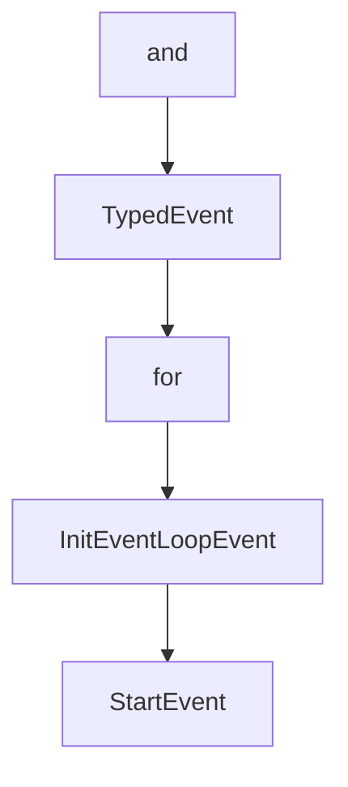

# Chapter 5: Hooks, State, and Reliability Controls

Welcome to **Chapter 5: Hooks, State, and Reliability Controls**. In this part of **Strands Agents Tutorial: Model-Driven Agent Systems with Native MCP Support**, you will build an intuitive mental model first, then move into concrete implementation details and practical production tradeoffs.


This chapter shows how to shape runtime behavior without breaking the simple programming model.

## Learning Goals

- use hooks to intercept and influence execution
- apply writable event properties correctly
- enforce guardrails around tool calls
- design for reliable, observable runs

## Hooks Design Tips

- use `Before*` and `After*` event pairs for lifecycle consistency
- keep hook logic small and deterministic
- reserve state mutation for explicit, auditable use cases

## Source References

- [Strands Hooks Concepts](https://strandsagents.com/latest/documentation/docs/user-guide/concepts/agents/hooks/)
- [Strands HOOKS.md](https://github.com/strands-agents/sdk-python/blob/main/docs/HOOKS.md)
- [Strands Agent Loop Docs](https://strandsagents.com/latest/documentation/docs/user-guide/concepts/agents/agent-loop/)

## Summary

You now have a safe pattern for applying runtime controls while preserving Strands' simplicity.

Next: [Chapter 6: Multi-Agent and Advanced Patterns](06-multi-agent-and-advanced-patterns.md)

## Depth Expansion Playbook

## Source Code Walkthrough

### `src/strands/tools/registry.py`

The `and` interface in [`src/strands/tools/registry.py`](https://github.com/strands-agents/sdk-python/blob/HEAD/src/strands/tools/registry.py) handles a key part of this chapter's functionality:

```py
"""Tool registry.

This module provides the central registry for all tools available to the agent, including discovery, validation, and
invocation capabilities.
"""

import inspect
import logging
import os
import sys
import uuid
import warnings
from collections.abc import Iterable, Sequence
from importlib import import_module, util
from os.path import expanduser
from pathlib import Path
from typing import Any, cast

from typing_extensions import TypedDict

from .._async import run_async
from ..tools.decorator import DecoratedFunctionTool
from ..types.tools import AgentTool, ToolSpec
from . import ToolProvider
from .loader import load_tool_from_string, load_tools_from_module
from .tools import _COMPOSITION_KEYWORDS, PythonAgentTool, normalize_schema, normalize_tool_spec

logger = logging.getLogger(__name__)


class ToolRegistry:
    """Central registry for all tools available to the agent.
```

This interface is important because it defines how Strands Agents Tutorial: Model-Driven Agent Systems with Native MCP Support implements the patterns covered in this chapter.

### `src/strands/types/_events.py`

The `TypedEvent` class in [`src/strands/types/_events.py`](https://github.com/strands-agents/sdk-python/blob/HEAD/src/strands/types/_events.py) handles a key part of this chapter's functionality:

```py


class TypedEvent(dict):
    """Base class for all typed events in the agent system."""

    def __init__(self, data: dict[str, Any] | None = None) -> None:
        """Initialize the typed event with optional data.

        Args:
            data: Optional dictionary of event data to initialize with
        """
        super().__init__(data or {})

    @property
    def is_callback_event(self) -> bool:
        """True if this event should trigger the callback_handler to fire."""
        return True

    def as_dict(self) -> dict:
        """Convert this event to a raw dictionary for emitting purposes."""
        return {**self}

    def prepare(self, invocation_state: dict) -> None:
        """Prepare the event for emission by adding invocation state.

        This allows a subset of events to merge with the invocation_state without needing to
        pass around the invocation_state throughout the system.
        """
        ...


class InitEventLoopEvent(TypedEvent):
```

This class is important because it defines how Strands Agents Tutorial: Model-Driven Agent Systems with Native MCP Support implements the patterns covered in this chapter.

### `src/strands/types/_events.py`

The `for` class in [`src/strands/types/_events.py`](https://github.com/strands-agents/sdk-python/blob/HEAD/src/strands/types/_events.py) handles a key part of this chapter's functionality:

```py
"""event system for the Strands Agents framework.

This module defines the event types that are emitted during agent execution,
providing a structured way to observe to different events of the event loop and
agent lifecycle.
"""

from collections.abc import Sequence
from typing import TYPE_CHECKING, Any, cast

from pydantic import BaseModel
from typing_extensions import override

from ..interrupt import Interrupt
from ..telemetry import EventLoopMetrics
from .citations import Citation
from .content import Message
from .event_loop import Metrics, StopReason, Usage
from .streaming import ContentBlockDelta, StreamEvent
from .tools import ToolResult, ToolUse

if TYPE_CHECKING:
    from ..agent import AgentResult
    from ..multiagent.base import MultiAgentResult, NodeResult


class TypedEvent(dict):
    """Base class for all typed events in the agent system."""

    def __init__(self, data: dict[str, Any] | None = None) -> None:
```

This class is important because it defines how Strands Agents Tutorial: Model-Driven Agent Systems with Native MCP Support implements the patterns covered in this chapter.

### `src/strands/types/_events.py`

The `InitEventLoopEvent` class in [`src/strands/types/_events.py`](https://github.com/strands-agents/sdk-python/blob/HEAD/src/strands/types/_events.py) handles a key part of this chapter's functionality:

```py


class InitEventLoopEvent(TypedEvent):
    """Event emitted at the very beginning of agent execution.

    This event is fired before any processing begins and provides access to the
    initial invocation state.

    Args:
            invocation_state: The invocation state passed into the request
    """

    def __init__(self) -> None:
        """Initialize the event loop initialization event."""
        super().__init__({"init_event_loop": True})

    @override
    def prepare(self, invocation_state: dict) -> None:
        self.update(invocation_state)


class StartEvent(TypedEvent):
    """Event emitted at the start of each event loop cycle.

    !!deprecated!!
        Use StartEventLoopEvent instead.

    This event events the beginning of a new processing cycle within the agent's
    event loop. It's fired before model invocation and tool execution begin.
    """

    def __init__(self) -> None:
```

This class is important because it defines how Strands Agents Tutorial: Model-Driven Agent Systems with Native MCP Support implements the patterns covered in this chapter.


## How These Components Connect


