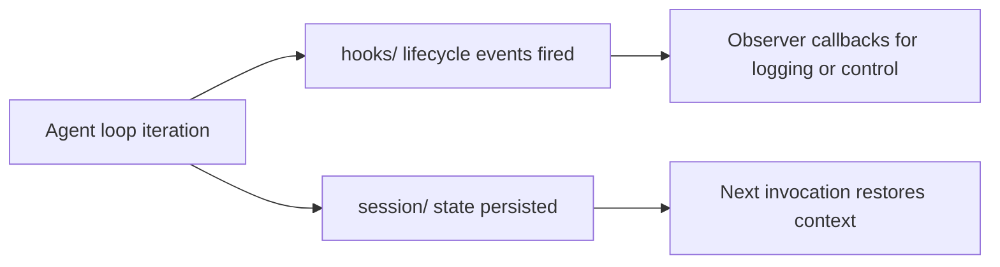

# Chapter 5: Hooks, State, and Reliability Controls

Welcome to **Chapter 5: Hooks, State, and Reliability Controls**. In this part of **Strands Agents Tutorial: Model-Driven Agent Systems with Native MCP Support**, you will build an intuitive mental model first, then move into concrete implementation details and practical production tradeoffs.

This chapter shows how to shape runtime behavior without breaking the simple programming model.

## Learning Goals

- use hooks to intercept and influence execution
- apply writable event properties correctly
- enforce guardrails around tool calls
- design for reliable, observable runs

## Hooks Design Tips

- use `Before*` and `After*` event pairs for lifecycle consistency
- keep hook logic small and deterministic
- reserve state mutation for explicit, auditable use cases

## Source References

- [Strands Hooks Concepts](https://strandsagents.com/latest/documentation/docs/user-guide/concepts/agents/hooks/)
- [Strands HOOKS.md](https://github.com/strands-agents/sdk-python/blob/main/docs/HOOKS.md)
- [Strands Agent Loop Docs](https://strandsagents.com/latest/documentation/docs/user-guide/concepts/agents/agent-loop/)

## Summary

You now have a safe pattern for applying runtime controls while preserving Strands' simplicity.

Next: [Chapter 6: Multi-Agent and Advanced Patterns](06-multi-agent-and-advanced-patterns.md)

## Source Code Walkthrough

Use the following upstream sources to verify hooks, state, and reliability control details while reading this chapter:

- [`src/strands/hooks/`](https://github.com/strands-agents/sdk-python/blob/HEAD/src/strands/hooks/) — the hooks system that allows intercepting agent lifecycle events (before/after tool calls, model responses, loop iterations) for observability and control.
- [`src/strands/session/`](https://github.com/strands-agents/sdk-python/blob/HEAD/src/strands/session/) — the session management layer that persists conversation history and agent state across invocations, essential for multi-turn reliability.

Suggested trace strategy:
- review the hook types in `src/strands/hooks/` to understand which lifecycle points are hookable and what context data is available
- trace `src/strands/session/repository_session_manager.py` to see how sessions are stored and retrieved for state continuity
- check `src/strands/agent/agent.py` for the `max_turns` and stop condition parameters that control agent reliability boundaries

## How These Components Connect

