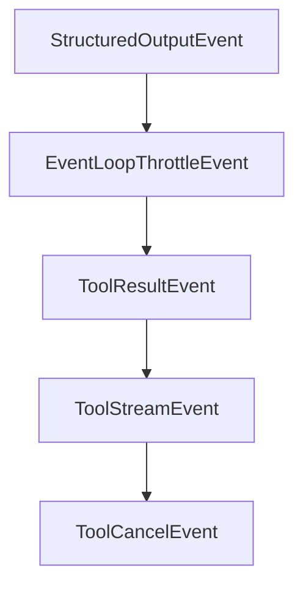

# Chapter 6: Multi-Agent and Advanced Patterns

Welcome to **Chapter 6: Multi-Agent and Advanced Patterns**. In this part of **Strands Agents Tutorial: Model-Driven Agent Systems with Native MCP Support**, you will build an intuitive mental model first, then move into concrete implementation details and practical production tradeoffs.


This chapter explores advanced usage beyond basic single-agent workflows.

## Learning Goals

- compose multiple agents for specialized workflows
- evaluate when to add streaming or autonomous patterns
- balance complexity with maintainability
- define escalation paths for human oversight

## Advanced Pattern Areas

- multi-agent decomposition by domain responsibility
- bidirectional streaming experiences for real-time interactions
- hybrid tool + MCP designs for broader capability coverage

## Source References

- [Strands Documentation Home](https://strandsagents.com/latest/documentation/docs/)
- [Strands Experimental Bidi Streaming Overview](https://github.com/strands-agents/sdk-python#bidirectional-streaming)
- [Strands Examples](https://strandsagents.com/latest/documentation/docs/examples/)

## Summary

You now have a roadmap for scaling Strands workflows without losing architectural control.

Next: [Chapter 7: Deployment and Production Operations](07-deployment-and-production-operations.md)

## Depth Expansion Playbook

## Source Code Walkthrough

### `src/strands/types/_events.py`

The `StructuredOutputEvent` class in [`src/strands/types/_events.py`](https://github.com/strands-agents/sdk-python/blob/HEAD/src/strands/types/_events.py) handles a key part of this chapter's functionality:

```py


class StructuredOutputEvent(TypedEvent):
    """Event emitted when structured output is detected and processed."""

    def __init__(self, structured_output: BaseModel) -> None:
        """Initialize with the structured output result.

        Args:
            structured_output: The parsed structured output instance
        """
        super().__init__({"structured_output": structured_output})


class EventLoopThrottleEvent(TypedEvent):
    """Event emitted when the event loop is throttled due to rate limiting."""

    def __init__(self, delay: int) -> None:
        """Initialize with the throttle delay duration.

        Args:
            delay: Delay in seconds before the next retry attempt
        """
        super().__init__({"event_loop_throttled_delay": delay})

    @override
    def prepare(self, invocation_state: dict) -> None:
        self.update(invocation_state)


class ToolResultEvent(TypedEvent):
    """Event emitted when a tool execution completes."""
```

This class is important because it defines how Strands Agents Tutorial: Model-Driven Agent Systems with Native MCP Support implements the patterns covered in this chapter.

### `src/strands/types/_events.py`

The `EventLoopThrottleEvent` class in [`src/strands/types/_events.py`](https://github.com/strands-agents/sdk-python/blob/HEAD/src/strands/types/_events.py) handles a key part of this chapter's functionality:

```py


class EventLoopThrottleEvent(TypedEvent):
    """Event emitted when the event loop is throttled due to rate limiting."""

    def __init__(self, delay: int) -> None:
        """Initialize with the throttle delay duration.

        Args:
            delay: Delay in seconds before the next retry attempt
        """
        super().__init__({"event_loop_throttled_delay": delay})

    @override
    def prepare(self, invocation_state: dict) -> None:
        self.update(invocation_state)


class ToolResultEvent(TypedEvent):
    """Event emitted when a tool execution completes."""

    def __init__(self, tool_result: ToolResult, exception: Exception | None = None) -> None:
        """Initialize tool result event."""
        super().__init__({"type": "tool_result", "tool_result": tool_result})
        self._exception = exception

    @property
    def exception(self) -> Exception | None:
        """The original exception that occurred, if any.

        Can be used for re-raising or type-based error handling.
        """
```

This class is important because it defines how Strands Agents Tutorial: Model-Driven Agent Systems with Native MCP Support implements the patterns covered in this chapter.

### `src/strands/types/_events.py`

The `ToolResultEvent` class in [`src/strands/types/_events.py`](https://github.com/strands-agents/sdk-python/blob/HEAD/src/strands/types/_events.py) handles a key part of this chapter's functionality:

```py


class ToolResultEvent(TypedEvent):
    """Event emitted when a tool execution completes."""

    def __init__(self, tool_result: ToolResult, exception: Exception | None = None) -> None:
        """Initialize tool result event."""
        super().__init__({"type": "tool_result", "tool_result": tool_result})
        self._exception = exception

    @property
    def exception(self) -> Exception | None:
        """The original exception that occurred, if any.

        Can be used for re-raising or type-based error handling.
        """
        return self._exception

    @property
    def tool_use_id(self) -> str:
        """The toolUseId associated with this result."""
        return cast(ToolResult, self.get("tool_result"))["toolUseId"]

    @property
    def tool_result(self) -> ToolResult:
        """Final result from the completed tool execution."""
        return cast(ToolResult, self.get("tool_result"))

    @property
    @override
    def is_callback_event(self) -> bool:
        return False
```

This class is important because it defines how Strands Agents Tutorial: Model-Driven Agent Systems with Native MCP Support implements the patterns covered in this chapter.

### `src/strands/types/_events.py`

The `ToolStreamEvent` class in [`src/strands/types/_events.py`](https://github.com/strands-agents/sdk-python/blob/HEAD/src/strands/types/_events.py) handles a key part of this chapter's functionality:

```py


class ToolStreamEvent(TypedEvent):
    """Event emitted when a tool yields sub-events as part of tool execution."""

    def __init__(self, tool_use: ToolUse, tool_stream_data: Any) -> None:
        """Initialize with tool streaming data.

        Args:
            tool_use: The tool invocation producing the stream
            tool_stream_data: The yielded event from the tool execution
        """
        super().__init__({"type": "tool_stream", "tool_stream_event": {"tool_use": tool_use, "data": tool_stream_data}})

    @property
    def tool_use_id(self) -> str:
        """The toolUseId associated with this stream."""
        return cast(ToolUse, cast(dict, self.get("tool_stream_event")).get("tool_use"))["toolUseId"]


class ToolCancelEvent(TypedEvent):
    """Event emitted when a user cancels a tool call from their BeforeToolCallEvent hook."""

    def __init__(self, tool_use: ToolUse, message: str) -> None:
        """Initialize with tool streaming data.

        Args:
            tool_use: Information about the tool being cancelled
            message: The tool cancellation message
        """
        super().__init__({"tool_cancel_event": {"tool_use": tool_use, "message": message}})

```

This class is important because it defines how Strands Agents Tutorial: Model-Driven Agent Systems with Native MCP Support implements the patterns covered in this chapter.


## How These Components Connect


