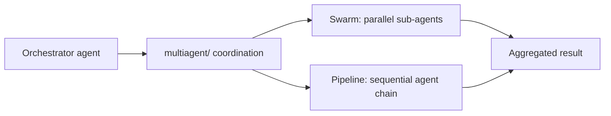

# Chapter 6: Multi-Agent and Advanced Patterns

Welcome to **Chapter 6: Multi-Agent and Advanced Patterns**. In this part of **Strands Agents Tutorial: Model-Driven Agent Systems with Native MCP Support**, you will build an intuitive mental model first, then move into concrete implementation details and practical production tradeoffs.

This chapter explores advanced usage beyond basic single-agent workflows.

## Learning Goals

- compose multiple agents for specialized workflows
- evaluate when to add streaming or autonomous patterns
- balance complexity with maintainability
- define escalation paths for human oversight

## Advanced Pattern Areas

- multi-agent decomposition by domain responsibility
- bidirectional streaming experiences for real-time interactions
- hybrid tool + MCP designs for broader capability coverage

## Source References

- [Strands Documentation Home](https://strandsagents.com/latest/documentation/docs/)
- [Strands Experimental Bidi Streaming Overview](https://github.com/strands-agents/sdk-python#bidirectional-streaming)
- [Strands Examples](https://strandsagents.com/latest/documentation/docs/examples/)

## Summary

You now have a roadmap for scaling Strands workflows without losing architectural control.

Next: [Chapter 7: Deployment and Production Operations](07-deployment-and-production-operations.md)

## Source Code Walkthrough

Use the following upstream sources to verify multi-agent and advanced pattern details while reading this chapter:

- [`src/strands/multiagent/`](https://github.com/strands-agents/sdk-python/blob/HEAD/src/strands/multiagent/) — the multi-agent coordination module containing swarm patterns, agent-as-tool composition, and pipeline orchestration primitives.
- [`src/strands/multiagent/swarm.py`](https://github.com/strands-agents/sdk-python/blob/HEAD/src/strands/multiagent/swarm.py) — the swarm implementation that enables parallel agent execution with shared context and result aggregation.

Suggested trace strategy:
- review `src/strands/multiagent/` to understand the available coordination patterns (swarm, pipeline, agent-as-tool)
- trace how `swarm.py` manages concurrent agent execution and merges outputs
- check the agent-as-tool pattern to understand how one agent can be registered as a callable tool for another agent

## How These Components Connect

