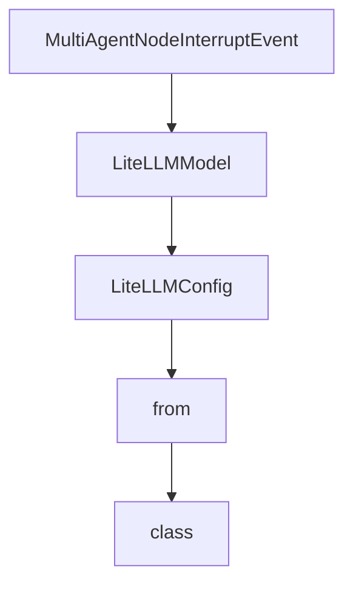

# Chapter 7: Deployment and Production Operations

Welcome to **Chapter 7: Deployment and Production Operations**. In this part of **Strands Agents Tutorial: Model-Driven Agent Systems with Native MCP Support**, you will build an intuitive mental model first, then move into concrete implementation details and practical production tradeoffs.


This chapter outlines production rollout and operational governance for Strands agents.

## Learning Goals

- prepare Strands services for production workloads
- build observability around agent and tool calls
- handle incident and rollback scenarios
- enforce security and dependency hygiene

## Operational Checklist

- pin versions for SDK, tools, and models
- capture structured logs/metrics for tool behavior
- define timeout/retry policies per integration
- document runbooks for degraded dependencies

## Source References

- [Strands Production Guide](https://strandsagents.com/latest/documentation/docs/user-guide/deploy/operating-agents-in-production/)
- [Strands Contributing Guide](https://github.com/strands-agents/sdk-python/blob/main/CONTRIBUTING.md)
- [Strands MCP Architecture Notes](https://github.com/strands-agents/sdk-python/blob/main/docs/MCP_CLIENT_ARCHITECTURE.md)

## Summary

You now have a deployment and operations baseline for production Strands usage.

Next: [Chapter 8: Contribution Workflow and Ecosystem Extensions](08-contribution-workflow-and-ecosystem-extensions.md)

## Depth Expansion Playbook

## Source Code Walkthrough

### `src/strands/types/_events.py`

The `MultiAgentNodeInterruptEvent` class in [`src/strands/types/_events.py`](https://github.com/strands-agents/sdk-python/blob/HEAD/src/strands/types/_events.py) handles a key part of this chapter's functionality:

```py


class MultiAgentNodeInterruptEvent(TypedEvent):
    """Event emitted when a node is interrupted."""

    def __init__(self, node_id: str, interrupts: list[Interrupt]) -> None:
        """Set interrupt in the event payload.

        Args:
            node_id: Unique identifier for the node generating the event.
            interrupts: Interrupts raised by user.
        """
        super().__init__(
            {
                "type": "multiagent_node_interrupt",
                "node_id": node_id,
                "interrupts": interrupts,
            }
        )

    @property
    def interrupts(self) -> list[Interrupt]:
        """The interrupt instances."""
        return cast(list[Interrupt], self["interrupts"])

```

This class is important because it defines how Strands Agents Tutorial: Model-Driven Agent Systems with Native MCP Support implements the patterns covered in this chapter.

### `src/strands/models/litellm.py`

The `LiteLLMModel` class in [`src/strands/models/litellm.py`](https://github.com/strands-agents/sdk-python/blob/HEAD/src/strands/models/litellm.py) handles a key part of this chapter's functionality:

```py


class LiteLLMModel(OpenAIModel):
    """LiteLLM model provider implementation."""

    class LiteLLMConfig(TypedDict, total=False):
        """Configuration options for LiteLLM models.

        Attributes:
            model_id: Model ID (e.g., "openai/gpt-4o", "anthropic/claude-3-sonnet").
                For a complete list of supported models, see https://docs.litellm.ai/docs/providers.
            params: Model parameters (e.g., max_tokens).
                For a complete list of supported parameters, see
                https://docs.litellm.ai/docs/completion/input#input-params-1.
        """

        model_id: str
        params: dict[str, Any] | None

    def __init__(self, client_args: dict[str, Any] | None = None, **model_config: Unpack[LiteLLMConfig]) -> None:
        """Initialize provider instance.

        Args:
            client_args: Arguments for the LiteLLM client.
                For a complete list of supported arguments, see
                https://github.com/BerriAI/litellm/blob/main/litellm/main.py.
            **model_config: Configuration options for the LiteLLM model.
        """
        self.client_args = client_args or {}
        validate_config_keys(model_config, self.LiteLLMConfig)
        self.config = dict(model_config)
        self._apply_proxy_prefix()
```

This class is important because it defines how Strands Agents Tutorial: Model-Driven Agent Systems with Native MCP Support implements the patterns covered in this chapter.

### `src/strands/models/litellm.py`

The `LiteLLMConfig` class in [`src/strands/models/litellm.py`](https://github.com/strands-agents/sdk-python/blob/HEAD/src/strands/models/litellm.py) handles a key part of this chapter's functionality:

```py
    """LiteLLM model provider implementation."""

    class LiteLLMConfig(TypedDict, total=False):
        """Configuration options for LiteLLM models.

        Attributes:
            model_id: Model ID (e.g., "openai/gpt-4o", "anthropic/claude-3-sonnet").
                For a complete list of supported models, see https://docs.litellm.ai/docs/providers.
            params: Model parameters (e.g., max_tokens).
                For a complete list of supported parameters, see
                https://docs.litellm.ai/docs/completion/input#input-params-1.
        """

        model_id: str
        params: dict[str, Any] | None

    def __init__(self, client_args: dict[str, Any] | None = None, **model_config: Unpack[LiteLLMConfig]) -> None:
        """Initialize provider instance.

        Args:
            client_args: Arguments for the LiteLLM client.
                For a complete list of supported arguments, see
                https://github.com/BerriAI/litellm/blob/main/litellm/main.py.
            **model_config: Configuration options for the LiteLLM model.
        """
        self.client_args = client_args or {}
        validate_config_keys(model_config, self.LiteLLMConfig)
        self.config = dict(model_config)
        self._apply_proxy_prefix()

        logger.debug("config=<%s> | initializing", self.config)

```

This class is important because it defines how Strands Agents Tutorial: Model-Driven Agent Systems with Native MCP Support implements the patterns covered in this chapter.

### `src/strands/models/sagemaker.py`

The `from` class in [`src/strands/models/sagemaker.py`](https://github.com/strands-agents/sdk-python/blob/HEAD/src/strands/models/sagemaker.py) handles a key part of this chapter's functionality:

```py
import logging
import os
from collections.abc import AsyncGenerator
from dataclasses import dataclass
from typing import Any, Literal, TypedDict, TypeVar

import boto3
from botocore.config import Config as BotocoreConfig
from mypy_boto3_sagemaker_runtime import SageMakerRuntimeClient
from pydantic import BaseModel
from typing_extensions import Unpack, override

from ..types.content import ContentBlock, Messages
from ..types.streaming import StreamEvent
from ..types.tools import ToolChoice, ToolResult, ToolSpec
from ._validation import validate_config_keys, warn_on_tool_choice_not_supported
from .openai import OpenAIModel

T = TypeVar("T", bound=BaseModel)

logger = logging.getLogger(__name__)


@dataclass
class UsageMetadata:
    """Usage metadata for the model.

    Attributes:
        total_tokens: Total number of tokens used in the request
        completion_tokens: Number of tokens used in the completion
        prompt_tokens: Number of tokens used in the prompt
        prompt_tokens_details: Additional information about the prompt tokens (optional)
```

This class is important because it defines how Strands Agents Tutorial: Model-Driven Agent Systems with Native MCP Support implements the patterns covered in this chapter.


## How These Components Connect


