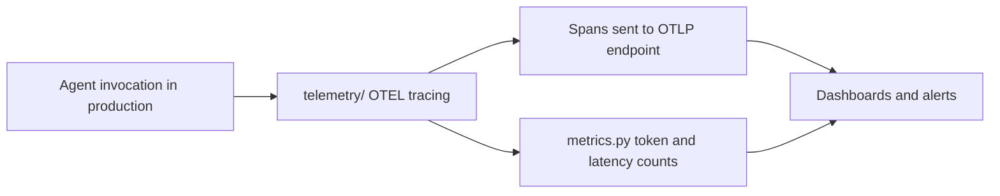

# Chapter 7: Deployment and Production Operations

Welcome to **Chapter 7: Deployment and Production Operations**. In this part of **Strands Agents Tutorial: Model-Driven Agent Systems with Native MCP Support**, you will build an intuitive mental model first, then move into concrete implementation details and practical production tradeoffs.

This chapter outlines production rollout and operational governance for Strands agents.

## Learning Goals

- prepare Strands services for production workloads
- build observability around agent and tool calls
- handle incident and rollback scenarios
- enforce security and dependency hygiene

## Operational Checklist

- pin versions for SDK, tools, and models
- capture structured logs/metrics for tool behavior
- define timeout/retry policies per integration
- document runbooks for degraded dependencies

## Source References

- [Strands Production Guide](https://strandsagents.com/latest/documentation/docs/user-guide/deploy/operating-agents-in-production/)
- [Strands Contributing Guide](https://github.com/strands-agents/sdk-python/blob/main/CONTRIBUTING.md)
- [Strands MCP Architecture Notes](https://github.com/strands-agents/sdk-python/blob/main/docs/MCP_CLIENT_ARCHITECTURE.md)

## Summary

You now have a deployment and operations baseline for production Strands usage.

Next: [Chapter 8: Contribution Workflow and Ecosystem Extensions](08-contribution-workflow-and-ecosystem-extensions.md)

## Source Code Walkthrough

Use the following upstream sources to verify deployment and production operations details while reading this chapter:

- [`src/strands/telemetry/`](https://github.com/strands-agents/sdk-python/blob/HEAD/src/strands/telemetry/) — the observability module providing OpenTelemetry tracing and metrics export for production monitoring of agent invocations, tool calls, and model latency.
- [`src/strands/telemetry/metrics.py`](https://github.com/strands-agents/sdk-python/blob/HEAD/src/strands/telemetry/metrics.py) — the metrics collection implementation that records token counts, latency, and tool call frequency as OTEL metrics for dashboarding and alerting.

Suggested trace strategy:
- review `src/strands/telemetry/tracer.py` to see how OpenTelemetry spans are created around agent invocations and tool calls
- trace `metrics.py` to understand which metrics are emitted by default and how to extend with custom metrics
- check environment variable documentation for `OTEL_EXPORTER_OTLP_ENDPOINT` and related settings that control telemetry export in production

## How These Components Connect

