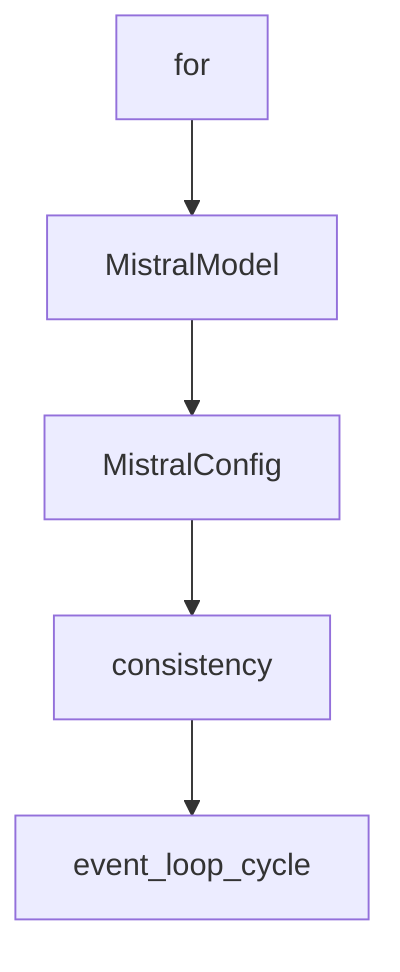

# Chapter 8: Contribution Workflow and Ecosystem Extensions

Welcome to **Chapter 8: Contribution Workflow and Ecosystem Extensions**. In this part of **Strands Agents Tutorial: Model-Driven Agent Systems with Native MCP Support**, you will build an intuitive mental model first, then move into concrete implementation details and practical production tradeoffs.


This chapter covers how to contribute effectively and extend the Strands ecosystem.

## Learning Goals

- follow contribution guidelines and development tenets
- use style/lint/test workflows before PRs
- extend capabilities through ecosystem repos
- align contributions with long-term maintainability

## Ecosystem Surfaces

- `strands-agents/tools` for reusable tool bundles
- `strands-agents/samples` for implementation references
- SDK docs and architecture notes for deeper internals

## Source References

- [Strands Contributing Guide](https://github.com/strands-agents/sdk-python/blob/main/CONTRIBUTING.md)
- [Strands Development Style Guide](https://github.com/strands-agents/sdk-python/blob/main/docs/STYLE_GUIDE.md)
- [Strands Tools Repository](https://github.com/strands-agents/tools)
- [Strands Samples Repository](https://github.com/strands-agents/samples)

## Summary

You now have a full Strands track from first agent to ecosystem-level contribution.

Next tutorial: [ADK Python Tutorial](../adk-python-tutorial/)

## Depth Expansion Playbook

## Source Code Walkthrough

### `src/strands/models/gemini.py`

The `for` interface in [`src/strands/models/gemini.py`](https://github.com/strands-agents/sdk-python/blob/HEAD/src/strands/models/gemini.py) handles a key part of this chapter's functionality:

```py

    class GeminiConfig(TypedDict, total=False):
        """Configuration options for Gemini models.

        Attributes:
            model_id: Gemini model ID (e.g., "gemini-2.5-flash").
                For a complete list of supported models, see
                https://ai.google.dev/gemini-api/docs/models
            params: Additional model parameters (e.g., temperature).
                For a complete list of supported parameters, see
                https://ai.google.dev/api/generate-content#generationconfig.
            gemini_tools: Gemini-specific tools that are not FunctionDeclarations
                (e.g., GoogleSearch, CodeExecution, ComputerUse, UrlContext, FileSearch).
                Use the standard tools interface for function calling tools.
                For a complete list of supported tools, see
                https://ai.google.dev/api/caching#Tool
        """

        model_id: Required[str]
        params: dict[str, Any]
        gemini_tools: list[genai.types.Tool]

    def __init__(
        self,
        *,
        client: genai.Client | None = None,
        client_args: dict[str, Any] | None = None,
        **model_config: Unpack[GeminiConfig],
    ) -> None:
        """Initialize provider instance.

        Args:
```

This interface is important because it defines how Strands Agents Tutorial: Model-Driven Agent Systems with Native MCP Support implements the patterns covered in this chapter.

### `src/strands/models/mistral.py`

The `MistralModel` class in [`src/strands/models/mistral.py`](https://github.com/strands-agents/sdk-python/blob/HEAD/src/strands/models/mistral.py) handles a key part of this chapter's functionality:

```py


class MistralModel(Model):
    """Mistral API model provider implementation.

    The implementation handles Mistral-specific features such as:

    - Chat and text completions
    - Streaming responses
    - Tool/function calling
    - System prompts
    """

    class MistralConfig(TypedDict, total=False):
        """Configuration parameters for Mistral models.

        Attributes:
            model_id: Mistral model ID (e.g., "mistral-large-latest", "mistral-medium-latest").
            max_tokens: Maximum number of tokens to generate in the response.
            temperature: Controls randomness in generation (0.0 to 1.0).
            top_p: Controls diversity via nucleus sampling.
            stream: Whether to enable streaming responses.
        """

        model_id: str
        max_tokens: int | None
        temperature: float | None
        top_p: float | None
        stream: bool | None

    def __init__(
        self,
```

This class is important because it defines how Strands Agents Tutorial: Model-Driven Agent Systems with Native MCP Support implements the patterns covered in this chapter.

### `src/strands/models/mistral.py`

The `MistralConfig` class in [`src/strands/models/mistral.py`](https://github.com/strands-agents/sdk-python/blob/HEAD/src/strands/models/mistral.py) handles a key part of this chapter's functionality:

```py
    """

    class MistralConfig(TypedDict, total=False):
        """Configuration parameters for Mistral models.

        Attributes:
            model_id: Mistral model ID (e.g., "mistral-large-latest", "mistral-medium-latest").
            max_tokens: Maximum number of tokens to generate in the response.
            temperature: Controls randomness in generation (0.0 to 1.0).
            top_p: Controls diversity via nucleus sampling.
            stream: Whether to enable streaming responses.
        """

        model_id: str
        max_tokens: int | None
        temperature: float | None
        top_p: float | None
        stream: bool | None

    def __init__(
        self,
        api_key: str | None = None,
        *,
        client_args: dict[str, Any] | None = None,
        **model_config: Unpack[MistralConfig],
    ) -> None:
        """Initialize provider instance.

        Args:
            api_key: Mistral API key. If not provided, will use MISTRAL_API_KEY env var.
            client_args: Additional arguments for the Mistral client.
            **model_config: Configuration options for the Mistral model.
```

This class is important because it defines how Strands Agents Tutorial: Model-Driven Agent Systems with Native MCP Support implements the patterns covered in this chapter.

### `src/strands/models/mistral.py`

The `consistency` interface in [`src/strands/models/mistral.py`](https://github.com/strands-agents/sdk-python/blob/HEAD/src/strands/models/mistral.py) handles a key part of this chapter's functionality:

```py
            system_prompt: System prompt to provide context to the model.
            tool_choice: Selection strategy for tool invocation. **Note: This parameter is accepted for
                interface consistency but is currently ignored for this model provider.**
            **kwargs: Additional keyword arguments for future extensibility.

        Yields:
            Formatted message chunks from the model.

        Raises:
            ModelThrottledException: When the model service is throttling requests.
        """
        warn_on_tool_choice_not_supported(tool_choice)

        logger.debug("formatting request")
        request = self.format_request(messages, tool_specs, system_prompt)
        logger.debug("request=<%s>", request)

        logger.debug("invoking model")
        try:
            logger.debug("got response from model")
            if not self.config.get("stream", True):
                # Use non-streaming API
                async with mistralai.Mistral(**self.client_args) as client:
                    response = await client.chat.complete_async(**request)
                    for event in self._handle_non_streaming_response(response):
                        yield self.format_chunk(event)

                return

            # Use the streaming API
            async with mistralai.Mistral(**self.client_args) as client:
                stream_response = await client.chat.stream_async(**request)
```

This interface is important because it defines how Strands Agents Tutorial: Model-Driven Agent Systems with Native MCP Support implements the patterns covered in this chapter.


## How These Components Connect


