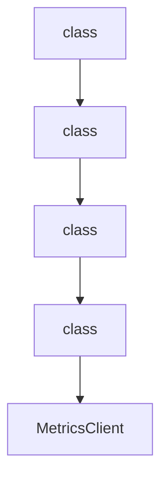

# Chapter 8: Contribution Workflow and Ecosystem Extensions

Welcome to **Chapter 8: Contribution Workflow and Ecosystem Extensions**. In this part of **Strands Agents Tutorial: Model-Driven Agent Systems with Native MCP Support**, you will build an intuitive mental model first, then move into concrete implementation details and practical production tradeoffs.


This chapter covers how to contribute effectively and extend the Strands ecosystem.

## Learning Goals

- follow contribution guidelines and development tenets
- use style/lint/test workflows before PRs
- extend capabilities through ecosystem repos
- align contributions with long-term maintainability

## Ecosystem Surfaces

- `strands-agents/tools` for reusable tool bundles
- `strands-agents/samples` for implementation references
- SDK docs and architecture notes for deeper internals

## Source References

- [Strands Contributing Guide](https://github.com/strands-agents/sdk-python/blob/main/CONTRIBUTING.md)
- [Strands Development Style Guide](https://github.com/strands-agents/sdk-python/blob/main/docs/STYLE_GUIDE.md)
- [Strands Tools Repository](https://github.com/strands-agents/tools)
- [Strands Samples Repository](https://github.com/strands-agents/samples)

## Summary

You now have a full Strands track from first agent to ecosystem-level contribution.

Next tutorial: [ADK Python Tutorial](../adk-python-tutorial/)

## Source Code Walkthrough

### `src/strands/telemetry/metrics.py`

The `class` class in [`src/strands/telemetry/metrics.py`](https://github.com/strands-agents/sdk-python/blob/HEAD/src/strands/telemetry/metrics.py) handles a key part of this chapter's functionality:

```py
import uuid
from collections.abc import Iterable
from dataclasses import dataclass, field
from typing import Any, Optional

import opentelemetry.metrics as metrics_api
from opentelemetry.metrics import Counter, Histogram, Meter

from ..telemetry import metrics_constants as constants
from ..types.content import Message
from ..types.event_loop import Metrics, Usage
from ..types.tools import ToolUse

logger = logging.getLogger(__name__)


class Trace:
    """A trace representing a single operation or step in the execution flow."""

    def __init__(
        self,
        name: str,
        parent_id: str | None = None,
        start_time: float | None = None,
        raw_name: str | None = None,
        metadata: dict[str, Any] | None = None,
        message: Message | None = None,
    ) -> None:
        """Initialize a new trace.

        Args:
            name: Human-readable name of the operation being traced.
```

This class is important because it defines how Strands Agents Tutorial: Model-Driven Agent Systems with Native MCP Support implements the patterns covered in this chapter.

### `src/strands/telemetry/metrics.py`

The `class` class in [`src/strands/telemetry/metrics.py`](https://github.com/strands-agents/sdk-python/blob/HEAD/src/strands/telemetry/metrics.py) handles a key part of this chapter's functionality:

```py
import uuid
from collections.abc import Iterable
from dataclasses import dataclass, field
from typing import Any, Optional

import opentelemetry.metrics as metrics_api
from opentelemetry.metrics import Counter, Histogram, Meter

from ..telemetry import metrics_constants as constants
from ..types.content import Message
from ..types.event_loop import Metrics, Usage
from ..types.tools import ToolUse

logger = logging.getLogger(__name__)


class Trace:
    """A trace representing a single operation or step in the execution flow."""

    def __init__(
        self,
        name: str,
        parent_id: str | None = None,
        start_time: float | None = None,
        raw_name: str | None = None,
        metadata: dict[str, Any] | None = None,
        message: Message | None = None,
    ) -> None:
        """Initialize a new trace.

        Args:
            name: Human-readable name of the operation being traced.
```

This class is important because it defines how Strands Agents Tutorial: Model-Driven Agent Systems with Native MCP Support implements the patterns covered in this chapter.

### `src/strands/telemetry/metrics.py`

The `class` class in [`src/strands/telemetry/metrics.py`](https://github.com/strands-agents/sdk-python/blob/HEAD/src/strands/telemetry/metrics.py) handles a key part of this chapter's functionality:

```py
import uuid
from collections.abc import Iterable
from dataclasses import dataclass, field
from typing import Any, Optional

import opentelemetry.metrics as metrics_api
from opentelemetry.metrics import Counter, Histogram, Meter

from ..telemetry import metrics_constants as constants
from ..types.content import Message
from ..types.event_loop import Metrics, Usage
from ..types.tools import ToolUse

logger = logging.getLogger(__name__)


class Trace:
    """A trace representing a single operation or step in the execution flow."""

    def __init__(
        self,
        name: str,
        parent_id: str | None = None,
        start_time: float | None = None,
        raw_name: str | None = None,
        metadata: dict[str, Any] | None = None,
        message: Message | None = None,
    ) -> None:
        """Initialize a new trace.

        Args:
            name: Human-readable name of the operation being traced.
```

This class is important because it defines how Strands Agents Tutorial: Model-Driven Agent Systems with Native MCP Support implements the patterns covered in this chapter.

### `src/strands/telemetry/metrics.py`

The `class` class in [`src/strands/telemetry/metrics.py`](https://github.com/strands-agents/sdk-python/blob/HEAD/src/strands/telemetry/metrics.py) handles a key part of this chapter's functionality:

```py
import uuid
from collections.abc import Iterable
from dataclasses import dataclass, field
from typing import Any, Optional

import opentelemetry.metrics as metrics_api
from opentelemetry.metrics import Counter, Histogram, Meter

from ..telemetry import metrics_constants as constants
from ..types.content import Message
from ..types.event_loop import Metrics, Usage
from ..types.tools import ToolUse

logger = logging.getLogger(__name__)


class Trace:
    """A trace representing a single operation or step in the execution flow."""

    def __init__(
        self,
        name: str,
        parent_id: str | None = None,
        start_time: float | None = None,
        raw_name: str | None = None,
        metadata: dict[str, Any] | None = None,
        message: Message | None = None,
    ) -> None:
        """Initialize a new trace.

        Args:
            name: Human-readable name of the operation being traced.
```

This class is important because it defines how Strands Agents Tutorial: Model-Driven Agent Systems with Native MCP Support implements the patterns covered in this chapter.


## How These Components Connect


