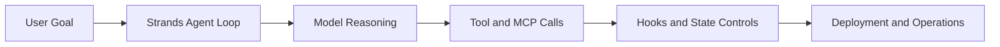

# Strands Agents Tutorial: Model-Driven Agent Systems with Native MCP Support

> Learn how to use `strands-agents/sdk-python` to build lightweight, model-driven agents with strong tool abstractions, hooks, and production deployment patterns.

## Why This Track Matters

Strands emphasizes simple defaults and extensible primitives, making it effective for teams that need quick iteration without losing production rigor.

This track focuses on:

- launching agents in a few lines of Python
- integrating custom tools and MCP servers cleanly
- tuning model provider and runtime behavior for reliability
- deploying and operating Strands systems at scale

## Current Snapshot (Verified February 12, 2026)

- repository: [`strands-agents/sdk-python`](https://github.com/strands-agents/sdk-python)
- stars: about **5.1k**
- latest release: [`v1.26.0`](https://github.com/strands-agents/sdk-python/releases/tag/v1.26.0)
- recent activity: updates on **February 11, 2026**
- project positioning: model-driven agent SDK with native MCP integration and broad provider support

## Mental Model

## Chapter Guide

| Chapter | Key Question | Outcome |
|:--------|:-------------|:--------|
| [01 - Getting Started](01-getting-started.md) | How do I run my first Strands agent quickly? | Working baseline |
| [02 - Agent Loop and Model-Driven Architecture](02-agent-loop-and-model-driven-architecture.md) | How does Strands execute decisions and actions? | Clear architecture model |
| [03 - Tools and MCP Integration](03-tools-and-mcp-integration.md) | How do I connect tools and MCP servers safely? | Integration baseline |
| [04 - Model Providers and Runtime Strategy](04-model-providers-and-runtime-strategy.md) | How do I choose providers and tune runtime behavior? | Better provider strategy |
| [05 - Hooks, State, and Reliability Controls](05-hooks-state-and-reliability-controls.md) | How do I enforce behavior and improve reliability? | Strong operational controls |
| [06 - Multi-Agent and Advanced Patterns](06-multi-agent-and-advanced-patterns.md) | How do I compose more capable agent systems? | Scalable design patterns |
| [07 - Deployment and Production Operations](07-deployment-and-production-operations.md) | How do I ship Strands agents in production? | Production runbook |
| [08 - Contribution Workflow and Ecosystem Extensions](08-contribution-workflow-and-ecosystem-extensions.md) | How do I contribute and extend the ecosystem? | Contributor readiness |

## What You Will Learn

- how to build model-driven agents with minimal boilerplate
- how to integrate MCP and custom tools without async complexity leaks
- how to apply hooks and runtime controls for safer behavior
- how to deploy and iterate Strands systems with production discipline

## Source References

- [Strands Python SDK Repository](https://github.com/strands-agents/sdk-python)
- [Strands README](https://github.com/strands-agents/sdk-python/blob/main/README.md)
- [Strands Documentation](https://strandsagents.com/latest/documentation/docs/)
- [Strands Python Quickstart](https://strandsagents.com/latest/documentation/docs/user-guide/quickstart/python/)
- [Strands MCP Client Architecture](https://github.com/strands-agents/sdk-python/blob/main/docs/MCP_CLIENT_ARCHITECTURE.md)

## Related Tutorials

- [MCP Servers Tutorial](../mcp-servers-tutorial/)
- [LangGraph Tutorial](../langgraph-tutorial/)
- [CrewAI Tutorial](../crewai-tutorial/)
- [Anything LLM Tutorial](../anything-llm-tutorial/)

---

Start with [Chapter 1: Getting Started](01-getting-started.md).
