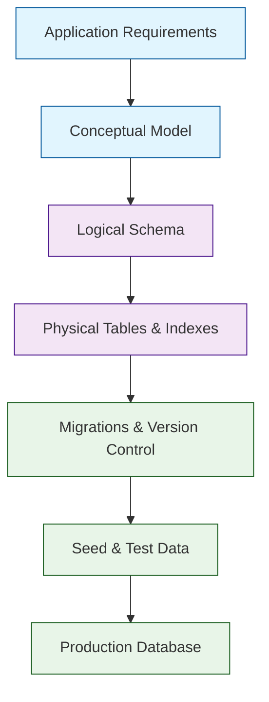
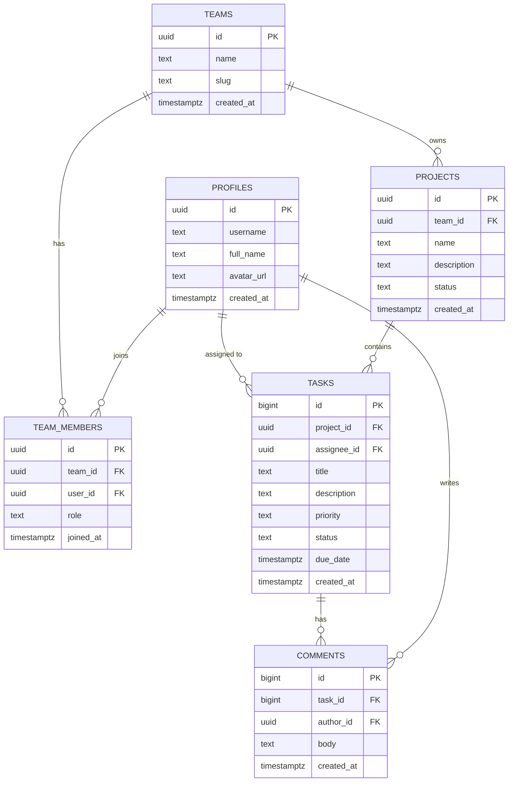
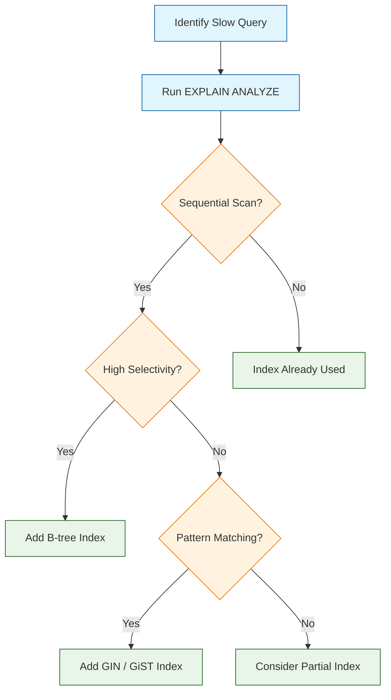

# Chapter 2: Database Design & Management

In [Chapter 1](01-getting-started.md), you set up a Supabase project, created your first table, and built a working task application. Now it is time to go deeper into the heart of Supabase -- PostgreSQL. A well-designed database schema is the foundation of every reliable application. In this chapter you will learn how to model data with tables, relationships, and constraints; manage schema changes through migrations; seed development data; index for performance; and lay the groundwork for Row Level Security.

## Why Database Design Matters

Every query your application runs, every RLS policy you write, and every real-time subscription you open depends on how your tables are structured. Poor design leads to slow queries, security gaps, and painful migrations down the road.



## Core Data Modeling Concepts

### Choosing Primary Keys

Supabase tables support several primary key strategies. Each has trade-offs.

| Strategy | Example | Pros | Cons |
|---|---|---|---|
| `BIGSERIAL` | `id BIGSERIAL PRIMARY KEY` | Human-readable, compact | Predictable, leaks row count |
| `UUID v4` | `id UUID DEFAULT gen_random_uuid()` | Universally unique, safe for distributed clients | Larger (16 bytes), unordered |
| `ULID / UUID v7` | `id UUID DEFAULT uuid_generate_v7()` | Sortable + unique | Requires extension or custom function |
| Natural key | `email TEXT PRIMARY KEY` | Meaningful | Mutable values cause cascading updates |

For most Supabase applications, UUID is the recommended default because the `auth.users` table already uses UUIDs, and foreign keys align naturally.

### Data Types Reference

PostgreSQL offers a rich set of types. Here are the ones you will use most often in Supabase.

| Use Case | Recommended Type | Notes |
|---|---|---|
| Short text | `TEXT` | Prefer over `VARCHAR(n)` -- add a `CHECK` constraint if you need a max length |
| Long content | `TEXT` | No performance difference vs `VARCHAR` in Postgres |
| Numbers | `INTEGER`, `BIGINT`, `NUMERIC` | Use `NUMERIC` for money; avoid floating point for currency |
| Boolean flags | `BOOLEAN DEFAULT FALSE` | Always set a default |
| Timestamps | `TIMESTAMPTZ DEFAULT NOW()` | Always use `TIMESTAMPTZ` (with time zone) |
| JSON data | `JSONB` | Binary JSON -- indexed and queryable |
| Enumerations | `TEXT CHECK (status IN ('draft','published','archived'))` | Simpler than `CREATE TYPE` for small sets |
| Arrays | `TEXT[]`, `INTEGER[]` | Useful for tags; index with GIN |
| Geospatial | `GEOGRAPHY` / `GEOMETRY` | Requires PostGIS extension |

## Designing a Complete Schema

Let us build the schema for a team collaboration application with users, teams, projects, and tasks.



### Profiles Table

```sql
-- Profiles extend the built-in auth.users table
CREATE TABLE public.profiles (
  id UUID PRIMARY KEY REFERENCES auth.users(id) ON DELETE CASCADE,
  username TEXT UNIQUE NOT NULL,
  full_name TEXT,
  avatar_url TEXT,
  created_at TIMESTAMPTZ DEFAULT NOW(),

  CONSTRAINT username_length CHECK (char_length(username) >= 3 AND char_length(username) <= 30),
  CONSTRAINT username_format CHECK (username ~ '^[a-z0-9_]+$')
);

-- Fast lookup by username
CREATE INDEX idx_profiles_username ON public.profiles (username);

COMMENT ON TABLE public.profiles IS 'Public user profiles linked to auth.users';
```

### Teams and Membership

```sql
CREATE TABLE public.teams (
  id UUID PRIMARY KEY DEFAULT gen_random_uuid(),
  name TEXT NOT NULL,
  slug TEXT UNIQUE NOT NULL,
  created_at TIMESTAMPTZ DEFAULT NOW(),

  CONSTRAINT slug_format CHECK (slug ~ '^[a-z0-9-]+$')
);

CREATE TABLE public.team_members (
  id UUID PRIMARY KEY DEFAULT gen_random_uuid(),
  team_id UUID NOT NULL REFERENCES public.teams(id) ON DELETE CASCADE,
  user_id UUID NOT NULL REFERENCES public.profiles(id) ON DELETE CASCADE,
  role TEXT NOT NULL DEFAULT 'member'
    CHECK (role IN ('owner', 'admin', 'member', 'viewer')),
  joined_at TIMESTAMPTZ DEFAULT NOW(),

  -- Each user can only be in a team once
  UNIQUE (team_id, user_id)
);

-- Quickly find all teams for a user, or all members of a team
CREATE INDEX idx_team_members_user ON public.team_members (user_id);
CREATE INDEX idx_team_members_team ON public.team_members (team_id);
```

### Projects

```sql
CREATE TABLE public.projects (
  id UUID PRIMARY KEY DEFAULT gen_random_uuid(),
  team_id UUID NOT NULL REFERENCES public.teams(id) ON DELETE CASCADE,
  name TEXT NOT NULL,
  description TEXT,
  status TEXT NOT NULL DEFAULT 'active'
    CHECK (status IN ('active', 'archived', 'completed')),
  created_at TIMESTAMPTZ DEFAULT NOW()
);

CREATE INDEX idx_projects_team ON public.projects (team_id);
CREATE INDEX idx_projects_status ON public.projects (team_id, status);
```

### Tasks

```sql
CREATE TABLE public.tasks (
  id BIGSERIAL PRIMARY KEY,
  project_id UUID NOT NULL REFERENCES public.projects(id) ON DELETE CASCADE,
  assignee_id UUID REFERENCES public.profiles(id) ON DELETE SET NULL,
  title TEXT NOT NULL,
  description TEXT,
  priority TEXT NOT NULL DEFAULT 'medium'
    CHECK (priority IN ('low', 'medium', 'high', 'urgent')),
  status TEXT NOT NULL DEFAULT 'todo'
    CHECK (status IN ('todo', 'in_progress', 'review', 'done')),
  due_date TIMESTAMPTZ,
  created_at TIMESTAMPTZ DEFAULT NOW(),
  updated_at TIMESTAMPTZ DEFAULT NOW()
);

-- Composite indexes for common query patterns
CREATE INDEX idx_tasks_project_status ON public.tasks (project_id, status);
CREATE INDEX idx_tasks_assignee ON public.tasks (assignee_id) WHERE assignee_id IS NOT NULL;
CREATE INDEX idx_tasks_due_date ON public.tasks (due_date) WHERE due_date IS NOT NULL;
```

### Comments

```sql
CREATE TABLE public.comments (
  id BIGSERIAL PRIMARY KEY,
  task_id BIGINT NOT NULL REFERENCES public.tasks(id) ON DELETE CASCADE,
  author_id UUID NOT NULL REFERENCES public.profiles(id) ON DELETE CASCADE,
  body TEXT NOT NULL,
  created_at TIMESTAMPTZ DEFAULT NOW()
);

CREATE INDEX idx_comments_task ON public.comments (task_id, created_at);
```

### Auto-Update Timestamps with Triggers

```sql
-- Reusable trigger function to update updated_at
CREATE OR REPLACE FUNCTION public.handle_updated_at()
RETURNS TRIGGER AS $$
BEGIN
  NEW.updated_at = NOW();
  RETURN NEW;
END;
$$ LANGUAGE plpgsql;

-- Apply to any table with an updated_at column
CREATE TRIGGER set_tasks_updated_at
  BEFORE UPDATE ON public.tasks
  FOR EACH ROW
  EXECUTE FUNCTION public.handle_updated_at();
```

## Database Migrations

Migrations are version-controlled SQL files that evolve your schema over time. Supabase CLI makes this workflow straightforward.


### Creating Migrations

```bash
# Create a new migration from a diff of your local changes
supabase db diff --file create_teams_schema

# Or create a blank migration and write SQL manually
supabase migration new add_comments_table
```

This creates a timestamped file in `supabase/migrations/`:

```
supabase/migrations/
├── 20240101000000_initial_schema.sql
├── 20240115000000_create_teams_schema.sql
└── 20240120000000_add_comments_table.sql
```

### Writing a Migration File

```sql
-- supabase/migrations/20240120000000_add_comments_table.sql

-- Up migration
CREATE TABLE IF NOT EXISTS public.comments (
  id BIGSERIAL PRIMARY KEY,
  task_id BIGINT NOT NULL REFERENCES public.tasks(id) ON DELETE CASCADE,
  author_id UUID NOT NULL REFERENCES public.profiles(id) ON DELETE CASCADE,
  body TEXT NOT NULL,
  created_at TIMESTAMPTZ DEFAULT NOW()
);

CREATE INDEX IF NOT EXISTS idx_comments_task
  ON public.comments (task_id, created_at);

-- Enable RLS
ALTER TABLE public.comments ENABLE ROW LEVEL SECURITY;

-- Policies
CREATE POLICY "Team members can view comments" ON public.comments
  FOR SELECT USING (
    EXISTS (
      SELECT 1 FROM public.tasks t
      JOIN public.projects p ON p.id = t.project_id
      JOIN public.team_members tm ON tm.team_id = p.team_id
      WHERE t.id = comments.task_id
        AND tm.user_id = auth.uid()
    )
  );

CREATE POLICY "Authenticated users can insert comments" ON public.comments
  FOR INSERT WITH CHECK (auth.uid() = author_id);
```

### Applying Migrations

```bash
# Apply to remote Supabase project
supabase db push

# Reset local database (drops and recreates)
supabase db reset

# Check migration status
supabase migration list
```

### Generating TypeScript Types

After every schema change, regenerate your types to keep client code in sync.

```bash
# Generate types from remote project
supabase gen types typescript --project-id YOUR_PROJECT_ID > src/types/supabase.ts

# Generate from local database
supabase gen types typescript --local > src/types/supabase.ts
```

The generated file provides full type safety:

```typescript
// src/types/supabase.ts (auto-generated)
export type Database = {
  public: {
    Tables: {
      profiles: {
        Row: {
          id: string
          username: string
          full_name: string | null
          avatar_url: string | null
          created_at: string
        }
        Insert: {
          id: string
          username: string
          full_name?: string | null
          avatar_url?: string | null
          created_at?: string
        }
        Update: {
          id?: string
          username?: string
          full_name?: string | null
          avatar_url?: string | null
          created_at?: string
        }
      }
      tasks: {
        Row: {
          id: number
          project_id: string
          assignee_id: string | null
          title: string
          description: string | null
          priority: 'low' | 'medium' | 'high' | 'urgent'
          status: 'todo' | 'in_progress' | 'review' | 'done'
          due_date: string | null
          created_at: string
          updated_at: string
        }
        Insert: {
          project_id: string
          title: string
          assignee_id?: string | null
          description?: string | null
          priority?: 'low' | 'medium' | 'high' | 'urgent'
          status?: 'todo' | 'in_progress' | 'review' | 'done'
          due_date?: string | null
        }
        Update: {
          title?: string
          assignee_id?: string | null
          description?: string | null
          priority?: 'low' | 'medium' | 'high' | 'urgent'
          status?: 'todo' | 'in_progress' | 'review' | 'done'
          due_date?: string | null
        }
      }
      // ... other tables
    }
  }
}
```

Use the generated types with your Supabase client:

```typescript
import { createClient } from '@supabase/supabase-js'
import type { Database } from './types/supabase'

const supabase = createClient<Database>(
  process.env.NEXT_PUBLIC_SUPABASE_URL!,
  process.env.NEXT_PUBLIC_SUPABASE_ANON_KEY!
)

// Now fully typed -- IDE autocomplete and compile-time checks
const { data: tasks } = await supabase
  .from('tasks')
  .select('id, title, status, priority')
  .eq('status', 'todo')
  .order('created_at', { ascending: false })

// data is typed as Pick<Task['Row'], 'id' | 'title' | 'status' | 'priority'>[]
```

## Seeding Development Data

Seed files populate your local database with realistic test data.

```sql
-- supabase/seed.sql

-- Create test users (in local dev, auth.users is accessible)
INSERT INTO auth.users (id, email, encrypted_password, email_confirmed_at, created_at, updated_at)
VALUES
  ('d0e1f2a3-b4c5-6d7e-8f9a-0b1c2d3e4f5a', 'alice@example.com', crypt('password123', gen_salt('bf')), NOW(), NOW(), NOW()),
  ('e1f2a3b4-c5d6-7e8f-9a0b-1c2d3e4f5a6b', 'bob@example.com', crypt('password123', gen_salt('bf')), NOW(), NOW(), NOW()),
  ('f2a3b4c5-d6e7-8f9a-0b1c-2d3e4f5a6b7c', 'carol@example.com', crypt('password123', gen_salt('bf')), NOW(), NOW(), NOW());

-- Profiles
INSERT INTO public.profiles (id, username, full_name)
VALUES
  ('d0e1f2a3-b4c5-6d7e-8f9a-0b1c2d3e4f5a', 'alice', 'Alice Johnson'),
  ('e1f2a3b4-c5d6-7e8f-9a0b-1c2d3e4f5a6b', 'bob', 'Bob Smith'),
  ('f2a3b4c5-d6e7-8f9a-0b1c-2d3e4f5a6b7c', 'carol', 'Carol Williams');

-- Teams
INSERT INTO public.teams (id, name, slug) VALUES
  ('a1b2c3d4-e5f6-7890-abcd-ef1234567890', 'Engineering', 'engineering'),
  ('b2c3d4e5-f6a7-8901-bcde-f12345678901', 'Design', 'design');

-- Team members
INSERT INTO public.team_members (team_id, user_id, role) VALUES
  ('a1b2c3d4-e5f6-7890-abcd-ef1234567890', 'd0e1f2a3-b4c5-6d7e-8f9a-0b1c2d3e4f5a', 'owner'),
  ('a1b2c3d4-e5f6-7890-abcd-ef1234567890', 'e1f2a3b4-c5d6-7e8f-9a0b-1c2d3e4f5a6b', 'member'),
  ('b2c3d4e5-f6a7-8901-bcde-f12345678901', 'f2a3b4c5-d6e7-8f9a-0b1c-2d3e4f5a6b7c', 'owner');

-- Projects
INSERT INTO public.projects (id, team_id, name, description, status) VALUES
  ('c3d4e5f6-a7b8-9012-cdef-123456789012', 'a1b2c3d4-e5f6-7890-abcd-ef1234567890', 'API Redesign', 'Rebuild the REST API with versioning', 'active'),
  ('d4e5f6a7-b8c9-0123-def0-234567890123', 'b2c3d4e5-f6a7-8901-bcde-f12345678901', 'Brand Refresh', 'Update visual identity', 'active');

-- Tasks
INSERT INTO public.tasks (project_id, assignee_id, title, priority, status) VALUES
  ('c3d4e5f6-a7b8-9012-cdef-123456789012', 'd0e1f2a3-b4c5-6d7e-8f9a-0b1c2d3e4f5a', 'Design new endpoint schema', 'high', 'in_progress'),
  ('c3d4e5f6-a7b8-9012-cdef-123456789012', 'e1f2a3b4-c5d6-7e8f-9a0b-1c2d3e4f5a6b', 'Write integration tests', 'medium', 'todo'),
  ('d4e5f6a7-b8c9-0123-def0-234567890123', 'f2a3b4c5-d6e7-8f9a-0b1c-2d3e4f5a6b7c', 'Create color palette', 'high', 'done');
```

Run the seed:

```bash
supabase db reset   # resets and re-seeds automatically
# or seed manually
supabase db seed --file supabase/seed.sql
```

## Indexing for Performance

Indexes make queries fast, but each index adds write overhead. Here is a decision framework.



### Index Types in PostgreSQL

| Index Type | Best For | Example |
|---|---|---|
| **B-tree** (default) | Equality, range, sorting | `CREATE INDEX ON tasks (status)` |
| **GIN** | Full-text search, arrays, JSONB | `CREATE INDEX ON articles USING GIN (search)` |
| **GiST** | Geometric, range types, proximity | `CREATE INDEX ON locations USING GIST (coordinates)` |
| **BRIN** | Large, naturally ordered tables | `CREATE INDEX ON events USING BRIN (created_at)` |
| **Partial** | Subset of rows | `CREATE INDEX ON tasks (due_date) WHERE status != 'done'` |

### Practical Indexing Examples

```sql
-- Composite index for filtering + sorting
CREATE INDEX idx_tasks_project_status_created
  ON public.tasks (project_id, status, created_at DESC);

-- Partial index: only index active tasks
CREATE INDEX idx_tasks_active
  ON public.tasks (assignee_id, due_date)
  WHERE status IN ('todo', 'in_progress');

-- GIN index for JSONB queries
ALTER TABLE public.profiles ADD COLUMN metadata JSONB DEFAULT '{}';
CREATE INDEX idx_profiles_metadata ON public.profiles USING GIN (metadata);

-- Use EXPLAIN ANALYZE to verify index usage
EXPLAIN ANALYZE
SELECT id, title, status
FROM public.tasks
WHERE project_id = 'c3d4e5f6-a7b8-9012-cdef-123456789012'
  AND status = 'todo'
ORDER BY created_at DESC
LIMIT 20;
```

## Database Functions and Views

### Reusable SQL Functions

```sql
-- Function to get task counts by status for a project
CREATE OR REPLACE FUNCTION public.get_project_stats(p_project_id UUID)
RETURNS TABLE (
  status TEXT,
  task_count BIGINT
) AS $$
BEGIN
  RETURN QUERY
  SELECT t.status, COUNT(*)
  FROM public.tasks t
  WHERE t.project_id = p_project_id
  GROUP BY t.status
  ORDER BY t.status;
END;
$$ LANGUAGE plpgsql STABLE SECURITY DEFINER;
```

Call from the client:

```typescript
const { data, error } = await supabase
  .rpc('get_project_stats', { p_project_id: projectId })

// data: [{ status: 'todo', task_count: 5 }, { status: 'done', task_count: 12 }]
```

### Database Views

Views simplify complex joins for client consumption.

```sql
-- View: tasks with assignee and project details
CREATE OR REPLACE VIEW public.task_details AS
SELECT
  t.id,
  t.title,
  t.status,
  t.priority,
  t.due_date,
  t.created_at,
  p.name AS project_name,
  p.team_id,
  pr.username AS assignee_username,
  pr.avatar_url AS assignee_avatar
FROM public.tasks t
JOIN public.projects p ON p.id = t.project_id
LEFT JOIN public.profiles pr ON pr.id = t.assignee_id;

-- Query the view from the client
-- Note: views inherit RLS from underlying tables
```

```typescript
const { data: taskDetails } = await supabase
  .from('task_details')
  .select('*')
  .eq('project_name', 'API Redesign')
  .order('created_at', { ascending: false })
```

## Row Level Security Foundations

RLS is the backbone of Supabase security. Enable it on every table that holds user data.

```sql
-- Enable RLS
ALTER TABLE public.profiles ENABLE ROW LEVEL SECURITY;
ALTER TABLE public.teams ENABLE ROW LEVEL SECURITY;
ALTER TABLE public.team_members ENABLE ROW LEVEL SECURITY;
ALTER TABLE public.projects ENABLE ROW LEVEL SECURITY;
ALTER TABLE public.tasks ENABLE ROW LEVEL SECURITY;
ALTER TABLE public.comments ENABLE ROW LEVEL SECURITY;

-- Profiles: users can read all profiles, update only their own
CREATE POLICY "Profiles are publicly readable"
  ON public.profiles FOR SELECT
  USING (true);

CREATE POLICY "Users can update own profile"
  ON public.profiles FOR UPDATE
  USING (auth.uid() = id)
  WITH CHECK (auth.uid() = id);

-- Team members: users can see teams they belong to
CREATE POLICY "Users can view their team memberships"
  ON public.team_members FOR SELECT
  USING (auth.uid() = user_id);

-- Tasks: users can view tasks in their team's projects
CREATE POLICY "Team members can view tasks"
  ON public.tasks FOR SELECT
  USING (
    EXISTS (
      SELECT 1 FROM public.projects p
      JOIN public.team_members tm ON tm.team_id = p.team_id
      WHERE p.id = tasks.project_id
        AND tm.user_id = auth.uid()
    )
  );
```

## PostgreSQL Extensions

Supabase ships with many PostgreSQL extensions. Enable only what you need.

```sql
-- Enable commonly used extensions
CREATE EXTENSION IF NOT EXISTS "pgcrypto";      -- gen_random_uuid(), crypt()
CREATE EXTENSION IF NOT EXISTS "pg_trgm";       -- Trigram similarity for fuzzy search
CREATE EXTENSION IF NOT EXISTS "uuid-ossp";     -- Additional UUID generators
CREATE EXTENSION IF NOT EXISTS "pgjwt";         -- JWT creation/verification
CREATE EXTENSION IF NOT EXISTS "pg_stat_statements"; -- Query performance tracking
```

| Extension | Purpose |
|---|---|
| `pgcrypto` | UUID generation, password hashing |
| `pg_trgm` | Fuzzy text matching (`ILIKE '%term%'` with index support) |
| `uuid-ossp` | UUID v1, v4, v5 generators |
| `pgjwt` | Sign and verify JWTs in SQL |
| `pg_stat_statements` | Track query performance statistics |
| `postgis` | Geospatial queries and data types |
| `pg_cron` | Schedule periodic SQL jobs |

## Troubleshooting Common Issues

| Problem | Cause | Solution |
|---|---|---|
| Migration conflicts | Multiple developers editing schema | Rebase migrations; use `supabase db diff` to regenerate |
| `permission denied for table` | RLS enabled with no matching policy | Add a policy or check `auth.uid()` availability |
| `duplicate key value violates unique constraint` | Conflicting seed data | Use `ON CONFLICT DO NOTHING` or clear data first |
| Slow queries | Missing index or sequential scan | Run `EXPLAIN ANALYZE`; add targeted indexes |
| Type generation stale | Schema changed without regenerating | Re-run `supabase gen types typescript` |
| `extension not found` | Extension not enabled | Run `CREATE EXTENSION IF NOT EXISTS "..."` |

## Summary

In this chapter you learned how to design a robust PostgreSQL schema for a real-world collaboration application. You created tables with proper data types, constraints, and relationships; built a migration workflow with the Supabase CLI; seeded development data; added indexes for performance; wrote database functions and views; and established Row Level Security foundations.

## Key Takeaways

1. **Use UUIDs as primary keys** to align with `auth.users` and support distributed clients.
2. **Add constraints at the database level** -- `CHECK`, `UNIQUE`, `NOT NULL` -- rather than relying solely on application code.
3. **Version-control your schema** with migrations; never modify production databases by hand.
4. **Generate TypeScript types** after every schema change to maintain type safety across the stack.
5. **Index strategically** -- cover your most frequent query patterns, but avoid over-indexing write-heavy tables.
6. **Enable RLS immediately** on every table that stores user data; build policies from day one.

## Next Steps

Your database is designed, indexed, and protected with RLS. In [Chapter 3: Authentication & Authorization](03-authentication.md), you will integrate Supabase Auth to manage users, implement OAuth providers, and write production-grade RLS policies that enforce per-user and per-team access control.

---

*Built with insights from the [Supabase](https://github.com/supabase/supabase) project.*
