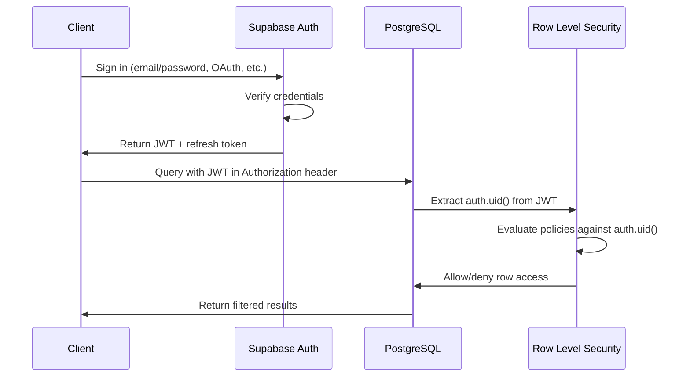
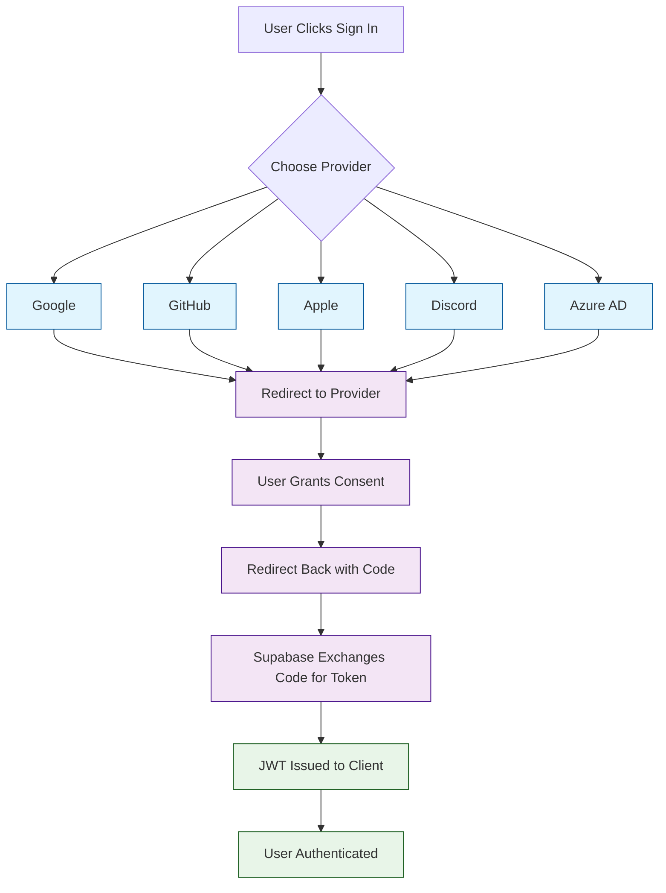

# Chapter 3: Authentication & Authorization

In [Chapter 2](02-database-design.md), you designed a robust database schema with tables, relationships, and Row Level Security foundations. Now you need to protect that data with a proper authentication system. Supabase Auth provides a complete identity layer built on top of GoTrue -- supporting email/password login, magic links, phone OTP, and over a dozen OAuth providers. In this chapter you will implement multiple auth strategies, manage user profiles with database triggers, build a session-aware React application, and write production-grade RLS policies.

## How Supabase Auth Works

Supabase Auth issues JSON Web Tokens (JWTs) on successful login. Every subsequent request from the client includes this token, and PostgreSQL RLS policies use the `auth.uid()` function to extract the user's identity from it.



### Authentication vs Authorization

| Concept | Question | Supabase Component |
|---|---|---|
| **Authentication** | "Who are you?" | Supabase Auth (GoTrue) |
| **Authorization** | "What can you access?" | Row Level Security (RLS) |
| **Identity** | "What attributes do you have?" | JWT claims + user metadata |
| **Session** | "Are you still logged in?" | Refresh tokens + session management |

## Email and Password Authentication

### Sign Up

```typescript
import { createClient } from '@supabase/supabase-js'
import type { Database } from './types/supabase'

const supabase = createClient<Database>(
  process.env.NEXT_PUBLIC_SUPABASE_URL!,
  process.env.NEXT_PUBLIC_SUPABASE_ANON_KEY!
)

// Sign up a new user
async function signUp(email: string, password: string, username: string) {
  const { data, error } = await supabase.auth.signUp({
    email,
    password,
    options: {
      // Store custom data in user_metadata
      data: {
        username,
        full_name: '',
      },
      // Redirect after email confirmation
      emailRedirectTo: `${window.location.origin}/auth/callback`,
    },
  })

  if (error) {
    console.error('Sign up failed:', error.message)
    throw error
  }

  // If email confirmation is enabled, user must verify before signing in
  if (data.user && !data.user.email_confirmed_at) {
    return { requiresConfirmation: true, user: data.user }
  }

  return { requiresConfirmation: false, user: data.user }
}
```

### Sign In

```typescript
// Email + password sign in
async function signIn(email: string, password: string) {
  const { data, error } = await supabase.auth.signInWithPassword({
    email,
    password,
  })

  if (error) {
    if (error.message === 'Invalid login credentials') {
      throw new Error('Incorrect email or password')
    }
    if (error.message === 'Email not confirmed') {
      throw new Error('Please check your email and confirm your account')
    }
    throw error
  }

  return data // { user, session }
}

// Sign out
async function signOut() {
  const { error } = await supabase.auth.signOut()
  if (error) throw error
}
```

### Magic Link (Passwordless)

```typescript
// Send a magic link via email
async function signInWithMagicLink(email: string) {
  const { error } = await supabase.auth.signInWithOtp({
    email,
    options: {
      emailRedirectTo: `${window.location.origin}/auth/callback`,
    },
  })

  if (error) throw error
  return { message: 'Check your email for the login link' }
}
```

### Phone OTP

```typescript
// Send OTP to phone number
async function signInWithPhone(phone: string) {
  const { error } = await supabase.auth.signInWithOtp({
    phone,  // E.164 format: +1234567890
  })

  if (error) throw error
  return { message: 'Check your phone for the OTP code' }
}

// Verify OTP
async function verifyPhoneOtp(phone: string, token: string) {
  const { data, error } = await supabase.auth.verifyOtp({
    phone,
    token,
    type: 'sms',
  })

  if (error) throw error
  return data
}
```

## OAuth Providers

Supabase supports many third-party identity providers. Here is how to configure and use them.



### Supported OAuth Providers

| Provider | Config Key | Requires |
|---|---|---|
| Google | `google` | Client ID + Secret from Google Cloud Console |
| GitHub | `github` | OAuth App from GitHub Developer Settings |
| Apple | `apple` | App ID + Service ID from Apple Developer |
| Discord | `discord` | Application from Discord Developer Portal |
| Microsoft/Azure | `azure` | App Registration in Azure AD |
| Twitter/X | `twitter` | OAuth 2.0 credentials from Developer Portal |
| Slack | `slack` | Slack App with OAuth scopes |
| GitLab | `gitlab` | Application from GitLab settings |
| Notion | `notion` | Integration from Notion Developer |

### Implementing OAuth

```typescript
// Google OAuth
async function signInWithGoogle() {
  const { data, error } = await supabase.auth.signInWithOAuth({
    provider: 'google',
    options: {
      redirectTo: `${window.location.origin}/auth/callback`,
      queryParams: {
        access_type: 'offline',
        prompt: 'consent',
      },
      scopes: 'openid email profile',
    },
  })

  if (error) throw error
  // Browser redirects to Google automatically
}

// GitHub OAuth
async function signInWithGitHub() {
  const { data, error } = await supabase.auth.signInWithOAuth({
    provider: 'github',
    options: {
      redirectTo: `${window.location.origin}/auth/callback`,
      scopes: 'user:email read:org',
    },
  })

  if (error) throw error
}

// Discord OAuth
async function signInWithDiscord() {
  const { data, error } = await supabase.auth.signInWithOAuth({
    provider: 'discord',
    options: {
      redirectTo: `${window.location.origin}/auth/callback`,
    },
  })

  if (error) throw error
}
```

### OAuth Callback Handler (Next.js)

```typescript
// app/auth/callback/route.ts (Next.js App Router)
import { createRouteHandlerClient } from '@supabase/auth-helpers-nextjs'
import { cookies } from 'next/headers'
import { NextResponse } from 'next/server'
import type { NextRequest } from 'next/server'

export async function GET(request: NextRequest) {
  const requestUrl = new URL(request.url)
  const code = requestUrl.searchParams.get('code')

  if (code) {
    const supabase = createRouteHandlerClient({ cookies })
    // Exchange the authorization code for a session
    await supabase.auth.exchangeCodeForSession(code)
  }

  // Redirect to the app after successful auth
  return NextResponse.redirect(new URL('/dashboard', request.url))
}
```

## Auto-Creating User Profiles

When a user signs up, you typically want a matching row in your `profiles` table. A database trigger handles this automatically.

```sql
-- Function that runs after a new user is created in auth.users
CREATE OR REPLACE FUNCTION public.handle_new_user()
RETURNS TRIGGER AS $$
BEGIN
  INSERT INTO public.profiles (id, username, full_name, avatar_url)
  VALUES (
    NEW.id,
    -- Generate username from email prefix, or from metadata
    COALESCE(
      NEW.raw_user_meta_data->>'username',
      split_part(NEW.email, '@', 1)
    ),
    COALESCE(
      NEW.raw_user_meta_data->>'full_name',
      NEW.raw_user_meta_data->>'name',
      ''
    ),
    COALESCE(
      NEW.raw_user_meta_data->>'avatar_url',
      NEW.raw_user_meta_data->>'picture',
      NULL
    )
  );
  RETURN NEW;
END;
$$ LANGUAGE plpgsql SECURITY DEFINER;

-- Trigger: fire after every new user signup
CREATE TRIGGER on_auth_user_created
  AFTER INSERT ON auth.users
  FOR EACH ROW
  EXECUTE FUNCTION public.handle_new_user();
```

This means:
- Email/password users get their email prefix as a username
- Google/GitHub users get their name and avatar from OAuth metadata
- The profile is available immediately after signup -- no extra client-side call needed

## Session Management

### Listening for Auth State Changes

```typescript
// src/hooks/useAuth.ts
import { useEffect, useState } from 'react'
import { supabase } from '../lib/supabase'
import type { User, Session } from '@supabase/supabase-js'

export function useAuth() {
  const [user, setUser] = useState<User | null>(null)
  const [session, setSession] = useState<Session | null>(null)
  const [loading, setLoading] = useState(true)

  useEffect(() => {
    // Get the current session on mount
    const getSession = async () => {
      const { data: { session } } = await supabase.auth.getSession()
      setSession(session)
      setUser(session?.user ?? null)
      setLoading(false)
    }

    getSession()

    // Listen for auth state changes (sign in, sign out, token refresh)
    const { data: { subscription } } = supabase.auth.onAuthStateChange(
      (event, session) => {
        setSession(session)
        setUser(session?.user ?? null)
        setLoading(false)

        if (event === 'SIGNED_IN') {
          console.log('User signed in:', session?.user?.email)
        }
        if (event === 'SIGNED_OUT') {
          console.log('User signed out')
        }
        if (event === 'TOKEN_REFRESHED') {
          console.log('Token refreshed')
        }
        if (event === 'PASSWORD_RECOVERY') {
          // Redirect to password reset form
          console.log('Password recovery initiated')
        }
      }
    )

    return () => {
      subscription.unsubscribe()
    }
  }, [])

  return { user, session, loading }
}
```

### Protected Routes (React)

```tsx
// src/components/ProtectedRoute.tsx
import { useAuth } from '../hooks/useAuth'
import { Navigate } from 'react-router-dom'

interface ProtectedRouteProps {
  children: React.ReactNode
  requiredRole?: string
}

export function ProtectedRoute({ children, requiredRole }: ProtectedRouteProps) {
  const { user, loading } = useAuth()

  if (loading) {
    return <div className="loading-spinner">Loading...</div>
  }

  if (!user) {
    return <Navigate to="/login" replace />
  }

  // Optional: check user role from metadata or profiles table
  if (requiredRole && user.user_metadata?.role !== requiredRole) {
    return <Navigate to="/unauthorized" replace />
  }

  return <>{children}</>
}
```

### Complete Auth UI Component

```tsx
// src/components/AuthForm.tsx
import React, { useState } from 'react'
import { supabase } from '../lib/supabase'

type AuthMode = 'sign_in' | 'sign_up' | 'magic_link' | 'forgot_password'

export function AuthForm() {
  const [mode, setMode] = useState<AuthMode>('sign_in')
  const [email, setEmail] = useState('')
  const [password, setPassword] = useState('')
  const [username, setUsername] = useState('')
  const [loading, setLoading] = useState(false)
  const [message, setMessage] = useState('')

  const handleSubmit = async (e: React.FormEvent) => {
    e.preventDefault()
    setLoading(true)
    setMessage('')

    try {
      switch (mode) {
        case 'sign_in': {
          const { error } = await supabase.auth.signInWithPassword({ email, password })
          if (error) throw error
          break
        }
        case 'sign_up': {
          const { error } = await supabase.auth.signUp({
            email,
            password,
            options: { data: { username } },
          })
          if (error) throw error
          setMessage('Check your email to confirm your account.')
          break
        }
        case 'magic_link': {
          const { error } = await supabase.auth.signInWithOtp({ email })
          if (error) throw error
          setMessage('Check your email for the magic link.')
          break
        }
        case 'forgot_password': {
          const { error } = await supabase.auth.resetPasswordForEmail(email, {
            redirectTo: `${window.location.origin}/auth/reset-password`,
          })
          if (error) throw error
          setMessage('Check your email for password reset instructions.')
          break
        }
      }
    } catch (error: any) {
      setMessage(error.message)
    } finally {
      setLoading(false)
    }
  }

  const handleOAuth = async (provider: 'google' | 'github' | 'discord') => {
    const { error } = await supabase.auth.signInWithOAuth({
      provider,
      options: { redirectTo: `${window.location.origin}/auth/callback` },
    })
    if (error) setMessage(error.message)
  }

  return (
    <div className="auth-form">
      <h2>
        {mode === 'sign_in' && 'Sign In'}
        {mode === 'sign_up' && 'Create Account'}
        {mode === 'magic_link' && 'Magic Link'}
        {mode === 'forgot_password' && 'Reset Password'}
      </h2>

      {/* OAuth Buttons */}
      <div className="oauth-buttons">
        <button onClick={() => handleOAuth('google')}>Continue with Google</button>
        <button onClick={() => handleOAuth('github')}>Continue with GitHub</button>
        <button onClick={() => handleOAuth('discord')}>Continue with Discord</button>
      </div>

      <div className="divider">or</div>

      {/* Email Form */}
      <form onSubmit={handleSubmit}>
        <input
          type="email" placeholder="Email" value={email}
          onChange={e => setEmail(e.target.value)} required
        />
        {mode === 'sign_up' && (
          <input
            type="text" placeholder="Username" value={username}
            onChange={e => setUsername(e.target.value)} required
          />
        )}
        {(mode === 'sign_in' || mode === 'sign_up') && (
          <input
            type="password" placeholder="Password" value={password}
            onChange={e => setPassword(e.target.value)} required minLength={8}
          />
        )}
        <button type="submit" disabled={loading}>
          {loading ? 'Loading...' : 'Continue'}
        </button>
      </form>

      {message && <p className="auth-message">{message}</p>}

      {/* Mode Switcher */}
      <div className="auth-links">
        {mode !== 'sign_in' && <button onClick={() => setMode('sign_in')}>Sign In</button>}
        {mode !== 'sign_up' && <button onClick={() => setMode('sign_up')}>Create Account</button>}
        {mode !== 'magic_link' && <button onClick={() => setMode('magic_link')}>Magic Link</button>}
        {mode === 'sign_in' && (
          <button onClick={() => setMode('forgot_password')}>Forgot Password?</button>
        )}
      </div>
    </div>
  )
}
```

## Password Management

### Password Reset Flow

```typescript
// Step 1: Request password reset (from login page)
async function requestPasswordReset(email: string) {
  const { error } = await supabase.auth.resetPasswordForEmail(email, {
    redirectTo: `${window.location.origin}/auth/reset-password`,
  })
  if (error) throw error
}

// Step 2: Update password (on the reset page, after user clicks email link)
async function updatePassword(newPassword: string) {
  const { error } = await supabase.auth.updateUser({
    password: newPassword,
  })
  if (error) throw error
}
```

### Updating User Metadata

```typescript
// Update user profile metadata
async function updateUserProfile(updates: {
  full_name?: string
  username?: string
  avatar_url?: string
}) {
  // Update auth.users metadata
  const { error: authError } = await supabase.auth.updateUser({
    data: updates,
  })
  if (authError) throw authError

  // Also update the profiles table
  const { error: profileError } = await supabase
    .from('profiles')
    .update({
      full_name: updates.full_name,
      username: updates.username,
      avatar_url: updates.avatar_url,
    })
    .eq('id', (await supabase.auth.getUser()).data.user?.id)

  if (profileError) throw profileError
}
```

## Production-Grade RLS Policies

### Team-Based Access Control

```sql
-- Users can view teams they belong to
CREATE POLICY "Users can view their teams"
  ON public.teams FOR SELECT
  USING (
    EXISTS (
      SELECT 1 FROM public.team_members
      WHERE team_members.team_id = teams.id
        AND team_members.user_id = auth.uid()
    )
  );

-- Only team owners can update team settings
CREATE POLICY "Team owners can update teams"
  ON public.teams FOR UPDATE
  USING (
    EXISTS (
      SELECT 1 FROM public.team_members
      WHERE team_members.team_id = teams.id
        AND team_members.user_id = auth.uid()
        AND team_members.role = 'owner'
    )
  );

-- Only team owners can delete teams
CREATE POLICY "Team owners can delete teams"
  ON public.teams FOR DELETE
  USING (
    EXISTS (
      SELECT 1 FROM public.team_members
      WHERE team_members.team_id = teams.id
        AND team_members.user_id = auth.uid()
        AND team_members.role = 'owner'
    )
  );

-- Authenticated users can create teams (they become the owner)
CREATE POLICY "Authenticated users can create teams"
  ON public.teams FOR INSERT
  WITH CHECK (auth.uid() IS NOT NULL);
```

### Role-Based Policies with Helper Functions

```sql
-- Helper function: check if user has a specific role in a team
CREATE OR REPLACE FUNCTION public.user_has_team_role(
  p_team_id UUID,
  p_required_roles TEXT[]
)
RETURNS BOOLEAN AS $$
BEGIN
  RETURN EXISTS (
    SELECT 1 FROM public.team_members
    WHERE team_id = p_team_id
      AND user_id = auth.uid()
      AND role = ANY(p_required_roles)
  );
END;
$$ LANGUAGE plpgsql STABLE SECURITY DEFINER;

-- Projects: team members can view; admins and owners can modify
CREATE POLICY "Team members can view projects"
  ON public.projects FOR SELECT
  USING (public.user_has_team_role(team_id, ARRAY['owner', 'admin', 'member', 'viewer']));

CREATE POLICY "Team admins can create projects"
  ON public.projects FOR INSERT
  WITH CHECK (public.user_has_team_role(team_id, ARRAY['owner', 'admin']));

CREATE POLICY "Team admins can update projects"
  ON public.projects FOR UPDATE
  USING (public.user_has_team_role(team_id, ARRAY['owner', 'admin']));

CREATE POLICY "Team owners can delete projects"
  ON public.projects FOR DELETE
  USING (public.user_has_team_role(team_id, ARRAY['owner']));
```

### RLS Policy Testing

```sql
-- Test policies by assuming a user's identity in the SQL Editor
-- Step 1: Set the role
SET LOCAL ROLE authenticated;

-- Step 2: Set the user's JWT claim
SET LOCAL request.jwt.claims = '{"sub": "d0e1f2a3-b4c5-6d7e-8f9a-0b1c2d3e4f5a", "role": "authenticated"}';

-- Step 3: Run a query and verify results
SELECT * FROM public.tasks;  -- Should only return tasks visible to this user

-- Step 4: Reset
RESET ROLE;
```

## Server-Side Authentication

### Service Role Usage (Backend Only)

```typescript
// NEVER expose the service role key to the client
// Use it only in server-side code (API routes, Edge Functions)

import { createClient } from '@supabase/supabase-js'

const supabaseAdmin = createClient(
  process.env.SUPABASE_URL!,
  process.env.SUPABASE_SERVICE_ROLE_KEY!, // Bypasses RLS
  {
    auth: {
      autoRefreshToken: false,
      persistSession: false,
    },
  }
)

// Admin operations: manage users, bypass RLS
async function adminListUsers() {
  const { data, error } = await supabaseAdmin.auth.admin.listUsers()
  if (error) throw error
  return data.users
}

async function adminDeleteUser(userId: string) {
  const { error } = await supabaseAdmin.auth.admin.deleteUser(userId)
  if (error) throw error
}

// Service role bypasses RLS -- use with caution
async function adminGetAllTasks() {
  const { data, error } = await supabaseAdmin
    .from('tasks')
    .select('*')
  if (error) throw error
  return data
}
```

### Server-Side Session Validation (Next.js)

```typescript
// app/api/protected/route.ts
import { createRouteHandlerClient } from '@supabase/auth-helpers-nextjs'
import { cookies } from 'next/headers'
import { NextResponse } from 'next/server'

export async function GET() {
  const supabase = createRouteHandlerClient({ cookies })

  const { data: { user }, error } = await supabase.auth.getUser()

  if (error || !user) {
    return NextResponse.json({ error: 'Unauthorized' }, { status: 401 })
  }

  // User is authenticated -- fetch their data
  const { data: profile } = await supabase
    .from('profiles')
    .select('*')
    .eq('id', user.id)
    .single()

  return NextResponse.json({ user, profile })
}
```

## Troubleshooting Authentication

| Problem | Cause | Solution |
|---|---|---|
| `401 Unauthorized` | Missing or expired JWT | Check token refresh; ensure `supabase.auth.getSession()` is called on mount |
| `Invalid login credentials` | Wrong email/password | Verify credentials; check if email is confirmed |
| OAuth redirect fails | Incorrect callback URL | Add the correct URL in Supabase Dashboard > Auth > URL Configuration |
| RLS blocks all queries | `auth.uid()` returns NULL | Ensure the client is using the anon key with a valid session |
| Duplicate profiles on signup | Trigger error or missing ON CONFLICT | Add `ON CONFLICT (id) DO NOTHING` to the trigger function |
| CORS errors on auth | Incorrect site URL | Set Site URL and Redirect URLs in Dashboard > Auth > URL Configuration |

## Security Best Practices

1. **Enable email confirmation** in Dashboard > Auth > Email to prevent fake accounts.
2. **Set strong password requirements** -- minimum 8 characters, require complexity.
3. **Use HTTPS everywhere** -- Supabase enforces this for hosted projects.
4. **Never expose the service role key** in client-side code or version control.
5. **Rotate keys periodically** -- regenerate API keys from the Dashboard.
6. **Implement rate limiting** on auth endpoints to prevent brute-force attacks.
7. **Use short session lifetimes** for sensitive applications and require re-authentication for critical actions.

## Summary

In this chapter you implemented a complete authentication system with Supabase Auth. You built email/password login, magic links, phone OTP, and multiple OAuth providers. You created a database trigger to auto-generate user profiles on signup, managed sessions with auth state listeners, built protected routes, and wrote team-based RLS policies with role checks. You also learned how to use the service role key safely on the server side.

## Key Takeaways

1. **Supabase Auth issues JWTs** that PostgreSQL RLS policies evaluate via `auth.uid()`.
2. **Use triggers to auto-create profiles** so user data is ready immediately after signup.
3. **Listen for auth state changes** with `onAuthStateChange` to keep your UI in sync with the session.
4. **Write granular RLS policies** -- separate policies per operation (SELECT, INSERT, UPDATE, DELETE) and per role.
5. **Never expose the service role key** to client-side code; it bypasses all RLS.
6. **Test RLS policies in the SQL Editor** by setting `LOCAL ROLE` and JWT claims.

## Next Steps

Your users can sign up, log in, and access only the data they are authorized to see. In [Chapter 4: Real-time Features](04-realtime-features.md), you will add live data synchronization so users see changes from their teammates instantly -- powered by Supabase Realtime and PostgreSQL's `LISTEN/NOTIFY`.

---

*Built with insights from the [Supabase](https://github.com/supabase/supabase) project.*
