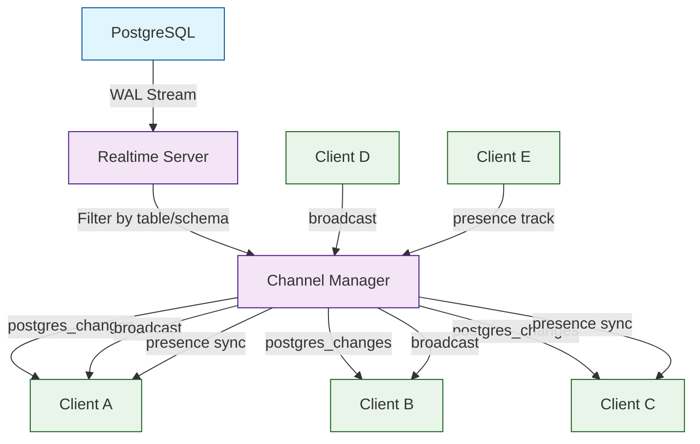
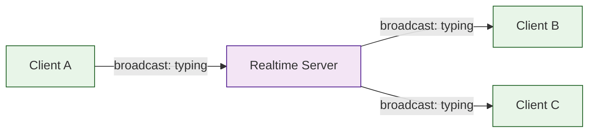
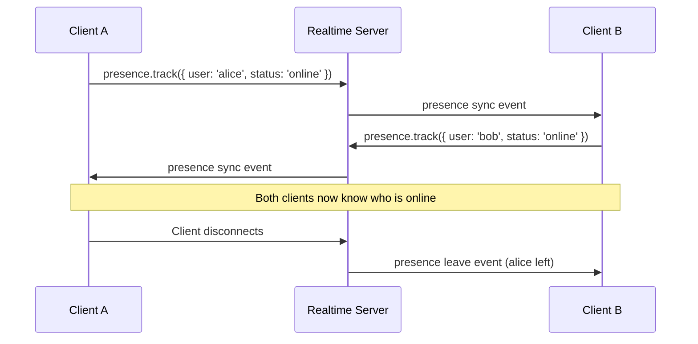

# Chapter 4: Real-time Features

In [Chapter 3](03-authentication.md), you built a complete authentication system with multiple sign-in methods and team-based RLS policies. Now it is time to make your application come alive. Supabase Realtime lets you subscribe to database changes, broadcast messages between clients, and track user presence -- all over WebSocket connections. In this chapter you will subscribe to table changes with `postgres_changes`, build a live chat application, implement collaborative presence indicators, and handle reconnection gracefully.

## How Supabase Realtime Works

Supabase Realtime is a server built on Elixir that listens to PostgreSQL's replication stream. When a row is inserted, updated, or deleted, the change is broadcast to all subscribed clients through WebSocket channels.



### Three Realtime Features

| Feature | Purpose | Data Source | RLS Applied |
|---|---|---|---|
| **Postgres Changes** | Subscribe to INSERT, UPDATE, DELETE on tables | PostgreSQL WAL | Yes |
| **Broadcast** | Send ephemeral messages between clients | Client-to-client via server | No (custom auth) |
| **Presence** | Track who is online and their state | Client-reported state | No (custom auth) |

## Enabling Realtime on Tables

Before subscribing, you must enable the Realtime publication on the tables you want to watch.

```sql
-- Enable Realtime for specific tables
ALTER PUBLICATION supabase_realtime ADD TABLE public.messages;
ALTER PUBLICATION supabase_realtime ADD TABLE public.tasks;
ALTER PUBLICATION supabase_realtime ADD TABLE public.comments;

-- Verify which tables have Realtime enabled
SELECT * FROM pg_publication_tables WHERE pubname = 'supabase_realtime';
```

You can also enable Realtime from the Supabase Dashboard under Database > Replication.

## Subscribing to Database Changes

### Basic Subscription

```typescript
import { supabase } from '../lib/supabase'

// Subscribe to all changes on the messages table
const channel = supabase
  .channel('messages-all')
  .on(
    'postgres_changes',
    {
      event: '*',        // 'INSERT' | 'UPDATE' | 'DELETE' | '*'
      schema: 'public',
      table: 'messages',
    },
    (payload) => {
      console.log('Change type:', payload.eventType)
      console.log('New record:', payload.new)
      console.log('Old record:', payload.old)
    }
  )
  .subscribe((status) => {
    console.log('Subscription status:', status)
  })

// Unsubscribe when done
channel.unsubscribe()
```

### Filtered Subscriptions

Reduce bandwidth by subscribing only to changes that match a filter.

```typescript
// Only receive messages for a specific chat room
const channel = supabase
  .channel('room-42-messages')
  .on(
    'postgres_changes',
    {
      event: 'INSERT',
      schema: 'public',
      table: 'messages',
      filter: 'room_id=eq.42',
    },
    (payload) => {
      console.log('New message in room 42:', payload.new)
    }
  )
  .subscribe()

// Filter by user -- only changes to the current user's tasks
const taskChannel = supabase
  .channel('my-tasks')
  .on(
    'postgres_changes',
    {
      event: '*',
      schema: 'public',
      table: 'tasks',
      filter: `assignee_id=eq.${userId}`,
    },
    (payload) => {
      console.log('Task updated:', payload.new)
    }
  )
  .subscribe()
```

### Listening to Multiple Events on One Channel

```typescript
const channel = supabase
  .channel('project-updates')
  // Listen for new tasks
  .on(
    'postgres_changes',
    { event: 'INSERT', schema: 'public', table: 'tasks' },
    (payload) => handleNewTask(payload.new)
  )
  // Listen for task status changes
  .on(
    'postgres_changes',
    { event: 'UPDATE', schema: 'public', table: 'tasks' },
    (payload) => handleTaskUpdate(payload.new, payload.old)
  )
  // Listen for new comments
  .on(
    'postgres_changes',
    { event: 'INSERT', schema: 'public', table: 'comments' },
    (payload) => handleNewComment(payload.new)
  )
  .subscribe()
```

## Building a Real-time Chat Application

### Database Schema for Chat

```sql
-- Chat rooms
CREATE TABLE public.rooms (
  id BIGSERIAL PRIMARY KEY,
  name TEXT NOT NULL,
  created_by UUID REFERENCES auth.users(id),
  created_at TIMESTAMPTZ DEFAULT NOW()
);

-- Messages
CREATE TABLE public.messages (
  id BIGSERIAL PRIMARY KEY,
  room_id BIGINT NOT NULL REFERENCES public.rooms(id) ON DELETE CASCADE,
  user_id UUID NOT NULL REFERENCES auth.users(id) ON DELETE CASCADE,
  content TEXT NOT NULL,
  edited_at TIMESTAMPTZ,
  created_at TIMESTAMPTZ DEFAULT NOW()
);

-- Enable RLS
ALTER TABLE public.rooms ENABLE ROW LEVEL SECURITY;
ALTER TABLE public.messages ENABLE ROW LEVEL SECURITY;

-- Policies
CREATE POLICY "Anyone can view rooms" ON public.rooms
  FOR SELECT USING (true);

CREATE POLICY "Authenticated users can view messages" ON public.messages
  FOR SELECT USING (auth.uid() IS NOT NULL);

CREATE POLICY "Users can insert messages" ON public.messages
  FOR INSERT WITH CHECK (auth.uid() = user_id);

CREATE POLICY "Users can update own messages" ON public.messages
  FOR UPDATE USING (auth.uid() = user_id);

-- Enable Realtime
ALTER PUBLICATION supabase_realtime ADD TABLE public.messages;

-- Indexes for performance
CREATE INDEX idx_messages_room_created ON public.messages (room_id, created_at DESC);
```

### React Hook for Real-time Messages

```typescript
// src/hooks/useRealtimeMessages.ts
import { useEffect, useState, useCallback, useRef } from 'react'
import { supabase } from '../lib/supabase'
import type { RealtimeChannel } from '@supabase/supabase-js'

interface Message {
  id: number
  room_id: number
  user_id: string
  content: string
  created_at: string
  // Joined from profiles
  profiles?: {
    username: string
    avatar_url: string | null
  }
}

export function useRealtimeMessages(roomId: number) {
  const [messages, setMessages] = useState<Message[]>([])
  const [loading, setLoading] = useState(true)
  const channelRef = useRef<RealtimeChannel | null>(null)

  // Fetch initial messages
  useEffect(() => {
    const fetchMessages = async () => {
      const { data, error } = await supabase
        .from('messages')
        .select(`
          id, room_id, user_id, content, created_at,
          profiles:user_id (username, avatar_url)
        `)
        .eq('room_id', roomId)
        .order('created_at', { ascending: true })
        .limit(100)

      if (error) {
        console.error('Error fetching messages:', error)
      } else {
        setMessages(data || [])
      }
      setLoading(false)
    }

    fetchMessages()
  }, [roomId])

  // Subscribe to real-time changes
  useEffect(() => {
    const channel = supabase
      .channel(`room-${roomId}`)
      .on(
        'postgres_changes',
        {
          event: 'INSERT',
          schema: 'public',
          table: 'messages',
          filter: `room_id=eq.${roomId}`,
        },
        async (payload) => {
          // Fetch the full message with profile data
          const { data } = await supabase
            .from('messages')
            .select(`
              id, room_id, user_id, content, created_at,
              profiles:user_id (username, avatar_url)
            `)
            .eq('id', payload.new.id)
            .single()

          if (data) {
            setMessages(prev => {
              // De-duplicate by ID
              if (prev.some(m => m.id === data.id)) return prev
              return [...prev, data]
            })
          }
        }
      )
      .on(
        'postgres_changes',
        {
          event: 'UPDATE',
          schema: 'public',
          table: 'messages',
          filter: `room_id=eq.${roomId}`,
        },
        (payload) => {
          setMessages(prev =>
            prev.map(m => m.id === payload.new.id
              ? { ...m, ...payload.new }
              : m
            )
          )
        }
      )
      .on(
        'postgres_changes',
        {
          event: 'DELETE',
          schema: 'public',
          table: 'messages',
          filter: `room_id=eq.${roomId}`,
        },
        (payload) => {
          setMessages(prev => prev.filter(m => m.id !== payload.old.id))
        }
      )
      .subscribe()

    channelRef.current = channel

    return () => {
      if (channelRef.current) {
        supabase.removeChannel(channelRef.current)
      }
    }
  }, [roomId])

  // Send a message
  const sendMessage = useCallback(async (content: string) => {
    const { data: { user } } = await supabase.auth.getUser()
    if (!user) throw new Error('Not authenticated')

    const { error } = await supabase
      .from('messages')
      .insert({
        room_id: roomId,
        user_id: user.id,
        content,
      })

    if (error) throw error
  }, [roomId])

  return { messages, loading, sendMessage }
}
```

### Chat UI Component

```tsx
// src/components/ChatRoom.tsx
import React, { useState, useRef, useEffect } from 'react'
import { useRealtimeMessages } from '../hooks/useRealtimeMessages'

interface ChatRoomProps {
  roomId: number
  roomName: string
}

export function ChatRoom({ roomId, roomName }: ChatRoomProps) {
  const { messages, loading, sendMessage } = useRealtimeMessages(roomId)
  const [input, setInput] = useState('')
  const [sending, setSending] = useState(false)
  const messagesEndRef = useRef<HTMLDivElement>(null)

  // Auto-scroll to bottom on new messages
  useEffect(() => {
    messagesEndRef.current?.scrollIntoView({ behavior: 'smooth' })
  }, [messages])

  const handleSend = async (e: React.FormEvent) => {
    e.preventDefault()
    if (!input.trim() || sending) return

    setSending(true)
    try {
      await sendMessage(input.trim())
      setInput('')
    } catch (error) {
      console.error('Failed to send message:', error)
    } finally {
      setSending(false)
    }
  }

  if (loading) return <div>Loading messages...</div>

  return (
    <div className="chat-room">
      <h2>{roomName}</h2>

      <div className="messages-container">
        {messages.map(message => (
          <div key={message.id} className="message">
            <div className="message-header">
              <strong>{message.profiles?.username || 'Unknown'}</strong>
              <span className="timestamp">
                {new Date(message.created_at).toLocaleTimeString()}
              </span>
            </div>
            <p>{message.content}</p>
          </div>
        ))}
        <div ref={messagesEndRef} />
      </div>

      <form onSubmit={handleSend} className="message-form">
        <input
          type="text"
          value={input}
          onChange={e => setInput(e.target.value)}
          placeholder="Type a message..."
          disabled={sending}
        />
        <button type="submit" disabled={sending || !input.trim()}>
          Send
        </button>
      </form>
    </div>
  )
}
```

## Broadcast: Ephemeral Client-to-Client Messages

Broadcast sends messages between clients without persisting them to the database. This is ideal for typing indicators, cursor positions, and notifications.



### Typing Indicator

```typescript
// src/hooks/useTypingIndicator.ts
import { useEffect, useState, useCallback, useRef } from 'react'
import { supabase } from '../lib/supabase'

export function useTypingIndicator(roomId: number, currentUsername: string) {
  const [typingUsers, setTypingUsers] = useState<string[]>([])
  const timeoutsRef = useRef<Map<string, NodeJS.Timeout>>(new Map())
  const channelRef = useRef<any>(null)

  useEffect(() => {
    const channel = supabase
      .channel(`typing-${roomId}`)
      .on('broadcast', { event: 'typing' }, ({ payload }) => {
        const { username } = payload

        // Don't show self
        if (username === currentUsername) return

        // Add user to typing list
        setTypingUsers(prev => {
          if (prev.includes(username)) return prev
          return [...prev, username]
        })

        // Clear existing timeout for this user
        const existing = timeoutsRef.current.get(username)
        if (existing) clearTimeout(existing)

        // Remove after 3 seconds of inactivity
        const timeout = setTimeout(() => {
          setTypingUsers(prev => prev.filter(u => u !== username))
          timeoutsRef.current.delete(username)
        }, 3000)

        timeoutsRef.current.set(username, timeout)
      })
      .subscribe()

    channelRef.current = channel

    return () => {
      timeoutsRef.current.forEach(t => clearTimeout(t))
      supabase.removeChannel(channel)
    }
  }, [roomId, currentUsername])

  // Broadcast that the current user is typing
  const sendTyping = useCallback(() => {
    channelRef.current?.send({
      type: 'broadcast',
      event: 'typing',
      payload: { username: currentUsername },
    })
  }, [currentUsername])

  return { typingUsers, sendTyping }
}
```

Usage in the chat component:

```tsx
const { typingUsers, sendTyping } = useTypingIndicator(roomId, currentUser.username)

// In the input handler
<input
  type="text"
  value={input}
  onChange={e => {
    setInput(e.target.value)
    sendTyping()  // Notify others that you are typing
  }}
/>

// Display typing indicator
{typingUsers.length > 0 && (
  <div className="typing-indicator">
    {typingUsers.join(', ')} {typingUsers.length === 1 ? 'is' : 'are'} typing...
  </div>
)}
```

## Presence: Track Online Users

Presence lets you track which users are currently online and share state like their cursor position or current page.



### Implementing Presence

```typescript
// src/hooks/usePresence.ts
import { useEffect, useState, useRef } from 'react'
import { supabase } from '../lib/supabase'
import type { RealtimeChannel } from '@supabase/supabase-js'

interface UserPresence {
  user_id: string
  username: string
  avatar_url: string | null
  online_at: string
  status: 'online' | 'away' | 'busy'
}

export function usePresence(roomId: number, currentUser: {
  id: string
  username: string
  avatar_url: string | null
}) {
  const [onlineUsers, setOnlineUsers] = useState<UserPresence[]>([])
  const channelRef = useRef<RealtimeChannel | null>(null)

  useEffect(() => {
    const channel = supabase.channel(`presence-${roomId}`, {
      config: {
        presence: {
          key: currentUser.id,  // Unique key per user
        },
      },
    })

    channel
      .on('presence', { event: 'sync' }, () => {
        // Called whenever the presence state changes
        const state = channel.presenceState<UserPresence>()
        const users: UserPresence[] = []

        Object.values(state).forEach(presences => {
          presences.forEach(presence => {
            users.push(presence)
          })
        })

        setOnlineUsers(users)
      })
      .on('presence', { event: 'join' }, ({ key, newPresences }) => {
        console.log(`${key} joined:`, newPresences)
      })
      .on('presence', { event: 'leave' }, ({ key, leftPresences }) => {
        console.log(`${key} left:`, leftPresences)
      })
      .subscribe(async (status) => {
        if (status === 'SUBSCRIBED') {
          // Track the current user's presence
          await channel.track({
            user_id: currentUser.id,
            username: currentUser.username,
            avatar_url: currentUser.avatar_url,
            online_at: new Date().toISOString(),
            status: 'online',
          })
        }
      })

    channelRef.current = channel

    return () => {
      channel.untrack()
      supabase.removeChannel(channel)
    }
  }, [roomId, currentUser.id])

  // Update presence status
  const updateStatus = async (status: 'online' | 'away' | 'busy') => {
    await channelRef.current?.track({
      user_id: currentUser.id,
      username: currentUser.username,
      avatar_url: currentUser.avatar_url,
      online_at: new Date().toISOString(),
      status,
    })
  }

  return { onlineUsers, updateStatus }
}
```

### Online Users Component

```tsx
// src/components/OnlineUsers.tsx
import React from 'react'
import { usePresence } from '../hooks/usePresence'

interface OnlineUsersProps {
  roomId: number
  currentUser: { id: string; username: string; avatar_url: string | null }
}

export function OnlineUsers({ roomId, currentUser }: OnlineUsersProps) {
  const { onlineUsers, updateStatus } = usePresence(roomId, currentUser)

  return (
    <div className="online-users">
      <h3>Online ({onlineUsers.length})</h3>
      <ul>
        {onlineUsers.map(user => (
          <li key={user.user_id} className={`status-${user.status}`}>
            {user.avatar_url && }
            <span>{user.username}</span>
            <span className="status-dot" />
          </li>
        ))}
      </ul>

      <div className="status-selector">
        <button onClick={() => updateStatus('online')}>Online</button>
        <button onClick={() => updateStatus('away')}>Away</button>
        <button onClick={() => updateStatus('busy')}>Busy</button>
      </div>
    </div>
  )
}
```

## Handling Reconnections

Network interruptions are inevitable. Build resilient real-time features with proper reconnection handling.

```typescript
// src/lib/realtimeManager.ts
import { supabase } from './supabase'
import type { RealtimeChannel } from '@supabase/supabase-js'

interface ChannelConfig {
  name: string
  onInsert?: (payload: any) => void
  onUpdate?: (payload: any) => void
  onDelete?: (payload: any) => void
  table: string
  filter?: string
}

export function createResilientChannel(config: ChannelConfig): RealtimeChannel {
  const channel = supabase.channel(config.name)

  // Track subscription status
  let isSubscribed = false
  let retryCount = 0
  const MAX_RETRIES = 10

  if (config.onInsert) {
    channel.on(
      'postgres_changes',
      {
        event: 'INSERT',
        schema: 'public',
        table: config.table,
        ...(config.filter ? { filter: config.filter } : {}),
      },
      config.onInsert
    )
  }

  if (config.onUpdate) {
    channel.on(
      'postgres_changes',
      {
        event: 'UPDATE',
        schema: 'public',
        table: config.table,
        ...(config.filter ? { filter: config.filter } : {}),
      },
      config.onUpdate
    )
  }

  if (config.onDelete) {
    channel.on(
      'postgres_changes',
      {
        event: 'DELETE',
        schema: 'public',
        table: config.table,
        ...(config.filter ? { filter: config.filter } : {}),
      },
      config.onDelete
    )
  }

  channel.subscribe((status, error) => {
    if (status === 'SUBSCRIBED') {
      isSubscribed = true
      retryCount = 0
      console.log(`Channel ${config.name} subscribed`)
    }

    if (status === 'CHANNEL_ERROR') {
      console.error(`Channel ${config.name} error:`, error)
      isSubscribed = false

      // Retry with exponential backoff
      if (retryCount < MAX_RETRIES) {
        const delay = Math.min(1000 * Math.pow(2, retryCount), 30000)
        retryCount++
        console.log(`Retrying in ${delay}ms (attempt ${retryCount})`)
        setTimeout(() => {
          channel.subscribe()
        }, delay)
      }
    }

    if (status === 'TIMED_OUT') {
      console.warn(`Channel ${config.name} timed out, retrying...`)
      isSubscribed = false
      channel.subscribe()
    }

    if (status === 'CLOSED') {
      isSubscribed = false
      console.log(`Channel ${config.name} closed`)
    }
  })

  return channel
}
```

## Real-time Task Board

Putting it all together -- a collaborative task board where team members see changes instantly.

```typescript
// src/hooks/useRealtimeTaskBoard.ts
import { useEffect, useState, useCallback } from 'react'
import { supabase } from '../lib/supabase'

interface Task {
  id: number
  title: string
  status: 'todo' | 'in_progress' | 'review' | 'done'
  assignee_id: string | null
  priority: string
  project_id: string
}

export function useRealtimeTaskBoard(projectId: string) {
  const [tasks, setTasks] = useState<Task[]>([])
  const [loading, setLoading] = useState(true)

  // Fetch initial tasks
  useEffect(() => {
    const fetchTasks = async () => {
      const { data, error } = await supabase
        .from('tasks')
        .select('*')
        .eq('project_id', projectId)
        .order('created_at', { ascending: false })

      if (!error) setTasks(data || [])
      setLoading(false)
    }
    fetchTasks()
  }, [projectId])

  // Subscribe to real-time changes
  useEffect(() => {
    const channel = supabase
      .channel(`taskboard-${projectId}`)
      .on(
        'postgres_changes',
        {
          event: 'INSERT',
          schema: 'public',
          table: 'tasks',
          filter: `project_id=eq.${projectId}`,
        },
        (payload) => {
          setTasks(prev => {
            if (prev.some(t => t.id === payload.new.id)) return prev
            return [payload.new as Task, ...prev]
          })
        }
      )
      .on(
        'postgres_changes',
        {
          event: 'UPDATE',
          schema: 'public',
          table: 'tasks',
          filter: `project_id=eq.${projectId}`,
        },
        (payload) => {
          setTasks(prev =>
            prev.map(t => t.id === payload.new.id ? payload.new as Task : t)
          )
        }
      )
      .on(
        'postgres_changes',
        {
          event: 'DELETE',
          schema: 'public',
          table: 'tasks',
          filter: `project_id=eq.${projectId}`,
        },
        (payload) => {
          setTasks(prev => prev.filter(t => t.id !== payload.old.id))
        }
      )
      .subscribe()

    return () => {
      supabase.removeChannel(channel)
    }
  }, [projectId])

  // Move task to a new status (e.g., drag-and-drop)
  const moveTask = useCallback(async (taskId: number, newStatus: Task['status']) => {
    // Optimistic update
    setTasks(prev =>
      prev.map(t => t.id === taskId ? { ...t, status: newStatus } : t)
    )

    const { error } = await supabase
      .from('tasks')
      .update({ status: newStatus })
      .eq('id', taskId)

    if (error) {
      // Revert on failure
      console.error('Failed to move task:', error)
      const { data } = await supabase
        .from('tasks')
        .select('*')
        .eq('project_id', projectId)
        .order('created_at', { ascending: false })
      if (data) setTasks(data)
    }
  }, [projectId])

  // Group tasks by status for the board view
  const columns = {
    todo: tasks.filter(t => t.status === 'todo'),
    in_progress: tasks.filter(t => t.status === 'in_progress'),
    review: tasks.filter(t => t.status === 'review'),
    done: tasks.filter(t => t.status === 'done'),
  }

  return { tasks, columns, loading, moveTask }
}
```

## Performance and Best Practices

### Channel Management

| Practice | Why |
|---|---|
| One channel per feature/room | Reduces message processing overhead |
| Unsubscribe when unmounting | Prevents memory leaks and ghost listeners |
| Use filtered subscriptions | Receive only relevant changes |
| De-duplicate by primary key | Prevent duplicate renders from race conditions |
| Batch state updates | Avoid rapid re-renders from multiple events |

### Optimistic Updates

Always update the local state immediately and reconcile with the server response. This keeps the UI responsive even on slow connections.

```typescript
// Optimistic pattern
const optimisticUpdate = async (taskId: number, updates: Partial<Task>) => {
  // 1. Update local state immediately
  setTasks(prev => prev.map(t => t.id === taskId ? { ...t, ...updates } : t))

  // 2. Send to server
  const { error } = await supabase
    .from('tasks')
    .update(updates)
    .eq('id', taskId)

  // 3. Revert on failure
  if (error) {
    // Re-fetch to get correct state
    const { data } = await supabase.from('tasks').select('*').eq('id', taskId).single()
    if (data) {
      setTasks(prev => prev.map(t => t.id === taskId ? data : t))
    }
  }
}
```

## Troubleshooting Real-time Issues

| Problem | Cause | Solution |
|---|---|---|
| No events received | Table not in `supabase_realtime` publication | Run `ALTER PUBLICATION supabase_realtime ADD TABLE ...` |
| Events missing rows | RLS blocks SELECT for the subscribing user | Ensure the user's RLS policy allows SELECT on the table |
| Duplicate events | Multiple channels or missing de-duplication | De-duplicate by primary key; use one channel per feature |
| Stale data after reconnect | No re-fetch after reconnection | Fetch latest data when subscription status returns to `SUBSCRIBED` |
| High latency | Large payloads or too many channels | Reduce payload size; consolidate channels |
| `CHANNEL_ERROR` | Auth token expired | Refresh the token and resubscribe |

## Summary

In this chapter you learned how to build real-time features with Supabase Realtime. You enabled the publication on tables, subscribed to database changes with `postgres_changes`, built a complete live chat application with message history, implemented typing indicators with broadcast, tracked online users with presence, handled reconnections with exponential backoff, and created a collaborative real-time task board with optimistic updates.

## Key Takeaways

1. **Enable the Realtime publication** on each table you want to subscribe to using `ALTER PUBLICATION`.
2. **Use filtered subscriptions** to receive only the changes your component cares about.
3. **De-duplicate by primary key** in your state updater to prevent rendering the same record twice.
4. **Use broadcast for ephemeral data** like typing indicators -- it does not touch the database.
5. **Use presence for online status** -- the server automatically handles join and leave events.
6. **Always unsubscribe** when a component unmounts to prevent memory leaks.
7. **Implement optimistic updates** so the UI feels instant, and reconcile on error.

## Next Steps

Your application now has live data synchronization. In [Chapter 5: Storage & File Management](05-storage-management.md), you will add file uploads, image transformations, and CDN-backed media delivery using Supabase Storage.

---

*Built with insights from the [Supabase](https://github.com/supabase/supabase) project.*
