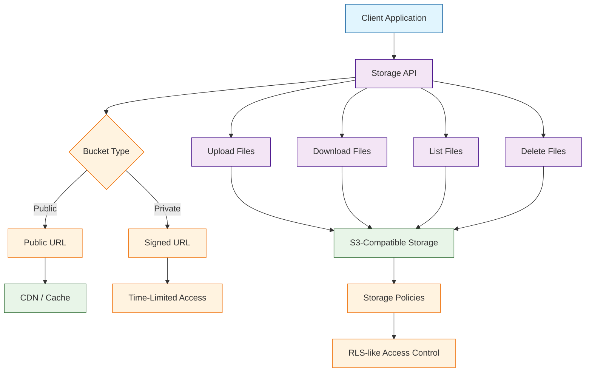
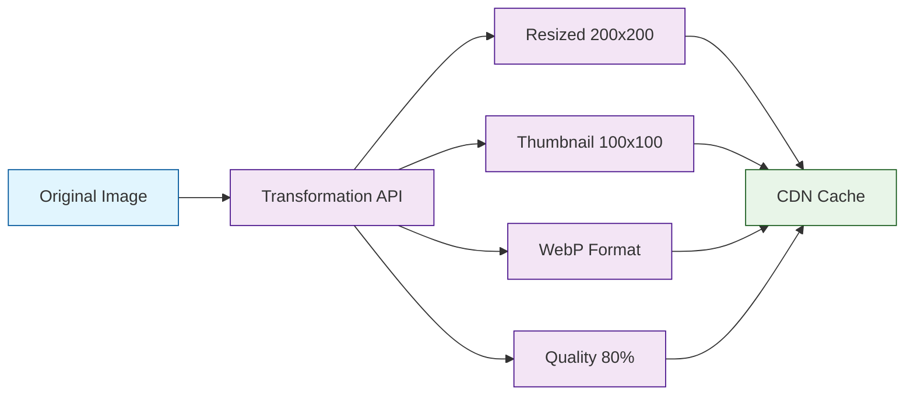

# Chapter 5: Storage & File Management

Welcome to **Chapter 5: Storage & File Management**. In this part of **Supabase Tutorial: Building Modern Backend Applications**, you will build an intuitive mental model first, then move into concrete implementation details and practical production tradeoffs.


In [Chapter 4](04-realtime-features.md), you added live data synchronization with real-time subscriptions, broadcast, and presence. Now your application needs to handle files -- profile avatars, document uploads, image galleries, and media attachments. Supabase Storage is an S3-compatible object storage service that integrates directly with your database and RLS policies. In this chapter you will create and configure storage buckets, upload and download files securely, generate signed and public URLs, implement image transformations, build a complete file management system, and protect files with granular access policies.

## How Supabase Storage Works

Supabase Storage wraps an S3-compatible backend with a REST API and integrates with Supabase Auth for access control. Files are organized into buckets, and each bucket can be public or private.



### Public vs Private Buckets

| Property | Public Bucket | Private Bucket |
|---|---|---|
| Access | Anyone with the URL | Requires signed URL or auth |
| Use case | Marketing assets, public images | User uploads, private documents |
| URL type | Permanent public URL | Time-limited signed URL |
| CDN caching | Yes, automatic | Only while signed URL is valid |
| Policy required | Optional (default allow) | Required for any access |

## Creating and Configuring Buckets

### Using the Supabase Client

```typescript
import { supabase } from '../lib/supabase'

// Create a private bucket for user avatars
async function createAvatarBucket() {
  const { data, error } = await supabase.storage.createBucket('avatars', {
    public: false,
    fileSizeLimit: 5 * 1024 * 1024,  // 5 MB max
    allowedMimeTypes: ['image/jpeg', 'image/png', 'image/webp', 'image/gif'],
  })

  if (error) throw error
  return data
}

// Create a public bucket for marketing assets
async function createAssetsBucket() {
  const { data, error } = await supabase.storage.createBucket('assets', {
    public: true,
    fileSizeLimit: 50 * 1024 * 1024,  // 50 MB max
  })

  if (error) throw error
  return data
}

// List all buckets
async function listBuckets() {
  const { data, error } = await supabase.storage.listBuckets()
  if (error) throw error
  return data  // [{ id: 'avatars', public: false }, { id: 'assets', public: true }]
}
```

### Using the CLI

```bash
# Create buckets via SQL (useful in migrations)
INSERT INTO storage.buckets (id, name, public, file_size_limit, allowed_mime_types)
VALUES
  ('avatars', 'avatars', false, 5242880, ARRAY['image/jpeg', 'image/png', 'image/webp']),
  ('documents', 'documents', false, 52428800, ARRAY['application/pdf', 'text/plain']),
  ('assets', 'assets', true, NULL, NULL);
```

## Uploading Files

### Basic Upload

```typescript
// Upload a file from a file input
async function uploadFile(
  bucket: string,
  path: string,
  file: File
) {
  const { data, error } = await supabase.storage
    .from(bucket)
    .upload(path, file, {
      cacheControl: '3600',  // Cache for 1 hour
      upsert: false,         // Fail if file exists; set true to overwrite
      contentType: file.type,
    })

  if (error) {
    if (error.message.includes('already exists')) {
      throw new Error('A file with this name already exists')
    }
    throw error
  }

  return data  // { path: 'users/abc/avatar.png' }
}
```

### Upload with User-Scoped Path

```typescript
// Organize files by user ID for easy RLS policy matching
async function uploadAvatar(file: File) {
  const { data: { user } } = await supabase.auth.getUser()
  if (!user) throw new Error('Not authenticated')

  const fileExt = file.name.split('.').pop()
  const filePath = `${user.id}/avatar.${fileExt}`

  const { data, error } = await supabase.storage
    .from('avatars')
    .upload(filePath, file, {
      cacheControl: '3600',
      upsert: true,  // Overwrite existing avatar
    })

  if (error) throw error

  // Update the profile with the new avatar URL
  const { data: urlData } = supabase.storage
    .from('avatars')
    .getPublicUrl(filePath)

  await supabase
    .from('profiles')
    .update({ avatar_url: urlData.publicUrl })
    .eq('id', user.id)

  return urlData.publicUrl
}
```

### Upload with Progress Tracking

```typescript
// Track upload progress using XMLHttpRequest
function uploadWithProgress(
  bucket: string,
  path: string,
  file: File,
  onProgress: (percent: number) => void
): Promise<string> {
  return new Promise((resolve, reject) => {
    const xhr = new XMLHttpRequest()
    const url = `${process.env.NEXT_PUBLIC_SUPABASE_URL}/storage/v1/object/${bucket}/${path}`

    xhr.upload.addEventListener('progress', (event) => {
      if (event.lengthComputable) {
        const percent = Math.round((event.loaded / event.total) * 100)
        onProgress(percent)
      }
    })

    xhr.addEventListener('load', () => {
      if (xhr.status >= 200 && xhr.status < 300) {
        resolve(path)
      } else {
        reject(new Error(`Upload failed with status ${xhr.status}`))
      }
    })

    xhr.addEventListener('error', () => reject(new Error('Upload failed')))

    xhr.open('POST', url)
    xhr.setRequestHeader('Authorization', `Bearer ${supabase.auth.session()?.access_token}`)
    xhr.setRequestHeader('x-upsert', 'true')
    xhr.send(file)
  })
}
```

### Uploading Multiple Files

```typescript
// Upload multiple files in parallel with concurrency control
async function uploadMultipleFiles(
  bucket: string,
  files: File[],
  basePath: string,
  maxConcurrency: number = 3
) {
  const results: { path: string; error?: string }[] = []
  const queue = [...files]

  async function processNext(): Promise<void> {
    const file = queue.shift()
    if (!file) return

    try {
      const filePath = `${basePath}/${Date.now()}-${file.name}`
      const { error } = await supabase.storage
        .from(bucket)
        .upload(filePath, file, { upsert: true })

      results.push({
        path: filePath,
        error: error?.message,
      })
    } catch (err: any) {
      results.push({ path: file.name, error: err.message })
    }

    await processNext()
  }

  // Start parallel uploads with concurrency limit
  const workers = Array.from(
    { length: Math.min(maxConcurrency, files.length) },
    () => processNext()
  )

  await Promise.all(workers)
  return results
}
```

## Downloading and Accessing Files

### Public URLs

```typescript
// Get a permanent public URL (only works for public buckets)
function getPublicUrl(bucket: string, path: string): string {
  const { data } = supabase.storage.from(bucket).getPublicUrl(path)
  return data.publicUrl
  // Example: https://your-project.supabase.co/storage/v1/object/public/assets/logo.png
}
```

### Signed URLs (Private Buckets)

```typescript
// Generate a time-limited URL for private files
async function getSignedUrl(
  bucket: string,
  path: string,
  expiresIn: number = 3600  // seconds (1 hour default)
) {
  const { data, error } = await supabase.storage
    .from(bucket)
    .createSignedUrl(path, expiresIn)

  if (error) throw error
  return data.signedUrl
}

// Generate signed URLs for multiple files at once
async function getSignedUrls(bucket: string, paths: string[]) {
  const { data, error } = await supabase.storage
    .from(bucket)
    .createSignedUrls(paths, 3600)

  if (error) throw error
  return data  // [{ path, signedUrl, error }]
}
```

### Download Files

```typescript
// Download a file as a Blob
async function downloadFile(bucket: string, path: string) {
  const { data, error } = await supabase.storage
    .from(bucket)
    .download(path)

  if (error) throw error

  // data is a Blob -- use it directly or create an object URL
  const url = URL.createObjectURL(data)
  return url
}

// Trigger a browser download
async function triggerDownload(bucket: string, path: string, filename: string) {
  const { data, error } = await supabase.storage
    .from(bucket)
    .download(path)

  if (error) throw error

  const url = URL.createObjectURL(data)
  const a = document.createElement('a')
  a.href = url
  a.download = filename
  document.body.appendChild(a)
  a.click()
  document.body.removeChild(a)
  URL.revokeObjectURL(url)
}
```

## Image Transformations

Supabase Storage can transform images on-the-fly -- resizing, cropping, and changing format without pre-generating variants.



### Generating Transformed URLs

```typescript
// Get a transformed public URL
function getTransformedUrl(
  bucket: string,
  path: string,
  options: {
    width?: number
    height?: number
    resize?: 'cover' | 'contain' | 'fill'
    quality?: number
    format?: 'origin' | 'webp'
  }
) {
  const { data } = supabase.storage
    .from(bucket)
    .getPublicUrl(path, {
      transform: options,
    })

  return data.publicUrl
}

// Examples
const thumbnail = getTransformedUrl('avatars', 'user/avatar.jpg', {
  width: 100,
  height: 100,
  resize: 'cover',
})

const optimized = getTransformedUrl('assets', 'photos/hero.jpg', {
  width: 1200,
  quality: 80,
  format: 'webp',
})

// Signed URL with transformation (for private buckets)
async function getTransformedSignedUrl(
  bucket: string,
  path: string,
  width: number,
  height: number
) {
  const { data, error } = await supabase.storage
    .from(bucket)
    .createSignedUrl(path, 3600, {
      transform: {
        width,
        height,
        resize: 'cover',
        quality: 80,
      },
    })

  if (error) throw error
  return data.signedUrl
}
```

### Responsive Image Component

```tsx
// src/components/ResponsiveImage.tsx
import React from 'react'
import { supabase } from '../lib/supabase'

interface ResponsiveImageProps {
  bucket: string
  path: string
  alt: string
  sizes?: string
  className?: string
}

export function ResponsiveImage({
  bucket,
  path,
  alt,
  sizes = '(max-width: 640px) 100vw, (max-width: 1024px) 50vw, 33vw',
  className,
}: ResponsiveImageProps) {
  const widths = [320, 640, 960, 1280, 1920]

  const srcSet = widths
    .map(w => {
      const { data } = supabase.storage.from(bucket).getPublicUrl(path, {
        transform: { width: w, quality: 80, format: 'webp' },
      })
      return `${data.publicUrl} ${w}w`
    })
    .join(', ')

  const { data: fallback } = supabase.storage.from(bucket).getPublicUrl(path, {
    transform: { width: 960, quality: 80 },
  })

  return (
    
  )
}
```

## File Management Operations

### Listing Files in a Bucket

```typescript
// List files with pagination
async function listFiles(
  bucket: string,
  folder: string = '',
  options: { limit?: number; offset?: number; sortBy?: { column: string; order: string } } = {}
) {
  const { data, error } = await supabase.storage
    .from(bucket)
    .list(folder, {
      limit: options.limit || 100,
      offset: options.offset || 0,
      sortBy: options.sortBy || { column: 'created_at', order: 'desc' },
    })

  if (error) throw error

  // data includes both files and folders
  const files = data.filter(item => item.id !== null)     // Files have an id
  const folders = data.filter(item => item.id === null)   // Folders have id = null

  return { files, folders }
}
```

### Moving and Copying Files

```typescript
// Move a file to a new path
async function moveFile(bucket: string, fromPath: string, toPath: string) {
  const { error } = await supabase.storage
    .from(bucket)
    .move(fromPath, toPath)

  if (error) throw error
}

// Copy a file
async function copyFile(bucket: string, fromPath: string, toPath: string) {
  const { error } = await supabase.storage
    .from(bucket)
    .copy(fromPath, toPath)

  if (error) throw error
}
```

### Deleting Files

```typescript
// Delete a single file
async function deleteFile(bucket: string, path: string) {
  const { error } = await supabase.storage
    .from(bucket)
    .remove([path])

  if (error) throw error
}

// Delete multiple files
async function deleteFiles(bucket: string, paths: string[]) {
  const { data, error } = await supabase.storage
    .from(bucket)
    .remove(paths)

  if (error) throw error
  return data  // List of deleted files
}

// Delete all files in a folder
async function deleteFolder(bucket: string, folderPath: string) {
  const { data: files } = await supabase.storage
    .from(bucket)
    .list(folderPath)

  if (!files || files.length === 0) return

  const paths = files
    .filter(f => f.id !== null)
    .map(f => `${folderPath}/${f.name}`)

  if (paths.length > 0) {
    await supabase.storage.from(bucket).remove(paths)
  }
}
```

## Storage Policies (Access Control)

Storage policies work similarly to RLS policies. They control who can upload, download, and delete files.

```sql
-- Policy: Users can upload to their own folder
CREATE POLICY "Users can upload own files"
ON storage.objects FOR INSERT
TO authenticated
WITH CHECK (
  bucket_id = 'avatars'
  AND (storage.foldername(name))[1] = auth.uid()::text
);

-- Policy: Users can view their own files
CREATE POLICY "Users can view own files"
ON storage.objects FOR SELECT
TO authenticated
USING (
  bucket_id = 'avatars'
  AND (storage.foldername(name))[1] = auth.uid()::text
);

-- Policy: Users can update their own files
CREATE POLICY "Users can update own files"
ON storage.objects FOR UPDATE
TO authenticated
USING (
  bucket_id = 'avatars'
  AND (storage.foldername(name))[1] = auth.uid()::text
);

-- Policy: Users can delete their own files
CREATE POLICY "Users can delete own files"
ON storage.objects FOR DELETE
TO authenticated
USING (
  bucket_id = 'avatars'
  AND (storage.foldername(name))[1] = auth.uid()::text
);

-- Policy: Public read access for the assets bucket
CREATE POLICY "Public read access for assets"
ON storage.objects FOR SELECT
TO public
USING (bucket_id = 'assets');

-- Policy: Only admins can upload to assets
CREATE POLICY "Admins can upload assets"
ON storage.objects FOR INSERT
TO authenticated
WITH CHECK (
  bucket_id = 'assets'
  AND EXISTS (
    SELECT 1 FROM public.profiles
    WHERE id = auth.uid()
      AND role = 'admin'
  )
);
```

### Storage Policy Patterns

| Pattern | Policy Logic |
|---|---|
| User-scoped folders | `(storage.foldername(name))[1] = auth.uid()::text` |
| Team-scoped folders | Join `team_members` to verify membership |
| Public read, private write | SELECT for `public`, INSERT for `authenticated` |
| Admin-only upload | Check admin role in profiles table |
| Size/type enforcement | Handled at bucket level, not in policies |

## Complete File Upload Component

```tsx
// src/components/FileUpload.tsx
import React, { useState, useCallback } from 'react'
import { supabase } from '../lib/supabase'

interface FileUploadProps {
  bucket: string
  folder: string
  accept?: string
  maxSize?: number  // bytes
  onUploadComplete: (url: string, path: string) => void
}

export function FileUpload({
  bucket,
  folder,
  accept = 'image/*',
  maxSize = 5 * 1024 * 1024,
  onUploadComplete,
}: FileUploadProps) {
  const [uploading, setUploading] = useState(false)
  const [progress, setProgress] = useState(0)
  const [error, setError] = useState<string | null>(null)
  const [preview, setPreview] = useState<string | null>(null)

  const handleFileSelect = useCallback(async (
    event: React.ChangeEvent<HTMLInputElement>
  ) => {
    const file = event.target.files?.[0]
    if (!file) return

    // Validate file size
    if (file.size > maxSize) {
      setError(`File too large. Maximum size is ${Math.round(maxSize / 1024 / 1024)} MB`)
      return
    }

    // Show preview for images
    if (file.type.startsWith('image/')) {
      const reader = new FileReader()
      reader.onloadend = () => setPreview(reader.result as string)
      reader.readAsDataURL(file)
    }

    setUploading(true)
    setError(null)
    setProgress(0)

    try {
      const fileExt = file.name.split('.').pop()
      const fileName = `${Date.now()}-${Math.random().toString(36).slice(2)}.${fileExt}`
      const filePath = `${folder}/${fileName}`

      const { error: uploadError } = await supabase.storage
        .from(bucket)
        .upload(filePath, file, {
          cacheControl: '3600',
          upsert: false,
        })

      if (uploadError) throw uploadError

      // Get the URL
      const { data: urlData } = supabase.storage
        .from(bucket)
        .getPublicUrl(filePath)

      setProgress(100)
      onUploadComplete(urlData.publicUrl, filePath)
    } catch (err: any) {
      setError(err.message)
      setPreview(null)
    } finally {
      setUploading(false)
    }
  }, [bucket, folder, maxSize, onUploadComplete])

  return (
    <div className="file-upload">
      <label className="upload-area">
        <input
          type="file"
          accept={accept}
          onChange={handleFileSelect}
          disabled={uploading}
          hidden
        />
        {preview ? (
          
        ) : (
          <div className="upload-placeholder">
            <span>Click to upload</span>
            <span className="upload-hint">
              Max {Math.round(maxSize / 1024 / 1024)} MB
            </span>
          </div>
        )}
      </label>

      {uploading && (
        <div className="upload-progress">
          <div className="progress-bar" style={{ width: `${progress}%` }} />
        </div>
      )}

      {error && <p className="upload-error">{error}</p>}
    </div>
  )
}
```

## Linking Storage to Database Records

A common pattern is to store the file path in a database column so you can query files alongside other data.

```sql
-- Add an attachments array to tasks
ALTER TABLE public.tasks ADD COLUMN attachments JSONB DEFAULT '[]';

-- Example attachment structure:
-- [
--   { "path": "tasks/123/report.pdf", "name": "report.pdf", "size": 1024000, "type": "application/pdf" },
--   { "path": "tasks/123/screenshot.png", "name": "screenshot.png", "size": 204800, "type": "image/png" }
-- ]
```

```typescript
// Add an attachment to a task
async function addAttachment(taskId: number, file: File) {
  const filePath = `tasks/${taskId}/${file.name}`

  // Upload the file
  const { error: uploadError } = await supabase.storage
    .from('documents')
    .upload(filePath, file, { upsert: true })

  if (uploadError) throw uploadError

  // Get the current attachments
  const { data: task } = await supabase
    .from('tasks')
    .select('attachments')
    .eq('id', taskId)
    .single()

  const attachments = task?.attachments || []
  attachments.push({
    path: filePath,
    name: file.name,
    size: file.size,
    type: file.type,
    uploaded_at: new Date().toISOString(),
  })

  // Update the task record
  const { error: updateError } = await supabase
    .from('tasks')
    .update({ attachments })
    .eq('id', taskId)

  if (updateError) throw updateError
}
```

## Troubleshooting Storage Issues

| Problem | Cause | Solution |
|---|---|---|
| `401 Unauthorized` on upload | Missing or invalid auth token | Ensure user is signed in; check bucket policies |
| `403 Forbidden` | Storage policy blocks the operation | Verify policy matches the user's path and operation |
| `413 Payload Too Large` | File exceeds size limit | Increase `fileSizeLimit` on the bucket |
| `409 Conflict` | File already exists and upsert is false | Set `upsert: true` or use a unique filename |
| Signed URL expired | URL lifetime exceeded | Generate a new signed URL; increase `expiresIn` |
| Slow uploads | Large files without optimization | Compress images client-side; use chunked upload for large files |
| CORS errors | Missing CORS config | Configure allowed origins in Supabase Dashboard |

## Summary

In this chapter you learned how to manage files with Supabase Storage. You created public and private buckets, uploaded files with user-scoped paths, generated public and signed URLs for access control, applied on-the-fly image transformations for responsive images, built a complete file upload component with preview and progress, wrote storage policies for fine-grained access control, and linked storage files to database records.

## Key Takeaways

1. **Use private buckets by default** and generate signed URLs for controlled access.
2. **Organize files by user ID** in the path so storage policies can match with `auth.uid()`.
3. **Set size and MIME type limits** at the bucket level to prevent abuse.
4. **Use image transformations** to serve optimized variants without storing multiple copies.
5. **Write storage policies** on `storage.objects` just like RLS policies on tables.
6. **Link file paths to database records** using a JSONB column for queryable attachments.
7. **Generate unique filenames** with timestamps or random strings to avoid collisions.

## Next Steps

Your application can now store and serve files securely. In [Chapter 6: Edge Functions](06-edge-functions.md), you will create serverless functions for custom backend logic -- webhooks, scheduled jobs, payment processing, and more -- all running at the edge close to your users.

---

*Built with insights from the [Supabase](https://github.com/supabase/supabase) project.*

## What Problem Does This Solve?

Most teams struggle here because the hard part is not writing more code, but deciding clear boundaries for `error`, `bucket`, `storage` so behavior stays predictable as complexity grows.

In practical terms, this chapter helps you avoid three common failures:

- coupling core logic too tightly to one implementation path
- missing the handoff boundaries between setup, execution, and validation
- shipping changes without clear rollback or observability strategy

After working through this chapter, you should be able to reason about `Chapter 5: Storage & File Management` as an operating subsystem inside **Supabase Tutorial: Building Modern Backend Applications**, with explicit contracts for inputs, state transitions, and outputs.

Use the implementation notes around `supabase`, `file`, `path` as your checklist when adapting these patterns to your own repository.

## How it Works Under the Hood

Under the hood, `Chapter 5: Storage & File Management` usually follows a repeatable control path:

1. **Context bootstrap**: initialize runtime config and prerequisites for `error`.
2. **Input normalization**: shape incoming data so `bucket` receives stable contracts.
3. **Core execution**: run the main logic branch and propagate intermediate state through `storage`.
4. **Policy and safety checks**: enforce limits, auth scopes, and failure boundaries.
5. **Output composition**: return canonical result payloads for downstream consumers.
6. **Operational telemetry**: emit logs/metrics needed for debugging and performance tuning.

When debugging, walk this sequence in order and confirm each stage has explicit success/failure conditions.

## Source Walkthrough

Use the following upstream sources to verify implementation details while reading this chapter:

- [View Repo](https://github.com/supabase/supabase)
  Why it matters: authoritative reference on `View Repo` (github.com).

Suggested trace strategy:
- search upstream code for `error` and `bucket` to map concrete implementation paths
- compare docs claims against actual runtime/config code before reusing patterns in production

## Chapter Connections

- [Tutorial Index](index.md)
- [Previous Chapter: Chapter 4: Real-time Features](04-realtime-features.md)
- [Next Chapter: Chapter 6: Edge Functions](06-edge-functions.md)
- [Main Catalog](../../README.md#-tutorial-catalog)
- [A-Z Tutorial Directory](../../discoverability/tutorial-directory.md)
