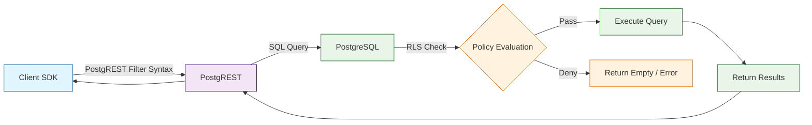
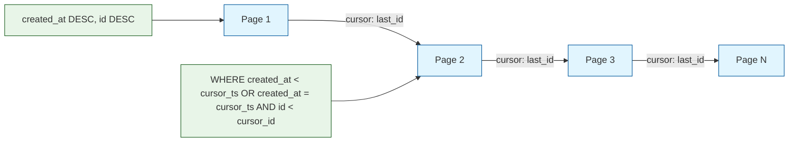
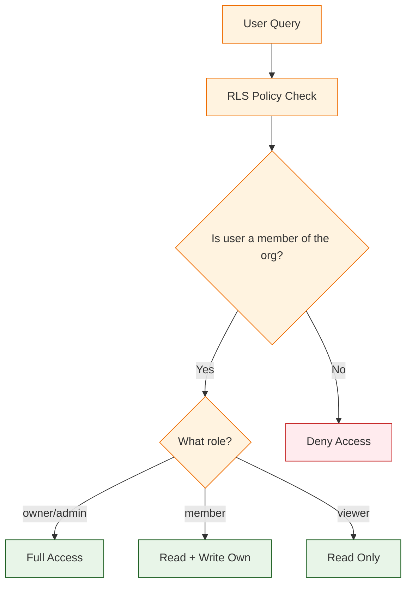

# Chapter 7: Advanced Queries & RLS

Welcome to **Chapter 7: Advanced Queries & RLS**. In this part of **Supabase Tutorial: Building Modern Backend Applications**, you will build an intuitive mental model first, then move into concrete implementation details and practical production tradeoffs.


In [Chapter 6](06-edge-functions.md), you built serverless backend logic with Edge Functions for payments, emails, and webhooks. Now it is time to push your database skills further. This chapter covers the advanced query patterns and security hardening techniques that separate a prototype from a production application. You will implement cursor-based pagination, full-text search with ranking, complex aggregations with database functions, multi-tenant RLS policies, query performance analysis with `EXPLAIN ANALYZE`, and materialized views for expensive computations.

## Query Architecture Overview

Every query in a Supabase application flows through PostgREST, the auto-generated REST API layer. Understanding this pipeline helps you write more efficient queries.



## Advanced Filtering and Selection

### Complex Filters

```typescript
// Multiple conditions with AND
const { data } = await supabase
  .from('tasks')
  .select('id, title, status, priority, due_date')
  .eq('status', 'in_progress')
  .in('priority', ['high', 'urgent'])
  .not('assignee_id', 'is', null)
  .gte('created_at', '2024-01-01')
  .order('due_date', { ascending: true })

// OR conditions using the or() filter
const { data: searchResults } = await supabase
  .from('tasks')
  .select('*')
  .or('title.ilike.%deploy%,description.ilike.%deploy%')
  .eq('project_id', projectId)

// Negation
const { data: openTasks } = await supabase
  .from('tasks')
  .select('*')
  .neq('status', 'done')
  .is('deleted_at', null)

// Range queries
const { data: dueSoon } = await supabase
  .from('tasks')
  .select('*')
  .gte('due_date', new Date().toISOString())
  .lte('due_date', new Date(Date.now() + 7 * 86400000).toISOString())
```

### Selecting Related Data (Joins)

```typescript
// Inner join: tasks with their project and assignee
const { data } = await supabase
  .from('tasks')
  .select(`
    id,
    title,
    status,
    priority,
    projects!inner (
      id,
      name,
      teams!inner (
        id,
        name
      )
    ),
    profiles:assignee_id (
      username,
      avatar_url
    )
  `)
  .eq('projects.teams.id', teamId)

// Count related records without fetching them
const { data: projectsWithCounts } = await supabase
  .from('projects')
  .select(`
    id,
    name,
    tasks (count)
  `)
  .eq('team_id', teamId)

// Nested filtering on related tables
const { data: activeProjects } = await supabase
  .from('projects')
  .select(`
    id,
    name,
    tasks!inner (
      id,
      title,
      status
    )
  `)
  .eq('tasks.status', 'in_progress')
```

### Aggregate Queries with RPC

For complex aggregations that PostgREST cannot express, use database functions.

```sql
-- Function: dashboard statistics for a team
CREATE OR REPLACE FUNCTION public.get_team_dashboard(p_team_id UUID)
RETURNS JSON AS $$
DECLARE
  result JSON;
BEGIN
  SELECT json_build_object(
    'total_projects', (
      SELECT COUNT(*) FROM public.projects WHERE team_id = p_team_id
    ),
    'active_tasks', (
      SELECT COUNT(*) FROM public.tasks t
      JOIN public.projects p ON p.id = t.project_id
      WHERE p.team_id = p_team_id AND t.status != 'done'
    ),
    'completed_this_week', (
      SELECT COUNT(*) FROM public.tasks t
      JOIN public.projects p ON p.id = t.project_id
      WHERE p.team_id = p_team_id
        AND t.status = 'done'
        AND t.updated_at >= date_trunc('week', NOW())
    ),
    'tasks_by_priority', (
      SELECT json_agg(json_build_object('priority', priority, 'count', cnt))
      FROM (
        SELECT t.priority, COUNT(*) as cnt
        FROM public.tasks t
        JOIN public.projects p ON p.id = t.project_id
        WHERE p.team_id = p_team_id AND t.status != 'done'
        GROUP BY t.priority
      ) sub
    ),
    'top_contributors', (
      SELECT json_agg(json_build_object('username', username, 'completed', completed))
      FROM (
        SELECT pr.username, COUNT(*) as completed
        FROM public.tasks t
        JOIN public.projects p ON p.id = t.project_id
        JOIN public.profiles pr ON pr.id = t.assignee_id
        WHERE p.team_id = p_team_id
          AND t.status = 'done'
          AND t.updated_at >= NOW() - INTERVAL '30 days'
        GROUP BY pr.username
        ORDER BY completed DESC
        LIMIT 5
      ) sub
    )
  ) INTO result;

  RETURN result;
END;
$$ LANGUAGE plpgsql STABLE SECURITY DEFINER;
```

```typescript
// Call from the client
const { data: dashboard } = await supabase
  .rpc('get_team_dashboard', { p_team_id: teamId })

// dashboard = {
//   total_projects: 12,
//   active_tasks: 47,
//   completed_this_week: 15,
//   tasks_by_priority: [{ priority: 'high', count: 8 }, ...],
//   top_contributors: [{ username: 'alice', completed: 12 }, ...]
// }
```

## Cursor-Based Pagination

Cursor-based pagination is more reliable than offset pagination for real-time data, because inserts and deletes do not shift page boundaries.



### Implementation

```typescript
// src/lib/pagination.ts
interface PaginationCursor {
  created_at: string
  id: number
}

interface PaginatedResult<T> {
  data: T[]
  nextCursor: PaginationCursor | null
  hasMore: boolean
}

async function fetchTasksPage(
  projectId: string,
  pageSize: number = 20,
  cursor?: PaginationCursor
): Promise<PaginatedResult<any>> {
  let query = supabase
    .from('tasks')
    .select('id, title, status, priority, created_at, profiles:assignee_id(username)')
    .eq('project_id', projectId)
    .order('created_at', { ascending: false })
    .order('id', { ascending: false })
    .limit(pageSize + 1)  // Fetch one extra to check if there are more

  // Apply cursor filter
  if (cursor) {
    query = query.or(
      `created_at.lt.${cursor.created_at},` +
      `and(created_at.eq.${cursor.created_at},id.lt.${cursor.id})`
    )
  }

  const { data, error } = await query

  if (error) throw error

  const hasMore = (data?.length || 0) > pageSize
  const items = hasMore ? data!.slice(0, pageSize) : (data || [])

  const nextCursor = hasMore && items.length > 0
    ? {
        created_at: items[items.length - 1].created_at,
        id: items[items.length - 1].id,
      }
    : null

  return { data: items, nextCursor, hasMore }
}
```

### React Hook for Infinite Scroll

```typescript
// src/hooks/useInfiniteScroll.ts
import { useState, useCallback } from 'react'

export function useInfiniteTasks(projectId: string) {
  const [tasks, setTasks] = useState<any[]>([])
  const [cursor, setCursor] = useState<PaginationCursor | undefined>()
  const [hasMore, setHasMore] = useState(true)
  const [loading, setLoading] = useState(false)

  const loadMore = useCallback(async () => {
    if (loading || !hasMore) return
    setLoading(true)

    try {
      const result = await fetchTasksPage(projectId, 20, cursor)
      setTasks(prev => [...prev, ...result.data])
      setCursor(result.nextCursor || undefined)
      setHasMore(result.hasMore)
    } catch (error) {
      console.error('Failed to load tasks:', error)
    } finally {
      setLoading(false)
    }
  }, [projectId, cursor, hasMore, loading])

  const reset = useCallback(() => {
    setTasks([])
    setCursor(undefined)
    setHasMore(true)
  }, [])

  return { tasks, loadMore, hasMore, loading, reset }
}
```

## Full-Text Search

PostgreSQL has built-in full-text search that is faster and more relevant than `ILIKE` for document-style queries.

### Setting Up Search

```sql
-- Add a generated tsvector column for search
ALTER TABLE public.tasks ADD COLUMN search_vector tsvector
  GENERATED ALWAYS AS (
    setweight(to_tsvector('english', coalesce(title, '')), 'A') ||
    setweight(to_tsvector('english', coalesce(description, '')), 'B')
  ) STORED;

-- Create a GIN index for fast full-text search
CREATE INDEX idx_tasks_search ON public.tasks USING GIN (search_vector);

-- For articles or long content
ALTER TABLE public.articles ADD COLUMN search_vector tsvector
  GENERATED ALWAYS AS (
    setweight(to_tsvector('english', coalesce(title, '')), 'A') ||
    setweight(to_tsvector('english', coalesce(summary, '')), 'B') ||
    setweight(to_tsvector('english', coalesce(body, '')), 'C')
  ) STORED;

CREATE INDEX idx_articles_search ON public.articles USING GIN (search_vector);
```

### Search Queries

```sql
-- Basic full-text search with ranking
SELECT
  id,
  title,
  ts_rank(search_vector, query) AS rank,
  ts_headline('english', description, query,
    'StartSel=<mark>, StopSel=</mark>, MaxWords=50, MinWords=20'
  ) AS snippet
FROM public.tasks,
  plainto_tsquery('english', 'deploy production') AS query
WHERE search_vector @@ query
ORDER BY rank DESC
LIMIT 20;

-- Phrase search (words must appear together)
SELECT id, title
FROM public.tasks
WHERE search_vector @@ phraseto_tsquery('english', 'deploy to production');

-- Web-style search (supports AND, OR, NOT, quotes)
SELECT id, title
FROM public.tasks
WHERE search_vector @@ websearch_to_tsquery('english', '"deploy production" -staging');
```

### Search Function for the Client

```sql
-- Function: search with pagination and ranking
CREATE OR REPLACE FUNCTION public.search_tasks(
  p_query TEXT,
  p_project_id UUID DEFAULT NULL,
  p_limit INTEGER DEFAULT 20,
  p_offset INTEGER DEFAULT 0
)
RETURNS TABLE (
  id BIGINT,
  title TEXT,
  status TEXT,
  rank REAL,
  snippet TEXT
) AS $$
BEGIN
  RETURN QUERY
  SELECT
    t.id,
    t.title,
    t.status,
    ts_rank(t.search_vector, websearch_to_tsquery('english', p_query)) AS rank,
    ts_headline('english', COALESCE(t.description, ''),
      websearch_to_tsquery('english', p_query),
      'StartSel=<mark>, StopSel=</mark>, MaxWords=50'
    ) AS snippet
  FROM public.tasks t
  WHERE t.search_vector @@ websearch_to_tsquery('english', p_query)
    AND (p_project_id IS NULL OR t.project_id = p_project_id)
  ORDER BY rank DESC
  LIMIT p_limit
  OFFSET p_offset;
END;
$$ LANGUAGE plpgsql STABLE;
```

```typescript
// Client-side search
const { data: results } = await supabase
  .rpc('search_tasks', {
    p_query: 'deploy production',
    p_project_id: projectId,
    p_limit: 20,
    p_offset: 0,
  })

// Using the textSearch filter directly
const { data } = await supabase
  .from('tasks')
  .select('id, title, status')
  .textSearch('search_vector', 'deploy production', {
    type: 'websearch',
    config: 'english',
  })
  .limit(20)
```

### Fuzzy Search with pg_trgm

For typo-tolerant search (autocomplete, "did you mean"), use the `pg_trgm` extension.

```sql
-- Enable trigram extension
CREATE EXTENSION IF NOT EXISTS pg_trgm;

-- Create trigram index
CREATE INDEX idx_profiles_username_trgm
  ON public.profiles USING GIN (username gin_trgm_ops);

-- Fuzzy search with similarity score
SELECT username, similarity(username, 'alce') AS sim
FROM public.profiles
WHERE username % 'alce'  -- % is the similarity operator
ORDER BY sim DESC
LIMIT 10;
```

```typescript
// Client-side fuzzy search on username
const { data } = await supabase
  .from('profiles')
  .select('username, avatar_url')
  .ilike('username', `%${searchTerm}%`)
  .limit(10)
```

## Multi-Tenant RLS Patterns

### Tenant Isolation Through Organization Membership



```sql
-- Helper function: get user's role in an organization
CREATE OR REPLACE FUNCTION public.user_org_role(p_org_id UUID)
RETURNS TEXT AS $$
  SELECT role FROM public.team_members
  WHERE team_id = p_org_id AND user_id = auth.uid()
  LIMIT 1;
$$ LANGUAGE sql STABLE SECURITY DEFINER;

-- Helper function: check if user belongs to organization
CREATE OR REPLACE FUNCTION public.user_in_org(p_org_id UUID)
RETURNS BOOLEAN AS $$
  SELECT EXISTS (
    SELECT 1 FROM public.team_members
    WHERE team_id = p_org_id AND user_id = auth.uid()
  );
$$ LANGUAGE sql STABLE SECURITY DEFINER;

-- Projects: scoped to organization membership
CREATE POLICY "Org members can view projects"
  ON public.projects FOR SELECT
  USING (public.user_in_org(team_id));

CREATE POLICY "Org admins can create projects"
  ON public.projects FOR INSERT
  WITH CHECK (public.user_org_role(team_id) IN ('owner', 'admin'));

CREATE POLICY "Org admins can update projects"
  ON public.projects FOR UPDATE
  USING (public.user_org_role(team_id) IN ('owner', 'admin'));

CREATE POLICY "Only org owners can delete projects"
  ON public.projects FOR DELETE
  USING (public.user_org_role(team_id) = 'owner');
```

### Row-Level Tenant Column

For simpler multi-tenant apps where every row belongs to one organization:

```sql
-- Add org_id to every tenant-scoped table
ALTER TABLE public.invoices ADD COLUMN org_id UUID NOT NULL REFERENCES public.teams(id);

-- Single policy covers all operations
CREATE POLICY "Org isolation" ON public.invoices
  FOR ALL
  USING (public.user_in_org(org_id))
  WITH CHECK (public.user_in_org(org_id));

-- Performance: always include org_id in indexes
CREATE INDEX idx_invoices_org ON public.invoices (org_id, created_at DESC);
```

### Sharing Data Across Tenants

```sql
-- Items can be shared publicly or within specific organizations
CREATE TABLE public.shared_documents (
  id UUID PRIMARY KEY DEFAULT gen_random_uuid(),
  org_id UUID NOT NULL REFERENCES public.teams(id),
  title TEXT NOT NULL,
  content TEXT,
  visibility TEXT NOT NULL DEFAULT 'private'
    CHECK (visibility IN ('private', 'org', 'public')),
  created_at TIMESTAMPTZ DEFAULT NOW()
);

CREATE POLICY "View shared documents" ON public.shared_documents
  FOR SELECT USING (
    visibility = 'public'
    OR (visibility = 'org' AND public.user_in_org(org_id))
    OR (visibility = 'private' AND EXISTS (
      SELECT 1 FROM public.team_members
      WHERE team_id = org_id
        AND user_id = auth.uid()
        AND role IN ('owner', 'admin')
    ))
  );
```

## Query Performance Optimization

### Using EXPLAIN ANALYZE

```sql
-- Analyze a query's execution plan
EXPLAIN (ANALYZE, BUFFERS, FORMAT TEXT)
SELECT t.id, t.title, t.status, p.name AS project_name
FROM public.tasks t
JOIN public.projects p ON p.id = t.project_id
WHERE p.team_id = 'a1b2c3d4-e5f6-7890-abcd-ef1234567890'
  AND t.status = 'in_progress'
ORDER BY t.created_at DESC
LIMIT 20;

-- Example output:
-- Limit (cost=0.56..12.34 rows=20 width=120) (actual time=0.123..0.456 rows=20 loops=1)
--   -> Nested Loop (cost=0.56..456.78 rows=47 width=120)
--         -> Index Scan using idx_tasks_project_status on tasks t
--              Index Cond: (project_id = ... AND status = 'in_progress')
--         -> Index Scan using projects_pkey on projects p
--              Index Cond: (id = t.project_id)
--              Filter: (team_id = '...')
-- Planning Time: 0.234 ms
-- Execution Time: 0.567 ms
```

### Performance Optimization Checklist

| Issue | Indicator | Solution |
|---|---|---|
| Sequential scan on large table | `Seq Scan` in EXPLAIN output | Add a B-tree index on filter columns |
| High row estimate vs actual | Large difference in `rows=` estimates | Run `ANALYZE tablename` to update statistics |
| N+1 queries from client | Many small queries in logs | Use joins or database functions |
| Slow `ILIKE` search | Sequential scan on text column | Use `pg_trgm` GIN index or full-text search |
| Large result sets | High `Buffers: shared read` | Add `LIMIT`; implement pagination |
| Slow RLS policy | Complex subquery in USING clause | Use a `SECURITY DEFINER` helper function |
| Join producing too many rows | Cartesian product | Add proper join conditions; check data model |

### Materialized Views for Expensive Queries

When a query is too slow to run on every request, cache the result in a materialized view.

```sql
-- Materialized view: team activity summary
CREATE MATERIALIZED VIEW public.team_activity_summary AS
SELECT
  tm.team_id,
  t2.name AS team_name,
  COUNT(DISTINCT p.id) AS project_count,
  COUNT(DISTINCT t.id) AS total_tasks,
  COUNT(DISTINCT t.id) FILTER (WHERE t.status = 'done') AS completed_tasks,
  COUNT(DISTINCT t.id) FILTER (WHERE t.status != 'done') AS open_tasks,
  COUNT(DISTINCT c.id) AS total_comments,
  MAX(t.updated_at) AS last_activity
FROM public.team_members tm
JOIN public.teams t2 ON t2.id = tm.team_id
LEFT JOIN public.projects p ON p.team_id = tm.team_id
LEFT JOIN public.tasks t ON t.project_id = p.id
LEFT JOIN public.comments c ON c.task_id = t.id
GROUP BY tm.team_id, t2.name;

-- Create a unique index (required for REFRESH CONCURRENTLY)
CREATE UNIQUE INDEX idx_team_activity_team_id
  ON public.team_activity_summary (team_id);

-- Refresh the view (can be done via pg_cron)
REFRESH MATERIALIZED VIEW CONCURRENTLY public.team_activity_summary;

-- Schedule automatic refresh every 15 minutes
SELECT cron.schedule(
  'refresh-team-activity',
  '*/15 * * * *',
  'REFRESH MATERIALIZED VIEW CONCURRENTLY public.team_activity_summary;'
);
```

```typescript
// Query the materialized view like a regular table
const { data } = await supabase
  .from('team_activity_summary')
  .select('*')
  .eq('team_id', teamId)
  .single()
```

## JSONB Queries

PostgreSQL JSONB columns are powerful for semi-structured data.

```sql
-- Table with JSONB metadata
CREATE TABLE public.events (
  id BIGSERIAL PRIMARY KEY,
  type TEXT NOT NULL,
  metadata JSONB NOT NULL DEFAULT '{}',
  created_at TIMESTAMPTZ DEFAULT NOW()
);

-- GIN index for JSONB queries
CREATE INDEX idx_events_metadata ON public.events USING GIN (metadata);

-- Query nested JSONB fields
SELECT id, type, metadata->>'source' AS source
FROM public.events
WHERE metadata->>'source' = 'stripe'
  AND (metadata->'amount')::int > 1000;

-- Check if JSONB contains a key
SELECT * FROM public.events
WHERE metadata ? 'user_agent';

-- Check if JSONB contains a key-value pair
SELECT * FROM public.events
WHERE metadata @> '{"type": "purchase"}';
```

```typescript
// Client-side JSONB queries
const { data } = await supabase
  .from('events')
  .select('id, type, metadata')
  .contains('metadata', { source: 'stripe' })
  .gte('metadata->amount', 1000)
  .order('created_at', { ascending: false })
  .limit(50)
```

## Troubleshooting Queries and RLS

| Problem | Diagnosis | Solution |
|---|---|---|
| Query returns empty unexpectedly | RLS policy blocks access | Test with `SET LOCAL ROLE authenticated` + JWT claims |
| Slow query on first run | No statistics; cold cache | Run `ANALYZE`; check if index exists |
| RLS makes query slow | Complex subquery per row | Extract to `SECURITY DEFINER` function |
| `permission denied` error | Missing policy for the operation | Add policy for SELECT/INSERT/UPDATE/DELETE |
| Search returns irrelevant results | Wrong text search config | Use language-specific config (`'english'`, `'simple'`) |
| Pagination skips or repeats rows | Using OFFSET with changing data | Switch to cursor-based pagination |

## Summary

In this chapter you mastered the advanced query patterns and security techniques needed for production Supabase applications. You built complex filtered queries with joins and aggregations, implemented cursor-based pagination for reliable infinite scroll, set up full-text search with ranking and highlights, created fuzzy search with trigram matching, designed multi-tenant RLS policies with role-based access, analyzed query performance with `EXPLAIN ANALYZE`, cached expensive queries with materialized views, and queried semi-structured data with JSONB operators.

## Key Takeaways

1. **Use cursor-based pagination** instead of OFFSET for real-time data that changes between page loads.
2. **Full-text search with `tsvector`** is built into PostgreSQL -- no external search engine needed for most use cases.
3. **Extract complex RLS checks into `SECURITY DEFINER` functions** for better performance and reuse.
4. **Always run `EXPLAIN ANALYZE`** before adding indexes -- measure first, optimize second.
5. **Use materialized views** for dashboard queries and aggregations that do not need real-time freshness.
6. **Multi-tenant isolation** starts with a helper function like `user_in_org()` that every policy references.
7. **JSONB with GIN indexes** provides flexible querying of semi-structured data without schema changes.

## Next Steps

Your queries are fast, your search is relevant, and your RLS policies are hardened. In [Chapter 8: Production Deployment](08-production-deployment.md), you will prepare everything for launch -- environment management, monitoring, backups, scaling, security hardening, and a go-live checklist.

---

*Built with insights from the [Supabase](https://github.com/supabase/supabase) project.*

## What Problem Does This Solve?

Most teams struggle here because the hard part is not writing more code, but deciding clear boundaries for `tasks`, `SELECT`, `team_id` so behavior stays predictable as complexity grows.

In practical terms, this chapter helps you avoid three common failures:

- coupling core logic too tightly to one implementation path
- missing the handoff boundaries between setup, execution, and validation
- shipping changes without clear rollback or observability strategy

After working through this chapter, you should be able to reason about `Chapter 7: Advanced Queries & RLS` as an operating subsystem inside **Supabase Tutorial: Building Modern Backend Applications**, with explicit contracts for inputs, state transitions, and outputs.

Use the implementation notes around `projects`, `CREATE`, `WHERE` as your checklist when adapting these patterns to your own repository.

## How it Works Under the Hood

Under the hood, `Chapter 7: Advanced Queries & RLS` usually follows a repeatable control path:

1. **Context bootstrap**: initialize runtime config and prerequisites for `tasks`.
2. **Input normalization**: shape incoming data so `SELECT` receives stable contracts.
3. **Core execution**: run the main logic branch and propagate intermediate state through `team_id`.
4. **Policy and safety checks**: enforce limits, auth scopes, and failure boundaries.
5. **Output composition**: return canonical result payloads for downstream consumers.
6. **Operational telemetry**: emit logs/metrics needed for debugging and performance tuning.

When debugging, walk this sequence in order and confirm each stage has explicit success/failure conditions.

## Source Walkthrough

Use the following upstream sources to verify implementation details while reading this chapter:

- [View Repo](https://github.com/supabase/supabase)
  Why it matters: authoritative reference on `View Repo` (github.com).

Suggested trace strategy:
- search upstream code for `tasks` and `SELECT` to map concrete implementation paths
- compare docs claims against actual runtime/config code before reusing patterns in production

## Chapter Connections

- [Tutorial Index](index.md)
- [Previous Chapter: Chapter 6: Edge Functions](06-edge-functions.md)
- [Next Chapter: Chapter 8: Production Deployment](08-production-deployment.md)
- [Main Catalog](../../README.md#-tutorial-catalog)
- [A-Z Tutorial Directory](../../discoverability/tutorial-directory.md)
