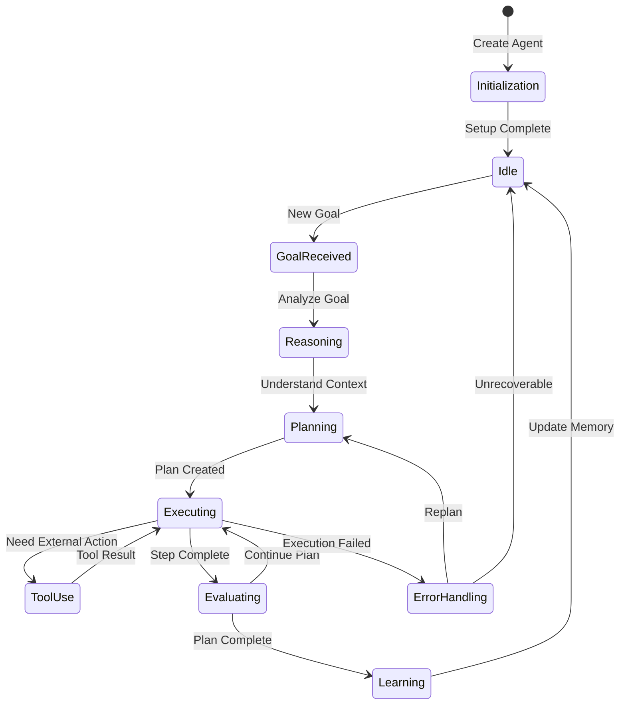

# Chapter 2: Agent Architecture

> Understand SuperAGI's agent design patterns, reasoning engines, and the components that enable autonomous behavior.

## Overview

SuperAGI's agent architecture is built on sophisticated design patterns that enable agents to reason, plan, and execute complex tasks autonomously. This chapter explores the core components, reasoning mechanisms, and architectural decisions that make SuperAGI agents powerful.

## Core Architecture

### Agent Components

```python
from superagi.agent import Agent
from superagi.core import ReasoningEngine, ExecutionEngine, PlanningModule

class AgentArchitecture:
    """
    SuperAGI Agent Architecture Overview

    Components:
    ├── Reasoning Engine - Decision making and logic
    ├── Planning Module - Goal decomposition and strategy
    ├── Execution Engine - Action implementation
    ├── Memory System - Context and experience storage
    ├── Tool Manager - External capability integration
    └── Feedback Loop - Learning and adaptation
    """

    def __init__(self, config: dict):
        self.reasoning = ReasoningEngine(config.get("reasoning", {}))
        self.planning = PlanningModule(config.get("planning", {}))
        self.execution = ExecutionEngine(config.get("execution", {}))
        self.memory = MemorySystem(config.get("memory", {}))
        self.tools = ToolManager(config.get("tools", []))

    def process_goal(self, goal: str):
        """Process a goal through the agent architecture."""
        # 1. Understand the goal
        understanding = self.reasoning.analyze(goal)

        # 2. Create a plan
        plan = self.planning.create_plan(understanding)

        # 3. Execute with feedback
        for step in plan.steps:
            result = self.execution.execute(step, self.tools)
            self.memory.store(step, result)
            self.reasoning.evaluate(result)

        return self.reasoning.synthesize_results()
```

### Agent Lifecycle



## Reasoning Engine

### Chain of Thought Reasoning

```python
class ReasoningEngine:
    """Engine for agent reasoning and decision making."""

    def __init__(self, llm_config: dict):
        self.llm = self._initialize_llm(llm_config)
        self.reasoning_strategies = {
            "chain_of_thought": self._cot_reasoning,
            "tree_of_thought": self._tot_reasoning,
            "react": self._react_reasoning,
        }

    def reason(self, context: dict, strategy: str = "chain_of_thought") -> dict:
        """Apply reasoning to context."""
        reasoning_fn = self.reasoning_strategies.get(strategy)
        return reasoning_fn(context)

    def _cot_reasoning(self, context: dict) -> dict:
        """Chain of thought reasoning."""
        prompt = f"""
        Given the following context, reason step by step.

        Goal: {context['goal']}
        Current State: {context['state']}
        Available Tools: {context['tools']}
        Previous Actions: {context['history']}

        Think through this step by step:
        1. What is the current situation?
        2. What needs to be done next?
        3. What tool or action is most appropriate?
        4. What are the potential outcomes?
        5. What is the best decision?

        Reasoning:
        """

        response = self.llm.generate(prompt)
        return self._parse_reasoning(response)

    def _react_reasoning(self, context: dict) -> dict:
        """ReAct (Reasoning + Acting) pattern."""
        prompt = f"""
        Goal: {context['goal']}
        Observation: {context['observation']}

        Based on the observation, provide:
        Thought: [Your reasoning about what to do next]
        Action: [The action to take]
        Action Input: [Input for the action]
        """

        response = self.llm.generate(prompt)
        return self._parse_react(response)

    def _tot_reasoning(self, context: dict) -> dict:
        """Tree of thought reasoning for complex problems."""
        # Generate multiple reasoning paths
        paths = []
        for _ in range(3):
            path = self._generate_reasoning_path(context)
            paths.append(path)

        # Evaluate paths
        scored_paths = [(self._evaluate_path(p), p) for p in paths]
        best_path = max(scored_paths, key=lambda x: x[0])[1]

        return {"reasoning_path": best_path, "all_paths": paths}
```

### Decision Making

```python
class DecisionMaker:
    """Make decisions based on reasoning output."""

    def __init__(self, config: dict):
        self.confidence_threshold = config.get("confidence_threshold", 0.7)
        self.max_alternatives = config.get("max_alternatives", 3)

    def decide(self, reasoning_output: dict, available_actions: list) -> dict:
        """Make a decision based on reasoning."""

        # Score each possible action
        scored_actions = []
        for action in available_actions:
            score = self._score_action(action, reasoning_output)
            scored_actions.append((score, action))

        # Sort by score
        scored_actions.sort(key=lambda x: x[0], reverse=True)

        # Select best action if confident
        best_score, best_action = scored_actions[0]

        if best_score >= self.confidence_threshold:
            return {
                "decision": best_action,
                "confidence": best_score,
                "alternatives": scored_actions[1:self.max_alternatives + 1]
            }

        # If not confident, return for human review or more reasoning
        return {
            "decision": None,
            "requires_clarification": True,
            "candidates": scored_actions[:self.max_alternatives]
        }

    def _score_action(self, action: dict, reasoning: dict) -> float:
        """Score an action based on reasoning context."""
        score = 0.5  # Base score

        # Alignment with goal
        if self._aligns_with_goal(action, reasoning.get("goal_analysis")):
            score += 0.2

        # Feasibility
        if self._is_feasible(action, reasoning.get("available_resources")):
            score += 0.15

        # Risk assessment
        risk = self._assess_risk(action, reasoning.get("risk_factors"))
        score -= risk * 0.15

        # Historical success rate
        success_rate = self._get_historical_success(action)
        score += success_rate * 0.1

        return min(max(score, 0), 1)  # Clamp to [0, 1]
```

## Planning Module

### Goal Decomposition

```python
class PlanningModule:
    """Module for planning and goal decomposition."""

    def __init__(self, llm, config: dict):
        self.llm = llm
        self.max_depth = config.get("max_depth", 5)
        self.max_breadth = config.get("max_breadth", 10)

    def decompose_goal(self, goal: str, context: dict) -> list:
        """Decompose a high-level goal into subtasks."""

        prompt = f"""
        Decompose this goal into smaller, actionable subtasks.

        Goal: {goal}
        Context: {context}

        Rules:
        - Each subtask should be independently completable
        - Subtasks should be ordered by dependency
        - Include success criteria for each subtask
        - Maximum {self.max_breadth} subtasks

        Return as JSON:
        {{
            "subtasks": [
                {{
                    "id": "task_1",
                    "description": "...",
                    "dependencies": [],
                    "success_criteria": "...",
                    "estimated_complexity": "low|medium|high"
                }}
            ]
        }}
        """

        response = self.llm.generate(prompt)
        return self._parse_subtasks(response)

    def create_execution_plan(self, subtasks: list) -> dict:
        """Create an execution plan from subtasks."""

        # Build dependency graph
        graph = self._build_dependency_graph(subtasks)

        # Topological sort for execution order
        execution_order = self._topological_sort(graph)

        # Identify parallelizable tasks
        parallel_groups = self._identify_parallel_groups(execution_order, subtasks)

        return {
            "execution_order": execution_order,
            "parallel_groups": parallel_groups,
            "estimated_steps": len(execution_order),
            "critical_path": self._find_critical_path(graph, subtasks)
        }
```

### Adaptive Planning

```python
class AdaptivePlanner:
    """Planner that adapts based on execution results."""

    def __init__(self, planning_module: PlanningModule):
        self.planner = planning_module
        self.execution_history = []

    def adapt_plan(self, current_plan: dict, execution_result: dict) -> dict:
        """Adapt plan based on execution results."""

        if execution_result["status"] == "success":
            # Mark step as complete, continue with plan
            return self._mark_complete_and_continue(current_plan)

        elif execution_result["status"] == "partial":
            # Adjust remaining steps
            return self._adjust_remaining_steps(current_plan, execution_result)

        elif execution_result["status"] == "failed":
            # Replan from failure point
            return self._replan_from_failure(current_plan, execution_result)

    def _replan_from_failure(self, plan: dict, failure: dict) -> dict:
        """Create new plan accounting for failure."""

        context = {
            "original_goal": plan["goal"],
            "completed_steps": self._get_completed_steps(plan),
            "failed_step": failure["step"],
            "failure_reason": failure["reason"],
            "available_alternatives": self._find_alternatives(failure)
        }

        # Generate alternative approaches
        alternatives = self.planner.decompose_goal(
            f"Alternative approach for: {failure['step']['description']}",
            context
        )

        # Integrate alternatives into plan
        return self._integrate_alternatives(plan, failure["step"], alternatives)
```

## Agent Types

### Task-Specific Agents

```python
# Research Agent
class ResearchAgent(Agent):
    """Agent specialized for research tasks."""

    default_tools = ["web_search", "document_reader", "summarizer"]
    default_capabilities = ["information_gathering", "synthesis", "citation"]

    def __init__(self, name: str, config: dict = None):
        super().__init__(
            name=name,
            role="Research Specialist",
            tools=self.default_tools,
            config=config
        )

    def research(self, topic: str, depth: str = "comprehensive") -> dict:
        """Conduct research on a topic."""
        return self.execute_task({
            "type": "research",
            "topic": topic,
            "depth": depth,
            "deliverables": ["summary", "sources", "key_findings"]
        })


# Coding Agent
class CodingAgent(Agent):
    """Agent specialized for coding tasks."""

    default_tools = ["code_generator", "code_reviewer", "test_runner", "debugger"]

    def __init__(self, name: str, languages: list = None, config: dict = None):
        super().__init__(
            name=name,
            role="Software Developer",
            tools=self.default_tools,
            config=config
        )
        self.languages = languages or ["python", "javascript"]

    def write_code(self, specification: str, language: str = "python") -> dict:
        """Write code based on specification."""
        return self.execute_task({
            "type": "code_generation",
            "specification": specification,
            "language": language,
            "include_tests": True
        })


# Analysis Agent
class AnalysisAgent(Agent):
    """Agent specialized for data analysis."""

    default_tools = ["data_loader", "statistical_analyzer", "visualizer", "report_generator"]

    def analyze(self, data_source: str, analysis_type: str) -> dict:
        """Analyze data and generate insights."""
        return self.execute_task({
            "type": "data_analysis",
            "data_source": data_source,
            "analysis_type": analysis_type,
            "output_format": "report"
        })
```

### Composite Agents

```python
class CompositeAgent(Agent):
    """Agent that can delegate to specialized sub-agents."""

    def __init__(self, name: str, sub_agents: list):
        super().__init__(name=name, role="Coordinator")
        self.sub_agents = {agent.name: agent for agent in sub_agents}

    def execute_task(self, task: dict) -> dict:
        """Execute task, delegating to appropriate sub-agent."""

        # Determine which sub-agent should handle the task
        assigned_agent = self._assign_agent(task)

        if assigned_agent:
            # Delegate to sub-agent
            result = assigned_agent.execute_task(task)
            return self._integrate_result(result, task)
        else:
            # Handle directly if no suitable sub-agent
            return super().execute_task(task)

    def _assign_agent(self, task: dict) -> Agent:
        """Assign task to most suitable sub-agent."""
        task_type = task.get("type", "")

        # Match task type to agent capabilities
        for agent in self.sub_agents.values():
            if task_type in agent.capabilities:
                return agent

        return None

# Usage
research_agent = ResearchAgent("researcher")
coding_agent = CodingAgent("developer")
analysis_agent = AnalysisAgent("analyst")

coordinator = CompositeAgent(
    name="project_lead",
    sub_agents=[research_agent, coding_agent, analysis_agent]
)
```

## Configuration

### Agent Configuration Schema

```python
agent_config = {
    "name": "ProductionAgent",
    "role": "General Assistant",

    # Reasoning configuration
    "reasoning": {
        "strategy": "chain_of_thought",
        "temperature": 0.3,
        "max_reasoning_steps": 10,
        "confidence_threshold": 0.7
    },

    # Planning configuration
    "planning": {
        "max_plan_depth": 5,
        "parallel_execution": True,
        "adaptive_replanning": True
    },

    # Execution configuration
    "execution": {
        "max_retries": 3,
        "timeout_seconds": 300,
        "checkpoint_frequency": "per_step"
    },

    # Memory configuration
    "memory": {
        "type": "vector",
        "capacity": 10000,
        "persistence": True
    },

    # LLM configuration
    "llm": {
        "provider": "openai",
        "model": "gpt-4",
        "max_tokens": 4096
    }
}

agent = Agent.from_config(agent_config)
```

## Summary

In this chapter, you've learned:

- **Core Components**: Reasoning, planning, execution, and memory
- **Reasoning Engine**: Chain of thought, ReAct, and tree of thought
- **Decision Making**: Scoring actions and confidence thresholds
- **Planning Module**: Goal decomposition and adaptive planning
- **Agent Types**: Task-specific and composite agents
- **Configuration**: Setting up agent behavior

## Key Takeaways

1. **Modular Architecture**: Components work together but are independently configurable
2. **Reasoning Strategies**: Different strategies for different problem types
3. **Adaptive Planning**: Plans evolve based on execution results
4. **Specialization**: Task-specific agents for better performance
5. **Composition**: Combine agents for complex workflows

## Next Steps

Now that you understand agent architecture, let's explore Tool Integration in Chapter 3 to connect agents with external capabilities.

---

**Ready for Chapter 3?** [Tool Integration](03-tool-integration.md)

*Generated for [Awesome Code Docs](https://github.com/johnxie/awesome-code-docs)*
